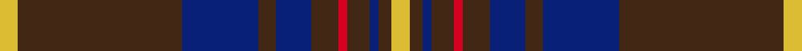

This is one **variant** — a specific cloth: this exact thread count and colourway, with its own
provenance below. It is one weaving of the [sett](/setts/ly4do37db17do4db8do6r2do5db2do3ly4/) (the scale-free proportion — the
same cloth at any scale or shade), whose colour order is pattern [YBBBBBRBBBY](/stripes/ybbbbbrbbby/).

Sourced from tartans-authority.  It is a [11 stripe tartan](/stripes/stripes11/).

Original link [https://www.tartanregister.gov.uk/tartanDetails.aspx?ref=5733](https://www.tartanregister.gov.uk/tartanDetails.aspx?ref=5733)

## Provenance

Earliest known date: 2002 The tartan for this Welsh surname and its variation, Griffith, is actually woven in Wales at the Cambrian Woollen Mill, weaving on the same site since 1830. This tartan differs from many traditional patterns in that the warp and weft differ, giving the finished worsted wool cloth more of a predominant stripe, vertically noticeable in the finished Kilt, or Cilt in Wales. Available from Wales Tartan Centres in Swansea

2 attestations — the source records this cloth was collapsed from (oldest owns this page)

<ul>
<li>2002 — Griffiths (Welsh Name) (tartans-authority, <a href="https://www.tartanregister.gov.uk/tartanDetails.aspx?ref=5733">record</a>)  <em>The tartan for this Welsh surname and its variations, is commercially accepted as a tartan or ?plaid? in Wales, this is one of the tartans actually woven in Wales at the Cambrian Woollen Mill, weaving on the same site since 1830. This tartan differs from many traditional patterns in that the warp and weft differ, giving the finished worsted wool cloth more of a predominant ?stripe?, vertically noticeable in the finished Kilt, or ?Cilt? in Wales. Available from Wales Tartan Centres in Swansea, +44 (0)1792 474685.</em></li>
<li>2002 — Griffiths Welsh Name Tartan (house-of-tartan, <a href="http://www.house-of-tartan.scotland.net/house/TartanViewjs.asp?colr=Def&tnam=5733">record</a>) </li>
</ul>

Dataset <small>— provenance for this record, inherited from the source manifest</small>

<dl class="dataset-prov">
<dt>source</dt><dd><a href="/sources/tartans-authority/">Scottish Tartans Authority</a></dd>
<dt>data captured from</dt><dd><a href="https://github.com/thetartan/tartan-database/blob/master/data/tartans-authority/data.csv">https://github.com/thetartan/tartan-database/blob/master/data/tartans-authority/data.csv</a></dd>
<dt>data date</dt><dd>2002 <small>(this record)</small></dd>
<dt>licence</dt><dd><a href="https://creativecommons.org/licenses/by-nc-nd/4.0/">CC BY-NC-ND 4.0</a></dd>
</dl>

Capture chain <small>— the hands this data passed through, oldest first; each capture carries its own licence</small>

<ol class="capture-chain">
<li><a href="https://www.tartansauthority.com/">Scottish Tartans Authority</a> <small>the heritage body's archive — its tartan-ferret record browser is retired (links repaired to the SRT, above)</small></li>
<li><a href="https://github.com/thetartan/tartan-database">thetartan/tartan-database</a> <small>2016-2017</small> · <a href="https://creativecommons.org/licenses/by-nc-nd/4.0/">CC BY-NC-ND 4.0</a> <small>Levko Kravets's frozen compilation — the capture we vendored, and where its CC licence text came from</small></li>
<li>this dictionary <small>captured 2026-06-10 · commit 5bf86c7566</small> <small>each re-capture is a git commit to data/sources</small></li>
</ol>

## Register references

External register numbers recorded for this tartan.

- Scottish Tartans Authority (ITI): 5733

## Thread count
LY/4 DO37 DB17 DO4 DB8 DO6 R2 DO5 DB2 DO3 LY/4

One full sett is **176 threads**.

## Palette
<table><thead><tr><th>Colour</th><th>Shade</th><th>OKLCh</th></tr></thead><tbody><tr><td>DB</td><td><code style="background-color:#082077;">#082077</code> <small style="color:#888">#082077</small></td><td><small style="color:#888">oklch(30.0% 0.149 265.1)</small></td></tr><tr><td>R</td><td><code style="background-color:#D60020;">#D60020</code> <small style="color:#888">#D60020</small></td><td><small style="color:#888">oklch(55.2% 0.224 25.5)</small></td></tr><tr><td>K</td><td><code style="background-color:#000000;">#000000</code> <small style="color:#888">#000000</small></td><td><small style="color:#888">oklch(0.0% 0.000 0.0)</small></td></tr><tr><td>LY</td><td><code style="background-color:#DCBC32;">#DCBC32</code> <small style="color:#888">#DCBC32</small></td><td><small style="color:#888">oklch(80.0% 0.150 95.2)</small></td></tr><tr><td>DO</td><td><code style="background-color:#412714;">#412714</code> <small style="color:#888">#412714</small></td><td><small style="color:#888">oklch(30.1% 0.050 55.7)</small></td></tr></tbody></table>

# Sample pattern

## Nearest tartan variants

The nearest existing variants by ΔTartan distance, with this cloth at the top so the swatches line up against it.

ΔTartan

Threads

Variant

Sett

—

176

<a href="/variants/s11/ly4do37db17do4db8do6r2do5db2do3ly4/">Griffiths (Welsh Name)</a>

<a href="/ttd/edit/#slug=dy5db9r3db5dy2db4dy26lb3r4~x2&amp;base=ly4do37db17do4db8do6r2do5db2do3ly4" title="compare in the TTD">2.29</a>

226

<a href="/variants/s9/dy5db9r3db5dy2db4dy26lb3r4~x2/">Bracken (Fashion)</a>

<a href="/ttd/edit/#slug=dy5dt9r3dt5dy2dt4dy26lb3r4~x2~dt1204274&amp;base=ly4do37db17do4db8do6r2do5db2do3ly4" title="compare in the TTD">2.69</a>

226

<a href="/variants/s9/dy5db9r3db5dy2db4dy26lb3r4~x2~db1204274/">Bracken</a>

<a href="/ttd/edit/#slug=dg40r3dg4r3dg12db32lo4r3~x2&amp;base=ly4do37db17do4db8do6r2do5db2do3ly4" title="compare in the TTD">2.76</a>

318

<a href="/variants/s8/dg40r3dg4r3dg12db32lo4r3~x2/">U.S. Marine Corps (Military?)</a>

<a href="/ttd/edit/#slug=g8dt3g2dt4ly2dt5g7dt4g4dt37r6~dt1204274&amp;base=ly4do37db17do4db8do6r2do5db2do3ly4" title="compare in the TTD">2.91</a>

150

<a href="/variants/s11/g8db3g2db4ly2db5g7db4g4db37r6~db1204274/">Jenkins (Welsh Name)</a>

<a href="/ttd/edit/#slug=dt15dy2dt2r2dt6dg30dt6r2dt2dy2dt15w2~x2~dt1204274-dg1605139&amp;base=ly4do37db17do4db8do6r2do5db2do3ly4" title="compare in the TTD">2.92</a>

310

<a href="/variants/s12/db15dy2db2r2db6dg30db6r2db2dy2db15w2~x2~db1204274-dg1605139/">Hydesville Tower</a>

<a href="/ttd/edit/#slug=y20dt27r6dt15y8dt11y78db10r12~dt1204274-db1406275&amp;base=ly4do37db17do4db8do6r2do5db2do3ly4" title="compare in the TTD">3.20</a>

342

<a href="/variants/s9/y20db27r6db15y8db11y78dbi10r12~db1204274-dbi1406275/">Braken Tartan</a>

<a href="/ttd/edit/#slug=dg25b10w1b5w1b10dg25r1dg3r2~x2&amp;base=ly4do37db17do4db8do6r2do5db2do3ly4" title="compare in the TTD">3.32</a>

278

<a href="/variants/s10/dg25b10w1b5w1b10dg25r1dg3r2~x2/">Strathdee (Personal)</a>

<a href="/ttd/edit/#slug=y20db27r6db15y8db11y78n10r12~db0805267-n1604274&amp;base=ly4do37db17do4db8do6r2do5db2do3ly4" title="compare in the TTD">3.35</a>

342

<a href="/variants/s9/y20db27r6db15y8db11y78dbi10r12~db0805267-dbi1604274/">Bracken</a>

<a href="/ttd/edit/#slug=n4db2n7dt30n8dt7r5db1w2~x2&amp;base=ly4do37db17do4db8do6r2do5db2do3ly4" title="compare in the TTD">3.37</a>

252

<a href="/variants/s9/n4db2n7dt30n8dt7r5db1w2~x2/">Hebridean Heather (Fashion)</a>

<a href="/ttd/edit/#slug=lb8db4dy5r1dy5r1dy5r1dy16lb1~x4&amp;base=ly4do37db17do4db8do6r2do5db2do3ly4" title="compare in the TTD">3.39</a>

340

<a href="/variants/s10/lb8db4dy5r1dy5r1dy5r1dy16lb1~x4/">Flowers of the Forest, The</a>

## Neighbour map

Every grey dot is one of 13621 variants placed by the first two principal components of the ΔTartan feature space (42% of its variance). Red is this tartan; blue dots are its nearest — click one to open its page.

<svg viewBox="0 0 640 380" role="img" style="max-width:100%;height:auto;border:1px solid #e0e0e0;border-radius:4px;display:block" xmlns="http://www.w3.org/2000/svg"><image href="/nn/cloud.v1.png" width="640" height="380"/><a href="/variants/s9/dy5db9r3db5dy2db4dy26lb3r4~x2/"><circle cx="347.3" cy="182.7" r="4" fill="#3465a4"><title>Bracken (Fashion)</title></circle></a><a href="/variants/s9/dy5db9r3db5dy2db4dy26lb3r4~x2~db1204274/"><circle cx="361.9" cy="187.0" r="4" fill="#3465a4"><title>Bracken</title></circle></a><a href="/variants/s8/dg40r3dg4r3dg12db32lo4r3~x2/"><circle cx="366.9" cy="187.0" r="4" fill="#3465a4"><title>U.S. Marine Corps (Military?)</title></circle></a><a href="/variants/s11/g8db3g2db4ly2db5g7db4g4db37r6~db1204274/"><circle cx="396.5" cy="137.8" r="4" fill="#3465a4"><title>Jenkins (Welsh Name)</title></circle></a><a href="/variants/s12/db15dy2db2r2db6dg30db6r2db2dy2db15w2~x2~db1204274-dg1605139/"><circle cx="346.2" cy="153.0" r="4" fill="#3465a4"><title>Hydesville Tower</title></circle></a><a href="/variants/s9/y20db27r6db15y8db11y78dbi10r12~db1204274-dbi1406275/"><circle cx="357.8" cy="183.5" r="4" fill="#3465a4"><title>Braken Tartan</title></circle></a><a href="/variants/s10/dg25b10w1b5w1b10dg25r1dg3r2~x2/"><circle cx="409.5" cy="148.9" r="4" fill="#3465a4"><title>Strathdee (Personal)</title></circle></a><a href="/variants/s9/y20db27r6db15y8db11y78dbi10r12~db0805267-dbi1604274/"><circle cx="325.0" cy="173.3" r="4" fill="#3465a4"><title>Bracken</title></circle></a><a href="/variants/s9/n4db2n7dt30n8dt7r5db1w2~x2/"><circle cx="385.0" cy="142.5" r="4" fill="#3465a4"><title>Hebridean Heather (Fashion)</title></circle></a><a href="/variants/s10/lb8db4dy5r1dy5r1dy5r1dy16lb1~x4/"><circle cx="366.6" cy="161.2" r="4" fill="#3465a4"><title>Flowers of the Forest, The</title></circle></a><circle cx="394.6" cy="152.4" r="5" fill="#c00000"/><text x="320" y="376" text-anchor="middle" font-size="11" fill="#999">ground</text><text x="11" y="190" text-anchor="middle" font-size="11" fill="#999" transform="rotate(-90 11 190)">complexity</text></svg>

ID: /variants/s11/ly4do37db17do4db8do6r2do5db2do3ly4/
