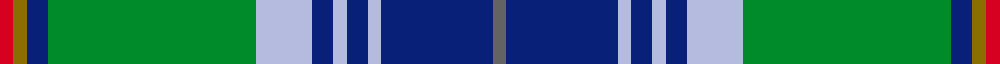

This is one **variant** — a specific cloth: this exact thread count and colourway, with its own
provenance below. It is one weaving of the [sett](/setts/n2db16lb2db3lb2db3lb8g30db3y2r2/) (the scale-free proportion — the
same cloth at any scale or shade), whose colour order is pattern [BBWBWBWGBGR](/stripes/bbwbwbwgbgr/).

Sourced from register-of-tartans.  It is a [11 stripe tartan](/stripes/stripes11/).

Original link [https://www.tartanregister.gov.uk/tartanDetails.aspx?ref=10784](https://www.tartanregister.gov.uk/tartanDetails.aspx?ref=10784)

2 attestations — the source records this cloth was collapsed from (oldest owns this page)

<ul>
<li>10/02/2013 — San Diego, The (register-of-tartans, <a href="https://www.tartanregister.gov.uk/tartanDetails.aspx?ref=10784">record</a>)  <em>San Diego Tartan Day (SDTD) Inc. is a non profit making coalition of San Diego's six major Scottish fraternal organisations: the House of Scotland, the North County Scots, the Robert Burns Club of San Diego, the Saint Andrew Society of San Diego, the San Diego-Edinburgh Sister City Society, and the San Diego Scottish Highland Games. Founded on 25th September 2003, their mission is to encourage fellowship among all San Diegans of Scots ancestry or inclination; to promote and generate membership for local organisations and activities; to celebrate heritage; and to reach out to non-Scots in the community. The colours reflect many aspects of San Diego, including the flags of the city and county (red, green, gold); the Pacific sea and sky (blues); the official native tree, the Torrey Pine (green); the significant presence of the U.S. Navy and U.S. Marine Corps (navy, red and gold); various land, sky and aquatic life including birds, land mammals, whales, dolphins, and seals (grey); and local major league sports teams (blue, gold, grey); the red and yellow gold also reflect the sunniness for which the region is known.</em></li>
<li>10/02/2013 — San Diego Tartan Day (Corporate) (tartans-authority, <a href="https://www.tartanregister.gov.uk/tartanDetails.aspx?ref=10784">record</a>)  <em>San Diego Tartan Day (SDTD) Inc. is a non profit making coalition of San Diego's six major Scottish fraternal organisations: the House of Scotland, the North County Scots, the Robert Burns Club of San Diego, the Saint Andrew Society of San Diego, the San Diego-Edinburgh Sister City Society, and the San Diego Scottish Highland Games. Founded on 25th September 2003, their mission is to encourage fellowship among all San Diegans of Scots ancestry or inclination; to promote and generate membership for local organisations and activities; to celebrate heritage; and to reach out to non-Scots in the community. The colours reflect many aspects of San Diego, including the flags of the city and county (red, green, gold); the Pacific sea and sky (blues); the official native tree, the Torrey Pine (green); the significant presence of the U.S. Navy and U.S. Marine Corps (navy, red and gold); various land, sky and aquatic life including birds, land mammals, whales, dolphins, and seals (grey); and local major league sports teams (blue, gold, grey); the red and yellow gold also reflect the sunniness for which the region is known. Weaving restricted to Lochcarron of Scotland, until transferred to San Diego Tartan Day Inc.</em></li>
</ul>

Dataset <small>— provenance for this record, inherited from the source manifest</small>

<dl class="dataset-prov">
<dt>source</dt><dd><a href="/sources/register-of-tartans/">Scottish Register of Tartans</a></dd>
<dt>data captured from</dt><dd><a href="https://github.com/thetartan/tartan-database/blob/master/data/register-of-tartans/data.csv">https://github.com/thetartan/tartan-database/blob/master/data/register-of-tartans/data.csv</a></dd>
<dt>data date</dt><dd>10/02/2013 <small>(this record)</small></dd>
<dt>licence</dt><dd><a href="https://www.tartanregister.gov.uk/copyright">Crown copyright</a></dd>
</dl>

Capture chain <small>— the hands this data passed through, oldest first; each capture carries its own licence</small>

<ol class="capture-chain">
<li><a href="https://www.tartanregister.gov.uk/">Scottish Register of Tartans</a> · <a href="https://www.tartanregister.gov.uk/copyright">Crown copyright</a> <small>the living register — still published by National Records of Scotland</small></li>
<li><a href="https://github.com/thetartan/tartan-database">thetartan/tartan-database</a> <small>2016-2017</small> · <a href="https://creativecommons.org/licenses/by-nc-nd/4.0/">CC BY-NC-ND 4.0</a> <small>Levko Kravets's frozen compilation — the capture we vendored, and where its CC licence text came from</small></li>
<li>this dictionary <small>captured 2026-06-10 · commit 5bf86c7566</small> <small>each re-capture is a git commit to data/sources</small></li>
</ol>

## Register references

External register numbers recorded for this tartan.

- Scottish Register of Tartans: [10784](https://www.tartanregister.gov.uk/tartanDetails?ref=10784)
- Scottish Tartans Authority (ITI): 10784

## Thread count
R/4 Y4 DB6 G60 LB16 DB6 LB4 DB6 LB4 DB32 N/4

One full sett is **284 threads**.

## Palette
<table><thead><tr><th>Colour</th><th>Shade</th><th>OKLCh</th></tr></thead><tbody><tr><td>LB</td><td><code style="background-color:#B5BBDE;">#B5BBDE</code> <small style="color:#888">#B5BBDE</small></td><td><small style="color:#888">oklch(79.9% 0.050 277.6)</small></td></tr><tr><td>DB</td><td><code style="background-color:#082077;">#082077</code> <small style="color:#888">#082077</small></td><td><small style="color:#888">oklch(30.0% 0.149 265.1)</small></td></tr><tr><td>G</td><td><code style="background-color:#008B2A;">#008B2A</code> <small style="color:#888">#008B2A</small></td><td><small style="color:#888">oklch(55.4% 0.170 145.9)</small></td></tr><tr><td>R</td><td><code style="background-color:#D60020;">#D60020</code> <small style="color:#888">#D60020</small></td><td><small style="color:#888">oklch(55.2% 0.224 25.5)</small></td></tr><tr><td>N</td><td><code style="background-color:#636363;">#636363</code> <small style="color:#888">#636363</small></td><td><small style="color:#888">oklch(50.0% 0.000 89.9)</small></td></tr><tr><td>Y</td><td><code style="background-color:#8B6E00;">#8B6E00</code> <small style="color:#888">#8B6E00</small></td><td><small style="color:#888">oklch(55.1% 0.113 90.4)</small></td></tr></tbody></table>

# Sample pattern

## Nearest tartan variants

The nearest existing variants by ΔTartan distance, with this cloth at the top so the swatches line up against it.

ΔTartan

Threads

Variant

Sett

—

284

<a href="/variants/s11/n2db16lb2db3lb2db3lb8g30db3y2r2~x2/">San Diego, The</a>

<a href="/ttd/edit/#slug=n5w2g30db6g4db3g4db24g4dy5r3~x2&amp;base=n2db16lb2db3lb2db3lb8g30db3y2r2~x2" title="compare in the TTD">1.97</a>

344

<a href="/variants/s11/n5w2g30db6g4db3g4db24g4dy5r3~x2/">Wells (1970) (Name)</a>

<a href="/ttd/edit/#slug=w1db16ly1r3ly1dg6g2dg6w1~x2~dg1806142-g2408144&amp;base=n2db16lb2db3lb2db3lb8g30db3y2r2~x2" title="compare in the TTD">1.97</a>

144

<a href="/variants/s9/w1db16ly1r3ly1dg6g2dg6w1~x2~dg1806142-g2408144/">Kleto, Susan (Personal)</a>

<a href="/ttd/edit/#slug=w2db20dg2g2dg2g4dg8y2r1~x2~dg1806142-g2408144&amp;base=n2db16lb2db3lb2db3lb8g30db3y2r2~x2" title="compare in the TTD">2.01</a>

166

<a href="/variants/s9/w2db20dg2g2dg2g4dg8y2r1~x2~dg1806142-g2408144/">Nova Scotia (Province)</a>

<a href="/ttd/edit/#slug=db16w3db1y4g24r1g3r4g3r1lb8~x2&amp;base=n2db16lb2db3lb2db3lb8g30db3y2r2~x2" title="compare in the TTD">2.32</a>

224

<a href="/variants/s11/db16w3db1y4g24r1g3r4g3r1lb8~x2/">Currie</a>

<a href="/ttd/edit/#slug=y2g20db8r3db2r2db16w1lb2~x2&amp;base=n2db16lb2db3lb2db3lb8g30db3y2r2~x2" title="compare in the TTD">2.38</a>

216

<a href="/variants/s9/y2g20db8r3db2r2db16w1lb2~x2/">Scotland’s Golf Coast</a>

<a href="/ttd/edit/#slug=db18w1db4w1lo4g1lo2g12r2g4~x2~w4000000-lo2804072&amp;base=n2db16lb2db3lb2db3lb8g30db3y2r2~x2" title="compare in the TTD">2.47</a>

152

<a href="/variants/s10/db18w1db4w1lo4g1lo2g12r2g4~x2~w4000000-lo2804072/">Michigan, State of (District)</a>

<a href="/ttd/edit/#slug=g27r2g3w3db3y2db14w2db3y3db3w2db14~x2&amp;base=n2db16lb2db3lb2db3lb8g30db3y2r2~x2" title="compare in the TTD">2.55</a>

242

<a href="/variants/s13/g27r2g3w3db3y2db14w2db3y3db3w2db14~x2/">Holiday Inn Crown Plaza</a>

<a href="/ttd/edit/#slug=g19r1g2r2g15r1dt13w1db2r2db21r1w3~x2&amp;base=n2db16lb2db3lb2db3lb8g30db3y2r2~x2" title="compare in the TTD">2.61</a>

288

<a href="/variants/s13/g19r1g2r2g15r1dt13w1db2r2db21r1w3~x2/">Ontario (Official)</a>

<a href="/ttd/edit/#slug=db18w1db4w1lo4g1lo2g12r2g4~x2~w4000000-r1707033&amp;base=n2db16lb2db3lb2db3lb8g30db3y2r2~x2" title="compare in the TTD">2.62</a>

152

<a href="/variants/s10/db18w1db4w1lo4g1lo2g12r2g4~x2~w4000000-r1707033/">Michigan State District Tartan</a>

<a href="/ttd/edit/#slug=g27r2g3w3db3dy2db14w2db3dy3db3w2db14~x2&amp;base=n2db16lb2db3lb2db3lb8g30db3y2r2~x2" title="compare in the TTD">2.65</a>

242

<a href="/variants/s13/g27r2g3w3db3dy2db14w2db3dy3db3w2db14~x2/">Holiday Inn Crown Plaza</a>

## Neighbour map

Every grey dot is one of 13621 variants placed by the first two principal components of the ΔTartan feature space (42% of its variance). Red is this tartan; blue dots are its nearest — click one to open its page.

<svg viewBox="0 0 640 380" role="img" style="max-width:100%;height:auto;border:1px solid #e0e0e0;border-radius:4px;display:block" xmlns="http://www.w3.org/2000/svg"><image href="/nn/cloud.v1.png" width="640" height="380"/><a href="/variants/s11/n5w2g30db6g4db3g4db24g4dy5r3~x2/"><circle cx="245.8" cy="138.9" r="4" fill="#3465a4"><title>Wells (1970) (Name)</title></circle></a><a href="/variants/s9/w1db16ly1r3ly1dg6g2dg6w1~x2~dg1806142-g2408144/"><circle cx="213.8" cy="138.7" r="4" fill="#3465a4"><title>Kleto, Susan (Personal)</title></circle></a><a href="/variants/s9/w2db20dg2g2dg2g4dg8y2r1~x2~dg1806142-g2408144/"><circle cx="242.3" cy="126.7" r="4" fill="#3465a4"><title>Nova Scotia (Province)</title></circle></a><a href="/variants/s11/db16w3db1y4g24r1g3r4g3r1lb8~x2/"><circle cx="211.1" cy="113.5" r="4" fill="#3465a4"><title>Currie</title></circle></a><a href="/variants/s9/y2g20db8r3db2r2db16w1lb2~x2/"><circle cx="245.6" cy="133.3" r="4" fill="#3465a4"><title>Scotland’s Golf Coast</title></circle></a><a href="/variants/s10/db18w1db4w1lo4g1lo2g12r2g4~x2~w4000000-lo2804072/"><circle cx="238.9" cy="142.1" r="4" fill="#3465a4"><title>Michigan, State of (District)</title></circle></a><a href="/variants/s13/g27r2g3w3db3y2db14w2db3y3db3w2db14~x2/"><circle cx="230.9" cy="137.4" r="4" fill="#3465a4"><title>Holiday Inn Crown Plaza</title></circle></a><a href="/variants/s13/g19r1g2r2g15r1dt13w1db2r2db21r1w3~x2/"><circle cx="227.9" cy="126.6" r="4" fill="#3465a4"><title>Ontario (Official)</title></circle></a><a href="/variants/s10/db18w1db4w1lo4g1lo2g12r2g4~x2~w4000000-r1707033/"><circle cx="232.0" cy="139.6" r="4" fill="#3465a4"><title>Michigan State District Tartan</title></circle></a><a href="/variants/s13/g27r2g3w3db3dy2db14w2db3dy3db3w2db14~x2/"><circle cx="230.5" cy="137.1" r="4" fill="#3465a4"><title>Holiday Inn Crown Plaza</title></circle></a><circle cx="210.8" cy="126.1" r="5" fill="#c00000"/><text x="320" y="376" text-anchor="middle" font-size="11" fill="#999">ground</text><text x="11" y="190" text-anchor="middle" font-size="11" fill="#999" transform="rotate(-90 11 190)">complexity</text></svg>

ID: /variants/s11/n2db16lb2db3lb2db3lb8g30db3y2r2~x2/
