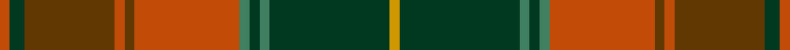

This page is one **sett** — a single exact thread-count. It belongs to the [tartan](/setts/o2dg3dy18o2dy2o21g2dg2g2dg24lo2/)
(the same proportion at any scale), whose colour order is pattern [RGGRGRGGGGY](/stripes/rggrgrggggy/).

Part of the [Methven](/tartans/methven/) tartan — the named design grouping this sett with its other cloths.

Sourced from tartans-authority.  It is a [11 stripe tartan](/stripes/stripes11/).

Original link http://www.tartansauthority.com/tartan-ferret/display/11092/

## Register references

External register numbers recorded for this tartan.

- Scottish Register of Tartans: [11092](https://www.tartanregister.gov.uk/tartanDetails?ref=11092)
- Scottish Tartans Authority (ITI): 11092

## Thread count
DO/4 DG6 T36 DO4 T4 DO42 G4 DG4 G4 DG48 DY/4

One full sett is **312 threads**.

## Palette

Palette: <strong>Tartan Register</strong> <small style="color:#888">(3 of 5 colours)</small>
<table><thead><tr><th>Colour</th><th>Threads</th><th>Shade</th><th>Base</th><th>OKLCh</th></tr></thead><tbody><tr><td>DO/</td><td style="text-align:right;font-variant-numeric:tabular-nums">4</td><td><code style="background-color:#C04C08;">#C04C08</code> <small style="color:#888">#C04C08</small></td><td>R <code style="background-color:#CC0000;">#CC0000</code></td><td><small style="color:#888">oklch(56.4% 0.163 43.2)</small></td></tr><tr><td>DG</td><td style="text-align:right;font-variant-numeric:tabular-nums">6</td><td><code style="background-color:#003820;">#003820</code> <small style="color:#888">#003820</small></td><td>G <code style="background-color:#006100;">#006100</code></td><td><small style="color:#888">oklch(30.0% 0.070 158.3)</small></td></tr><tr><td>T</td><td style="text-align:right;font-variant-numeric:tabular-nums">36</td><td><code style="background-color:#603800;">#603800</code> <small style="color:#888">#603800</small></td><td>G <code style="background-color:#006100;">#006100</code></td><td><small style="color:#888">oklch(38.1% 0.084 66.7)</small></td></tr><tr><td>DO</td><td style="text-align:right;font-variant-numeric:tabular-nums">4</td><td><code style="background-color:#C04C08;">#C04C08</code> <small style="color:#888">#C04C08</small></td><td>R <code style="background-color:#CC0000;">#CC0000</code></td><td><small style="color:#888">oklch(56.4% 0.163 43.2)</small></td></tr><tr><td>T</td><td style="text-align:right;font-variant-numeric:tabular-nums">4</td><td><code style="background-color:#603800;">#603800</code> <small style="color:#888">#603800</small></td><td>G <code style="background-color:#006100;">#006100</code></td><td><small style="color:#888">oklch(38.1% 0.084 66.7)</small></td></tr><tr><td>DO</td><td style="text-align:right;font-variant-numeric:tabular-nums">42</td><td><code style="background-color:#C04C08;">#C04C08</code> <small style="color:#888">#C04C08</small></td><td>R <code style="background-color:#CC0000;">#CC0000</code></td><td><small style="color:#888">oklch(56.4% 0.163 43.2)</small></td></tr><tr><td>G</td><td style="text-align:right;font-variant-numeric:tabular-nums">4</td><td><code style="background-color:#408060;">#408060</code> <small style="color:#888">#408060</small></td><td>G <code style="background-color:#006100;">#006100</code></td><td><small style="color:#888">oklch(54.8% 0.084 160.1)</small></td></tr><tr><td>DG</td><td style="text-align:right;font-variant-numeric:tabular-nums">4</td><td><code style="background-color:#003820;">#003820</code> <small style="color:#888">#003820</small></td><td>G <code style="background-color:#006100;">#006100</code></td><td><small style="color:#888">oklch(30.0% 0.070 158.3)</small></td></tr><tr><td>G</td><td style="text-align:right;font-variant-numeric:tabular-nums">4</td><td><code style="background-color:#408060;">#408060</code> <small style="color:#888">#408060</small></td><td>G <code style="background-color:#006100;">#006100</code></td><td><small style="color:#888">oklch(54.8% 0.084 160.1)</small></td></tr><tr><td>DG</td><td style="text-align:right;font-variant-numeric:tabular-nums">48</td><td><code style="background-color:#003820;">#003820</code> <small style="color:#888">#003820</small></td><td>G <code style="background-color:#006100;">#006100</code></td><td><small style="color:#888">oklch(30.0% 0.070 158.3)</small></td></tr><tr><td>DY/</td><td style="text-align:right;font-variant-numeric:tabular-nums">4</td><td><code style="background-color:#D09800;">#D09800</code> <small style="color:#888">#D09800</small></td><td>Y <code style="background-color:#F2BF00;">#F2BF00</code></td><td><small style="color:#888">oklch(71.4% 0.147 82.1)</small></td></tr></tbody></table>

## Compared to the master

This cloth is one sett of its design; the master sett (the exemplar the design is anchored on) is below for comparison.

<figure style="margin:0"><figcaption style="color:#888;font-size:smaller">this sett</figcaption></figure>
<figure style="margin:0"><figcaption style="color:#888;font-size:smaller"><a href="/setts/r2dg3dy18r2dy2r21y6dg2y2dg24lo2/">master sett →</a></figcaption></figure>

## Nearest tartans

The nearest existing variants by ΔTartan distance, with this tartan at the top so the swatches line up against it.

ΔTartan

Tartan

Sett

—

<a href="/ttd/edit/#slug=o2dg3dy18o2dy2o21g2dg2g2dg24lo2~x2">Methven</a> <a class="nn-out" href="/variants/s11/o2dg3dy18o2dy2o21g2dg2g2dg24lo2~x2/" title="open its dictionary page">↗</a>

1.03

<a href="/ttd/edit/#slug=g16dy1g2dy1g2dy12m12dy1ly2dy1m12dy12g12dy1w2~x2&amp;base=o2dg3dy18o2dy2o21g2dg2g2dg24lo2~x2">Prince Edward Island District Tartan</a> <a class="nn-out" href="/variants/s15/g16dy1g2dy1g2dy12m12dy1ly2dy1m12dy12g12dy1w2~x2/" title="open its dictionary page">↗</a>

1.06

<a href="/ttd/edit/#slug=k3r9k4dy9y3dy9k4g26k2y3~x2&amp;base=o2dg3dy18o2dy2o21g2dg2g2dg24lo2~x2">Cavan, County</a> <a class="nn-out" href="/variants/s10/k3r9k4dy9y3dy9k4g26k2y3~x2/" title="open its dictionary page">↗</a>

1.10

<a href="/ttd/edit/#slug=dg9r3dg4dy3dg3dy4dg3dp11o30r3o4dg3~x2&amp;base=o2dg3dy18o2dy2o21g2dg2g2dg24lo2~x2">Harmony 5</a> <a class="nn-out" href="/variants/s12/dg9r3dg4dy3dg3dy4dg3dp11o30r3o4dg3~x2/" title="open its dictionary page">↗</a>

1.10

<a href="/ttd/edit/#slug=r2dg3dy18r2dy2r21y6dg2y2dg24lo2~x2&amp;base=o2dg3dy18o2dy2o21g2dg2g2dg24lo2~x2">Methven</a> <a class="nn-out" href="/variants/s11/r2dg3dy18r2dy2r21y6dg2y2dg24lo2~x2/" title="open its dictionary page">↗</a>

1.13

<a href="/ttd/edit/#slug=dy16r16lr3dg16o2r1o2dy6r2~x4&amp;base=o2dg3dy18o2dy2o21g2dg2g2dg24lo2~x2">Henry, W. A.</a> <a class="nn-out" href="/variants/s9/dy16r16lr3dg16o2r1o2dy6r2~x4/" title="open its dictionary page">↗</a>

1.16

<a href="/ttd/edit/#slug=r8k5r8g27r8w2r3g3r3w2r8o27r8o3r3~x2&amp;base=o2dg3dy18o2dy2o21g2dg2g2dg24lo2~x2">McCall (Name)</a> <a class="nn-out" href="/variants/s15/r8k5r8g27r8w2r3g3r3w2r8o27r8o3r3~x2/" title="open its dictionary page">↗</a>

1.20

<a href="/ttd/edit/#slug=y4lr2y2lr3y20k6do4k2do2k2do16o3~x2&amp;base=o2dg3dy18o2dy2o21g2dg2g2dg24lo2~x2">Dorcas</a> <a class="nn-out" href="/variants/s12/y4lr2y2lr3y20k6do4k2do2k2do16o3~x2/" title="open its dictionary page">↗</a>

1.23

<a href="/ttd/edit/#slug=ly25o2w2db2w2o13dy28db2o3~x2&amp;base=o2dg3dy18o2dy2o21g2dg2g2dg24lo2~x2">Brousseau (Personal)</a> <a class="nn-out" href="/variants/s9/ly25o2w2db2w2o13dy28db2o3~x2/" title="open its dictionary page">↗</a>

1.23

<a href="/ttd/edit/#slug=y14lo1y1lo1y2k3y3k3doi3do1doi9lo1~x4&amp;base=o2dg3dy18o2dy2o21g2dg2g2dg24lo2~x2">Glen Nevis #2 (Personal)</a> <a class="nn-out" href="/variants/s12/y14lo1y1lo1y2k3y3k3doi3do1doi9lo1~x4/" title="open its dictionary page">↗</a>

1.27

<a href="/ttd/edit/#slug=g16o1g2o1g2o12r12o1ly2o1r12o12g12o1w2~x2&amp;base=o2dg3dy18o2dy2o21g2dg2g2dg24lo2~x2">Prince Edward Island</a> <a class="nn-out" href="/variants/s15/g16o1g2o1g2o12r12o1ly2o1r12o12g12o1w2~x2/" title="open its dictionary page">↗</a>

## Neighbour map

Every grey dot is one of 14360 variants placed by the first two principal components of the ΔTartan feature space (44% of its variance). Red is this tartan; blue dots are its nearest — click one to open its page.

<svg viewBox="0 0 640 380" role="img" style="max-width:100%;height:auto;border:1px solid #e0e0e0;border-radius:4px;display:block" xmlns="http://www.w3.org/2000/svg"><image href="/nn/cloud.v1.png" width="640" height="380"/><a href="/variants/s15/g16dy1g2dy1g2dy12m12dy1ly2dy1m12dy12g12dy1w2~x2/"><circle cx="232.9" cy="151.1" r="4" fill="#3465a4"><title>Prince Edward Island District Tartan</title></circle></a><a href="/variants/s10/k3r9k4dy9y3dy9k4g26k2y3~x2/"><circle cx="206.5" cy="177.0" r="4" fill="#3465a4"><title>Cavan, County</title></circle></a><a href="/variants/s12/dg9r3dg4dy3dg3dy4dg3dp11o30r3o4dg3~x2/"><circle cx="233.9" cy="150.4" r="4" fill="#3465a4"><title>Harmony 5</title></circle></a><a href="/variants/s11/r2dg3dy18r2dy2r21y6dg2y2dg24lo2~x2/"><circle cx="251.4" cy="180.1" r="4" fill="#3465a4"><title>Methven</title></circle></a><a href="/variants/s9/dy16r16lr3dg16o2r1o2dy6r2~x4/"><circle cx="237.8" cy="183.3" r="4" fill="#3465a4"><title>Henry, W. A.</title></circle></a><a href="/variants/s15/r8k5r8g27r8w2r3g3r3w2r8o27r8o3r3~x2/"><circle cx="247.0" cy="145.3" r="4" fill="#3465a4"><title>McCall (Name)</title></circle></a><a href="/variants/s12/y4lr2y2lr3y20k6do4k2do2k2do16o3~x2/"><circle cx="208.2" cy="154.5" r="4" fill="#3465a4"><title>Dorcas</title></circle></a><a href="/variants/s9/ly25o2w2db2w2o13dy28db2o3~x2/"><circle cx="224.9" cy="144.9" r="4" fill="#3465a4"><title>Brousseau (Personal)</title></circle></a><a href="/variants/s12/y14lo1y1lo1y2k3y3k3doi3do1doi9lo1~x4/"><circle cx="274.8" cy="146.9" r="4" fill="#3465a4"><title>Glen Nevis #2 (Personal)</title></circle></a><a href="/variants/s15/g16o1g2o1g2o12r12o1ly2o1r12o12g12o1w2~x2/"><circle cx="225.1" cy="146.0" r="4" fill="#3465a4"><title>Prince Edward Island</title></circle></a><circle cx="242.1" cy="159.5" r="5" fill="#c00000"/></svg>

ID: /variants/s11/o2dg3dy18o2dy2o21g2dg2g2dg24lo2~x2/
