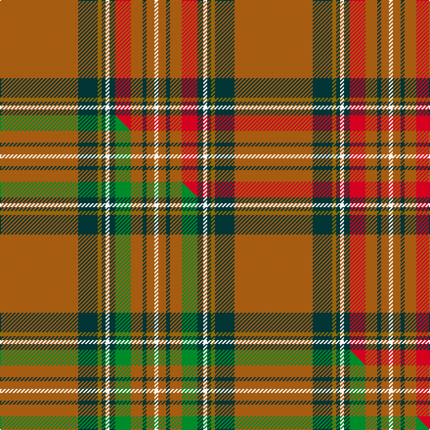

This is one **variant** — a specific cloth: this exact thread count and colourway, with its own
provenance below. It is one weaving of the [sett](/tartans/c/ca/cavalier/) (the scale-free proportion — the
same cloth at any scale or shade), whose colour order is pattern [RBGBWBRRBRW](/stripes/rbgbwbrrbrw/).

Part of the [Cavalier](/tartans/c/ca/cavalier/) tartan — the named design grouping this sett with its other cloths.

Sourced from register-of-tartans.  It is a [11 stripe tartan](/stripes/stripes11/).

Original link [https://www.tartanregister.gov.uk/tartanDetails.aspx?ref=600](https://www.tartanregister.gov.uk/tartanDetails.aspx?ref=600)

2 attestations — the source records this cloth was collapsed from (oldest owns this page)

<ul>
<li>01/01/1981 — Cavalier, Red (register-of-tartans, <a href="https://www.tartanregister.gov.uk/tartanDetails.aspx?ref=600">record</a>)  <em>Seen in the Woollen Mill, Edinburgh, June 1981. Same as Stewart. Swatch in Scottish Tartans Authority's Johnston Collection.</em></li>
<li>pre 1981 — Cavalier, Red (Fashion) (tartans-authority, <a href="https://web.archive.org/web/*/http://www.tartansauthority.com/tartan-ferret/display/5851/*">record</a>)  <em>Seen in the Woollen Mill, Edinburgh, June 1981. same as Stewart. Swatch in STA's Johnston Collection</em></li>
</ul>

Dataset <small>— provenance for this record, inherited from the source manifest</small>

<dl class="dataset-prov">
<dt>source</dt><dd><a href="/sources/register-of-tartans/">Scottish Register of Tartans</a></dd>
<dt>data captured from</dt><dd><a href="https://github.com/thetartan/tartan-database/blob/master/data/register-of-tartans/data.csv">https://github.com/thetartan/tartan-database/blob/master/data/register-of-tartans/data.csv</a></dd>
<dt>data date</dt><dd>1981 <small>(this record)</small></dd>
<dt>licence</dt><dd><a href="https://www.tartanregister.gov.uk/copyright">Crown copyright</a></dd>
</dl>

Capture chain <small>— the hands this data passed through, oldest first; each capture carries its own licence</small>

<ol class="capture-chain">
<li><a href="https://www.tartanregister.gov.uk/">Scottish Register of Tartans</a> · <a href="https://www.tartanregister.gov.uk/copyright">Crown copyright</a> <small>the living register — still published by National Records of Scotland</small></li>
<li><a href="https://github.com/thetartan/tartan-database">thetartan/tartan-database</a> <small>2016-2017</small> · <a href="https://creativecommons.org/licenses/by-nc-nd/4.0/">CC BY-NC-ND 4.0</a> <small>Levko Kravets's frozen compilation — the capture we vendored, and where its CC licence text came from</small></li>
<li>this dictionary <small>captured 2026-06-10 · commit 5bf86c7566</small> <small>each re-capture is a git commit to data/sources</small></li>
</ol>

## Register references

External register numbers recorded for this tartan.

- Scottish Register of Tartans: [600](https://www.tartanregister.gov.uk/tartanDetails.aspx?ref=600)
- Scottish Tartans Authority (ITI): 5851

## Thread count
O/80 DT20 Y4 DT4 W4 DT6 R16 O12 DT4 O8 W/4

One full sett is **240 threads**.

## Palette
<table><thead><tr><th>Colour</th><th>Shade</th><th>OKLCh</th></tr></thead><tbody><tr><td>R</td><td><code style="background-color:#D60020;">#D60020</code> <small style="color:#888">#D60020</small></td><td><small style="color:#888">oklch(55.2% 0.224 25.5)</small></td></tr><tr><td>DT</td><td><code style="background-color:#023535;">#023535</code> <small style="color:#888">#023535</small></td><td><small style="color:#888">oklch(29.8% 0.050 194.8)</small></td></tr><tr><td>Y</td><td><code style="background-color:#8B6E00;">#8B6E00</code> <small style="color:#888">#8B6E00</small></td><td><small style="color:#888">oklch(55.1% 0.113 90.4)</small></td></tr><tr><td>W</td><td><code style="background-color:#F7F7F7;">#F7F7F7</code> <small style="color:#888">#F7F7F7</small></td><td><small style="color:#888">oklch(97.6% 0.000 89.9)</small></td></tr><tr><td>O</td><td><code style="background-color:#A65C11;">#A65C11</code> <small style="color:#888">#A65C11</small></td><td><small style="color:#888">oklch(55.0% 0.125 58.3)</small></td></tr></tbody></table>

# Sample pattern

[Sample sheet (PDF)](swatch.pdf) — the woven sample, thread count and palette on one printable A4, rendered on demand (the same sheet the TTD print page downloads).

## Compared to the master

This cloth is one sett of its design; the master sett (the exemplar the design is anchored on) is below for comparison.

Its **ΔTartan distance** from the master is **0.30** — the same measure the nearest-tartans table ranks by (0 is identical; a re-scale of the same cloth is near 0, a recolour or a different proportion further).

<figure class="master-compare" style="margin:0">

this sett
master sett ★

<figcaption style="color:#888;font-size:smaller">One weave of this sett against the <a href="/setts/o40dt10y2dt2w2dt3g8o6dt2o4w2/">master sett ★</a>, split on the diagonal: a shared proportion runs seamlessly across it with only the shades shifting; a different proportion breaks on it.</figcaption>
</figure>

## Nearest tartan variants

The nearest existing variants by ΔTartan distance, with this cloth at the top so the swatches line up against it.

ΔTartan

Threads

Variant

Sett

—

240

<a href="/variants/s11/o40dt10y2dt2w2dt3r8o6dt2o4w2~x2/">Cavalier, Red</a>

<a href="/ttd/edit/#slug=o40dt10y2dt2w2dt3g8o6dt2o4w2~x2&amp;base=o40dt10y2dt2w2dt3r8o6dt2o4w2~x2" title="compare in the TTD">0.30</a>

240

<a href="/variants/s11/o40dt10y2dt2w2dt3g8o6dt2o4w2~x2/">Cavalier, Brown</a>

<a href="/ttd/edit/#slug=r24y1db1r3g16r3db1y1r3db6r3y1db1r16g2dr2g2~x2~r4619030-dr3010027&amp;base=o40dt10y2dt2w2dt3r8o6dt2o4w2~x2" title="compare in the TTD">2.46</a>

292

<a href="/variants/s17/r24y1db1r3g16r3db1y1r3db6r3y1db1r16g2dr2g2~x2~r4619030-dr3010027/">Munro</a>

<a href="/ttd/edit/#slug=r6y2db2r30dg2r2g4r2dg2r1dg20r1y2db2r4~x2~db2911276-dg4514144-g6019141&amp;base=o40dt10y2dt2w2dt3r8o6dt2o4w2~x2" title="compare in the TTD">2.49</a>

308

<a href="/variants/s15/r6y2db2r30dg2r2g4r2dg2r1dg20r1y2db2r4~x2~db2911276-dg4514144-g6019141/">All Ireland Red</a>

<a href="/ttd/edit/#slug=r6y2db2r30dg2r2g4r2dg2r1dg20r1y2db2r4~x2~dg4514144-g6019141&amp;base=o40dt10y2dt2w2dt3r8o6dt2o4w2~x2" title="compare in the TTD">2.49</a>

308

<a href="/variants/s15/r6y2db2r30dg2r2g4r2dg2r1dg20r1y2db2r4~x2~dg4514144-g6019141/">All Ireland Red (Fashion)</a>

<a href="/ttd/edit/#slug=ri24y1db1ri3g16ri3db1y1ri3db6ri3y1db1ri16g2r2g2~x2~ri5021030-r4116015&amp;base=o40dt10y2dt2w2dt3r8o6dt2o4w2~x2" title="compare in the TTD">2.60</a>

292

<a href="/variants/s17/ri24y1db1ri3g16ri3db1y1ri3db6ri3y1db1ri16g2r2g2~x2~ri5021030-r4116015/">Munro</a>

<a href="/ttd/edit/#slug=o4g13o3db4o3db3o40db3o2lo4~x2&amp;base=o40dt10y2dt2w2dt3r8o6dt2o4w2~x2" title="compare in the TTD">2.65</a>

300

<a href="/variants/s10/o4g13o3db4o3db3o40db3o2lo4~x2/">Galway Irish County Tartan</a>

<a href="/ttd/edit/#slug=r24y1db1r3g16r3db1y1r3db6r3y1db1r16g2ri2g2~x4~r5221030-ri5717030&amp;base=o40dt10y2dt2w2dt3r8o6dt2o4w2~x2" title="compare in the TTD">2.68</a>

584

<a href="/variants/s17/r24y1db1r3g16r3db1y1r3db6r3y1db1r16g2ri2g2~x4~r5221030-ri5717030/">Munro</a>

<a href="/ttd/edit/#slug=ri24y1db1ri3g16ri3db1y1ri3db6ri3y1db1ri16g2r2g2~x2~ri5221030-r4518006&amp;base=o40dt10y2dt2w2dt3r8o6dt2o4w2~x2" title="compare in the TTD">2.72</a>

292

<a href="/variants/s17/ri24y1db1ri3g16ri3db1y1ri3db6ri3y1db1ri16g2r2g2~x2~ri5221030-r4518006/">Munro Clan Tartan</a>

<a href="/ttd/edit/#slug=dy21r2w1ly3r2dy5r21ly1y1ly1r1dy8~x2~dy3908078-ly8117093&amp;base=o40dt10y2dt2w2dt3r8o6dt2o4w2~x2" title="compare in the TTD">2.76</a>

210

<a href="/variants/s12/dy21r2w1ly3r2dy5r21ly1y1ly1r1dy8~x2~dy3908078-ly8117093/">Glendronach Corporate Tartan</a>

<a href="/ttd/edit/#slug=r12w2r37t6g3t3r4t3g21r4~x2&amp;base=o40dt10y2dt2w2dt3r8o6dt2o4w2~x2" title="compare in the TTD">2.94</a>

348

<a href="/variants/s10/r12w2r37t6g3t3r4t3g21r4~x2/">Chisholm, The (MacGregor-Hastie)</a>

## Neighbour map

Every grey dot is one of 13662 variants placed by the first two principal components of the ΔTartan feature space (42% of its variance). Red is this tartan; blue dots are its nearest — click one to open its page. The map is a flat projection of a many-dimensional space — [how to read it](/posts/neighbourhood-maps/).

<svg viewBox="0 0 640 380" role="img" style="max-width:100%;height:auto;border:1px solid #e0e0e0;border-radius:4px;display:block" xmlns="http://www.w3.org/2000/svg"><image href="/nn/cloud.v1.png" width="640" height="380"/><a href="/variants/s11/o40dt10y2dt2w2dt3g8o6dt2o4w2~x2/"><circle cx="395.6" cy="122.0" r="4" fill="#3465a4"><title>Cavalier, Brown</title></circle></a><a href="/variants/s17/r24y1db1r3g16r3db1y1r3db6r3y1db1r16g2dr2g2~x2~r4619030-dr3010027/"><circle cx="382.7" cy="99.3" r="4" fill="#3465a4"><title>Munro</title></circle></a><a href="/variants/s15/r6y2db2r30dg2r2g4r2dg2r1dg20r1y2db2r4~x2~db2911276-dg4514144-g6019141/"><circle cx="370.1" cy="86.0" r="4" fill="#3465a4"><title>All Ireland Red</title></circle></a><a href="/variants/s15/r6y2db2r30dg2r2g4r2dg2r1dg20r1y2db2r4~x2~dg4514144-g6019141/"><circle cx="367.7" cy="85.3" r="4" fill="#3465a4"><title>All Ireland Red (Fashion)</title></circle></a><a href="/variants/s17/ri24y1db1ri3g16ri3db1y1ri3db6ri3y1db1ri16g2r2g2~x2~ri5021030-r4116015/"><circle cx="377.4" cy="96.4" r="4" fill="#3465a4"><title>Munro</title></circle></a><a href="/variants/s10/o4g13o3db4o3db3o40db3o2lo4~x2/"><circle cx="455.0" cy="144.2" r="4" fill="#3465a4"><title>Galway Irish County Tartan</title></circle></a><a href="/variants/s17/r24y1db1r3g16r3db1y1r3db6r3y1db1r16g2ri2g2~x4~r5221030-ri5717030/"><circle cx="375.1" cy="95.4" r="4" fill="#3465a4"><title>Munro</title></circle></a><a href="/variants/s17/ri24y1db1ri3g16ri3db1y1ri3db6ri3y1db1ri16g2r2g2~x2~ri5221030-r4518006/"><circle cx="374.3" cy="95.0" r="4" fill="#3465a4"><title>Munro Clan Tartan</title></circle></a><a href="/variants/s12/dy21r2w1ly3r2dy5r21ly1y1ly1r1dy8~x2~dy3908078-ly8117093/"><circle cx="361.8" cy="123.2" r="4" fill="#3465a4"><title>Glendronach Corporate Tartan</title></circle></a><a href="/variants/s10/r12w2r37t6g3t3r4t3g21r4~x2/"><circle cx="383.0" cy="147.7" r="4" fill="#3465a4"><title>Chisholm, The (MacGregor-Hastie)</title></circle></a><circle cx="397.6" cy="117.5" r="5" fill="#c00000"/><text x="320" y="376" text-anchor="middle" font-size="11" fill="#999">ground</text><text x="11" y="190" text-anchor="middle" font-size="11" fill="#999" transform="rotate(-90 11 190)">complexity</text></svg>

ID: /variants/s11/o40dt10y2dt2w2dt3r8o6dt2o4w2~x2/
