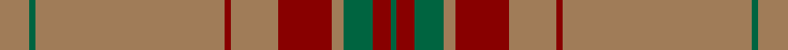

This page is one **sett** — a single exact thread-count. It belongs to the [tartan](/setts/o5g1o32r1o8r9o2g2g3r3g1/)
(the same proportion at any scale), whose colour order is pattern [GRGGRRRRRGR](/stripes/grggrrrrrgr/).

Part of the [Portosalvo](/tartans/portosalvo/) tartan — the named design grouping this sett with its other cloths.

Sourced from tartans-authority.  It is a [11 stripe tartan](/stripes/stripes11/).

Original link http://www.tartansauthority.com/tartan-ferret/display/10328/

## Register references

External register numbers recorded for this tartan.

- Scottish Register of Tartans: [10328](https://www.tartanregister.gov.uk/tartanDetails?ref=10328)
- Scottish Tartans Authority (ITI): 10328

## Thread count
LT/10 Ga2 LT64 DR2 LT16 DR18 LT4 Ga4 G6 DR6 Ga/2

One full sett is **256 threads**.

## Palette

Palette: <strong>Tartan Register</strong> <small style="color:#888">(2 of 3 colours)</small>
<table><thead><tr><th>Colour</th><th>Threads</th><th>Shade</th><th>Base</th><th>OKLCh</th></tr></thead><tbody><tr><td>LT/</td><td style="text-align:right;font-variant-numeric:tabular-nums">10</td><td><code style="background-color:#A07C58;">#A07C58</code> <small style="color:#888">#A07C58</small></td><td>R <code style="background-color:#CC0000;">#CC0000</code></td><td><small style="color:#888">oklch(61.2% 0.067 66.0)</small></td></tr><tr><td>Ga</td><td style="text-align:right;font-variant-numeric:tabular-nums">2</td><td><code style="background-color:#006440;">#006440</code> <small style="color:#888">#006440</small></td><td>G <code style="background-color:#006100;">#006100</code></td><td><small style="color:#888">oklch(44.4% 0.100 160.2)</small></td></tr><tr><td>LT</td><td style="text-align:right;font-variant-numeric:tabular-nums">64</td><td><code style="background-color:#A07C58;">#A07C58</code> <small style="color:#888">#A07C58</small></td><td>R <code style="background-color:#CC0000;">#CC0000</code></td><td><small style="color:#888">oklch(61.2% 0.067 66.0)</small></td></tr><tr><td>DR</td><td style="text-align:right;font-variant-numeric:tabular-nums">2</td><td><code style="background-color:#880000;">#880000</code> <small style="color:#888">#880000</small></td><td>R <code style="background-color:#CC0000;">#CC0000</code></td><td><small style="color:#888">oklch(39.4% 0.162 29.2)</small></td></tr><tr><td>LT</td><td style="text-align:right;font-variant-numeric:tabular-nums">16</td><td><code style="background-color:#A07C58;">#A07C58</code> <small style="color:#888">#A07C58</small></td><td>R <code style="background-color:#CC0000;">#CC0000</code></td><td><small style="color:#888">oklch(61.2% 0.067 66.0)</small></td></tr><tr><td>DR</td><td style="text-align:right;font-variant-numeric:tabular-nums">18</td><td><code style="background-color:#880000;">#880000</code> <small style="color:#888">#880000</small></td><td>R <code style="background-color:#CC0000;">#CC0000</code></td><td><small style="color:#888">oklch(39.4% 0.162 29.2)</small></td></tr><tr><td>LT</td><td style="text-align:right;font-variant-numeric:tabular-nums">4</td><td><code style="background-color:#A07C58;">#A07C58</code> <small style="color:#888">#A07C58</small></td><td>R <code style="background-color:#CC0000;">#CC0000</code></td><td><small style="color:#888">oklch(61.2% 0.067 66.0)</small></td></tr><tr><td>Ga</td><td style="text-align:right;font-variant-numeric:tabular-nums">4</td><td><code style="background-color:#006440;">#006440</code> <small style="color:#888">#006440</small></td><td>G <code style="background-color:#006100;">#006100</code></td><td><small style="color:#888">oklch(44.4% 0.100 160.2)</small></td></tr><tr><td>G</td><td style="text-align:right;font-variant-numeric:tabular-nums">6</td><td><code style="background-color:#006440;">#006440</code> <small style="color:#888">#006440</small></td><td>G <code style="background-color:#006100;">#006100</code></td><td><small style="color:#888">oklch(44.4% 0.100 160.2)</small></td></tr><tr><td>DR</td><td style="text-align:right;font-variant-numeric:tabular-nums">6</td><td><code style="background-color:#880000;">#880000</code> <small style="color:#888">#880000</small></td><td>R <code style="background-color:#CC0000;">#CC0000</code></td><td><small style="color:#888">oklch(39.4% 0.162 29.2)</small></td></tr><tr><td>Ga/</td><td style="text-align:right;font-variant-numeric:tabular-nums">2</td><td><code style="background-color:#006440;">#006440</code> <small style="color:#888">#006440</small></td><td>G <code style="background-color:#006100;">#006100</code></td><td><small style="color:#888">oklch(44.4% 0.100 160.2)</small></td></tr></tbody></table>

## Compared to the master

This cloth is one sett of its design; the master sett (the exemplar the design is anchored on) is below for comparison.

<figure style="margin:0"><figcaption style="color:#888;font-size:smaller">this sett</figcaption></figure>
<figure style="margin:0"><figcaption style="color:#888;font-size:smaller"><a href="/setts/g5w1g32db1g8db9g2w2r3db3w1/">master sett →</a></figcaption></figure>

## Nearest tartans

The nearest existing variants by ΔTartan distance, with this tartan at the top so the swatches line up against it.

ΔTartan

Tartan

Sett

—

<a href="/ttd/edit/#slug=o5g1o32r1o8r9o2g2g3r3g1~x2">Portosalvo (Corporate)</a> <a class="nn-out" href="/variants/s11/o5g1o32r1o8r9o2g2g3r3g1~x2/" title="open its dictionary page">↗</a>

1.51

<a href="/ttd/edit/#slug=r4lo40n12o2n12lo30k2lo4k2lo4o2lo3k3~x2&amp;base=o5g1o32r1o8r9o2g2g3r3g1~x2">Bartlett (Personal)</a> <a class="nn-out" href="/variants/s13/r4lo40n12o2n12lo30k2lo4k2lo4o2lo3k3~x2/" title="open its dictionary page">↗</a>

1.51

<a href="/ttd/edit/#slug=y40n3y8r2y2w2y10n6do2n2w2~x2&amp;base=o5g1o32r1o8r9o2g2g3r3g1~x2">Spencer</a> <a class="nn-out" href="/variants/s11/y40n3y8r2y2w2y10n6do2n2w2~x2/" title="open its dictionary page">↗</a>

1.64

<a href="/ttd/edit/#slug=g6w1g12o4r4o2r4o32g1o2~x2&amp;base=o5g1o32r1o8r9o2g2g3r3g1~x2">Seton, hunting</a> <a class="nn-out" href="/variants/s10/g6w1g12o4r4o2r4o32g1o2~x2/" title="open its dictionary page">↗</a>

1.69

<a href="/ttd/edit/#slug=o4y13o3db4o3db3o40db3o2lo4~x2&amp;base=o5g1o32r1o8r9o2g2g3r3g1~x2">Galway Irish County Tartan</a> <a class="nn-out" href="/variants/s10/o4y13o3db4o3db3o40db3o2lo4~x2/" title="open its dictionary page">↗</a>

1.73

<a href="/ttd/edit/#slug=dy42do10t2do2lo2do2dy10lo6do2lo3dy2~x2&amp;base=o5g1o32r1o8r9o2g2g3r3g1~x2">Yarrow</a> <a class="nn-out" href="/variants/s11/dy42do10t2do2lo2do2dy10lo6do2lo3dy2~x2/" title="open its dictionary page">↗</a>

1.74

<a href="/ttd/edit/#slug=r2g2r2g4ly3dy45g2dy3g2~x2&amp;base=o5g1o32r1o8r9o2g2g3r3g1~x2">Welsh Stanley–Gpa (Personal)</a> <a class="nn-out" href="/variants/s9/r2g2r2g4ly3dy45g2dy3g2~x2/" title="open its dictionary page">↗</a>

1.79

<a href="/ttd/edit/#slug=y40r8y4w2y4ly5~x2&amp;base=o5g1o32r1o8r9o2g2g3r3g1~x2">Reid (1939)</a> <a class="nn-out" href="/variants/s6/y40r8y4w2y4ly5~x2/" title="open its dictionary page">↗</a>

1.81

<a href="/ttd/edit/#slug=o16lb8dy1lb2dy1lb1dy8o34w2~x2&amp;base=o5g1o32r1o8r9o2g2g3r3g1~x2">Stuart of Bute St Colmac</a> <a class="nn-out" href="/variants/s9/o16lb8dy1lb2dy1lb1dy8o34w2~x2/" title="open its dictionary page">↗</a>

1.88

<a href="/ttd/edit/#slug=lo78r10r1g2r6lo2r3lo2r43~x2&amp;base=o5g1o32r1o8r9o2g2g3r3g1~x2">Montreal Granate</a> <a class="nn-out" href="/variants/s9/lo78r10r1g2r6lo2r3lo2r43~x2/" title="open its dictionary page">↗</a>

1.93

<a href="/ttd/edit/#slug=dy36k3o6k3dy10o5dy3lo4k1dy2~x2&amp;base=o5g1o32r1o8r9o2g2g3r3g1~x2">Mead Hunting (Personal)</a> <a class="nn-out" href="/variants/s10/dy36k3o6k3dy10o5dy3lo4k1dy2~x2/" title="open its dictionary page">↗</a>

## Neighbour map

Every grey dot is one of 14360 variants placed by the first two principal components of the ΔTartan feature space (44% of its variance). Red is this tartan; blue dots are its nearest — click one to open its page.

<svg viewBox="0 0 640 380" role="img" style="max-width:100%;height:auto;border:1px solid #e0e0e0;border-radius:4px;display:block" xmlns="http://www.w3.org/2000/svg"><image href="/nn/cloud.v1.png" width="640" height="380"/><a href="/variants/s13/r4lo40n12o2n12lo30k2lo4k2lo4o2lo3k3~x2/"><circle cx="453.2" cy="138.9" r="4" fill="#3465a4"><title>Bartlett (Personal)</title></circle></a><a href="/variants/s11/y40n3y8r2y2w2y10n6do2n2w2~x2/"><circle cx="537.7" cy="140.5" r="4" fill="#3465a4"><title>Spencer</title></circle></a><a href="/variants/s10/g6w1g12o4r4o2r4o32g1o2~x2/"><circle cx="463.7" cy="157.4" r="4" fill="#3465a4"><title>Seton, hunting</title></circle></a><a href="/variants/s10/o4y13o3db4o3db3o40db3o2lo4~x2/"><circle cx="461.7" cy="142.6" r="4" fill="#3465a4"><title>Galway Irish County Tartan</title></circle></a><a href="/variants/s11/dy42do10t2do2lo2do2dy10lo6do2lo3dy2~x2/"><circle cx="505.3" cy="168.8" r="4" fill="#3465a4"><title>Yarrow</title></circle></a><a href="/variants/s9/r2g2r2g4ly3dy45g2dy3g2~x2/"><circle cx="585.6" cy="161.5" r="4" fill="#3465a4"><title>Welsh Stanley–Gpa (Personal)</title></circle></a><a href="/variants/s6/y40r8y4w2y4ly5~x2/"><circle cx="564.5" cy="187.4" r="4" fill="#3465a4"><title>Reid (1939)</title></circle></a><a href="/variants/s9/o16lb8dy1lb2dy1lb1dy8o34w2~x2/"><circle cx="528.2" cy="165.1" r="4" fill="#3465a4"><title>Stuart of Bute St Colmac</title></circle></a><a href="/variants/s9/lo78r10r1g2r6lo2r3lo2r43~x2/"><circle cx="506.8" cy="130.2" r="4" fill="#3465a4"><title>Montreal Granate</title></circle></a><a href="/variants/s10/dy36k3o6k3dy10o5dy3lo4k1dy2~x2/"><circle cx="496.8" cy="127.6" r="4" fill="#3465a4"><title>Mead Hunting (Personal)</title></circle></a><circle cx="538.0" cy="141.2" r="5" fill="#c00000"/></svg>

ID: /variants/s11/o5g1o32r1o8r9o2g2g3r3g1~x2/
