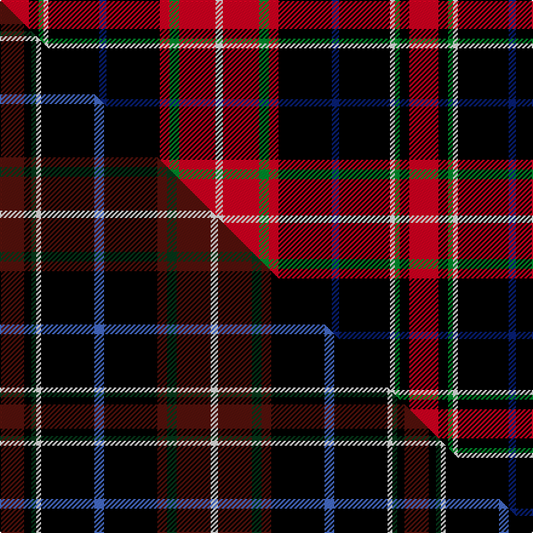

This is one **variant** — a specific cloth: this exact thread count and colourway, with its own
provenance below. It is one weaving of the [sett](/setts/r12k4g2w2k21db3k22r4g4r15w3/) (the scale-free proportion — the
same cloth at any scale or shade), whose colour order is pattern [RKGWKBKRGRW](/stripes/rkgwkbkrgrw/).

Part of the [MacDonald, Sir John A](/tartans/m/ma/macdonald-sir-john-a/) tartan — the named design grouping this sett with its other cloths.

Sourced from weddslist.  It is a [11 stripe tartan](/stripes/stripes11/).

Original link [http://www.weddslist.com/cgi-bin/tartans/pg.pl?source=sts](http://www.weddslist.com/cgi-bin/tartans/pg.pl?source=sts)

Dataset <small>— provenance for this record, inherited from the source manifest</small>

<dl class="dataset-prov">
<dt>source</dt><dd><a href="/sources/weddslist/">Weddslist</a></dd>
<dt>data captured from</dt><dd><a href="https://github.com/thetartan/tartan-database/blob/master/data/weddslist/data.csv">https://github.com/thetartan/tartan-database/blob/master/data/weddslist/data.csv</a></dd>
<dt>data date</dt><dd>2016-11-17 <small>(dataset default)</small></dd>
<dt>licence</dt><dd><a href="https://creativecommons.org/licenses/by-nc-nd/4.0/">CC BY-NC-ND 4.0</a></dd>
</dl>

Capture chain <small>— the hands this data passed through, oldest first; each capture carries its own licence</small>

<ol class="capture-chain">
<li><a href="https://www.weddslist.com/tartans/">Weddslist</a> <small>the living privately compiled reference</small></li>
<li><a href="https://github.com/thetartan/tartan-database">thetartan/tartan-database</a> <small>2016-2017</small> · <a href="https://creativecommons.org/licenses/by-nc-nd/4.0/">CC BY-NC-ND 4.0</a> <small>Levko Kravets's frozen compilation — the capture we vendored, and where its CC licence text came from</small></li>
<li>this dictionary <small>captured 2026-06-10 · commit 5bf86c7566</small> <small>each re-capture is a git commit to data/sources</small></li>
</ol>

## Thread count
R/24 K8 G4 W4 K42 DB6 K44 R8 G8 R30 W/6

One full sett is **338 threads**.

## Palette
<table><thead><tr><th>Colour</th><th>Shade</th><th>OKLCh</th></tr></thead><tbody><tr><td>DB</td><td><code style="background-color:#082077;">#082077</code> <small style="color:#888">#082077</small></td><td><small style="color:#888">oklch(30.0% 0.149 265.1)</small></td></tr><tr><td>G</td><td><code style="background-color:#008B2A;">#008B2A</code> <small style="color:#888">#008B2A</small></td><td><small style="color:#888">oklch(55.4% 0.170 145.9)</small></td></tr><tr><td>K</td><td><code style="background-color:#000000;">#000000</code> <small style="color:#888">#000000</small></td><td><small style="color:#888">oklch(0.0% 0.000 0.0)</small></td></tr><tr><td>W</td><td><code style="background-color:#F7F7F7;">#F7F7F7</code> <small style="color:#888">#F7F7F7</small></td><td><small style="color:#888">oklch(97.6% 0.000 89.9)</small></td></tr><tr><td>R</td><td><code style="background-color:#D60020;">#D60020</code> <small style="color:#888">#D60020</small></td><td><small style="color:#888">oklch(55.2% 0.224 25.5)</small></td></tr></tbody></table>

# Sample pattern

## Compared to the master

This cloth is one sett of its design; the master sett (the exemplar the design is anchored on) is below for comparison.

Its **ΔTartan distance** from the master is **0.29** — the same measure the nearest-tartans table ranks by (0 is identical; a re-scale of the same cloth is near 0, a recolour or a different proportion further).

<figure class="master-compare" style="margin:0">

this sett
master sett ★

<figcaption style="color:#888;font-size:smaller">One weave of this sett against the <a href="/setts/dr10k3dg2w2k22b4k22dr4dg4dr14w3/">master sett ★</a>, split on the diagonal: a shared proportion runs seamlessly across it with only the shades shifting; a different proportion breaks on it.</figcaption>
</figure>

## Nearest tartan variants

The nearest existing variants by ΔTartan distance, with this cloth at the top so the swatches line up against it.

ΔTartan

Threads

Variant

Sett

—

338

<a href="/variants/s11/r12k4g2w2k21db3k22r4g4r15w3~x2/">MacDonald, Sir John A.</a>

<a href="/ttd/edit/#slug=r10k3g2w2k22db4k22r4g4r14w3~x2&amp;base=r12k4g2w2k21db3k22r4g4r15w3~x2" title="compare in the TTD">0.14</a>

334

<a href="/variants/s11/r10k3g2w2k22db4k22r4g4r14w3~x2/">York Region Pipe Band</a>

<a href="/ttd/edit/#slug=dr10k3dg2w2k22b4k22dr4dg4dr14w3~x2&amp;base=r12k4g2w2k21db3k22r4g4r15w3~x2" title="compare in the TTD">0.29</a>

334

<a href="/variants/s11/dr10k3dg2w2k22b4k22dr4dg4dr14w3~x2/">MacDonald, Sir John A</a>

<a href="/ttd/edit/#slug=r2k20r5k4dg4k4r5k2r14k2y2~x2&amp;base=r12k4g2w2k21db3k22r4g4r15w3~x2" title="compare in the TTD">2.36</a>

248

<a href="/variants/s11/r2k20r5k4dg4k4r5k2r14k2y2~x2/">Canterbury (Fashion)</a>

<a href="/ttd/edit/#slug=k51r21ly4r12g8db4r5~x2&amp;base=r12k4g2w2k21db3k22r4g4r15w3~x2" title="compare in the TTD">2.36</a>

308

<a href="/variants/s7/k51r21ly4r12g8db4r5~x2/">Tott (Personal))</a>

<a href="/ttd/edit/#slug=k51r21y4r12g8db4r5~x2&amp;base=r12k4g2w2k21db3k22r4g4r15w3~x2" title="compare in the TTD">2.39</a>

308

<a href="/variants/s7/k51r21y4r12g8db4r5~x2/">Totté (from Hofstade de Baerebeeck) (Personal)</a>

<a href="/ttd/edit/#slug=r8k14r6y6r34k10r6w6r6k64r44db9r6&amp;base=r12k4g2w2k21db3k22r4g4r15w3~x2" title="compare in the TTD">2.56</a>

424

<a href="/variants/s13/r8k14r6y6r34k10r6w6r6k64r44db9r6/">First Special Service Force</a>

<a href="/ttd/edit/#slug=k23r27db3r5w3k14y6~x2&amp;base=r12k4g2w2k21db3k22r4g4r15w3~x2" title="compare in the TTD">2.57</a>

266

<a href="/variants/s7/k23r27db3r5w3k14y6~x2/">Hoffman Texas German</a>

<a href="/ttd/edit/#slug=r8k14r6ly6r34k10r6w6r6k64r44db9r6&amp;base=r12k4g2w2k21db3k22r4g4r15w3~x2" title="compare in the TTD">2.58</a>

424

<a href="/variants/s13/r8k14r6ly6r34k10r6w6r6k64r44db9r6/">First Special Service Force</a>

<a href="/ttd/edit/#slug=lo7k3db4k3dr21k2dr4k2w4~x2&amp;base=r12k4g2w2k21db3k22r4g4r15w3~x2" title="compare in the TTD">2.62</a>

178

<a href="/variants/s9/lo7k3db4k3dr21k2dr4k2w4~x2/">Castle Stewart (District)</a>

<a href="/ttd/edit/#slug=k22ly4k4g4k16r36y3r6~x2&amp;base=r12k4g2w2k21db3k22r4g4r15w3~x2" title="compare in the TTD">2.71</a>

324

<a href="/variants/s8/k22ly4k4g4k16r36y3r6~x2/">Dean Brae</a>

## Neighbour map

Every grey dot is one of 13656 variants placed by the first two principal components of the ΔTartan feature space (42% of its variance). Red is this tartan; blue dots are its nearest — click one to open its page. The map is a flat projection of a many-dimensional space — [how to read it](/posts/neighbourhood-maps/).

<svg viewBox="0 0 640 380" role="img" style="max-width:100%;height:auto;border:1px solid #e0e0e0;border-radius:4px;display:block" xmlns="http://www.w3.org/2000/svg"><image href="/nn/cloud.v1.png" width="640" height="380"/><a href="/variants/s11/r10k3g2w2k22db4k22r4g4r14w3~x2/"><circle cx="196.7" cy="129.9" r="4" fill="#3465a4"><title>York Region Pipe Band</title></circle></a><a href="/variants/s11/dr10k3dg2w2k22b4k22dr4dg4dr14w3~x2/"><circle cx="221.5" cy="142.9" r="4" fill="#3465a4"><title>MacDonald, Sir John A</title></circle></a><a href="/variants/s11/r2k20r5k4dg4k4r5k2r14k2y2~x2/"><circle cx="231.2" cy="143.0" r="4" fill="#3465a4"><title>Canterbury (Fashion)</title></circle></a><a href="/variants/s7/k51r21ly4r12g8db4r5~x2/"><circle cx="213.8" cy="132.8" r="4" fill="#3465a4"><title>Tott (Personal))</title></circle></a><a href="/variants/s7/k51r21y4r12g8db4r5~x2/"><circle cx="216.3" cy="133.2" r="4" fill="#3465a4"><title>Totté (from Hofstade de Baerebeeck) (Personal)</title></circle></a><a href="/variants/s13/r8k14r6y6r34k10r6w6r6k64r44db9r6/"><circle cx="216.8" cy="110.6" r="4" fill="#3465a4"><title>First Special Service Force</title></circle></a><a href="/variants/s7/k23r27db3r5w3k14y6~x2/"><circle cx="178.5" cy="164.3" r="4" fill="#3465a4"><title>Hoffman Texas German</title></circle></a><a href="/variants/s13/r8k14r6ly6r34k10r6w6r6k64r44db9r6/"><circle cx="215.1" cy="110.2" r="4" fill="#3465a4"><title>First Special Service Force</title></circle></a><a href="/variants/s9/lo7k3db4k3dr21k2dr4k2w4~x2/"><circle cx="194.4" cy="138.8" r="4" fill="#3465a4"><title>Castle Stewart (District)</title></circle></a><a href="/variants/s8/k22ly4k4g4k16r36y3r6~x2/"><circle cx="198.0" cy="136.7" r="4" fill="#3465a4"><title>Dean Brae</title></circle></a><circle cx="193.6" cy="131.4" r="5" fill="#c00000"/><text x="320" y="376" text-anchor="middle" font-size="11" fill="#999">ground</text><text x="11" y="190" text-anchor="middle" font-size="11" fill="#999" transform="rotate(-90 11 190)">complexity</text></svg>

ID: /variants/s11/r12k4g2w2k21db3k22r4g4r15w3~x2/
