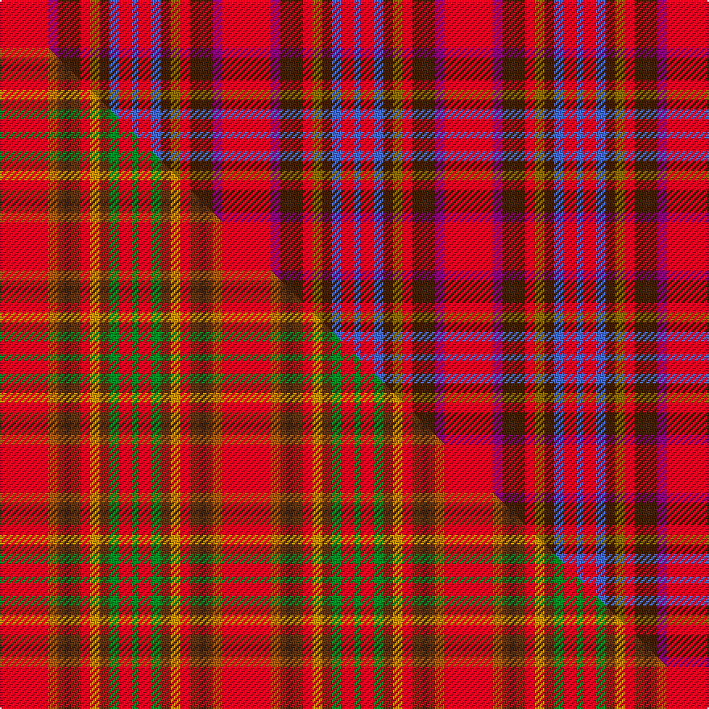

This is one **variant** — a specific cloth: this exact thread count and colourway, with its own
provenance below. It is one weaving of the [sett](/setts/r15dp3dy2do2dy3r3y3dy3b3r4b2/) (the scale-free proportion — the
same cloth at any scale or shade), whose colour order is pattern [BRBGGRGBGBR](/stripes/brbggrgbgbr/).

Part of the [Unidentified Chair Covering](/tartans/u/un/unidentified-chair-covering/) tartan — the named design grouping this sett with its other cloths.

Sourced from weddslist.  It is a [11 stripe tartan](/stripes/stripes11/).

Original link [http://www.weddslist.com/cgi-bin/tartans/pg.pl?source=sts](http://www.weddslist.com/cgi-bin/tartans/pg.pl?source=sts)

Dataset <small>— provenance for this record, inherited from the source manifest</small>

<dl class="dataset-prov">
<dt>source</dt><dd><a href="/sources/weddslist/">Weddslist</a></dd>
<dt>data captured from</dt><dd><a href="https://github.com/thetartan/tartan-database/blob/master/data/weddslist/data.csv">https://github.com/thetartan/tartan-database/blob/master/data/weddslist/data.csv</a></dd>
<dt>data date</dt><dd>2016-11-17 <small>(dataset default)</small></dd>
<dt>licence</dt><dd><a href="https://creativecommons.org/licenses/by-nc-nd/4.0/">CC BY-NC-ND 4.0</a></dd>
</dl>

Capture chain <small>— the hands this data passed through, oldest first; each capture carries its own licence</small>

<ol class="capture-chain">
<li><a href="https://www.weddslist.com/tartans/">Weddslist</a> <small>the living privately compiled reference</small></li>
<li><a href="https://github.com/thetartan/tartan-database">thetartan/tartan-database</a> <small>2016-2017</small> · <a href="https://creativecommons.org/licenses/by-nc-nd/4.0/">CC BY-NC-ND 4.0</a> <small>Levko Kravets's frozen compilation — the capture we vendored, and where its CC licence text came from</small></li>
<li>this dictionary <small>captured 2026-06-10 · commit 5bf86c7566</small> <small>each re-capture is a git commit to data/sources</small></li>
</ol>

## Thread count
R/30 DP6 DY4 DO4 DY6 R6 Y6 DY6 B6 R8 B/4

One full sett is **138 threads**.

## Palette
<table><thead><tr><th>Colour</th><th>Shade</th><th>OKLCh</th></tr></thead><tbody><tr><td>DY</td><td><code style="background-color:#402000;">#402000</code> <small style="color:#888">#402000</small></td><td><small style="color:#888">oklch(28.2% 0.066 60.5)</small></td></tr><tr><td>R</td><td><code style="background-color:#D60020;">#D60020</code> <small style="color:#888">#D60020</small></td><td><small style="color:#888">oklch(55.2% 0.224 25.5)</small></td></tr><tr><td>B</td><td><code style="background-color:#466CC8;">#466CC8</code> <small style="color:#888">#466CC8</small></td><td><small style="color:#888">oklch(55.1% 0.149 265.0)</small></td></tr><tr><td>Y</td><td><code style="background-color:#8B6E00;">#8B6E00</code> <small style="color:#888">#8B6E00</small></td><td><small style="color:#888">oklch(55.1% 0.113 90.4)</small></td></tr><tr><td>DP</td><td><code style="background-color:#800070;">#800070</code> <small style="color:#888">#800070</small></td><td><small style="color:#888">oklch(41.1% 0.183 335.2)</small></td></tr><tr><td>DO</td><td><code style="background-color:#412714;">#412714</code> <small style="color:#888">#412714</small></td><td><small style="color:#888">oklch(30.1% 0.050 55.7)</small></td></tr></tbody></table>

# Sample pattern

## Compared to the master

This cloth is one sett of its design; the master sett (the exemplar the design is anchored on) is below for comparison.

Its **ΔTartan distance** from the master is **2.69** — the same measure the nearest-tartans table ranks by (0 is identical; a re-scale of the same cloth is near 0, a recolour or a different proportion further).

<figure class="master-compare" style="margin:0">

this sett
master sett ★

<figcaption style="color:#888;font-size:smaller">One weave of this sett against the <a href="/setts/r15o3dy2do2dy3r3ly3dy3g3r4g2/">master sett ★</a>, split on the diagonal: a shared proportion runs seamlessly across it with only the shades shifting; a different proportion breaks on it.</figcaption>
</figure>

## Nearest tartan variants

The nearest existing variants by ΔTartan distance, with this cloth at the top so the swatches line up against it.

ΔTartan

Threads

Variant

Sett

—

138

<a href="/variants/s11/r15dp3dy2do2dy3r3y3dy3b3r4b2~x2~dp1607335-dy1103057/">Unidentified, chair covering</a>

<a href="/ttd/edit/#slug=r15o3dy2do2dy3r3lo3dy3g3r4g2~x2~dy1503057-lo2806085&amp;base=r15dp3dy2do2dy3r3y3dy3b3r4b2~x2~dp1607335-dy1103057" title="compare in the TTD">2.68</a>

138

<a href="/variants/s11/r15o3dy2do2dy3r3ly3dy3g3r4g2~x2~dy1503057-ly2806085/">Unidentified Chair Covering</a>

<a href="/ttd/edit/#slug=r28y3r3db3r4b8dg10dp15b4~x2~db1003265-dg1304144&amp;base=r15dp3dy2do2dy3r3y3dy3b3r4b2~x2~dp1607335-dy1103057" title="compare in the TTD">2.75</a>

248

<a href="/variants/s9/r28y3r3db3r4b8dg10dp15b4~x2~db1003265-dg1304144/">Loch Lomond</a>

<a href="/ttd/edit/#slug=do2ri3r3ri21y3ri2r6db6r4w2~x2~ri2906009-r2609025&amp;base=r15dp3dy2do2dy3r3y3dy3b3r4b2~x2~dp1607335-dy1103057" title="compare in the TTD">3.20</a>

200

<a href="/variants/s10/do2ri3r3ri21y3ri2r6db6r4w2~x2~ri2906009-r2609025/">Hello Kitty (Corporate)</a>

<a href="/ttd/edit/#slug=do2ri3r3ri21y3ri2r6db6r4w2~x2~ri2906019-r2510029&amp;base=r15dp3dy2do2dy3r3y3dy3b3r4b2~x2~dp1607335-dy1103057" title="compare in the TTD">3.26</a>

200

<a href="/variants/s10/do2lr3r3lr21y3lr2r6db6r4w2~x2~lr2906019-r2510029/">Hello Kitty</a>

<a href="/ttd/edit/#slug=r8dp2r14y2r2dp6r2dg2r2dg11r2db2r6~x2&amp;base=r15dp3dy2do2dy3r3y3dy3b3r4b2~x2~dp1607335-dy1103057" title="compare in the TTD">3.33</a>

216

<a href="/variants/s13/r8dp2r14y2r2dp6r2dg2r2dg11r2db2r6~x2/">London Caledonian</a>

<a href="/ttd/edit/#slug=r26b2r6n2r2n2o2n9w5dg2w4o2~x2&amp;base=r15dp3dy2do2dy3r3y3dy3b3r4b2~x2~dp1607335-dy1103057" title="compare in the TTD">3.76</a>

200

<a href="/variants/s12/r26b2r6n2r2n2o2n9w5dg2w4o2~x2/">Rathmore</a>

<a href="/ttd/edit/#slug=y6r30n2k3n30g3n2r25w6~x2&amp;base=r15dp3dy2do2dy3r3y3dy3b3r4b2~x2~dp1607335-dy1103057" title="compare in the TTD">3.79</a>

404

<a href="/variants/s9/y6r30n2k3n30g3n2r25w6~x2/">Virginia Military Institute, New Market</a>

<a href="/ttd/edit/#slug=r1dy1r9g6lg2gi3r2y1~x4~lg2803208-gi2203208&amp;base=r15dp3dy2do2dy3r3y3dy3b3r4b2~x2~dp1607335-dy1103057" title="compare in the TTD">3.83</a>

192

<a href="/variants/s8/r1dy1r9g6lg2t3r2y1~x4~lg2803208-t2203208/">Battle of Bannockburn, The</a>

<a href="/ttd/edit/#slug=dp2lb9dp3ri7r19y2~x2~ri2109032-r1706009&amp;base=r15dp3dy2do2dy3r3y3dy3b3r4b2~x2~dp1607335-dy1103057" title="compare in the TTD">3.86</a>

160

<a href="/variants/s6/dp2lb9dp3ri7r19y2~x2~ri2109032-r1706009/">Stevens #3</a>

<a href="/ttd/edit/#slug=r2ri6db5lg3g13ri20do2ri2~x2~r1906038-ri2109032&amp;base=r15dp3dy2do2dy3r3y3dy3b3r4b2~x2~dp1607335-dy1103057" title="compare in the TTD">3.88</a>

204

<a href="/variants/s8/r2ri6db5lg3g13ri20do2ri2~x2~r1906038-ri2109032/">Flowers of the Forest, The</a>

## Neighbour map

Every grey dot is one of 13621 variants placed by the first two principal components of the ΔTartan feature space (42% of its variance). Red is this tartan; blue dots are its nearest — click one to open its page.

<svg viewBox="0 0 640 380" role="img" style="max-width:100%;height:auto;border:1px solid #e0e0e0;border-radius:4px;display:block" xmlns="http://www.w3.org/2000/svg"><image href="/nn/cloud.v1.png" width="640" height="380"/><a href="/variants/s11/r15o3dy2do2dy3r3ly3dy3g3r4g2~x2~dy1503057-ly2806085/"><circle cx="280.3" cy="179.6" r="4" fill="#3465a4"><title>Unidentified Chair Covering</title></circle></a><a href="/variants/s9/r28y3r3db3r4b8dg10dp15b4~x2~db1003265-dg1304144/"><circle cx="220.0" cy="168.4" r="4" fill="#3465a4"><title>Loch Lomond</title></circle></a><a href="/variants/s10/do2ri3r3ri21y3ri2r6db6r4w2~x2~ri2906009-r2609025/"><circle cx="263.0" cy="146.1" r="4" fill="#3465a4"><title>Hello Kitty (Corporate)</title></circle></a><a href="/variants/s10/do2lr3r3lr21y3lr2r6db6r4w2~x2~lr2906019-r2510029/"><circle cx="262.1" cy="148.8" r="4" fill="#3465a4"><title>Hello Kitty</title></circle></a><a href="/variants/s13/r8dp2r14y2r2dp6r2dg2r2dg11r2db2r6~x2/"><circle cx="304.6" cy="178.0" r="4" fill="#3465a4"><title>London Caledonian</title></circle></a><a href="/variants/s12/r26b2r6n2r2n2o2n9w5dg2w4o2~x2/"><circle cx="277.5" cy="116.1" r="4" fill="#3465a4"><title>Rathmore</title></circle></a><a href="/variants/s9/y6r30n2k3n30g3n2r25w6~x2/"><circle cx="280.8" cy="135.0" r="4" fill="#3465a4"><title>Virginia Military Institute, New Market</title></circle></a><a href="/variants/s8/r1dy1r9g6lg2t3r2y1~x4~lg2803208-t2203208/"><circle cx="247.2" cy="186.3" r="4" fill="#3465a4"><title>Battle of Bannockburn, The</title></circle></a><a href="/variants/s6/dp2lb9dp3ri7r19y2~x2~ri2109032-r1706009/"><circle cx="255.9" cy="202.4" r="4" fill="#3465a4"><title>Stevens #3</title></circle></a><a href="/variants/s8/r2ri6db5lg3g13ri20do2ri2~x2~r1906038-ri2109032/"><circle cx="260.3" cy="165.6" r="4" fill="#3465a4"><title>Flowers of the Forest, The</title></circle></a><circle cx="264.6" cy="172.3" r="5" fill="#c00000"/><text x="320" y="376" text-anchor="middle" font-size="11" fill="#999">ground</text><text x="11" y="190" text-anchor="middle" font-size="11" fill="#999" transform="rotate(-90 11 190)">complexity</text></svg>

ID: /variants/s11/r15dp3dy2do2dy3r3y3dy3b3r4b2~x2~dp1607335-dy1103057/
