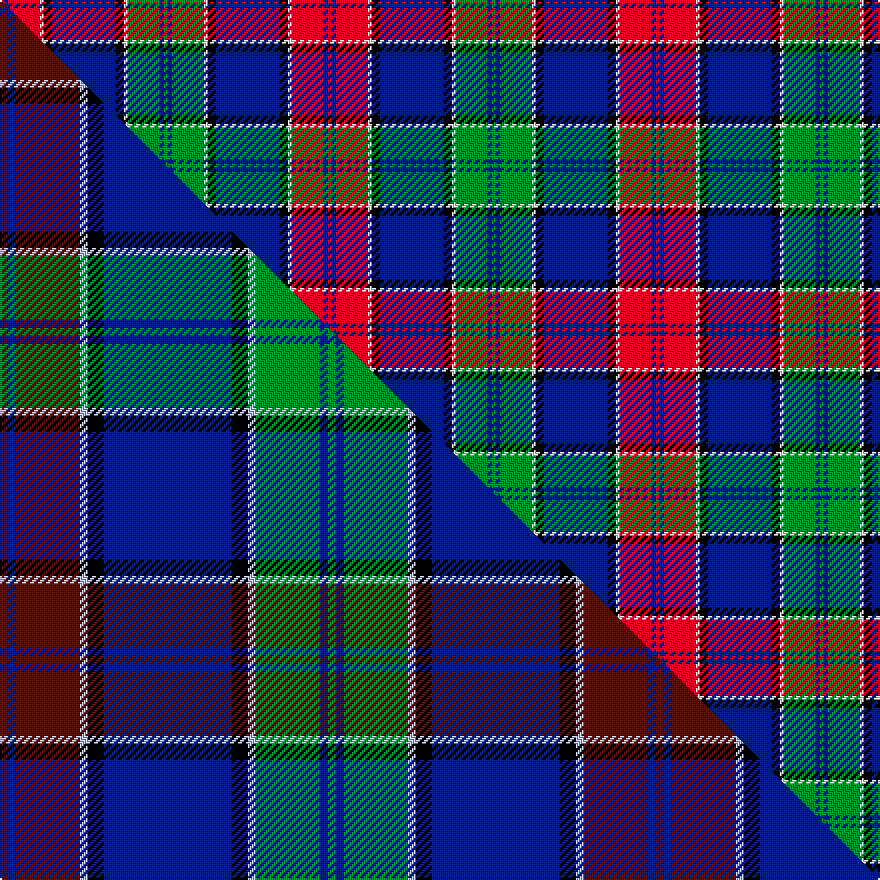

This is one **variant** — a specific cloth: this exact thread count and colourway, with its own
provenance below. It is one weaving of the [sett](/setts/r1db1r8w1k2db16k2w1g8db1g1/) (the scale-free proportion — the
same cloth at any scale or shade), whose colour order is pattern [GBGWKBKWRBR](/stripes/gbgwkbkwrbr/).

Part of the [MacMichael](/tartans/m/ma/macmichael/) tartan — the named design grouping this sett with its other cloths.

Sourced from house-of-tartan.  It is a [11 stripe tartan](/stripes/stripes11/).

Original link [http://www.house-of-tartan.scotland.net/house/TartanViewjs.asp?colr=Def&tnam=2063](http://www.house-of-tartan.scotland.net/house/TartanViewjs.asp?colr=Def&tnam=2063)

## Provenance

Earliest known date: 1991

2 attestations — the source records this cloth was collapsed from (oldest owns this page)

<ul>
<li>1991 — MacMichael Family Tartan (house-of-tartan, <a href="http://www.house-of-tartan.scotland.net/house/TartanViewjs.asp?colr=Def&tnam=2063">record</a>) </li>
<li>undated — MacMichael (weddslist, <a href="http://www.weddslist.com/cgi-bin/tartans/pg.pl?source=sts">record</a>) </li>
</ul>

Dataset <small>— provenance for this record, inherited from the source manifest</small>

<dl class="dataset-prov">
<dt>source</dt><dd><a href="/sources/house-of-tartan/">House of Tartan</a></dd>
<dt>data captured from</dt><dd><a href="https://github.com/thetartan/tartan-database/blob/master/data/house-of-tartan/data.csv">https://github.com/thetartan/tartan-database/blob/master/data/house-of-tartan/data.csv</a></dd>
<dt>data date</dt><dd>1991 <small>(this record)</small></dd>
<dt>licence</dt><dd><a href="https://creativecommons.org/licenses/by-nc-nd/4.0/">CC BY-NC-ND 4.0</a></dd>
</dl>

Capture chain <small>— the hands this data passed through, oldest first; each capture carries its own licence</small>

<ol class="capture-chain">
<li><a href="http://www.house-of-tartan.scotland.net/">House of Tartan</a> <small>the weaver/retailer's database — the site is now offline; the URL is kept as the ultimate source's identity</small></li>
<li><a href="https://github.com/thetartan/tartan-database">thetartan/tartan-database</a> <small>2016-2017</small> · <a href="https://creativecommons.org/licenses/by-nc-nd/4.0/">CC BY-NC-ND 4.0</a> <small>Levko Kravets's frozen compilation — the capture we vendored, and where its CC licence text came from</small></li>
<li>this dictionary <small>captured 2026-06-10 · commit 5bf86c7566</small> <small>each re-capture is a git commit to data/sources</small></li>
</ol>

## Thread count
R/2 DB2 R16 W2 K4 DB32 K4 W2 G16 DB2 G/2

One full sett is **164 threads**.

## Palette
<table><thead><tr><th>Colour</th><th>Shade</th><th>OKLCh</th></tr></thead><tbody><tr><td>DB</td><td><code style="background-color:#082077;">#082077</code> <small style="color:#888">#082077</small></td><td><small style="color:#888">oklch(30.0% 0.149 265.1)</small></td></tr><tr><td>G</td><td><code style="background-color:#008B2A;">#008B2A</code> <small style="color:#888">#008B2A</small></td><td><small style="color:#888">oklch(55.4% 0.170 145.9)</small></td></tr><tr><td>K</td><td><code style="background-color:#000000;">#000000</code> <small style="color:#888">#000000</small></td><td><small style="color:#888">oklch(0.0% 0.000 0.0)</small></td></tr><tr><td>W</td><td><code style="background-color:#F7F7F7;">#F7F7F7</code> <small style="color:#888">#F7F7F7</small></td><td><small style="color:#888">oklch(97.6% 0.000 89.9)</small></td></tr><tr><td>R</td><td><code style="background-color:#D60020;">#D60020</code> <small style="color:#888">#D60020</small></td><td><small style="color:#888">oklch(55.2% 0.224 25.5)</small></td></tr></tbody></table>

# Sample pattern

## Compared to the master

This cloth is one sett of its design; the master sett (the exemplar the design is anchored on) is below for comparison.

Its **ΔTartan distance** from the master is **0.65** — the same measure the nearest-tartans table ranks by (0 is identical; a re-scale of the same cloth is near 0, a recolour or a different proportion further).

<figure class="master-compare" style="margin:0">

this sett
master sett ★

<figcaption style="color:#888;font-size:smaller">One weave of this sett against the <a href="/setts/dr1db1dr8lb1k2db16k2lb1g8db1g1/">master sett ★</a>, split on the diagonal: a shared proportion runs seamlessly across it with only the shades shifting; a different proportion breaks on it.</figcaption>
</figure>

## Nearest tartan variants

The nearest existing variants by ΔTartan distance, with this cloth at the top so the swatches line up against it.

ΔTartan

Threads

Variant

Sett

—

164

<a href="/variants/s11/r1db1r8w1k2db16k2w1g8db1g1~x2/">MacMichael Family Tartan</a>

<a href="/ttd/edit/#slug=dr1db1dr8lb1k2db16k2lb1g8db1g1~x4&amp;base=r1db1r8w1k2db16k2w1g8db1g1~x2" title="compare in the TTD">0.65</a>

328

<a href="/variants/s11/dr1db1dr8lb1k2db16k2lb1g8db1g1~x4/">MacMichael</a>

<a href="/ttd/edit/#slug=o38k4w4k4n10k4n10k4w2dp3~x2~o2500000-n1900000&amp;base=r1db1r8w1k2db16k2w1g8db1g1~x2" title="compare in the TTD">1.85</a>

250

<a href="/variants/s10/o38k4w4k4n10k4n10k4w2dp3~x2~o2500000-n1900000/">Penman Grey (Personal)</a>

<a href="/ttd/edit/#slug=dr2db6lr2db2k9lb30k9db5lr4db2dr2~x2&amp;base=r1db1r8w1k2db16k2w1g8db1g1~x2" title="compare in the TTD">1.88</a>

284

<a href="/variants/s11/dr2db6lr2db2k9lb30k9db5lr4db2dr2~x2/">Rangers Dress (Sports)</a>

<a href="/ttd/edit/#slug=lb3k1n12k1n1k2n1k6lr12k1lo1~x4~lb3103284-lr2800000&amp;base=r1db1r8w1k2db16k2w1g8db1g1~x2" title="compare in the TTD">2.15</a>

312

<a href="/variants/s11/lb3k1n12k1n1k2n1k6lr12k1lo1~x4~lb3103284-lr2800000/">McCandlish Dress, Grey (Name)</a>

<a href="/ttd/edit/#slug=n20r2db4lb2db4r2db4k1db1k1db1k4~x4&amp;base=r1db1r8w1k2db16k2w1g8db1g1~x2" title="compare in the TTD">2.17</a>

272

<a href="/variants/s12/n20r2db4lb2db4r2db4k1db1k1db1k4~x4/">Broz Sanz Elementary School</a>

<a href="/ttd/edit/#slug=k4lb26k2lb4k2lb26k3db36k3dg30k3w2&amp;base=r1db1r8w1k2db16k2w1g8db1g1~x2" title="compare in the TTD">2.21</a>

276

<a href="/variants/s12/k4lb26k2lb4k2lb26k3db36k3dg30k3w2/">Ellis (Welsh Name)</a>

<a href="/ttd/edit/#slug=dr4k1db8k1ly3k2db4ly6db4w3k2db20k4dr21k1ly3~x2&amp;base=r1db1r8w1k2db16k2w1g8db1g1~x2" title="compare in the TTD">2.22</a>

334

<a href="/variants/s16/dr4k1db8k1ly3k2db4ly6db4w3k2db20k4dr21k1ly3~x2/">Westmeath County Crest (Fashion)</a>

<a href="/ttd/edit/#slug=g2db2lb23db2lb2db6lb2db2k33y2lb2~x2&amp;base=r1db1r8w1k2db16k2w1g8db1g1~x2" title="compare in the TTD">2.26</a>

304

<a href="/variants/s11/g2db2lb23db2lb2db6lb2db2k33y2lb2~x2/">Smith Family (Maine) (Personal)</a>

<a href="/ttd/edit/#slug=n4dr20k2dr2k2dr3k6o26w3o2w2o4~x2~n1900000-o2500000&amp;base=r1db1r8w1k2db16k2w1g8db1g1~x2" title="compare in the TTD">2.27</a>

288

<a href="/variants/s12/n4dr20k2dr2k2dr3k6o26w3o2w2o4~x2~n1900000-o2500000/">Eidart 1990 (Fashion)</a>

<a href="/ttd/edit/#slug=db20r2db2r5db30r2k32w2g30r5g4r2g4w2&amp;base=r1db1r8w1k2db16k2w1g8db1g1~x2" title="compare in the TTD">2.31</a>

262

<a href="/variants/s14/db20r2db2r5db30r2k32w2g30r5g4r2g4w2/">MacDonald of Clanranald #5</a>

## Neighbour map

Every grey dot is one of 13621 variants placed by the first two principal components of the ΔTartan feature space (42% of its variance). Red is this tartan; blue dots are its nearest — click one to open its page. The map is a flat projection of a many-dimensional space — [how to read it](/posts/neighbourhood-maps/).

<svg viewBox="0 0 640 380" role="img" style="max-width:100%;height:auto;border:1px solid #e0e0e0;border-radius:4px;display:block" xmlns="http://www.w3.org/2000/svg"><image href="/nn/cloud.v1.png" width="640" height="380"/><a href="/variants/s11/dr1db1dr8lb1k2db16k2lb1g8db1g1~x4/"><circle cx="209.1" cy="123.3" r="4" fill="#3465a4"><title>MacMichael</title></circle></a><a href="/variants/s10/o38k4w4k4n10k4n10k4w2dp3~x2~o2500000-n1900000/"><circle cx="206.0" cy="107.0" r="4" fill="#3465a4"><title>Penman Grey (Personal)</title></circle></a><a href="/variants/s11/dr2db6lr2db2k9lb30k9db5lr4db2dr2~x2/"><circle cx="157.5" cy="113.4" r="4" fill="#3465a4"><title>Rangers Dress (Sports)</title></circle></a><a href="/variants/s11/lb3k1n12k1n1k2n1k6lr12k1lo1~x4~lb3103284-lr2800000/"><circle cx="136.7" cy="131.0" r="4" fill="#3465a4"><title>McCandlish Dress, Grey (Name)</title></circle></a><a href="/variants/s12/n20r2db4lb2db4r2db4k1db1k1db1k4~x4/"><circle cx="232.7" cy="104.8" r="4" fill="#3465a4"><title>Broz Sanz Elementary School</title></circle></a><a href="/variants/s12/k4lb26k2lb4k2lb26k3db36k3dg30k3w2/"><circle cx="153.6" cy="111.3" r="4" fill="#3465a4"><title>Ellis (Welsh Name)</title></circle></a><a href="/variants/s16/dr4k1db8k1ly3k2db4ly6db4w3k2db20k4dr21k1ly3~x2/"><circle cx="177.6" cy="95.4" r="4" fill="#3465a4"><title>Westmeath County Crest (Fashion)</title></circle></a><a href="/variants/s11/g2db2lb23db2lb2db6lb2db2k33y2lb2~x2/"><circle cx="189.0" cy="93.6" r="4" fill="#3465a4"><title>Smith Family (Maine) (Personal)</title></circle></a><a href="/variants/s12/n4dr20k2dr2k2dr3k6o26w3o2w2o4~x2~n1900000-o2500000/"><circle cx="183.7" cy="115.1" r="4" fill="#3465a4"><title>Eidart 1990 (Fashion)</title></circle></a><a href="/variants/s14/db20r2db2r5db30r2k32w2g30r5g4r2g4w2/"><circle cx="141.4" cy="106.9" r="4" fill="#3465a4"><title>MacDonald of Clanranald #5</title></circle></a><circle cx="185.6" cy="113.1" r="5" fill="#c00000"/><text x="320" y="376" text-anchor="middle" font-size="11" fill="#999">ground</text><text x="11" y="190" text-anchor="middle" font-size="11" fill="#999" transform="rotate(-90 11 190)">complexity</text></svg>

ID: /variants/s11/r1db1r8w1k2db16k2w1g8db1g1~x2/
