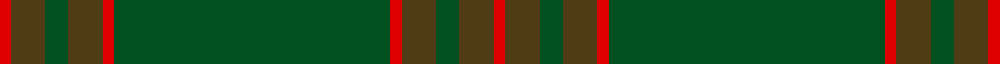

This page is one **sett** — a single exact thread-count. It belongs to the [tartan](/setts/r1dy3dg2dy3r1dg24r1dy3dg2dy3r1/)
(the same proportion at any scale), whose colour order is pattern [RGGGRGRGGGR](/stripes/rgggrgrgggr/).

Part of the [Un-named](/tartans/un-named/) tartan — the named design grouping this sett with its other cloths.

Sourced from register-of-tartans.  It is a [11 stripe tartan](/stripes/stripes11/).

Original link https://www.tartanregister.gov.uk/tartanDetails.aspx?ref=4427

## Also known as

This cloth is also recorded under:

- Un-named #2
- Un-named #3
- Unnamed
- Unnamed Brown
- Unnamed Green

## Register references

External register numbers recorded for this tartan.

- Scottish Register of Tartans: [4427](https://www.tartanregister.gov.uk/tartanDetails.aspx?ref=4427)
- Scottish Tartans World Register: 2556

## Thread count
R/2 T6 G4 T6 R2 G48 R2 T6 G4 T6 R/2

One full sett is **172 threads**.

## Palette

Palette: <strong>Tartan Register</strong>
<table><thead><tr><th>Colour</th><th>Threads</th><th>Shade</th><th>Base</th><th>OKLCh</th></tr></thead><tbody><tr><td>R/</td><td style="text-align:right;font-variant-numeric:tabular-nums">2</td><td><code style="background-color:#DC0000;">#DC0000</code> <small style="color:#888">#DC0000</small></td><td>R <code style="background-color:#CC0000;">#CC0000</code></td><td><small style="color:#888">oklch(56.2% 0.230 29.2)</small></td></tr><tr><td>T</td><td style="text-align:right;font-variant-numeric:tabular-nums">6</td><td><code style="background-color:#503C14;">#503C14</code> <small style="color:#888">#503C14</small></td><td>G <code style="background-color:#006100;">#006100</code></td><td><small style="color:#888">oklch(37.0% 0.062 81.8)</small></td></tr><tr><td>G</td><td style="text-align:right;font-variant-numeric:tabular-nums">4</td><td><code style="background-color:#005020;">#005020</code> <small style="color:#888">#005020</small></td><td>G <code style="background-color:#006100;">#006100</code></td><td><small style="color:#888">oklch(37.7% 0.105 149.6)</small></td></tr><tr><td>T</td><td style="text-align:right;font-variant-numeric:tabular-nums">6</td><td><code style="background-color:#503C14;">#503C14</code> <small style="color:#888">#503C14</small></td><td>G <code style="background-color:#006100;">#006100</code></td><td><small style="color:#888">oklch(37.0% 0.062 81.8)</small></td></tr><tr><td>R</td><td style="text-align:right;font-variant-numeric:tabular-nums">2</td><td><code style="background-color:#DC0000;">#DC0000</code> <small style="color:#888">#DC0000</small></td><td>R <code style="background-color:#CC0000;">#CC0000</code></td><td><small style="color:#888">oklch(56.2% 0.230 29.2)</small></td></tr><tr><td>G</td><td style="text-align:right;font-variant-numeric:tabular-nums">48</td><td><code style="background-color:#005020;">#005020</code> <small style="color:#888">#005020</small></td><td>G <code style="background-color:#006100;">#006100</code></td><td><small style="color:#888">oklch(37.7% 0.105 149.6)</small></td></tr><tr><td>R</td><td style="text-align:right;font-variant-numeric:tabular-nums">2</td><td><code style="background-color:#DC0000;">#DC0000</code> <small style="color:#888">#DC0000</small></td><td>R <code style="background-color:#CC0000;">#CC0000</code></td><td><small style="color:#888">oklch(56.2% 0.230 29.2)</small></td></tr><tr><td>T</td><td style="text-align:right;font-variant-numeric:tabular-nums">6</td><td><code style="background-color:#503C14;">#503C14</code> <small style="color:#888">#503C14</small></td><td>G <code style="background-color:#006100;">#006100</code></td><td><small style="color:#888">oklch(37.0% 0.062 81.8)</small></td></tr><tr><td>G</td><td style="text-align:right;font-variant-numeric:tabular-nums">4</td><td><code style="background-color:#005020;">#005020</code> <small style="color:#888">#005020</small></td><td>G <code style="background-color:#006100;">#006100</code></td><td><small style="color:#888">oklch(37.7% 0.105 149.6)</small></td></tr><tr><td>T</td><td style="text-align:right;font-variant-numeric:tabular-nums">6</td><td><code style="background-color:#503C14;">#503C14</code> <small style="color:#888">#503C14</small></td><td>G <code style="background-color:#006100;">#006100</code></td><td><small style="color:#888">oklch(37.0% 0.062 81.8)</small></td></tr><tr><td>R/</td><td style="text-align:right;font-variant-numeric:tabular-nums">2</td><td><code style="background-color:#DC0000;">#DC0000</code> <small style="color:#888">#DC0000</small></td><td>R <code style="background-color:#CC0000;">#CC0000</code></td><td><small style="color:#888">oklch(56.2% 0.230 29.2)</small></td></tr></tbody></table>

## Compared to the master

This cloth is one sett of its design; the master sett (the exemplar the design is anchored on) is below for comparison.

<figure style="margin:0"><figcaption style="color:#888;font-size:smaller">this sett</figcaption></figure>
<figure style="margin:0"><figcaption style="color:#888;font-size:smaller"><a href="/setts/b5lg2b2lg9k3b9g3b3g25lr2/">master sett →</a></figcaption></figure>

## Nearest tartans

The nearest existing variants by ΔTartan distance, with this tartan at the top so the swatches line up against it.

ΔTartan

Tartan

Sett

—

<a href="/ttd/edit/#slug=r1dy3dg2dy3r1dg24r1dy3dg2dy3r1~x2">Unnamed Green (Teddy Bear)</a> <a class="nn-out" href="/variants/s11/r1dy3dg2dy3r1dg24r1dy3dg2dy3r1~x2/" title="open its dictionary page">↗</a>

1.24

<a href="/ttd/edit/#slug=g20dy3g6dy6g6dy8db2dy2g20dy2db2dy46db3dy8~x2&amp;base=r1dy3dg2dy3r1dg24r1dy3dg2dy3r1~x2">MacAlister of Glenbarr Hunting</a> <a class="nn-out" href="/variants/s14/g20dy3g6dy6g6dy8db2dy2g20dy2db2dy46db3dy8~x2/" title="open its dictionary page">↗</a>

1.90

<a href="/ttd/edit/#slug=g6w1g12dy4r4dy2r4dy32g1dy2~x2&amp;base=r1dy3dg2dy3r1dg24r1dy3dg2dy3r1~x2">Seton Hunting Family Tartan</a> <a class="nn-out" href="/variants/s10/g6w1g12dy4r4dy2r4dy32g1dy2~x2/" title="open its dictionary page">↗</a>

1.91

<a href="/ttd/edit/#slug=dy42do10t2do2lo2do2dy10lo6do2lo3dy2~x2&amp;base=r1dy3dg2dy3r1dg24r1dy3dg2dy3r1~x2">Yarrow</a> <a class="nn-out" href="/variants/s11/dy42do10t2do2lo2do2dy10lo6do2lo3dy2~x2/" title="open its dictionary page">↗</a>

1.92

<a href="/ttd/edit/#slug=dg27dgi39db3dgi3db4dgi3db3dgi39db3dgi3db4dgi3~x2&amp;base=r1dy3dg2dy3r1dg24r1dy3dg2dy3r1~x2">Montgomerie/Montgomery</a> <a class="nn-out" href="/variants/s12/dg27dgi39db3dgi3db4dgi3db3dgi39db3dgi3db4dgi3~x2/" title="open its dictionary page">↗</a>

1.95

<a href="/ttd/edit/#slug=r1o3g2o3r1g24r1o3g2o3r1~x2&amp;base=r1dy3dg2dy3r1dg24r1dy3dg2dy3r1~x2">Unnamed Green (Teddy Bear)</a> <a class="nn-out" href="/variants/s11/r1o3g2o3r1g24r1o3g2o3r1~x2/" title="open its dictionary page">↗</a>

1.96

<a href="/variants/s8/y3dyi3y4k4dy14k3y41g2~x2/">Huntsman</a>

1.97

<a href="/ttd/edit/#slug=g4dy2g2dy2g2dy3db1dy1g4dy1db1dy12db2dy3~x2&amp;base=r1dy3dg2dy3r1dg24r1dy3dg2dy3r1~x2">MacAlister of Glenbarr Clan Tartan</a> <a class="nn-out" href="/variants/s14/g4dy2g2dy2g2dy3db1dy1g4dy1db1dy12db2dy3~x2/" title="open its dictionary page">↗</a>

1.99

<a href="/ttd/edit/#slug=k2y7k1y9dy21o2dy1o1dy2~x2&amp;base=r1dy3dg2dy3r1dg24r1dy3dg2dy3r1~x2">Historic Scotland Corporate Tartan</a> <a class="nn-out" href="/variants/s9/k2y7k1y9dy21o2dy1o1dy2~x2/" title="open its dictionary page">↗</a>

2.00

<a href="/ttd/edit/#slug=y24r2y2dg40y25dg2y2r2y2dg20~x2&amp;base=r1dy3dg2dy3r1dg24r1dy3dg2dy3r1~x2">Donachie of Brockloch Htg (Clan)</a> <a class="nn-out" href="/variants/s10/y24r2y2dg40y25dg2y2r2y2dg20~x2/" title="open its dictionary page">↗</a>

2.12

<a href="/ttd/edit/#slug=dg3g1lo2dg3g1lo2dy21dg18dy2dg3dy2dg18dy21g1lo2~x2&amp;base=r1dy3dg2dy3r1dg24r1dy3dg2dy3r1~x2">Prince David Royal Family Tartan</a> <a class="nn-out" href="/variants/s15/dg3g1lo2dg3g1lo2dy21dg18dy2dg3dy2dg18dy21g1lo2~x2/" title="open its dictionary page">↗</a>

## Neighbour map

Every grey dot is one of 14360 variants placed by the first two principal components of the ΔTartan feature space (44% of its variance). Red is this tartan; blue dots are its nearest — click one to open its page.

<svg viewBox="0 0 640 380" role="img" style="max-width:100%;height:auto;border:1px solid #e0e0e0;border-radius:4px;display:block" xmlns="http://www.w3.org/2000/svg"><image href="/nn/cloud.v1.png" width="640" height="380"/><a href="/variants/s14/g20dy3g6dy6g6dy8db2dy2g20dy2db2dy46db3dy8~x2/"><circle cx="498.6" cy="208.0" r="4" fill="#3465a4"><title>MacAlister of Glenbarr Hunting</title></circle></a><a href="/variants/s10/g6w1g12dy4r4dy2r4dy32g1dy2~x2/"><circle cx="472.6" cy="165.7" r="4" fill="#3465a4"><title>Seton Hunting Family Tartan</title></circle></a><a href="/variants/s11/dy42do10t2do2lo2do2dy10lo6do2lo3dy2~x2/"><circle cx="505.3" cy="168.8" r="4" fill="#3465a4"><title>Yarrow</title></circle></a><a href="/variants/s12/dg27dgi39db3dgi3db4dgi3db3dgi39db3dgi3db4dgi3~x2/"><circle cx="549.4" cy="255.1" r="4" fill="#3465a4"><title>Montgomerie/Montgomery</title></circle></a><a href="/variants/s11/r1o3g2o3r1g24r1o3g2o3r1~x2/"><circle cx="507.9" cy="174.2" r="4" fill="#3465a4"><title>Unnamed Green (Teddy Bear)</title></circle></a><a href="/variants/s8/y3dyi3y4k4dy14k3y41g2~x2/"><circle cx="499.5" cy="192.3" r="4" fill="#3465a4"><title>Huntsman</title></circle></a><a href="/variants/s14/g4dy2g2dy2g2dy3db1dy1g4dy1db1dy12db2dy3~x2/"><circle cx="467.7" cy="247.7" r="4" fill="#3465a4"><title>MacAlister of Glenbarr Clan Tartan</title></circle></a><a href="/variants/s9/k2y7k1y9dy21o2dy1o1dy2~x2/"><circle cx="457.2" cy="212.8" r="4" fill="#3465a4"><title>Historic Scotland Corporate Tartan</title></circle></a><a href="/variants/s10/y24r2y2dg40y25dg2y2r2y2dg20~x2/"><circle cx="445.9" cy="223.7" r="4" fill="#3465a4"><title>Donachie of Brockloch Htg (Clan)</title></circle></a><a href="/variants/s15/dg3g1lo2dg3g1lo2dy21dg18dy2dg3dy2dg18dy21g1lo2~x2/"><circle cx="407.7" cy="187.5" r="4" fill="#3465a4"><title>Prince David Royal Family Tartan</title></circle></a><circle cx="545.0" cy="198.3" r="5" fill="#c00000"/></svg>

ID: /variants/s11/r1dy3dg2dy3r1dg24r1dy3dg2dy3r1~x2/
