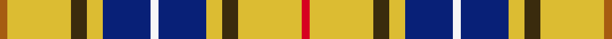

This page is one **sett** — a single exact thread-count. It belongs to the [tartan](/setts/r1ly8dy2ly2db6w1db6ly2dy2ly8o1/)
(the same proportion at any scale), whose colour order is pattern [RYGYBWBYGYR](/stripes/rygybwbygyr/).

Sourced from register-of-tartans.  It is a [11 stripe tartan](/stripes/stripes11/).

Original link https://www.tartanregister.gov.uk/tartanDetails.aspx?ref=2535

2 attestations — the source records this cloth was collapsed from (oldest owns this page)

<ul>
<li>01/01/2006 — MacKessog (register-of-tartans, <a href="https://www.tartanregister.gov.uk/tartanDetails.aspx?ref=2535">record</a>)  <em>The MacKessog tartan was designed in 2006 to commemorate the saint who came to Loch Lomondside in 510 AD to bring Christianity to the people of Argyll. Saint Kessog founded a monastery on the island of Inch Tavannach and a church in Luss nearly 1,500 years ago. In his memory Redshanke of Inverary has designed this tartan which has been woven on the Isle of Islay. The tartan is exclusive to the Church and Pilgrimage Centre of Luss. The tartan is based on the Bruce sett due to the veneration of Kessog by King Robert the Bruce, who led his soldiers into the battle of Bannockburn in the name of the blessed Kessog and established Luss as a major pilgrimage site during the Middle Ages. The colours are : two shades of green for the hills, blue for the loch, a white stripe to create the Scottish saltire, a purple stripe for the heather and for Kessog's ecclesiastical significance, and a red stripe for his martyrdom. The saint was murdered in 520 AD at Bandry, a small village just south of Luss. All pilgrims visiting Luss and those who choose to be married here are entitled to wear the MacKessog tartan as their own. A woven sample is preserved by the Scottish Tartans Authority.</em></li>
<li>pre 2006 — MacKessog (Commemorative) (tartans-authority, <a href="https://www.tartanregister.gov.uk/tartanDetails.aspx?ref=6928">record</a>)  <em>From www.lusschurch.org.uk: "The MacKessog tartan was designed in 2006 to commemorate the saint who came to Loch Lomond-side in Ad 510 to bring Christianity to the people of Argyll. MacKessog (the Gaelic form of ?Saint? Kessog) founded a monastery on the island of Inch Tavannach and a church in Luss nearly 1,500 years ago. In his memory we have created a tartan, designed by Redshanke of Inveraray and woven on the Isle of Islay, which is exclusive to the Church and Pilgrimage Centre of Luss. The tartan is based on the Bruce sett the veneration of Kessog by King Robert the Bruce, who led his soldiers into the battle of Bannockburn in the name of the blessed Kessog, established Luss as a major pilgrimage site during the Middle Ages. The colours are : two shades of green for the hills, blue for the loch, a white stripe to create the Scottish saltire, a purple stripe for the heather and for Kessog?s ecclesiastical significance, and a red stripe for his martyrdom. The saint was murdered in AD 520 at Bandry, a small village just south of Luss. The overall tone of the tartan is beautifully muted and appropriate for a tartan in memory of a fifteen-hundred year old saint. It is appropriate both for formal wear, such as at a wedding, and for day wear with a jersey or informal jacket. All pilgrims visiting Luss and those who choose to be married here are entitled to wear the MacKessog tartan as their own. Woven sample.</em></li>
</ul>

Dataset <small>— provenance for this record, inherited from the source manifest</small>

<dl class="dataset-prov">
<dt>source</dt><dd><a href="/sources/register-of-tartans/">Scottish Register of Tartans</a></dd>
<dt>data captured from</dt><dd><a href="https://github.com/thetartan/tartan-database/blob/master/data/register-of-tartans/data.csv">https://github.com/thetartan/tartan-database/blob/master/data/register-of-tartans/data.csv</a></dd>
<dt>data date</dt><dd>2006 <small>(this record)</small></dd>
<dt>licence</dt><dd><a href="https://www.tartanregister.gov.uk/copyright">Crown copyright</a></dd>
</dl>

Capture chain <small>— the hands this data passed through, oldest first; each capture carries its own licence</small>

<ol class="capture-chain">
<li><a href="https://www.tartanregister.gov.uk/">Scottish Register of Tartans</a> · <a href="https://www.tartanregister.gov.uk/copyright">Crown copyright</a> <small>the living register — still published by National Records of Scotland</small></li>
<li><a href="https://github.com/thetartan/tartan-database">thetartan/tartan-database</a> <small>2016-2017</small> · <a href="https://creativecommons.org/licenses/by-nc-nd/4.0/">CC BY-NC-ND 4.0</a> <small>Levko Kravets's frozen compilation — the capture we vendored, and where its CC licence text came from</small></li>
<li>this dictionary <small>captured 2026-06-10 · commit 5bf86c7566</small> <small>each re-capture is a git commit to data/sources</small></li>
</ol>

## Register references

External register numbers recorded for this tartan.

- Scottish Register of Tartans: [2535](https://www.tartanregister.gov.uk/tartanDetails.aspx?ref=2535)
- Scottish Tartans Authority (ITI): 6928

## Thread count
O/4 LY32 DY8 LY8 DB24 W4 DB24 LY8 DY8 LY32 R/4

One full sett is **304 threads**.

## Palette
<table><thead><tr><th>Colour</th><th>Shade</th><th>OKLCh</th></tr></thead><tbody><tr><td>DB</td><td><code style="background-color:#082077;">#082077</code> <small style="color:#888">#082077</small></td><td><small style="color:#888">oklch(30.0% 0.149 265.1)</small></td></tr><tr><td>LY</td><td><code style="background-color:#DCBC32;">#DCBC32</code> <small style="color:#888">#DCBC32</small></td><td><small style="color:#888">oklch(80.0% 0.150 95.2)</small></td></tr><tr><td>O</td><td><code style="background-color:#A65C11;">#A65C11</code> <small style="color:#888">#A65C11</small></td><td><small style="color:#888">oklch(55.0% 0.125 58.3)</small></td></tr><tr><td>R</td><td><code style="background-color:#D60020;">#D60020</code> <small style="color:#888">#D60020</small></td><td><small style="color:#888">oklch(55.2% 0.224 25.5)</small></td></tr><tr><td>DY</td><td><code style="background-color:#3A2B0D;">#3A2B0D</code> <small style="color:#888">#3A2B0D</small></td><td><small style="color:#888">oklch(30.0% 0.049 82.0)</small></td></tr><tr><td>W</td><td><code style="background-color:#F7F7F7;">#F7F7F7</code> <small style="color:#888">#F7F7F7</small></td><td><small style="color:#888">oklch(97.6% 0.000 89.9)</small></td></tr></tbody></table>

# Sample pattern

## Nearest tartan variants

The nearest existing variants by ΔTartan distance, with this cloth at the top so the swatches line up against it.

ΔTartan

Threads

Variant

Sett

—

304

<a href="/variants/s11/r1ly8dy2ly2db6w1db6ly2dy2ly8o1~x4/">MacKessog</a>

<a href="/ttd/edit/#slug=db4dy24g17dy3w18dy3w18dy3g17dy24r4~x2&amp;base=r1ly8dy2ly2db6w1db6ly2dy2ly8o1~x4" title="compare in the TTD">2.92</a>

524

<a href="/variants/s11/db4dy24g17dy3w18dy3w18dy3g17dy24r4~x2/">Fraser Hunting Dress Clan Tartan</a>

<a href="/ttd/edit/#slug=dr1n6ly2w1k8w1ly2w9k1w4dy1~x4&amp;base=r1ly8dy2ly2db6w1db6ly2dy2ly8o1~x4" title="compare in the TTD">3.20</a>

280

<a href="/variants/s11/dr1n6ly2w1k8w1ly2w9k1w4dy1~x4/">Kintyre (Fashion)</a>

<a href="/ttd/edit/#slug=dr1o6ly2w1k8w1ly2w9k1w4dy1~x4~o2500000&amp;base=r1ly8dy2ly2db6w1db6ly2dy2ly8o1~x4" title="compare in the TTD">3.23</a>

280

<a href="/variants/s11/dr1o6ly2w1k8w1ly2w9k1w4dy1~x4~o2500000/">Kintyre</a>

<a href="/ttd/edit/#slug=db6w1ly6dy12r2~x4&amp;base=r1ly8dy2ly2db6w1db6ly2dy2ly8o1~x4" title="compare in the TTD">3.32</a>

184

<a href="/variants/s5/db6w1ly6dy12r2~x4/">Vass (Personal)</a>

<a href="/ttd/edit/#slug=w54dti7w19dt5w8dg8w8dg16dt8dy8w21r11dg7dti11dg8w7~x2~dti1502194-dg1803133&amp;base=r1ly8dy2ly2db6w1db6ly2dy2ly8o1~x4" title="compare in the TTD">3.43</a>

702

<a href="/variants/s16/w54dti7w19dt5w8dg8w8dg16dt8dy8w21r11dg7dti11dg8w7~x2~dti1502194-dg1803133/">Beckett Beaumont</a>

<a href="/ttd/edit/#slug=r1w8g2ly2db6w1db6ly2g2w8o1~x4&amp;base=r1ly8dy2ly2db6w1db6ly2dy2ly8o1~x4" title="compare in the TTD">3.46</a>

304

<a href="/variants/s11/r1w8g2ly2db6w1db6ly2g2w8o1~x4/">MacKessog Wedding (Fashion)</a>

<a href="/ttd/edit/#slug=db4o24g17o3w18o3w18o3g17o24r4~x2&amp;base=r1ly8dy2ly2db6w1db6ly2dy2ly8o1~x4" title="compare in the TTD">3.57</a>

524

<a href="/variants/s11/db4o24g17o3w18o3w18o3g17o24r4~x2/">Fraser hunting, dress</a>

<a href="/ttd/edit/#slug=g14r1g14r7w1r7w1r7db5dp3w1~x4&amp;base=r1ly8dy2ly2db6w1db6ly2dy2ly8o1~x4" title="compare in the TTD">3.61</a>

428

<a href="/variants/s11/g14r1g14r7w1r7w1r7db5dp3w1~x4/">Hynde</a>

<a href="/ttd/edit/#slug=lb8ly2lb22dg6r2w10dg12lb3~x2&amp;base=r1ly8dy2ly2db6w1db6ly2dy2ly8o1~x4" title="compare in the TTD">3.67</a>

238

<a href="/variants/s8/lb8ly2lb22dg6r2w10dg12lb3~x2/">Bahamas</a>

<a href="/ttd/edit/#slug=g11lr2g12k3lb15dr3lb15g19lr2lb3k2lb3dy3~x2&amp;base=r1ly8dy2ly2db6w1db6ly2dy2ly8o1~x4" title="compare in the TTD">3.68</a>

344

<a href="/variants/s13/g11lr2g12k3lb15dr3lb15g19lr2lb3k2lb3dy3~x2/">Greylock</a>

## Neighbour map

Every grey dot is one of 13620 variants placed by the first two principal components of the ΔTartan feature space (42% of its variance). Red is this tartan; blue dots are its nearest — click one to open its page.

<svg viewBox="0 0 640 380" role="img" style="max-width:100%;height:auto;border:1px solid #e0e0e0;border-radius:4px;display:block" xmlns="http://www.w3.org/2000/svg"><image href="/nn/cloud.v1.png" width="640" height="380"/><a href="/variants/s11/db4dy24g17dy3w18dy3w18dy3g17dy24r4~x2/"><circle cx="145.4" cy="193.1" r="4" fill="#3465a4"><title>Fraser Hunting Dress Clan Tartan</title></circle></a><a href="/variants/s11/dr1n6ly2w1k8w1ly2w9k1w4dy1~x4/"><circle cx="106.1" cy="142.7" r="4" fill="#3465a4"><title>Kintyre (Fashion)</title></circle></a><a href="/variants/s11/dr1o6ly2w1k8w1ly2w9k1w4dy1~x4~o2500000/"><circle cx="106.4" cy="143.0" r="4" fill="#3465a4"><title>Kintyre</title></circle></a><a href="/variants/s5/db6w1ly6dy12r2~x4/"><circle cx="227.8" cy="184.6" r="4" fill="#3465a4"><title>Vass (Personal)</title></circle></a><a href="/variants/s16/w54dti7w19dt5w8dg8w8dg16dt8dy8w21r11dg7dti11dg8w7~x2~dti1502194-dg1803133/"><circle cx="208.9" cy="131.7" r="4" fill="#3465a4"><title>Beckett Beaumont</title></circle></a><a href="/variants/s11/r1w8g2ly2db6w1db6ly2g2w8o1~x4/"><circle cx="129.4" cy="168.9" r="4" fill="#3465a4"><title>MacKessog Wedding (Fashion)</title></circle></a><a href="/variants/s11/db4o24g17o3w18o3w18o3g17o24r4~x2/"><circle cx="173.8" cy="199.4" r="4" fill="#3465a4"><title>Fraser hunting, dress</title></circle></a><a href="/variants/s11/g14r1g14r7w1r7w1r7db5dp3w1~x4/"><circle cx="233.0" cy="163.5" r="4" fill="#3465a4"><title>Hynde</title></circle></a><a href="/variants/s8/lb8ly2lb22dg6r2w10dg12lb3~x2/"><circle cx="225.6" cy="188.2" r="4" fill="#3465a4"><title>Bahamas</title></circle></a><a href="/variants/s13/g11lr2g12k3lb15dr3lb15g19lr2lb3k2lb3dy3~x2/"><circle cx="168.8" cy="150.4" r="4" fill="#3465a4"><title>Greylock</title></circle></a><circle cx="182.5" cy="167.0" r="5" fill="#c00000"/><text x="320" y="376" text-anchor="middle" font-size="11" fill="#999">ground</text><text x="11" y="190" text-anchor="middle" font-size="11" fill="#999" transform="rotate(-90 11 190)">complexity</text></svg>

ID: /variants/s11/r1ly8dy2ly2db6w1db6ly2dy2ly8o1~x4/
