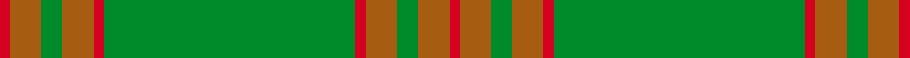

This page is one **sett** — a single exact thread-count. It belongs to the [tartan](/setts/r1o3g2o3r1g24r1o3g2o3r1/)
(the same proportion at any scale), whose colour order is pattern [RRGRRGRRGRR](/stripes/rrgrrgrrgrr/).

Sourced from weddslist.  It is a [11 stripe tartan](/stripes/stripes11/).

Original link http://www.weddslist.com/cgi-bin/tartans/pg.pl?source=sts

## Thread count
R/2 O6 G4 O6 R2 G48 R2 O6 G4 O6 R/2

One full sett is **172 threads**.

## Palette
<table><thead><tr><th>Colour</th><th>Shade</th><th>OKLCh</th></tr></thead><tbody><tr><td>G</td><td><code style="background-color:#008B2A;">#008B2A</code> <small style="color:#888">#008B2A</small></td><td><small style="color:#888">oklch(55.4% 0.170 145.9)</small></td></tr><tr><td>LT</td><td><code style="background-color:#A65C11;">#A65C11</code> <small style="color:#888">#A65C11</small></td><td><small style="color:#888">oklch(55.0% 0.125 58.3)</small></td></tr><tr><td>R</td><td><code style="background-color:#D60020;">#D60020</code> <small style="color:#888">#D60020</small></td><td><small style="color:#888">oklch(55.2% 0.224 25.5)</small></td></tr></tbody></table>

# Sample pattern

ID: /variants/s11/r1o3g2o3r1g24r1o3g2o3r1~x2/
