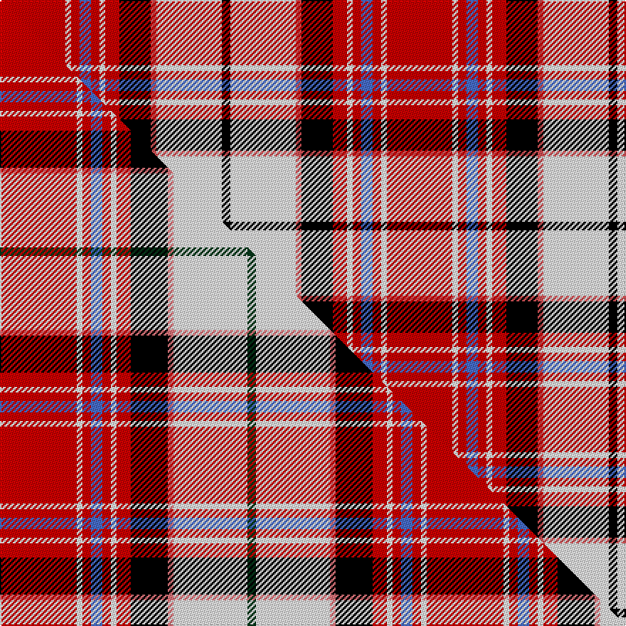

This page is one **sett** — a single exact thread-count. It belongs to the [tartan](/setts/r23w2r3b4r3w2r5k11ri2w23k3/)
(the same proportion at any scale), whose colour order is pattern [KWRKRWRBRWR](/stripes/kwrkrwrbrwr/).

Part of the [MacKellar Dress](/tartans/mackellar-dress-2/) tartan — the named design grouping this sett with its other cloths.

Sourced from house-of-tartan.  It is a [11 stripe tartan](/stripes/stripes11/).

Original link http://www.house-of-tartan.scotland.net/house/TartanViewjs.asp?colr=Def&tnam=6563

## Provenance

Earliest known date: 01/01/2002 The Mackellar Dress sett was originally designed by AA Bottomley of Peter MacArthur's. The colours of this version have been changed (presumably by DC Dalgliesh of Selkirk) to produce a Dancers' tartan./Threadcount and colours aren't 100% original. Generated manually./

## Thread count
R/46 W4 R6 B8 R6 W4 R10 K22 Ri4 W46 K/6

One full sett is **272 threads**.

## Palette
<table><thead><tr><th>Colour</th><th>Shade</th><th>OKLCh</th></tr></thead><tbody><tr><td>R</td><td><code style="background-color:#D05054;">#D05054</code> <small style="color:#888">#D05054</small></td><td><small style="color:#888">oklch(60.2% 0.162 21.5)</small></td></tr><tr><td>K</td><td><code style="background-color:#000000;">#000000</code> <small style="color:#888">#000000</small></td><td><small style="color:#888">oklch(0.0% 0.000 0.0)</small></td></tr><tr><td>W</td><td><code style="background-color:#F7F7F7;">#F7F7F7</code> <small style="color:#888">#F7F7F7</small></td><td><small style="color:#888">oklch(97.6% 0.000 89.9)</small></td></tr><tr><td>B</td><td><code style="background-color:#466CC8;">#466CC8</code> <small style="color:#888">#466CC8</small></td><td><small style="color:#888">oklch(55.1% 0.149 265.0)</small></td></tr><tr><td>R</td><td><code style="background-color:#C80000;">#C80000</code> <small style="color:#888">#C80000</small></td><td><small style="color:#888">oklch(52.3% 0.215 29.2)</small></td></tr></tbody></table>

# Sample pattern

## Compared to the master

This cloth is one sett of its design; the master sett (the exemplar the design is anchored on) is below for comparison.

Its **ΔTartan distance** from the master is **1.15** — the same measure the nearest-tartans table ranks by (0 is identical; a re-scale of the same cloth is near 0, a recolour or a different proportion further).

<figure class="master-compare" style="margin:0">

this sett
master sett ★

<figcaption style="color:#888;font-size:smaller">One weave of this sett against the <a href="/setts/r27w2r3b4r3w2r5k13ri2w26dg3/">master sett ★</a>, split on the diagonal: a shared proportion runs seamlessly across it with only the shades shifting; a different proportion breaks on it.</figcaption>
</figure>

## Nearest tartan variants

The nearest existing variants by ΔTartan distance, with this cloth at the top so the swatches line up against it.

ΔTartan

Threads

Variant

Sett

—

272

<a href="/variants/s11/r23w2r3b4r3w2r5k11ri2w23k3~x2~r2109032-ri2406019/">MacKellar Dress Red Fashion Tartan</a>

<a href="/ttd/edit/#slug=r20w3r3lb4r3w3r5k10dp3w35k3~x2&amp;base=r23w2r3b4r3w2r5k11ri2w23k3~x2~r2109032-ri2406019" title="compare in the TTD">0.88</a>

322

<a href="/variants/s11/r20w3r3lb4r3w3r5k10dp3w35k3~x2/">MacKellar Cerise Dress Tartan</a>

<a href="/ttd/edit/#slug=r27w2r3b4r3w2r5k13ri2w26dg3~x2~r2109032-ri2806019&amp;base=r23w2r3b4r3w2r5k11ri2w23k3~x2~r2109032-ri2406019" title="compare in the TTD">1.15</a>

300

<a href="/variants/s11/r27w2r3b4r3w2r5k13ri2w26dg3~x2~r2109032-ri2806019/">MacKellar Dress Red</a>

<a href="/ttd/edit/#slug=n12w2k4g2k3w3k3w19r30w2r4k2~x2&amp;base=r23w2r3b4r3w2r5k11ri2w23k3~x2~r2109032-ri2406019" title="compare in the TTD">1.45</a>

316

<a href="/variants/s12/n12w2k4g2k3w3k3w19r30w2r4k2~x2/">MacLean of Duart Dress #2</a>

<a href="/ttd/edit/#slug=r15ri1g3k1w11r3g3ri3w1~x4~r1506019-ri2806019&amp;base=r23w2r3b4r3w2r5k11ri2w23k3~x2~r2109032-ri2406019" title="compare in the TTD">1.89</a>

264

<a href="/variants/s9/r15ri1g3k1w11r3g3ri3w1~x4~r1506019-ri2806019/">Etive, Burgundy (Dance)</a>

<a href="/ttd/edit/#slug=db3w12k11r4w2r2w2r24ly3~x2&amp;base=r23w2r3b4r3w2r5k11ri2w23k3~x2~r2109032-ri2406019" title="compare in the TTD">1.97</a>

240

<a href="/variants/s9/db3w12k11r4w2r2w2r24ly3~x2/">Hearts Football Club (Corporate)</a>

<a href="/ttd/edit/#slug=r24w2r2w2r4k11w12db3w12k11r4w2r2w2r24y3~x2&amp;base=r23w2r3b4r3w2r5k11ri2w23k3~x2~r2109032-ri2406019" title="compare in the TTD">2.49</a>

426

<a href="/variants/s16/r24w2r2w2r4k11w12db3w12k11r4w2r2w2r24y3~x2/">Heart of Midlothian Football Club</a>

<a href="/ttd/edit/#slug=lr24p3lr8p5k3r3k3lr3k3o24r4~x2&amp;base=r23w2r3b4r3w2r5k11ri2w23k3~x2~r2109032-ri2406019" title="compare in the TTD">2.51</a>

276

<a href="/variants/s11/lr24p3lr8p5k3r3k3lr3k3o24r4~x2/">Kerry (WCWM)</a>

<a href="/ttd/edit/#slug=lb1r3k2w1r8w1k2w9k1w3lb1~x6&amp;base=r23w2r3b4r3w2r5k11ri2w23k3~x2~r2109032-ri2406019" title="compare in the TTD">2.53</a>

372

<a href="/variants/s11/lb1r3k2w1r8w1k2w9k1w3lb1~x6/">MacRae, Dress Red (Dance)</a>

<a href="/ttd/edit/#slug=y4k2r7k15r3k3r3k7w28r7w6r2&amp;base=r23w2r3b4r3w2r5k11ri2w23k3~x2~r2109032-ri2406019" title="compare in the TTD">2.60</a>

168

<a href="/variants/s12/y4k2r7k15r3k3r3k7w28r7w6r2/">Walker, dress</a>

<a href="/ttd/edit/#slug=r3lb19k4r3k3r7k3r5k3r5k2w2~x2&amp;base=r23w2r3b4r3w2r5k11ri2w23k3~x2~r2109032-ri2406019" title="compare in the TTD">2.66</a>

226

<a href="/variants/s12/r3lb19k4r3k3r7k3r5k3r5k2w2~x2/">Duchess of Kent</a>

## Neighbour map

Every grey dot is one of 13620 variants placed by the first two principal components of the ΔTartan feature space (42% of its variance). Red is this tartan; blue dots are its nearest — click one to open its page.

<svg viewBox="0 0 640 380" role="img" style="max-width:100%;height:auto;border:1px solid #e0e0e0;border-radius:4px;display:block" xmlns="http://www.w3.org/2000/svg"><image href="/nn/cloud.v1.png" width="640" height="380"/><a href="/variants/s11/r20w3r3lb4r3w3r5k10dp3w35k3~x2/"><circle cx="174.4" cy="113.8" r="4" fill="#3465a4"><title>MacKellar Cerise Dress Tartan</title></circle></a><a href="/variants/s11/r27w2r3b4r3w2r5k13ri2w26dg3~x2~r2109032-ri2806019/"><circle cx="148.1" cy="97.9" r="4" fill="#3465a4"><title>MacKellar Dress Red</title></circle></a><a href="/variants/s12/n12w2k4g2k3w3k3w19r30w2r4k2~x2/"><circle cx="154.5" cy="101.7" r="4" fill="#3465a4"><title>MacLean of Duart Dress #2</title></circle></a><a href="/variants/s9/r15ri1g3k1w11r3g3ri3w1~x4~r1506019-ri2806019/"><circle cx="182.4" cy="127.2" r="4" fill="#3465a4"><title>Etive, Burgundy (Dance)</title></circle></a><a href="/variants/s9/db3w12k11r4w2r2w2r24ly3~x2/"><circle cx="180.9" cy="127.6" r="4" fill="#3465a4"><title>Hearts Football Club (Corporate)</title></circle></a><a href="/variants/s16/r24w2r2w2r4k11w12db3w12k11r4w2r2w2r24y3~x2/"><circle cx="183.5" cy="106.6" r="4" fill="#3465a4"><title>Heart of Midlothian Football Club</title></circle></a><a href="/variants/s11/lr24p3lr8p5k3r3k3lr3k3o24r4~x2/"><circle cx="165.2" cy="141.7" r="4" fill="#3465a4"><title>Kerry (WCWM)</title></circle></a><a href="/variants/s11/lb1r3k2w1r8w1k2w9k1w3lb1~x6/"><circle cx="169.0" cy="152.7" r="4" fill="#3465a4"><title>MacRae, Dress Red (Dance)</title></circle></a><a href="/variants/s12/y4k2r7k15r3k3r3k7w28r7w6r2/"><circle cx="150.6" cy="127.6" r="4" fill="#3465a4"><title>Walker, dress</title></circle></a><a href="/variants/s12/r3lb19k4r3k3r7k3r5k3r5k2w2~x2/"><circle cx="148.1" cy="147.6" r="4" fill="#3465a4"><title>Duchess of Kent</title></circle></a><circle cx="156.5" cy="120.6" r="5" fill="#c00000"/><text x="320" y="376" text-anchor="middle" font-size="11" fill="#999">ground</text><text x="11" y="190" text-anchor="middle" font-size="11" fill="#999" transform="rotate(-90 11 190)">complexity</text></svg>

ID: /variants/s11/r23w2r3b4r3w2r5k11ri2w23k3~x2~r2109032-ri2406019/
