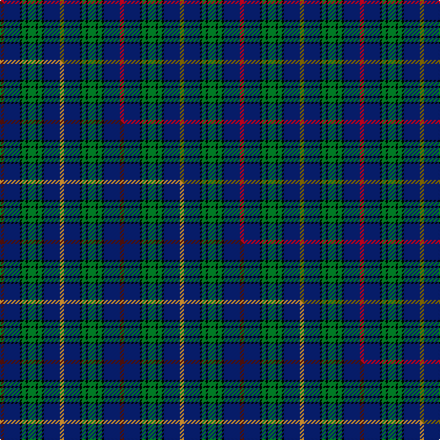

This page is one **sett** — a single exact thread-count. It belongs to the [tartan](/setts/r2db8k1g2k1g4k1g2k1db8y2/)
(the same proportion at any scale), whose colour order is pattern [GBKGKGKGKBR](/stripes/gbkgkgkgkbr/).

Part of the [MacCainsh](/tartans/maccainsh/) tartan — the named design grouping this sett with its other cloths.

Sourced from weddslist.  It is a [11 stripe tartan](/stripes/stripes11/).

Original link http://www.weddslist.com/cgi-bin/tartans/pg.pl?source=sts

## Provenance

Earliest known date: pre 1992 From the Lumsden Collection ( Alec Lumsden of Toronto).

2 attestations — the source records this cloth was collapsed from (oldest owns this page)

<ul>
<li>undated — MacCainsh (weddslist, <a href="http://www.weddslist.com/cgi-bin/tartans/pg.pl?source=sts">record</a>) </li>
<li>undated — MacCainsh Family Tartan (house-of-tartan, <a href="http://www.house-of-tartan.scotland.net/house/TartanViewjs.asp?colr=Def&tnam=1379">record</a>) </li>
</ul>

## Thread count
R/4 DB16 K2 G4 K2 G8 K2 G4 K2 DB16 Y/4

One full sett is **120 threads**.

## Palette
<table><thead><tr><th>Colour</th><th>Shade</th><th>OKLCh</th></tr></thead><tbody><tr><td>DB</td><td><code style="background-color:#082077;">#082077</code> <small style="color:#888">#082077</small></td><td><small style="color:#888">oklch(30.0% 0.149 265.1)</small></td></tr><tr><td>G</td><td><code style="background-color:#008B2A;">#008B2A</code> <small style="color:#888">#008B2A</small></td><td><small style="color:#888">oklch(55.4% 0.170 145.9)</small></td></tr><tr><td>K</td><td><code style="background-color:#000000;">#000000</code> <small style="color:#888">#000000</small></td><td><small style="color:#888">oklch(0.0% 0.000 0.0)</small></td></tr><tr><td>R</td><td><code style="background-color:#D60020;">#D60020</code> <small style="color:#888">#D60020</small></td><td><small style="color:#888">oklch(55.2% 0.224 25.5)</small></td></tr><tr><td>Y</td><td><code style="background-color:#8B6E00;">#8B6E00</code> <small style="color:#888">#8B6E00</small></td><td><small style="color:#888">oklch(55.1% 0.113 90.4)</small></td></tr></tbody></table>

# Sample pattern

## Compared to the master

This cloth is one sett of its design; the master sett (the exemplar the design is anchored on) is below for comparison.

Its **ΔTartan distance** from the master is **0.16** — the same measure the nearest-tartans table ranks by (0 is identical; a re-scale of the same cloth is near 0, a recolour or a different proportion further).

<figure class="master-compare" style="margin:0">

this sett
master sett ★

<figcaption style="color:#888;font-size:smaller">One weave of this sett against the <a href="/setts/dr2db8k1g2k1g4k1g2k1db8lo2/">master sett ★</a>, split on the diagonal: a shared proportion runs seamlessly across it with only the shades shifting; a different proportion breaks on it.</figcaption>
</figure>

## Nearest tartan variants

The nearest existing variants by ΔTartan distance, with this cloth at the top so the swatches line up against it.

ΔTartan

Threads

Variant

Sett

—

120

<a href="/variants/s11/r2db8k1g2k1g4k1g2k1db8y2~x2/">MacCainsh</a>

<a href="/ttd/edit/#slug=dr2db8k1g2k1g4k1g2k1db8lo2~x2&amp;base=r2db8k1g2k1g4k1g2k1db8y2~x2" title="compare in the TTD">0.30</a>

120

<a href="/variants/s11/dr2db8k1g2k1g4k1g2k1db8lo2~x2/">MacCainsh</a>

<a href="/ttd/edit/#slug=db8k1db8k2g6r1g6k2db8w1~x2&amp;base=r2db8k1g2k1g4k1g2k1db8y2~x2" title="compare in the TTD">2.14</a>

154

<a href="/variants/s10/db8k1db8k2g6r1g6k2db8w1~x2/">Dalmeny</a>

<a href="/ttd/edit/#slug=db11w2db11k4g8r1~x2&amp;base=r2db8k1g2k1g4k1g2k1db8y2~x2" title="compare in the TTD">2.67</a>

124

<a href="/variants/s6/db11w2db11k4g8r1~x2/">Dalmeny - 2002 (Fashion)</a>

<a href="/ttd/edit/#slug=db3k2db22k9g2lp2g2lp2g8k2w3~x2&amp;base=r2db8k1g2k1g4k1g2k1db8y2~x2" title="compare in the TTD">2.77</a>

216

<a href="/variants/s11/db3k2db22k9g2lp2g2lp2g8k2w3~x2/">Scottish Rugby Union Corporate Tartan</a>

<a href="/ttd/edit/#slug=db19dg7db7lb2dg20k9dg6k4dg10w3~x2&amp;base=r2db8k1g2k1g4k1g2k1db8y2~x2" title="compare in the TTD">2.78</a>

304

<a href="/variants/s10/db19dg7db7lb2dg20k9dg6k4dg10w3~x2/">O'Connell, William Benedict (Personal)</a>

<a href="/ttd/edit/#slug=db4k3db23k9g2lb2g2lb2g8k2y3~x2&amp;base=r2db8k1g2k1g4k1g2k1db8y2~x2" title="compare in the TTD">2.80</a>

226

<a href="/variants/s11/db4k3db23k9g2lb2g2lb2g8k2y3~x2/">Forth</a>

<a href="/ttd/edit/#slug=db4k3db23k9g2lb2g2lb2g8k2dy3~x2&amp;base=r2db8k1g2k1g4k1g2k1db8y2~x2" title="compare in the TTD">2.80</a>

226

<a href="/variants/s11/db4k3db23k9g2lb2g2lb2g8k2dy3~x2/">Forth</a>

<a href="/ttd/edit/#slug=g8w1g1dr1g4k4db8k1db1k1~x4&amp;base=r2db8k1g2k1g4k1g2k1db8y2~x2" title="compare in the TTD">2.86</a>

204

<a href="/variants/s10/g8w1g1dr1g4k4db8k1db1k1~x4/">Allen (1996)</a>

<a href="/ttd/edit/#slug=g8w1g1r1g4k4db8k1db1k1~x2&amp;base=r2db8k1g2k1g4k1g2k1db8y2~x2" title="compare in the TTD">2.86</a>

102

<a href="/variants/s10/g8w1g1r1g4k4db8k1db1k1~x2/">Scott #2</a>

<a href="/ttd/edit/#slug=db10y3db30y5k8g16r4g16r2~x2&amp;base=r2db8k1g2k1g4k1g2k1db8y2~x2" title="compare in the TTD">2.92</a>

352

<a href="/variants/s9/db10y3db30y5k8g16r4g16r2~x2/">MacMillan Hunting</a>

## Neighbour map

Every grey dot is one of 13620 variants placed by the first two principal components of the ΔTartan feature space (42% of its variance). Red is this tartan; blue dots are its nearest — click one to open its page.

<svg viewBox="0 0 640 380" role="img" style="max-width:100%;height:auto;border:1px solid #e0e0e0;border-radius:4px;display:block" xmlns="http://www.w3.org/2000/svg"><image href="/nn/cloud.v1.png" width="640" height="380"/><a href="/variants/s11/dr2db8k1g2k1g4k1g2k1db8lo2~x2/"><circle cx="189.0" cy="165.5" r="4" fill="#3465a4"><title>MacCainsh</title></circle></a><a href="/variants/s10/db8k1db8k2g6r1g6k2db8w1~x2/"><circle cx="220.2" cy="185.4" r="4" fill="#3465a4"><title>Dalmeny</title></circle></a><a href="/variants/s6/db11w2db11k4g8r1~x2/"><circle cx="191.7" cy="178.6" r="4" fill="#3465a4"><title>Dalmeny - 2002 (Fashion)</title></circle></a><a href="/variants/s11/db3k2db22k9g2lp2g2lp2g8k2w3~x2/"><circle cx="163.8" cy="131.7" r="4" fill="#3465a4"><title>Scottish Rugby Union Corporate Tartan</title></circle></a><a href="/variants/s10/db19dg7db7lb2dg20k9dg6k4dg10w3~x2/"><circle cx="215.6" cy="188.4" r="4" fill="#3465a4"><title>O'Connell, William Benedict (Personal)</title></circle></a><a href="/variants/s11/db4k3db23k9g2lb2g2lb2g8k2y3~x2/"><circle cx="180.7" cy="134.4" r="4" fill="#3465a4"><title>Forth</title></circle></a><a href="/variants/s11/db4k3db23k9g2lb2g2lb2g8k2dy3~x2/"><circle cx="184.0" cy="135.4" r="4" fill="#3465a4"><title>Forth</title></circle></a><a href="/variants/s10/g8w1g1dr1g4k4db8k1db1k1~x4/"><circle cx="154.8" cy="166.7" r="4" fill="#3465a4"><title>Allen (1996)</title></circle></a><a href="/variants/s10/g8w1g1r1g4k4db8k1db1k1~x2/"><circle cx="152.0" cy="165.0" r="4" fill="#3465a4"><title>Scott #2</title></circle></a><a href="/variants/s9/db10y3db30y5k8g16r4g16r2~x2/"><circle cx="186.8" cy="161.2" r="4" fill="#3465a4"><title>MacMillan Hunting</title></circle></a><circle cx="194.4" cy="167.0" r="5" fill="#c00000"/><text x="320" y="376" text-anchor="middle" font-size="11" fill="#999">ground</text><text x="11" y="190" text-anchor="middle" font-size="11" fill="#999" transform="rotate(-90 11 190)">complexity</text></svg>

ID: /variants/s11/r2db8k1g2k1g4k1g2k1db8y2~x2/
