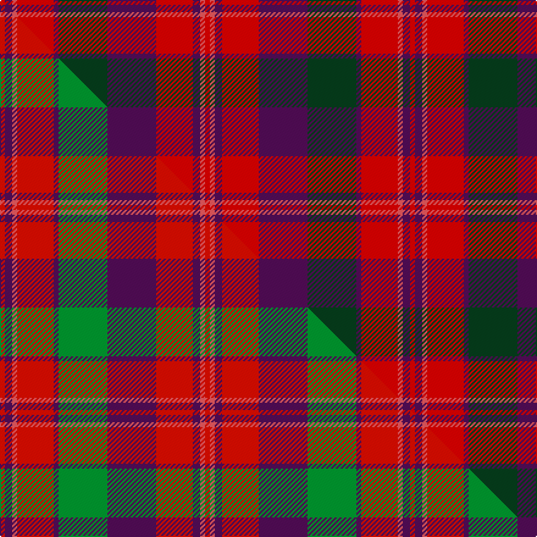

This is one **variant** — a specific cloth: this exact thread count and colourway, with its own
provenance below. It is one weaving of the [sett](/tartans/d/dr/drumlithie/) (the scale-free proportion — the
same cloth at any scale or shade), whose colour order is pattern [RBRRBGBRBRR](/stripes/rbrrbgbrbrr/).

Part of the [Drumlithie](/tartans/d/dr/drumlithie/) tartan — the named design grouping this sett with its other cloths.

Sourced from tartans-authority.  It is a [11 stripe tartan](/stripes/stripes11/).

Original link <code>http://www.tartansauthority.com/tartan-ferret/display/1414/</code> — retired · [Internet Archive copy](https://web.archive.org/web/*/http://www.tartansauthority.com/tartan-ferret/display/1414/*)

Dataset <small>— provenance for this record, inherited from the source manifest</small>

<dl class="dataset-prov">
<dt>source</dt><dd><a href="/sources/tartans-authority/">Scottish Tartans Authority</a></dd>
<dt>data captured from</dt><dd><a href="https://github.com/thetartan/tartan-database/blob/master/data/tartans-authority/data.csv">https://github.com/thetartan/tartan-database/blob/master/data/tartans-authority/data.csv</a></dd>
<dt>data date</dt><dd>1790s <small>(this record)</small></dd>
<dt>licence</dt><dd><a href="https://creativecommons.org/licenses/by-nc-nd/4.0/">CC BY-NC-ND 4.0</a></dd>
</dl>

Capture chain <small>— the hands this data passed through, oldest first; each capture carries its own licence</small>

<ol class="capture-chain">
<li><a href="https://www.tartansauthority.com/">Scottish Tartans Authority</a> <small>the heritage body’s archive — its tartan-ferret record browser is retired; dead record links are shown unlinked, with an Internet Archive copy (ITI numbers are not SRT references)</small></li>
<li><a href="https://github.com/thetartan/tartan-database">thetartan/tartan-database</a> <small>2016-2017</small> · <a href="https://creativecommons.org/licenses/by-nc-nd/4.0/">CC BY-NC-ND 4.0</a> <small>Levko Kravets's frozen compilation — the capture we vendored, and where its CC licence text came from</small></li>
<li>this dictionary <small>captured 2026-06-10 · commit 5bf86c7566</small> <small>each re-capture is a git commit to data/sources</small></li>
</ol>

## Register references

External register numbers recorded for this tartan.

- Scottish Tartans Authority (ITI): 1414

## Thread count
R/4 DP6 Ri4 R30 DP4 DG40 DP40 R30 DP6 Ri4 R/4

One full sett is **336 threads**.

## Palette
<table><thead><tr><th>Colour</th><th>Shade</th><th>OKLCh</th></tr></thead><tbody><tr><td>R</td><td><code style="background-color:#D05054;">#D05054</code> <small style="color:#888">#D05054</small></td><td><small style="color:#888">oklch(60.2% 0.162 21.5)</small></td></tr><tr><td>DP</td><td><code style="background-color:#4B0B4F;">#4B0B4F</code> <small style="color:#888">#4B0B4F</small></td><td><small style="color:#888">oklch(30.1% 0.125 325.4)</small></td></tr><tr><td>DG</td><td><code style="background-color:#053819;">#053819</code> <small style="color:#888">#053819</small></td><td><small style="color:#888">oklch(30.0% 0.075 151.3)</small></td></tr><tr><td>R</td><td><code style="background-color:#C80000;">#C80000</code> <small style="color:#888">#C80000</small></td><td><small style="color:#888">oklch(52.3% 0.215 29.2)</small></td></tr></tbody></table>

# Sample pattern

[Sample sheet (PDF)](swatch.pdf) — the woven sample, thread count and palette on one printable A4, rendered on demand (the same sheet the TTD print page downloads).

## Compared to the master

This cloth is one sett of its design; the master sett (the exemplar the design is anchored on) is below for comparison.

Its **ΔTartan distance** from the master is **0.12** — the same measure the nearest-tartans table ranks by (0 is identical; a re-scale of the same cloth is near 0, a recolour or a different proportion further).

<figure class="master-compare" style="margin:0">

this sett
master sett ★

<figcaption style="color:#888;font-size:smaller">One weave of this sett against the <a href="/setts/r2dp3ri2r15dp2g20dp20r15dp3ri2r2/">master sett ★</a>, split on the diagonal: a shared proportion runs seamlessly across it with only the shades shifting; a different proportion breaks on it.</figcaption>
</figure>

## Nearest tartan variants

The nearest existing variants by ΔTartan distance, with this cloth at the top so the swatches line up against it.

ΔTartan

Threads

Variant

Sett

—

336

<a href="/variants/s11/r2dp3ri2r15dp2dg20dp20r15dp3ri2r2~x2~r5221030-ri6016021/">Drumlithie - 1790 (Fashion)</a>

<a href="/ttd/edit/#slug=r2dp3ri2r15dp2g20dp20r15dp3ri2r2~x2~r5221030-ri6016021&amp;base=r2dp3ri2r15dp2dg20dp20r15dp3ri2r2~x2~r5221030-ri6016021" title="compare in the TTD">0.12</a>

336

<a href="/variants/s11/r2dp3ri2r15dp2g20dp20r15dp3ri2r2~x2~r5221030-ri6016021/">Drumlithie</a>

<a href="/ttd/edit/#slug=r2dp3ri2r15dp3g19dp20r15dp3ri2r2~x2~r5221030-ri6016021&amp;base=r2dp3ri2r15dp2dg20dp20r15dp3ri2r2~x2~r5221030-ri6016021" title="compare in the TTD">0.16</a>

336

<a href="/variants/s11/r2dp3ri2r15dp3g19dp20r15dp3ri2r2~x2~r5221030-ri6016021/">Drumlithie Rock and Wheel Tartan</a>

<a href="/ttd/edit/#slug=r2dp3dg2r15dp3g19dp20r15dp3dg2r2~x2&amp;base=r2dp3ri2r15dp2dg20dp20r15dp3ri2r2~x2~r5221030-ri6016021" title="compare in the TTD">1.64</a>

336

<a href="/variants/s11/r2dp3dg2r15dp3g19dp20r15dp3dg2r2~x2/">Drumlithie, Rock and Wheel</a>

<a href="/ttd/edit/#slug=dr3b3dr18r2dr2r3dr2r4b18y2~x2&amp;base=r2dp3ri2r15dp2dg20dp20r15dp3ri2r2~x2~r5221030-ri6016021" title="compare in the TTD">3.16</a>

218

<a href="/variants/s10/dr3b3dr18r2dr2r3dr2r4b18y2~x2/">FC Barcelona (Corporate)</a>

<a href="/ttd/edit/#slug=dp8r3y1r3dg14r3y1~x4&amp;base=r2dp3ri2r15dp2dg20dp20r15dp3ri2r2~x2~r5221030-ri6016021" title="compare in the TTD">3.16</a>

228

<a href="/variants/s7/dp8r3y1r3dg14r3y1~x4/">Logan - 1819 (with yellow)</a>

<a href="/ttd/edit/#slug=dy2r11dp1r1dp1r1dp4b6dy1b1y1~x4~dp2712327-b4819270&amp;base=r2dp3ri2r15dp2dg20dp20r15dp3ri2r2~x2~r5221030-ri6016021" title="compare in the TTD">3.20</a>

228

<a href="/variants/s11/dy2r11dp1r1dp1r1dp4b6dy1b1y1~x4~dp2712327-b4819270/">NHK Asaichi</a>

<a href="/ttd/edit/#slug=dy2r11db1r1db1r1db4dbi6dy1dbi1ly1~x4~db2911276-dbi4215273&amp;base=r2dp3ri2r15dp2dg20dp20r15dp3ri2r2~x2~r5221030-ri6016021" title="compare in the TTD">3.24</a>

228

<a href="/variants/s11/dy2r11db1r1db1r1db4dbi6dy1dbi1ly1~x4~db2911276-dbi4215273/">NHK Asaichi</a>

<a href="/ttd/edit/#slug=r31db2r3db2r3dg12r3db2r3db2r31dy4dg19dy36dg19dy4~x2&amp;base=r2dp3ri2r15dp2dg20dp20r15dp3ri2r2~x2~r5221030-ri6016021" title="compare in the TTD">3.25</a>

634

<a href="/variants/s16/r31db2r3db2r3dg12r3db2r3db2r31dy4dg19dy36dg19dy4~x2/">O'Brian #1 (Fashion)</a>

<a href="/ttd/edit/#slug=db4r1y12r2y2r12y1db4~x4&amp;base=r2dp3ri2r15dp2dg20dp20r15dp3ri2r2~x2~r5221030-ri6016021" title="compare in the TTD">3.29</a>

272

<a href="/variants/s8/db4r1y12r2y2r12y1db4~x4/">Glassary #2</a>

<a href="/ttd/edit/#slug=r4ri2r1dg16ri2r11ri1r1ri2~x2~r5221030-ri5321009&amp;base=r2dp3ri2r15dp2dg20dp20r15dp3ri2r2~x2~r5221030-ri6016021" title="compare in the TTD">3.40</a>

148

<a href="/variants/s9/r4ri2r1dg16ri2r11ri1r1ri2~x2~r5221030-ri5321009/">Valdres, Kvam &amp; Vang</a>

## Neighbour map

Every grey dot is one of 13662 variants placed by the first two principal components of the ΔTartan feature space (42% of its variance). Red is this tartan; blue dots are its nearest — click one to open its page. The map is a flat projection of a many-dimensional space — [how to read it](/posts/neighbourhood-maps/).

<svg viewBox="0 0 640 380" role="img" style="max-width:100%;height:auto;border:1px solid #e0e0e0;border-radius:4px;display:block" xmlns="http://www.w3.org/2000/svg"><image href="/nn/cloud.v1.png" width="640" height="380"/><a href="/variants/s11/r2dp3ri2r15dp2g20dp20r15dp3ri2r2~x2~r5221030-ri6016021/"><circle cx="244.0" cy="180.3" r="4" fill="#3465a4"><title>Drumlithie</title></circle></a><a href="/variants/s11/r2dp3ri2r15dp3g19dp20r15dp3ri2r2~x2~r5221030-ri6016021/"><circle cx="244.1" cy="182.3" r="4" fill="#3465a4"><title>Drumlithie Rock and Wheel Tartan</title></circle></a><a href="/variants/s11/r2dp3dg2r15dp3g19dp20r15dp3dg2r2~x2/"><circle cx="234.7" cy="179.6" r="4" fill="#3465a4"><title>Drumlithie, Rock and Wheel</title></circle></a><a href="/variants/s10/dr3b3dr18r2dr2r3dr2r4b18y2~x2/"><circle cx="288.0" cy="186.3" r="4" fill="#3465a4"><title>FC Barcelona (Corporate)</title></circle></a><a href="/variants/s7/dp8r3y1r3dg14r3y1~x4/"><circle cx="285.7" cy="196.3" r="4" fill="#3465a4"><title>Logan - 1819 (with yellow)</title></circle></a><a href="/variants/s11/dy2r11dp1r1dp1r1dp4b6dy1b1y1~x4~dp2712327-b4819270/"><circle cx="248.9" cy="151.9" r="4" fill="#3465a4"><title>NHK Asaichi</title></circle></a><a href="/variants/s11/dy2r11db1r1db1r1db4dbi6dy1dbi1ly1~x4~db2911276-dbi4215273/"><circle cx="245.1" cy="153.1" r="4" fill="#3465a4"><title>NHK Asaichi</title></circle></a><a href="/variants/s16/r31db2r3db2r3dg12r3db2r3db2r31dy4dg19dy36dg19dy4~x2/"><circle cx="284.7" cy="143.9" r="4" fill="#3465a4"><title>O'Brian #1 (Fashion)</title></circle></a><a href="/variants/s8/db4r1y12r2y2r12y1db4~x4/"><circle cx="298.0" cy="210.1" r="4" fill="#3465a4"><title>Glassary #2</title></circle></a><a href="/variants/s9/r4ri2r1dg16ri2r11ri1r1ri2~x2~r5221030-ri5321009/"><circle cx="336.7" cy="176.8" r="4" fill="#3465a4"><title>Valdres, Kvam &amp; Vang</title></circle></a><circle cx="268.3" cy="186.2" r="5" fill="#c00000"/><text x="320" y="376" text-anchor="middle" font-size="11" fill="#999">ground</text><text x="11" y="190" text-anchor="middle" font-size="11" fill="#999" transform="rotate(-90 11 190)">complexity</text></svg>

ID: /variants/s11/r2dp3ri2r15dp2dg20dp20r15dp3ri2r2~x2~r5221030-ri6016021/
