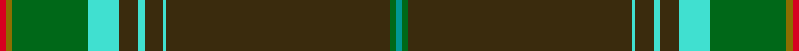

This page is one **sett** — a single exact thread-count. It belongs to the [tartan](/setts/r2y2dg24lt10dy6lt2dy6lt1dy71dg2g2/)
(the same proportion at any scale), whose colour order is pattern [GGGWGWGWGGR](/stripes/gggwgwgwggr/).

Sourced from tartans-authority.  It is a [11 stripe tartan](/stripes/stripes11/).

Original link http://www.tartansauthority.com/tartan-ferret/display/8010/

## Register references

External register numbers recorded for this tartan.

- Scottish Tartans Authority (ITI): 8010

## Thread count
R/4 Y4 DG48 LT20 DY12 LT4 DY12 LT2 DY142 DG4 G/4

One full sett is **504 threads**.

## Palette
<table><thead><tr><th>Colour</th><th>Shade</th><th>OKLCh</th></tr></thead><tbody><tr><td>G</td><td><code style="background-color:#009894;">#009894</code> <small style="color:#888">#009894</small></td><td><small style="color:#888">oklch(61.4% 0.106 191.5)</small></td></tr><tr><td>LT</td><td><code style="background-color:#40E0D0;">#40E0D0</code> <small style="color:#888">#40E0D0</small></td><td><small style="color:#888">oklch(82.2% 0.131 185.1)</small></td></tr><tr><td>DG</td><td><code style="background-color:#006818;">#006818</code> <small style="color:#888">#006818</small></td><td><small style="color:#888">oklch(45.0% 0.142 145.0)</small></td></tr><tr><td>R</td><td><code style="background-color:#D60020;">#D60020</code> <small style="color:#888">#D60020</small></td><td><small style="color:#888">oklch(55.2% 0.224 25.5)</small></td></tr><tr><td>DY</td><td><code style="background-color:#3A2B0D;">#3A2B0D</code> <small style="color:#888">#3A2B0D</small></td><td><small style="color:#888">oklch(30.0% 0.049 82.0)</small></td></tr><tr><td>Y</td><td><code style="background-color:#8B6E00;">#8B6E00</code> <small style="color:#888">#8B6E00</small></td><td><small style="color:#888">oklch(55.1% 0.113 90.4)</small></td></tr></tbody></table>

# Sample pattern

ID: /variants/s11/r2y2dg24lt10dy6lt2dy6lt1dy71dg2g2~x2~dg1806142-lt3305186-g2504187/
