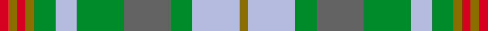

This is one **variant** — a specific cloth: this exact thread count and colourway, with its own
provenance below. It is one weaving of the [sett](/tartans/v/va/vasseur-mignon/) (the scale-free proportion — the
same cloth at any scale or shade), whose colour order is pattern [GWGBGWGGRGR](/stripes/gwgbgwggrgr/).

Part of the [Vasseur Mignon](/tartans/v/va/vasseur-mignon/) tartan — the named design grouping this sett with its other cloths.

Sourced from register-of-tartans.  It is a [11 stripe tartan](/stripes/stripes11/).

Original link [https://www.tartanregister.gov.uk/tartanDetails.aspx?ref=10808](https://www.tartanregister.gov.uk/tartanDetails.aspx?ref=10808)

Dataset <small>— provenance for this record, inherited from the source manifest</small>

<dl class="dataset-prov">
<dt>source</dt><dd><a href="/sources/register-of-tartans/">Scottish Register of Tartans</a></dd>
<dt>data captured from</dt><dd><a href="https://github.com/thetartan/tartan-database/blob/master/data/register-of-tartans/data.csv">https://github.com/thetartan/tartan-database/blob/master/data/register-of-tartans/data.csv</a></dd>
<dt>data date</dt><dd>21/03/2013 <small>(this record)</small></dd>
<dt>licence</dt><dd><a href="https://www.tartanregister.gov.uk/copyright">Crown copyright</a></dd>
</dl>

Capture chain <small>— the hands this data passed through, oldest first; each capture carries its own licence</small>

<ol class="capture-chain">
<li><a href="https://www.tartanregister.gov.uk/">Scottish Register of Tartans</a> · <a href="https://www.tartanregister.gov.uk/copyright">Crown copyright</a> <small>the living register — still published by National Records of Scotland</small></li>
<li><a href="https://github.com/thetartan/tartan-database">thetartan/tartan-database</a> <small>2016-2017</small> · <a href="https://creativecommons.org/licenses/by-nc-nd/4.0/">CC BY-NC-ND 4.0</a> <small>Levko Kravets's frozen compilation — the capture we vendored, and where its CC licence text came from</small></li>
<li>this dictionary <small>captured 2026-06-10 · commit 5bf86c7566</small> <small>each re-capture is a git commit to data/sources</small></li>
</ol>

## Register references

External register numbers recorded for this tartan.

- Scottish Register of Tartans: [10808](https://www.tartanregister.gov.uk/tartanDetails.aspx?ref=10808)

## Thread count
R/4 Y4 R4 Y4 G10 LB10 G22 N22 G10 LB22 Y/4

One full sett is **224 threads**.

## Palette
<table><thead><tr><th>Colour</th><th>Shade</th><th>OKLCh</th></tr></thead><tbody><tr><td>G</td><td><code style="background-color:#008B2A;">#008B2A</code> <small style="color:#888">#008B2A</small></td><td><small style="color:#888">oklch(55.4% 0.170 145.9)</small></td></tr><tr><td>N</td><td><code style="background-color:#636363;">#636363</code> <small style="color:#888">#636363</small></td><td><small style="color:#888">oklch(50.0% 0.000 89.9)</small></td></tr><tr><td>LB</td><td><code style="background-color:#B5BBDE;">#B5BBDE</code> <small style="color:#888">#B5BBDE</small></td><td><small style="color:#888">oklch(79.9% 0.050 277.6)</small></td></tr><tr><td>R</td><td><code style="background-color:#D60020;">#D60020</code> <small style="color:#888">#D60020</small></td><td><small style="color:#888">oklch(55.2% 0.224 25.5)</small></td></tr><tr><td>Y</td><td><code style="background-color:#8B6E00;">#8B6E00</code> <small style="color:#888">#8B6E00</small></td><td><small style="color:#888">oklch(55.1% 0.113 90.4)</small></td></tr></tbody></table>

# Sample pattern

## Nearest tartan variants

The nearest existing variants by ΔTartan distance, with this cloth at the top so the swatches line up against it.

ΔTartan

Threads

Variant

Sett

—

224

<a href="/variants/s11/r2y2r2y2g5lb5g11n11g5lb11y2~x2/">Vasseur Mignon (Personal)</a>

<a href="/ttd/edit/#slug=r1dy7db3g1n3g1db3g7w1~x4&amp;base=r2y2r2y2g5lb5g11n11g5lb11y2~x2" title="compare in the TTD">1.68</a>

208

<a href="/variants/s9/r1dy7db3g1n3g1db3g7w1~x4/">Adamson (Personal)</a>

<a href="/ttd/edit/#slug=dg3lb12dg10lb6dg8g6dg8o23oi3~x2~dg1806142-g2408144-o2005046-oi2007033&amp;base=r2y2r2y2g5lb5g11n11g5lb11y2~x2" title="compare in the TTD">2.27</a>

304

<a href="/variants/s9/dg3lb12dg10lb6dg8g6dg8o23oi3~x2~dg1806142-g2408144-o2005046-oi2007033/">Lawrence's Seven Pillars of Khaki</a>

<a href="/ttd/edit/#slug=r2ly2r2ly2g5o5g11n11g5o11ly2~x2~o2500000-n1900000&amp;base=r2y2r2y2g5lb5g11n11g5lb11y2~x2" title="compare in the TTD">2.43</a>

224

<a href="/variants/s11/r2ly2r2ly2g5o5g11n11g5o11ly2~x2~o2500000-n1900000/">Vassseur Mignon ({Personal)</a>

<a href="/ttd/edit/#slug=y3dg14g9db4g8w2g12r12g2r5w2~x2~dg1806142-g2203152&amp;base=r2y2r2y2g5lb5g11n11g5lb11y2~x2" title="compare in the TTD">3.04</a>

282

<a href="/variants/s11/y3dg14g9db4g8w2g12r12g2r5w2~x2~dg1806142-g2203152/">Muirhead (Clan)</a>

<a href="/ttd/edit/#slug=dt2y10dg4o5dg2o3dg2o5dg4dt15lr2~x2~y2302166-dg1806142&amp;base=r2y2r2y2g5lb5g11n11g5lb11y2~x2" title="compare in the TTD">3.04</a>

208

<a href="/variants/s11/dt2y10dg4o5dg2o3dg2o5dg4dt15lr2~x2~y2302166-dg1806142/">Elwyn Glen (Scottish Borders)</a>

<a href="/ttd/edit/#slug=g7n3r3lb3r3n3g12y4g4y4lb3~x2&amp;base=r2y2r2y2g5lb5g11n11g5lb11y2~x2" title="compare in the TTD">3.06</a>

176

<a href="/variants/s11/g7n3r3lb3r3n3g12y4g4y4lb3~x2/">Ralston (USA)</a>

<a href="/ttd/edit/#slug=o7n6lb1ly6n1ly6n6lb1o6~x8~o2500000-n1900000&amp;base=r2y2r2y2g5lb5g11n11g5lb11y2~x2" title="compare in the TTD">3.31</a>

536

<a href="/variants/s9/o7n6lb1ly6n1ly6n6lb1o6~x8~o2500000-n1900000/">Outlander #2</a>

<a href="/ttd/edit/#slug=dr5lr1dr1lri1dr1n5o6dr1o6n5lri5dr1~x4~lr2800000-lri2901240-n1900000-o2500000&amp;base=r2y2r2y2g5lb5g11n11g5lb11y2~x2" title="compare in the TTD">3.32</a>

280

<a href="/variants/s12/dr5lr1dr1lg1dr1n5o6dr1o6n5lg5dr1~x4~lr2800000-lg2901240-n1900000-o2500000/">Lakin (Personal)</a>

<a href="/ttd/edit/#slug=dg11lb3dg4y3dg3y4dg3o13b3lb3b4dg3~x2&amp;base=r2y2r2y2g5lb5g11n11g5lb11y2~x2" title="compare in the TTD">3.35</a>

200

<a href="/variants/s12/dg11lb3dg4y3dg3y4dg3o13b3lb3b4dg3~x2/">Harmony, 2 &amp; 3</a>

<a href="/ttd/edit/#slug=b3do2o14g17do14b8o14do2b3~x2&amp;base=r2y2r2y2g5lb5g11n11g5lb11y2~x2" title="compare in the TTD">3.38</a>

296

<a href="/variants/s9/b3do2o14g17do14b8o14do2b3~x2/">Monaghan</a>

## Neighbour map

Every grey dot is one of 13656 variants placed by the first two principal components of the ΔTartan feature space (42% of its variance). Red is this tartan; blue dots are its nearest — click one to open its page. The map is a flat projection of a many-dimensional space — [how to read it](/posts/neighbourhood-maps/).

<svg viewBox="0 0 640 380" role="img" style="max-width:100%;height:auto;border:1px solid #e0e0e0;border-radius:4px;display:block" xmlns="http://www.w3.org/2000/svg"><image href="/nn/cloud.v1.png" width="640" height="380"/><a href="/variants/s9/r1dy7db3g1n3g1db3g7w1~x4/"><circle cx="135.6" cy="204.6" r="4" fill="#3465a4"><title>Adamson (Personal)</title></circle></a><a href="/variants/s9/dg3lb12dg10lb6dg8g6dg8o23oi3~x2~dg1806142-g2408144-o2005046-oi2007033/"><circle cx="187.7" cy="229.3" r="4" fill="#3465a4"><title>Lawrence's Seven Pillars of Khaki</title></circle></a><a href="/variants/s11/r2ly2r2ly2g5o5g11n11g5o11ly2~x2~o2500000-n1900000/"><circle cx="226.6" cy="253.2" r="4" fill="#3465a4"><title>Vassseur Mignon ({Personal)</title></circle></a><a href="/variants/s11/y3dg14g9db4g8w2g12r12g2r5w2~x2~dg1806142-g2203152/"><circle cx="182.3" cy="210.3" r="4" fill="#3465a4"><title>Muirhead (Clan)</title></circle></a><a href="/variants/s11/dt2y10dg4o5dg2o3dg2o5dg4dt15lr2~x2~y2302166-dg1806142/"><circle cx="201.7" cy="224.2" r="4" fill="#3465a4"><title>Elwyn Glen (Scottish Borders)</title></circle></a><a href="/variants/s11/g7n3r3lb3r3n3g12y4g4y4lb3~x2/"><circle cx="233.0" cy="268.6" r="4" fill="#3465a4"><title>Ralston (USA)</title></circle></a><a href="/variants/s9/o7n6lb1ly6n1ly6n6lb1o6~x8~o2500000-n1900000/"><circle cx="225.0" cy="270.6" r="4" fill="#3465a4"><title>Outlander #2</title></circle></a><a href="/variants/s12/dr5lr1dr1lg1dr1n5o6dr1o6n5lg5dr1~x4~lr2800000-lg2901240-n1900000-o2500000/"><circle cx="191.0" cy="236.3" r="4" fill="#3465a4"><title>Lakin (Personal)</title></circle></a><a href="/variants/s12/dg11lb3dg4y3dg3y4dg3o13b3lb3b4dg3~x2/"><circle cx="170.4" cy="229.6" r="4" fill="#3465a4"><title>Harmony, 2 &amp; 3</title></circle></a><a href="/variants/s9/b3do2o14g17do14b8o14do2b3~x2/"><circle cx="227.8" cy="241.8" r="4" fill="#3465a4"><title>Monaghan</title></circle></a><circle cx="186.6" cy="238.3" r="5" fill="#c00000"/><text x="320" y="376" text-anchor="middle" font-size="11" fill="#999">ground</text><text x="11" y="190" text-anchor="middle" font-size="11" fill="#999" transform="rotate(-90 11 190)">complexity</text></svg>

ID: /variants/s11/r2y2r2y2g5lb5g11n11g5lb11y2~x2/
