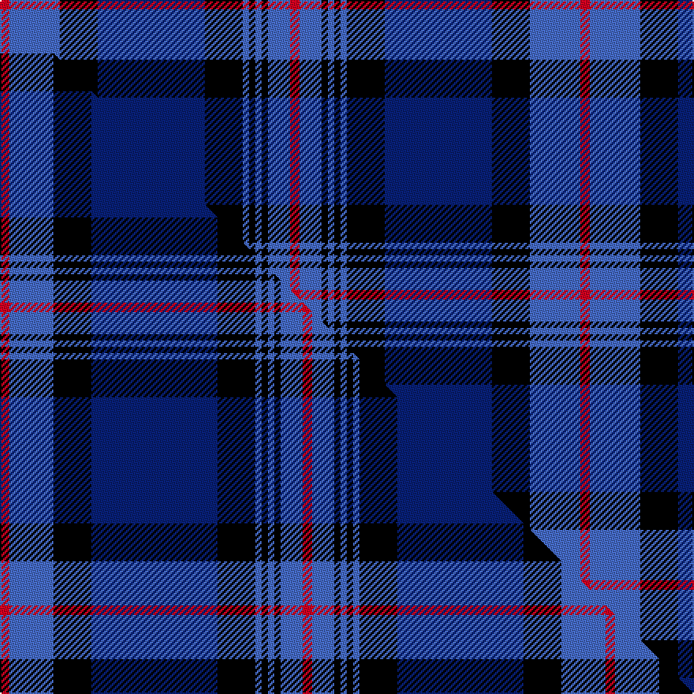

This page is one **sett** — a single exact thread-count. It belongs to the [tartan](/setts/r3b16k12db34k12b2k2b2k2b7r3/)
(the same proportion at any scale), whose colour order is pattern [RBKBKBKBKBR](/stripes/rbkbkbkbkbr/).

Part of the [Rangers F.C.](/tartans/rangers-f-c/) tartan — the named design grouping this sett with its other cloths.

Sourced from weddslist.  It is a [11 stripe tartan](/stripes/stripes11/).

Original link [http://www.weddslist.com/cgi-bin/tartans/pg.pl?source=sts](http://www.weddslist.com/cgi-bin/tartans/pg.pl?source=sts)

Dataset <small>— provenance for this record, inherited from the source manifest</small>

<dl class="dataset-prov">
<dt>source</dt><dd><a href="/sources/weddslist/">Weddslist</a></dd>
<dt>data captured from</dt><dd><a href="https://github.com/thetartan/tartan-database/blob/master/data/weddslist/data.csv">https://github.com/thetartan/tartan-database/blob/master/data/weddslist/data.csv</a></dd>
<dt>data date</dt><dd>2016-11-17 <small>(dataset default)</small></dd>
<dt>licence</dt><dd><a href="https://creativecommons.org/licenses/by-nc-nd/4.0/">CC BY-NC-ND 4.0</a></dd>
</dl>

Capture chain <small>— the hands this data passed through, oldest first; each capture carries its own licence</small>

<ol class="capture-chain">
<li><a href="https://www.weddslist.com/tartans/">Weddslist</a> <small>the living privately compiled reference</small></li>
<li><a href="https://github.com/thetartan/tartan-database">thetartan/tartan-database</a> <small>2016-2017</small> · <a href="https://creativecommons.org/licenses/by-nc-nd/4.0/">CC BY-NC-ND 4.0</a> <small>Levko Kravets's frozen compilation — the capture we vendored, and where its CC licence text came from</small></li>
<li>this dictionary <small>captured 2026-06-10 · commit 5bf86c7566</small> <small>each re-capture is a git commit to data/sources</small></li>
</ol>

## Thread count
R/6 B32 K24 DB68 K24 B4 K4 B4 K4 B14 R/6

One full sett is **368 threads**.

## Palette
<table><thead><tr><th>Colour</th><th>Shade</th><th>OKLCh</th></tr></thead><tbody><tr><td>DB</td><td><code style="background-color:#082077;">#082077</code> <small style="color:#888">#082077</small></td><td><small style="color:#888">oklch(30.0% 0.149 265.1)</small></td></tr><tr><td>B</td><td><code style="background-color:#466CC8;">#466CC8</code> <small style="color:#888">#466CC8</small></td><td><small style="color:#888">oklch(55.1% 0.149 265.0)</small></td></tr><tr><td>K</td><td><code style="background-color:#000000;">#000000</code> <small style="color:#888">#000000</small></td><td><small style="color:#888">oklch(0.0% 0.000 0.0)</small></td></tr><tr><td>R</td><td><code style="background-color:#D60020;">#D60020</code> <small style="color:#888">#D60020</small></td><td><small style="color:#888">oklch(55.2% 0.224 25.5)</small></td></tr></tbody></table>

# Sample pattern

## Compared to the master

This cloth is one sett of its design; the master sett (the exemplar the design is anchored on) is below for comparison.

Its **ΔTartan distance** from the master is **0.19** — the same measure the nearest-tartans table ranks by (0 is identical; a re-scale of the same cloth is near 0, a recolour or a different proportion further).

<figure class="master-compare" style="margin:0">

this sett
master sett ★

<figcaption style="color:#888;font-size:smaller">One weave of this sett against the <a href="/setts/r3b14k12db40k12b2k2b2k2b7r3/">master sett ★</a>, split on the diagonal: a shared proportion runs seamlessly across it with only the shades shifting; a different proportion breaks on it.</figcaption>
</figure>

## Nearest tartan variants

The nearest existing variants by ΔTartan distance, with this cloth at the top so the swatches line up against it.

ΔTartan

Threads

Variant

Sett

—

368

<a href="/variants/s11/r3b16k12db34k12b2k2b2k2b7r3~x2/">Rangers F.C.</a>

<a href="/ttd/edit/#slug=r3b14k12db40k12b2k2b2k2b7r3~x2&amp;base=r3b16k12db34k12b2k2b2k2b7r3~x2" title="compare in the TTD">0.19</a>

384

<a href="/variants/s11/r3b14k12db40k12b2k2b2k2b7r3~x2/">Rangers F.C.</a>

<a href="/ttd/edit/#slug=r3dt12k12db32k12dt2k2dt2k2dt4r3~dt1204274-db1106275&amp;base=r3b16k12db34k12b2k2b2k2b7r3~x2" title="compare in the TTD">0.28</a>

166

<a href="/variants/s11/r3dbi12k12db32k12dbi2k2dbi2k2dbi4r3~dbi1204274-db1106275/">Rangers F. C. Corporate Tartan</a>

<a href="/ttd/edit/#slug=r3db16k12t34k12db2k2db2k2db7r3~x2&amp;base=r3b16k12db34k12b2k2b2k2b7r3~x2" title="compare in the TTD">1.98</a>

368

<a href="/variants/s11/r3db16k12t34k12db2k2db2k2db7r3~x2/">Rangers 1989 (Sports)</a>

<a href="/ttd/edit/#slug=r3db16k12dbi34k12db2k2db2k2db7r3~x2~db0906265-dbi1605267&amp;base=r3b16k12db34k12b2k2b2k2b7r3~x2" title="compare in the TTD">2.13</a>

368

<a href="/variants/s11/r3db16k12dbi34k12db2k2db2k2db7r3~x2~db0906265-dbi1605267/">Rangers Football Club</a>

<a href="/ttd/edit/#slug=r7db2b5db2k24db2b10db28b10w3~x2&amp;base=r3b16k12db34k12b2k2b2k2b7r3~x2" title="compare in the TTD">2.27</a>

352

<a href="/variants/s10/r7db2b5db2k24db2b10db28b10w3~x2/">Colgan, USA, Robert James</a>

<a href="/ttd/edit/#slug=r3db14k12dbi40k12db2k2db2k2db7r3~x2~db0906265-dbi1605267&amp;base=r3b16k12db34k12b2k2b2k2b7r3~x2" title="compare in the TTD">2.32</a>

384

<a href="/variants/s11/r3db14k12dbi40k12db2k2db2k2db7r3~x2~db0906265-dbi1605267/">Rangers Football Club #2</a>

<a href="/ttd/edit/#slug=k5db26k2db4k2db26k3lr36k3dbi30k3t2~db0806265-lr2800000-dbi1404245-t2503227&amp;base=r3b16k12db34k12b2k2b2k2b7r3~x2" title="compare in the TTD">2.34</a>

277

<a href="/variants/s12/k5db26k2db4k2db26k3lr36k3dbi30k3t2~db0806265-lr2800000-dbi1404245-t2503227/">Daniel Welsh Name Tartan</a>

<a href="/ttd/edit/#slug=db4k2db20k13y1k2y2k2y1b23n4~x2&amp;base=r3b16k12db34k12b2k2b2k2b7r3~x2" title="compare in the TTD">2.37</a>

280

<a href="/variants/s11/db4k2db20k13y1k2y2k2y1b23n4~x2/">Michigan State Police (Corporate)</a>

<a href="/ttd/edit/#slug=k5dbi26k2dbi4k2dbi26k3lr36k3db30k3t2~k0700000-dbi0806265-lr2800000-t2503227&amp;base=r3b16k12db34k12b2k2b2k2b7r3~x2" title="compare in the TTD">2.51</a>

277

<a href="/variants/s12/k5dbi26k2dbi4k2dbi26k3lr36k3db30k3t2~k0700000-dbi0806265-lr2800000-t2503227/">Daniel (Welsh Name)</a>

<a href="/ttd/edit/#slug=y7k1db22k2db1k2db4k2db1k2db4k18w5~x2~k0503265-db1605267&amp;base=r3b16k12db34k12b2k2b2k2b7r3~x2" title="compare in the TTD">2.57</a>

260

<a href="/variants/s13/y7k1db22k2db1k2db4k2db1k2db4k18w5~x2~k0503265-db1605267/">Swedish</a>

## Neighbour map

Every grey dot is one of 13621 variants placed by the first two principal components of the ΔTartan feature space (42% of its variance). Red is this tartan; blue dots are its nearest — click one to open its page.

<svg viewBox="0 0 640 380" role="img" style="max-width:100%;height:auto;border:1px solid #e0e0e0;border-radius:4px;display:block" xmlns="http://www.w3.org/2000/svg"><image href="/nn/cloud.v1.png" width="640" height="380"/><a href="/variants/s11/r3b14k12db40k12b2k2b2k2b7r3~x2/"><circle cx="225.7" cy="125.5" r="4" fill="#3465a4"><title>Rangers F.C.</title></circle></a><a href="/variants/s11/r3dbi12k12db32k12dbi2k2dbi2k2dbi4r3~dbi1204274-db1106275/"><circle cx="249.3" cy="152.7" r="4" fill="#3465a4"><title>Rangers F. C. Corporate Tartan</title></circle></a><a href="/variants/s11/r3db16k12t34k12db2k2db2k2db7r3~x2/"><circle cx="182.7" cy="138.0" r="4" fill="#3465a4"><title>Rangers 1989 (Sports)</title></circle></a><a href="/variants/s11/r3db16k12dbi34k12db2k2db2k2db7r3~x2~db0906265-dbi1605267/"><circle cx="222.7" cy="147.5" r="4" fill="#3465a4"><title>Rangers Football Club</title></circle></a><a href="/variants/s10/r7db2b5db2k24db2b10db28b10w3~x2/"><circle cx="154.0" cy="142.9" r="4" fill="#3465a4"><title>Colgan, USA, Robert James</title></circle></a><a href="/variants/s11/r3db14k12dbi40k12db2k2db2k2db7r3~x2~db0906265-dbi1605267/"><circle cx="250.9" cy="133.3" r="4" fill="#3465a4"><title>Rangers Football Club #2</title></circle></a><a href="/variants/s12/k5db26k2db4k2db26k3lr36k3dbi30k3t2~db0806265-lr2800000-dbi1404245-t2503227/"><circle cx="178.2" cy="121.1" r="4" fill="#3465a4"><title>Daniel Welsh Name Tartan</title></circle></a><a href="/variants/s11/db4k2db20k13y1k2y2k2y1b23n4~x2/"><circle cx="171.4" cy="112.0" r="4" fill="#3465a4"><title>Michigan State Police (Corporate)</title></circle></a><a href="/variants/s12/k5dbi26k2dbi4k2dbi26k3lr36k3db30k3t2~k0700000-dbi0806265-lr2800000-t2503227/"><circle cx="194.5" cy="126.6" r="4" fill="#3465a4"><title>Daniel (Welsh Name)</title></circle></a><a href="/variants/s13/y7k1db22k2db1k2db4k2db1k2db4k18w5~x2~k0503265-db1605267/"><circle cx="252.3" cy="115.4" r="4" fill="#3465a4"><title>Swedish</title></circle></a><circle cx="193.9" cy="138.6" r="5" fill="#c00000"/><text x="320" y="376" text-anchor="middle" font-size="11" fill="#999">ground</text><text x="11" y="190" text-anchor="middle" font-size="11" fill="#999" transform="rotate(-90 11 190)">complexity</text></svg>

ID: /variants/s11/r3b16k12db34k12b2k2b2k2b7r3~x2/
