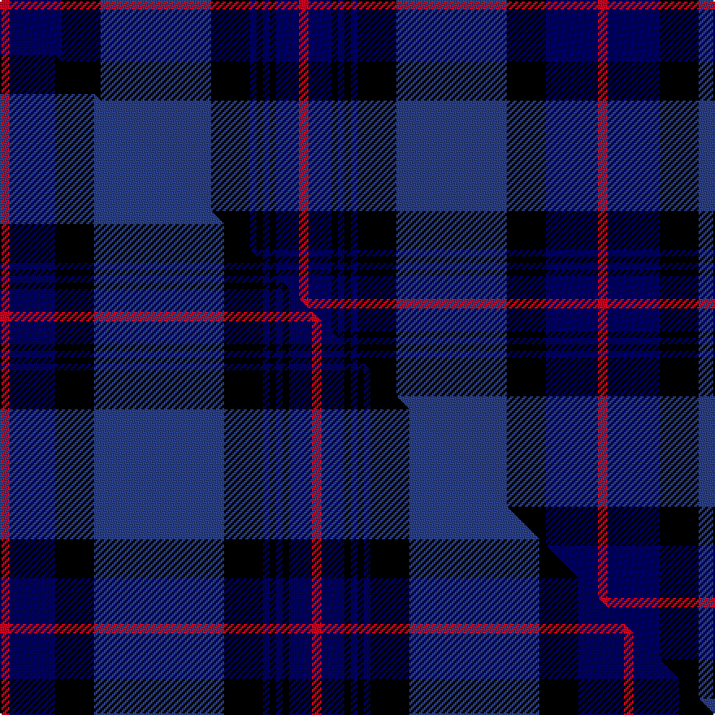

This page is one **sett** — a single exact thread-count. It belongs to the [tartan](/setts/r3db16k12dbi34k12db2k2db2k2db7r3/)
(the same proportion at any scale), whose colour order is pattern [RBKBKBKBKBR](/stripes/rbkbkbkbkbr/).

Part of the [Rangers Football Club](/tartans/rangers-football-club/) tartan — the named design grouping this sett with its other cloths.

Sourced from register-of-tartans.  It is a [11 stripe tartan](/stripes/stripes11/).

Original link https://www.tartanregister.gov.uk/tartanDetails.aspx?ref=3456

## Register references

External register numbers recorded for this tartan.

- Scottish Register of Tartans: [3456](https://www.tartanregister.gov.uk/tartanDetails.aspx?ref=3456)
- Scottish Tartans World Register: 2062

## Thread count
R/6 DB32 K24 DBi68 K24 DB4 K4 DB4 K4 DB14 R/6

One full sett is **368 threads**.

## Palette
<table><thead><tr><th>Colour</th><th>Shade</th><th>OKLCh</th></tr></thead><tbody><tr><td>DB</td><td><code style="background-color:#2C4084;">#2C4084</code> <small style="color:#888">#2C4084</small></td><td><small style="color:#888">oklch(39.4% 0.117 268.3)</small></td></tr><tr><td>DB</td><td><code style="background-color:#000064;">#000064</code> <small style="color:#888">#000064</small></td><td><small style="color:#888">oklch(22.7% 0.158 264.1)</small></td></tr><tr><td>K</td><td><code style="background-color:#000000;">#000000</code> <small style="color:#888">#000000</small></td><td><small style="color:#888">oklch(0.0% 0.000 0.0)</small></td></tr><tr><td>R</td><td><code style="background-color:#D60020;">#D60020</code> <small style="color:#888">#D60020</small></td><td><small style="color:#888">oklch(55.2% 0.224 25.5)</small></td></tr></tbody></table>

# Sample pattern

## Compared to the master

This cloth is one sett of its design; the master sett (the exemplar the design is anchored on) is below for comparison.

Its **ΔTartan distance** from the master is **0.54** — the same measure the nearest-tartans table ranks by (0 is identical; a re-scale of the same cloth is near 0, a recolour or a different proportion further).

<figure class="master-compare" style="margin:0">

this sett
master sett ★

<figcaption style="color:#888;font-size:smaller">One weave of this sett against the <a href="/setts/r3db14k12dbi40k12db2k2db2k2db7r3/">master sett ★</a>, split on the diagonal: a shared proportion runs seamlessly across it with only the shades shifting; a different proportion breaks on it.</figcaption>
</figure>

## Nearest tartan variants

The nearest existing variants by ΔTartan distance, with this cloth at the top so the swatches line up against it.

ΔTartan

Threads

Variant

Sett

—

368

<a href="/variants/s11/r3db16k12dbi34k12db2k2db2k2db7r3~x2~db0906265-dbi1605267/">Rangers Football Club</a>

<a href="/ttd/edit/#slug=r3db16k12t34k12db2k2db2k2db7r3~x2&amp;base=r3db16k12dbi34k12db2k2db2k2db7r3~x2~db0906265-dbi1605267" title="compare in the TTD">0.00</a>

368

<a href="/variants/s11/r3db16k12t34k12db2k2db2k2db7r3~x2/">Rangers 1989 (Sports)</a>

<a href="/ttd/edit/#slug=r3db14k12dbi40k12db2k2db2k2db7r3~x2~db0906265-dbi1605267&amp;base=r3db16k12dbi34k12db2k2db2k2db7r3~x2~db0906265-dbi1605267" title="compare in the TTD">0.19</a>

384

<a href="/variants/s11/r3db14k12dbi40k12db2k2db2k2db7r3~x2~db0906265-dbi1605267/">Rangers Football Club #2</a>

2.27

—

<a href="/variants/s11/k16db8k6db8k6db20k6db6k14dbi41r4~db0805267-dbi1604274/">Merchiston, Castle School</a>

2.27

—

<a href="/variants/s11/k16db8k6db8k6db20k6db6k14dbi41r4~db1204274-dbi1406275/">Merchiston Castle School Corporate Tartan</a>

<a href="/ttd/edit/#slug=k5dbi26k2dbi4k2dbi26k3lr36k3db30k3t2~k0700000-dbi0806265-lr2800000-t2503227&amp;base=r3db16k12dbi34k12db2k2db2k2db7r3~x2~db0906265-dbi1605267" title="compare in the TTD">2.84</a>

277

<a href="/variants/s12/k5dbi26k2dbi4k2dbi26k3lr36k3db30k3t2~k0700000-dbi0806265-lr2800000-t2503227/">Daniel (Welsh Name)</a>

<a href="/ttd/edit/#slug=k5db26k2db4k2db26k3lr36k3dbi30k3t2~db0806265-lr2800000-dbi1404245-t2503227&amp;base=r3db16k12dbi34k12db2k2db2k2db7r3~x2~db0906265-dbi1605267" title="compare in the TTD">2.84</a>

277

<a href="/variants/s12/k5db26k2db4k2db26k3lr36k3dbi30k3t2~db0806265-lr2800000-dbi1404245-t2503227/">Daniel Welsh Name Tartan</a>

## Neighbour map

Every grey dot is one of 13620 variants placed by the first two principal components of the ΔTartan feature space (42% of its variance). Red is this tartan; blue dots are its nearest — click one to open its page.

<svg viewBox="0 0 640 380" role="img" style="max-width:100%;height:auto;border:1px solid #e0e0e0;border-radius:4px;display:block" xmlns="http://www.w3.org/2000/svg"><image href="/nn/cloud.v1.png" width="640" height="380"/><a href="/variants/s11/r3db16k12t34k12db2k2db2k2db7r3~x2/"><circle cx="182.8" cy="137.7" r="4" fill="#3465a4"><title>Rangers 1989 (Sports)</title></circle></a><a href="/variants/s11/r3db14k12dbi40k12db2k2db2k2db7r3~x2~db0906265-dbi1605267/"><circle cx="251.0" cy="133.1" r="4" fill="#3465a4"><title>Rangers Football Club #2</title></circle></a><a href="/variants/s11/k16db8k6db8k6db20k6db6k14dbi41r4~db0805267-dbi1604274/"><circle cx="204.0" cy="185.1" r="4" fill="#3465a4"><title>Merchiston, Castle School</title></circle></a><a href="/variants/s11/k16db8k6db8k6db20k6db6k14dbi41r4~db1204274-dbi1406275/"><circle cx="216.6" cy="188.5" r="4" fill="#3465a4"><title>Merchiston Castle School Corporate Tartan</title></circle></a><a href="/variants/s12/k5dbi26k2dbi4k2dbi26k3lr36k3db30k3t2~k0700000-dbi0806265-lr2800000-t2503227/"><circle cx="194.6" cy="126.5" r="4" fill="#3465a4"><title>Daniel (Welsh Name)</title></circle></a><a href="/variants/s12/k5db26k2db4k2db26k3lr36k3dbi30k3t2~db0806265-lr2800000-dbi1404245-t2503227/"><circle cx="178.3" cy="120.9" r="4" fill="#3465a4"><title>Daniel Welsh Name Tartan</title></circle></a><circle cx="222.8" cy="147.3" r="5" fill="#c00000"/><text x="320" y="376" text-anchor="middle" font-size="11" fill="#999">ground</text><text x="11" y="190" text-anchor="middle" font-size="11" fill="#999" transform="rotate(-90 11 190)">complexity</text></svg>

ID: /variants/s11/r3db16k12dbi34k12db2k2db2k2db7r3~x2~db0906265-dbi1605267/
