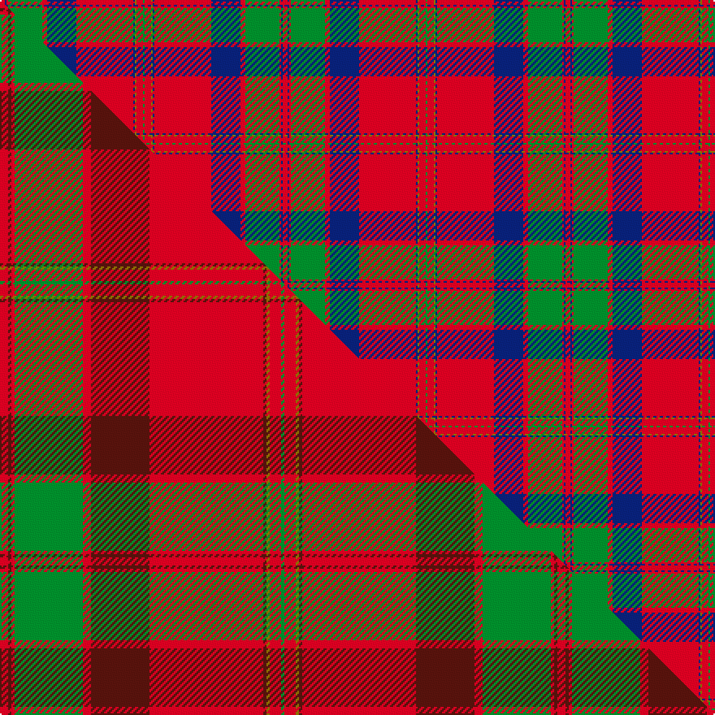

This is one **variant** — a specific cloth: this exact thread count and colourway, with its own
provenance below. It is one weaving of the [sett](/setts/r3db1r1g21r3db18r35db1y1r4g1/) (the scale-free proportion — the
same cloth at any scale or shade), whose colour order is pattern [GRGBRBRGRBR](/stripes/grgbrbrgrbr/).

Part of the [MacPherson Of Cluny](/tartans/macpherson-of-cluny/) tartan — the named design grouping this sett with its other cloths.

Sourced from weddslist.  It is a [11 stripe tartan](/stripes/stripes11/).

Original link [http://www.weddslist.com/cgi-bin/tartans/pg.pl?source=rb](http://www.weddslist.com/cgi-bin/tartans/pg.pl?source=rb)

Dataset <small>— provenance for this record, inherited from the source manifest</small>

<dl class="dataset-prov">
<dt>source</dt><dd><a href="/sources/weddslist/">Weddslist</a></dd>
<dt>data captured from</dt><dd><a href="https://github.com/thetartan/tartan-database/blob/master/data/weddslist/data.csv">https://github.com/thetartan/tartan-database/blob/master/data/weddslist/data.csv</a></dd>
<dt>data date</dt><dd>2016-11-17 <small>(dataset default)</small></dd>
<dt>licence</dt><dd><a href="https://creativecommons.org/licenses/by-nc-nd/4.0/">CC BY-NC-ND 4.0</a></dd>
</dl>

Capture chain <small>— the hands this data passed through, oldest first; each capture carries its own licence</small>

<ol class="capture-chain">
<li><a href="https://www.weddslist.com/tartans/">Weddslist</a> <small>the living privately compiled reference</small></li>
<li><a href="https://github.com/thetartan/tartan-database">thetartan/tartan-database</a> <small>2016-2017</small> · <a href="https://creativecommons.org/licenses/by-nc-nd/4.0/">CC BY-NC-ND 4.0</a> <small>Levko Kravets's frozen compilation — the capture we vendored, and where its CC licence text came from</small></li>
<li>this dictionary <small>captured 2026-06-10 · commit 5bf86c7566</small> <small>each re-capture is a git commit to data/sources</small></li>
</ol>

## Thread count
R/3 DB1 R1 G21 R3 DB18 R35 DB1 Y1 R4 G/1

One full sett is **174 threads**.

## Palette
<table><thead><tr><th>Colour</th><th>Shade</th><th>OKLCh</th></tr></thead><tbody><tr><td>G</td><td><code style="background-color:#008B2A;">#008B2A</code> <small style="color:#888">#008B2A</small></td><td><small style="color:#888">oklch(55.4% 0.170 145.9)</small></td></tr><tr><td>DB</td><td><code style="background-color:#082077;">#082077</code> <small style="color:#888">#082077</small></td><td><small style="color:#888">oklch(30.0% 0.149 265.1)</small></td></tr><tr><td>R</td><td><code style="background-color:#D60020;">#D60020</code> <small style="color:#888">#D60020</small></td><td><small style="color:#888">oklch(55.2% 0.224 25.5)</small></td></tr><tr><td>Y</td><td><code style="background-color:#8B6E00;">#8B6E00</code> <small style="color:#888">#8B6E00</small></td><td><small style="color:#888">oklch(55.1% 0.113 90.4)</small></td></tr></tbody></table>

# Sample pattern

## Compared to the master

This cloth is one sett of its design; the master sett (the exemplar the design is anchored on) is below for comparison.

Its **ΔTartan distance** from the master is **2.70** — the same measure the nearest-tartans table ranks by (0 is identical; a re-scale of the same cloth is near 0, a recolour or a different proportion further).

<figure class="master-compare" style="margin:0">

this sett
master sett ★

<figcaption style="color:#888;font-size:smaller">One weave of this sett against the <a href="/setts/r5dr2r2g42r5dr36r70dr2y2r7g2/">master sett ★</a>, split on the diagonal: a shared proportion runs seamlessly across it with only the shades shifting; a different proportion breaks on it.</figcaption>
</figure>

## Nearest tartan variants

The nearest existing variants by ΔTartan distance, with this cloth at the top so the swatches line up against it.

ΔTartan

Threads

Variant

Sett

—

174

<a href="/variants/s11/r3db1r1g21r3db18r35db1y1r4g1/">MacPherson Of Cluny</a>

<a href="/ttd/edit/#slug=r6w1r24db6g2db1g2db1g12r1~x2&amp;base=r3db1r1g21r3db18r35db1y1r4g1" title="compare in the TTD">1.87</a>

210

<a href="/variants/s10/r6w1r24db6g2db1g2db1g12r1~x2/">Chisholm</a>

<a href="/ttd/edit/#slug=r6w1r24db6g2db1g2db1g12r1&amp;base=r3db1r1g21r3db18r35db1y1r4g1" title="compare in the TTD">1.87</a>

105

<a href="/variants/s10/r6w1r24db6g2db1g2db1g12r1/">Chisholm D</a>

<a href="/ttd/edit/#slug=r6db1r2db2r28lb2r2db9r2g2r2g24r3db2r6db2~x2&amp;base=r3db1r1g21r3db18r35db1y1r4g1" title="compare in the TTD">1.91</a>

364

<a href="/variants/s16/r6db1r2db2r28lb2r2db9r2g2r2g24r3db2r6db2~x2/">Drummond Clan Tartan</a>

<a href="/ttd/edit/#slug=r28db12r3g20dp1g2dp1g2r7~x2&amp;base=r3db1r1g21r3db18r35db1y1r4g1" title="compare in the TTD">1.91</a>

234

<a href="/variants/s9/r28db12r3g20dp1g2dp1g2r7~x2/">Carrick (Clan)</a>

<a href="/ttd/edit/#slug=g2r2db1r24db6r3g12r4db1~x2&amp;base=r3db1r1g21r3db18r35db1y1r4g1" title="compare in the TTD">1.93</a>

214

<a href="/variants/s9/g2r2db1r24db6r3g12r4db1~x2/">MacDonald #7</a>

<a href="/ttd/edit/#slug=r28db12r3g20m1g2m1g2r7~x2&amp;base=r3db1r1g21r3db18r35db1y1r4g1" title="compare in the TTD">1.93</a>

234

<a href="/variants/s9/r28db12r3g20m1g2m1g2r7~x2/">Carrick</a>

<a href="/ttd/edit/#slug=r7db1r2db2r35lb2r2db10r2dg2r2dg37r3db2r6~x2~r2109032-db0906265-lb3203246-dg1405139&amp;base=r3db1r1g21r3db18r35db1y1r4g1" title="compare in the TTD">2.02</a>

434

<a href="/variants/s15/r7db1r2db2r35lb2r2db10r2dg2r2dg37r3db2r6~x2~r2109032-db0906265-lb3203246-dg1405139/">Drummond of Megginch - 1849 Kilt</a>

<a href="/ttd/edit/#slug=r60db2g24r8db2lb3db2&amp;base=r3db1r1g21r3db18r35db1y1r4g1" title="compare in the TTD">2.05</a>

140

<a href="/variants/s7/r60db2g24r8db2lb3db2/">Unidentified Cant #12</a>

<a href="/ttd/edit/#slug=r6db1r1g28r4db8w1r32g1r4g2~x2&amp;base=r3db1r1g21r3db18r35db1y1r4g1" title="compare in the TTD">2.07</a>

336

<a href="/variants/s11/r6db1r1g28r4db8w1r32g1r4g2~x2/">MacDonell of Keppoch (artefact)</a>

<a href="/ttd/edit/#slug=r6db2r2g24r2g2r2db8r2lb2r32db2r2db1r6~x2&amp;base=r3db1r1g21r3db18r35db1y1r4g1" title="compare in the TTD">2.09</a>

356

<a href="/variants/s15/r6db2r2g24r2g2r2db8r2lb2r32db2r2db1r6~x2/">Grant or Drummond Clan Tartan</a>

## Neighbour map

Every grey dot is one of 13621 variants placed by the first two principal components of the ΔTartan feature space (42% of its variance). Red is this tartan; blue dots are its nearest — click one to open its page.

<svg viewBox="0 0 640 380" role="img" style="max-width:100%;height:auto;border:1px solid #e0e0e0;border-radius:4px;display:block" xmlns="http://www.w3.org/2000/svg"><image href="/nn/cloud.v1.png" width="640" height="380"/><a href="/variants/s10/r6w1r24db6g2db1g2db1g12r1~x2/"><circle cx="346.5" cy="124.4" r="4" fill="#3465a4"><title>Chisholm</title></circle></a><a href="/variants/s10/r6w1r24db6g2db1g2db1g12r1/"><circle cx="346.5" cy="124.4" r="4" fill="#3465a4"><title>Chisholm D</title></circle></a><a href="/variants/s16/r6db1r2db2r28lb2r2db9r2g2r2g24r3db2r6db2~x2/"><circle cx="336.3" cy="98.8" r="4" fill="#3465a4"><title>Drummond Clan Tartan</title></circle></a><a href="/variants/s9/r28db12r3g20dp1g2dp1g2r7~x2/"><circle cx="319.4" cy="136.3" r="4" fill="#3465a4"><title>Carrick (Clan)</title></circle></a><a href="/variants/s9/g2r2db1r24db6r3g12r4db1~x2/"><circle cx="399.0" cy="148.7" r="4" fill="#3465a4"><title>MacDonald #7</title></circle></a><a href="/variants/s9/r28db12r3g20m1g2m1g2r7~x2/"><circle cx="321.1" cy="136.6" r="4" fill="#3465a4"><title>Carrick</title></circle></a><a href="/variants/s15/r7db1r2db2r35lb2r2db10r2dg2r2dg37r3db2r6~x2~r2109032-db0906265-lb3203246-dg1405139/"><circle cx="350.1" cy="84.4" r="4" fill="#3465a4"><title>Drummond of Megginch - 1849 Kilt</title></circle></a><a href="/variants/s7/r60db2g24r8db2lb3db2/"><circle cx="369.4" cy="107.2" r="4" fill="#3465a4"><title>Unidentified Cant #12</title></circle></a><a href="/variants/s11/r6db1r1g28r4db8w1r32g1r4g2~x2/"><circle cx="361.6" cy="111.0" r="4" fill="#3465a4"><title>MacDonell of Keppoch (artefact)</title></circle></a><a href="/variants/s15/r6db2r2g24r2g2r2db8r2lb2r32db2r2db1r6~x2/"><circle cx="364.8" cy="91.2" r="4" fill="#3465a4"><title>Grant or Drummond Clan Tartan</title></circle></a><circle cx="340.9" cy="104.1" r="5" fill="#c00000"/><text x="320" y="376" text-anchor="middle" font-size="11" fill="#999">ground</text><text x="11" y="190" text-anchor="middle" font-size="11" fill="#999" transform="rotate(-90 11 190)">complexity</text></svg>

ID: /variants/s11/r3db1r1g21r3db18r35db1y1r4g1/
