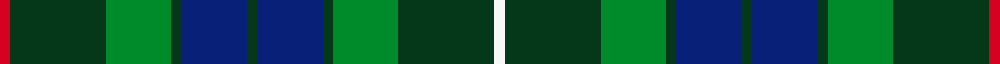

This page is one **sett** — a single exact thread-count. It belongs to the [tartan](/setts/r3dg28g19dg3db19dg3db19dg3g19dg28w3/)
(the same proportion at any scale), whose colour order is pattern [RGGGBGBGGGW](/stripes/rgggbgbgggw/).

Sourced from register-of-tartans.  It is a [11 stripe tartan](/stripes/stripes11/).

Original link https://www.tartanregister.gov.uk/tartanDetails.aspx?ref=328

## Provenance

Earliest known date: pre 2003 Previously marked 'Unidentified' in STS file. No explanation is given for the title which Paton has named as 'B.B. Special Tartan'. This tartan has recently been woven by MacNaughtons of Pitlochry as the result of a request by a unit of the Boys Brigade.

4 attestations — the source records this cloth was collapsed from (oldest owns this page)

<ul>
<li>01/01/2002 — Boys Brigade (register-of-tartans, <a href="https://www.tartanregister.gov.uk/tartanDetails.aspx?ref=328">record</a>)  <em>This tartan started life as an unidentified with a title of 'B B Special Tartan' given to it by Patons of Tillicoultry. The tartan has 'recently' been woven by the Macnaughtons Group of Pitlochry (now Perth) at a request from a Boys Brigade unit.</em></li>
<li>pre 2002 — Boys' Brigade (Corporate) (tartans-authority, <a href="http://www.tartansauthority.com/tartan-ferret/display/1466/">record</a>)  <em>This tartan started life as an unidentified with a title of "B.B. Special Tartan" given to it by Patons of Tillicoultry. The conventional meaning of BB in Scotland is 'Boys Brigade', an alternative to Scouts. The tartan has 'recently' been woven by the Macnaughtons Group of Pitlochry (now Perth) at a request from a Boys Brigade unit. No date or further details known.</em></li>
<li>undated — B.B., Special (weddslist, <a href="http://www.weddslist.com/cgi-bin/tartans/pg.pl?source=sts">record</a>) </li>
<li>undated — B.B. Special Corporate Tartan (house-of-tartan, <a href="http://www.house-of-tartan.scotland.net/house/TartanViewjs.asp?colr=Def&tnam=1466">record</a>) </li>
</ul>

## Register references

External register numbers recorded for this tartan.

- Scottish Register of Tartans: [328](https://www.tartanregister.gov.uk/tartanDetails.aspx?ref=328)
- Scottish Tartans Authority (ITI): 1466
- Scottish Tartans World Register: 1466

## Thread count
R/6 DG56 G38 DG6 DB38 DG6 DB38 DG6 G38 DG56 W/6

One full sett is **576 threads**.

## Palette
<table><thead><tr><th>Colour</th><th>Shade</th><th>OKLCh</th></tr></thead><tbody><tr><td>DB</td><td><code style="background-color:#082077;">#082077</code> <small style="color:#888">#082077</small></td><td><small style="color:#888">oklch(30.0% 0.149 265.1)</small></td></tr><tr><td>DG</td><td><code style="background-color:#053819;">#053819</code> <small style="color:#888">#053819</small></td><td><small style="color:#888">oklch(30.0% 0.075 151.3)</small></td></tr><tr><td>G</td><td><code style="background-color:#008B2A;">#008B2A</code> <small style="color:#888">#008B2A</small></td><td><small style="color:#888">oklch(55.4% 0.170 145.9)</small></td></tr><tr><td>R</td><td><code style="background-color:#D60020;">#D60020</code> <small style="color:#888">#D60020</small></td><td><small style="color:#888">oklch(55.2% 0.224 25.5)</small></td></tr><tr><td>W</td><td><code style="background-color:#F7F7F7;">#F7F7F7</code> <small style="color:#888">#F7F7F7</small></td><td><small style="color:#888">oklch(97.6% 0.000 89.9)</small></td></tr></tbody></table>

# Sample pattern

ID: /variants/s11/r3dg28g19dg3db19dg3db19dg3g19dg28w3~x2/
