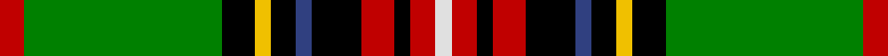

This page is one **sett** — a single exact thread-count. It belongs to the [tartan](/setts/r3g24k4ly2k3db2k6r4k2r3w2/)
(the same proportion at any scale), whose colour order is pattern [RGKYKBKRKRW](/stripes/rgkykbkrkrw/).

Part of the [King George](/tartans/king-george/) tartan — the named design grouping this sett with its other cloths.

Sourced from weddslist.  It is a [11 stripe tartan](/stripes/stripes11/).

Original link http://www.weddslist.com/cgi-bin/tartans/pg.pl?source=sts

## Provenance

Earliest known date: pre 2003 Reputed to be a tartan specifically woven for King Edward VII. In the possession of Miss K Roberts of Torquay.

## Also known as

This cloth is also recorded under:

- King George IV
- King George VI
- King George VI Royal

2 attestations — the source records this cloth was collapsed from (oldest owns this page)

<ul>
<li>undated — King George VI (weddslist, <a href="http://www.weddslist.com/cgi-bin/tartans/pg.pl?source=sts">record</a>)</li>
<li>undated — King George VI Royal Family Tartan (house-of-tartan, <a href="http://www.house-of-tartan.scotland.net/house/TartanViewjs.asp?colr=Def&tnam=1484">record</a>)</li>
</ul>

## Thread count
R/6 G48 K8 Y4 K6 B4 K12 R8 K4 R6 LN/4

One full sett is **210 threads**.

## Palette

Palette: <strong>Tartan Register</strong> <small style="color:#888">(2 of 6 colours)</small>
<table><thead><tr><th>Colour</th><th>Threads</th><th>Shade</th><th>Base</th><th>OKLCh</th></tr></thead><tbody><tr><td>R/</td><td style="text-align:right;font-variant-numeric:tabular-nums">6</td><td><code style="background-color:#C00000;">#C00000</code> <small style="color:#888">#C00000</small></td><td>R <code style="background-color:#CC0000;">#CC0000</code></td><td><small style="color:#888">oklch(50.7% 0.208 29.2)</small></td></tr><tr><td>G</td><td style="text-align:right;font-variant-numeric:tabular-nums">48</td><td><code style="background-color:#008000;">#008000</code> <small style="color:#888">#008000</small></td><td>G <code style="background-color:#006100;">#006100</code></td><td><small style="color:#888">oklch(52.0% 0.177 142.5)</small></td></tr><tr><td>K</td><td style="text-align:right;font-variant-numeric:tabular-nums">8</td><td><code style="background-color:#000000;">#000000</code> <small style="color:#888">#000000</small></td><td>K <code style="background-color:#000000;">#000000</code></td><td><small style="color:#888">oklch(0.0% 0.000 0.0)</small></td></tr><tr><td>Y</td><td style="text-align:right;font-variant-numeric:tabular-nums">4</td><td><code style="background-color:#F0C000;">#F0C000</code> <small style="color:#888">#F0C000</small></td><td>Y <code style="background-color:#F2BF00;">#F2BF00</code></td><td><small style="color:#888">oklch(82.7% 0.169 90.5)</small></td></tr><tr><td>K</td><td style="text-align:right;font-variant-numeric:tabular-nums">6</td><td><code style="background-color:#000000;">#000000</code> <small style="color:#888">#000000</small></td><td>K <code style="background-color:#000000;">#000000</code></td><td><small style="color:#888">oklch(0.0% 0.000 0.0)</small></td></tr><tr><td>B</td><td style="text-align:right;font-variant-numeric:tabular-nums">4</td><td><code style="background-color:#304080;">#304080</code> <small style="color:#888">#304080</small></td><td>B <code style="background-color:#2A418A;">#2A418A</code></td><td><small style="color:#888">oklch(39.4% 0.109 270.2)</small></td></tr><tr><td>K</td><td style="text-align:right;font-variant-numeric:tabular-nums">12</td><td><code style="background-color:#000000;">#000000</code> <small style="color:#888">#000000</small></td><td>K <code style="background-color:#000000;">#000000</code></td><td><small style="color:#888">oklch(0.0% 0.000 0.0)</small></td></tr><tr><td>R</td><td style="text-align:right;font-variant-numeric:tabular-nums">8</td><td><code style="background-color:#C00000;">#C00000</code> <small style="color:#888">#C00000</small></td><td>R <code style="background-color:#CC0000;">#CC0000</code></td><td><small style="color:#888">oklch(50.7% 0.208 29.2)</small></td></tr><tr><td>K</td><td style="text-align:right;font-variant-numeric:tabular-nums">4</td><td><code style="background-color:#000000;">#000000</code> <small style="color:#888">#000000</small></td><td>K <code style="background-color:#000000;">#000000</code></td><td><small style="color:#888">oklch(0.0% 0.000 0.0)</small></td></tr><tr><td>R</td><td style="text-align:right;font-variant-numeric:tabular-nums">6</td><td><code style="background-color:#C00000;">#C00000</code> <small style="color:#888">#C00000</small></td><td>R <code style="background-color:#CC0000;">#CC0000</code></td><td><small style="color:#888">oklch(50.7% 0.208 29.2)</small></td></tr><tr><td>LN/</td><td style="text-align:right;font-variant-numeric:tabular-nums">4</td><td><code style="background-color:#E0E0E0;">#E0E0E0</code> <small style="color:#888">#E0E0E0</small></td><td>W <code style="background-color:#F7F7F7;">#F7F7F7</code></td><td><small style="color:#888">oklch(90.7% 0.000 89.9)</small></td></tr></tbody></table>

## Compared to the master

This cloth is one sett of its design; the master sett (the exemplar the design is anchored on) is below for comparison.

<figure style="margin:0"><figcaption style="color:#888;font-size:smaller">this sett</figcaption></figure>
<figure style="margin:0"><figcaption style="color:#888;font-size:smaller"><a href="/setts/g42b3k8ly2k2w3k2g12r5k2r2w2/">master sett →</a></figcaption></figure>

## Nearest tartans

The nearest existing variants by ΔTartan distance, with this tartan at the top so the swatches line up against it.

ΔTartan

Tartan

Sett

—

<a href="/ttd/edit/#slug=r3g24k4ly2k3db2k6r4k2r3w2~x2">King George VI</a> <a class="nn-out" href="/variants/s11/r3g24k4ly2k3db2k6r4k2r3w2~x2/" title="open its dictionary page">↗</a>

0.49

<a href="/ttd/edit/#slug=k8r2k3ly2k2w3k2o10g26r2g3k2~x2&amp;base=r3g24k4ly2k3db2k6r4k2r3w2~x2">Tara, Murphy</a> <a class="nn-out" href="/variants/s12/k8r2k3ly2k2w3k2o10g26r2g3k2~x2/" title="open its dictionary page">↗</a>

0.83

<a href="/ttd/edit/#slug=ly16lo5k8lo8k68g46w8k8r8&amp;base=r3g24k4ly2k3db2k6r4k2r3w2~x2">Louth County Crest (Fashion)</a> <a class="nn-out" href="/variants/s9/ly16lo5k8lo8k68g46w8k8r8/" title="open its dictionary page">↗</a>

1.06

<a href="/ttd/edit/#slug=g12r2g2r5g16db3lr2k2lr3db6k20ly3~x2&amp;base=r3g24k4ly2k3db2k6r4k2r3w2~x2">Kelsey, William (Personal)</a> <a class="nn-out" href="/variants/s12/g12r2g2r5g16db3lr2k2lr3db6k20ly3~x2/" title="open its dictionary page">↗</a>

1.11

<a href="/ttd/edit/#slug=r3dg24k4ly2k3db2k6r4k2r3w2~x2&amp;base=r3g24k4ly2k3db2k6r4k2r3w2~x2">King George VI</a> <a class="nn-out" href="/variants/s11/r3dg24k4ly2k3db2k6r4k2r3w2~x2/" title="open its dictionary page">↗</a>

1.20

<a href="/ttd/edit/#slug=g1k1g14k2r3db3k6w1k1w1k1w1~x4&amp;base=r3g24k4ly2k3db2k6r4k2r3w2~x2">Murray-Hetherington (Personal) Name Tartan</a> <a class="nn-out" href="/variants/s12/g1k1g14k2r3db3k6w1k1w1k1w1~x4/" title="open its dictionary page">↗</a>

1.21

<a href="/ttd/edit/#slug=g1k1g14k2r3db3k6w1k1w1~x4&amp;base=r3g24k4ly2k3db2k6r4k2r3w2~x2">Murray-Hetherington (Personal)</a> <a class="nn-out" href="/variants/s10/g1k1g14k2r3db3k6w1k1w1~x4/" title="open its dictionary page">↗</a>

1.25

<a href="/ttd/edit/#slug=dg6g3dg24k2dg4k16o5dg2w4dg2g21dg2k2ly3~x2&amp;base=r3g24k4ly2k3db2k6r4k2r3w2~x2">Celtic F.C.</a> <a class="nn-out" href="/variants/s14/dg6g3dg24k2dg4k16o5dg2w4dg2g21dg2k2ly3~x2/" title="open its dictionary page">↗</a>

1.25

<a href="/ttd/edit/#slug=g32w2g2ly3g2w2g2k16t2db16w3~x2&amp;base=r3g24k4ly2k3db2k6r4k2r3w2~x2">MacKellar</a> <a class="nn-out" href="/variants/s11/g32w2g2ly3g2w2g2k16t2db16w3~x2/" title="open its dictionary page">↗</a>

1.26

<a href="/ttd/edit/#slug=k2ly2k24ly2k2ly2lo30w3g2r2~x2&amp;base=r3g24k4ly2k3db2k6r4k2r3w2~x2">Spotsylvania County Sheriff's Office</a> <a class="nn-out" href="/variants/s10/k2ly2k24ly2k2ly2lo30w3g2r2~x2/" title="open its dictionary page">↗</a>

1.27

<a href="/ttd/edit/#slug=k8r2k3ly2k2w3k2dy10g26r2g3k2~x2&amp;base=r3g24k4ly2k3db2k6r4k2r3w2~x2">Tara Murphy Irish Family Tartan</a> <a class="nn-out" href="/variants/s12/k8r2k3ly2k2w3k2dy10g26r2g3k2~x2/" title="open its dictionary page">↗</a>

## Neighbour map

Every grey dot is one of 14360 variants placed by the first two principal components of the ΔTartan feature space (44% of its variance). Red is this tartan; blue dots are its nearest — click one to open its page.

<svg viewBox="0 0 640 380" role="img" style="max-width:100%;height:auto;border:1px solid #e0e0e0;border-radius:4px;display:block" xmlns="http://www.w3.org/2000/svg"><image href="/nn/cloud.v1.png" width="640" height="380"/><a href="/variants/s12/k8r2k3ly2k2w3k2o10g26r2g3k2~x2/"><circle cx="173.8" cy="103.1" r="4" fill="#3465a4"><title>Tara, Murphy</title></circle></a><a href="/variants/s9/ly16lo5k8lo8k68g46w8k8r8/"><circle cx="197.5" cy="124.9" r="4" fill="#3465a4"><title>Louth County Crest (Fashion)</title></circle></a><a href="/variants/s12/g12r2g2r5g16db3lr2k2lr3db6k20ly3~x2/"><circle cx="113.0" cy="128.2" r="4" fill="#3465a4"><title>Kelsey, William (Personal)</title></circle></a><a href="/variants/s11/r3dg24k4ly2k3db2k6r4k2r3w2~x2/"><circle cx="198.4" cy="118.3" r="4" fill="#3465a4"><title>King George VI</title></circle></a><a href="/variants/s12/g1k1g14k2r3db3k6w1k1w1k1w1~x4/"><circle cx="188.0" cy="112.9" r="4" fill="#3465a4"><title>Murray-Hetherington (Personal) Name Tartan</title></circle></a><a href="/variants/s10/g1k1g14k2r3db3k6w1k1w1~x4/"><circle cx="204.2" cy="127.5" r="4" fill="#3465a4"><title>Murray-Hetherington (Personal)</title></circle></a><a href="/variants/s14/dg6g3dg24k2dg4k16o5dg2w4dg2g21dg2k2ly3~x2/"><circle cx="154.9" cy="122.4" r="4" fill="#3465a4"><title>Celtic F.C.</title></circle></a><a href="/variants/s11/g32w2g2ly3g2w2g2k16t2db16w3~x2/"><circle cx="186.3" cy="100.1" r="4" fill="#3465a4"><title>MacKellar</title></circle></a><a href="/variants/s10/k2ly2k24ly2k2ly2lo30w3g2r2~x2/"><circle cx="209.6" cy="90.2" r="4" fill="#3465a4"><title>Spotsylvania County Sheriff's Office</title></circle></a><a href="/variants/s12/k8r2k3ly2k2w3k2dy10g26r2g3k2~x2/"><circle cx="207.4" cy="119.1" r="4" fill="#3465a4"><title>Tara Murphy Irish Family Tartan</title></circle></a><circle cx="170.6" cy="107.5" r="5" fill="#c00000"/></svg>

ID: /variants/s11/r3g24k4ly2k3db2k6r4k2r3w2~x2/
