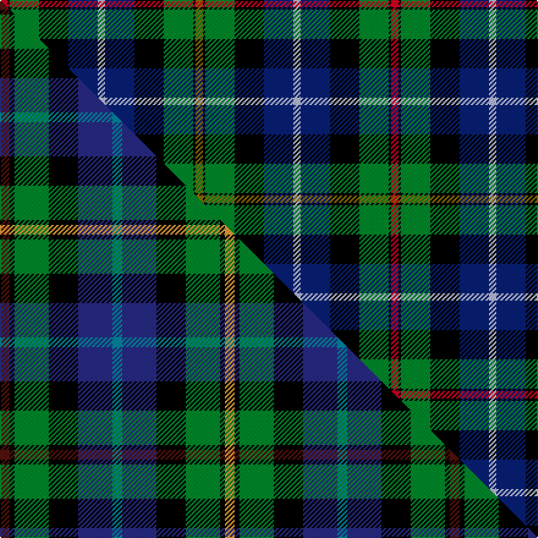

This page is one **sett** — a single exact thread-count. It belongs to the [tartan](/setts/r3k1g12k12db12lb3db12k12g12k1y3/)
(the same proportion at any scale), whose colour order is pattern [GKGKBWBKGKR](/stripes/gkgkbwbkgkr/).

Part of the [Smith](/tartans/smith/) tartan — the named design grouping this sett with its other cloths.

Sourced from weddslist.  It is a [11 stripe tartan](/stripes/stripes11/).

Original link http://www.weddslist.com/cgi-bin/tartans/pg.pl?source=sts

## Provenance

Earliest known date: pre 2003 This is Gow Hunting tartan with the dark blue stripe changed to azure. Gow is the Gaelic form of Smith meaning metal worker or armourer. There is an alternative Smith sett designed for Smith of Pennylands, the founder of the Boys Brigade.

2 attestations — the source records this cloth was collapsed from (oldest owns this page)

<ul>
<li>undated — Smith (weddslist, <a href="http://www.weddslist.com/cgi-bin/tartans/pg.pl?source=sts">record</a>) </li>
<li>undated — Smith Family Tartan (house-of-tartan, <a href="http://www.house-of-tartan.scotland.net/house/TartanViewjs.asp?colr=Def&tnam=488">record</a>) </li>
</ul>

## Thread count
R/6 K2 G24 K24 DB24 LB6 DB24 K24 G24 K2 Y/6

One full sett is **320 threads**.

## Palette
<table><thead><tr><th>Colour</th><th>Shade</th><th>OKLCh</th></tr></thead><tbody><tr><td>DB</td><td><code style="background-color:#082077;">#082077</code> <small style="color:#888">#082077</small></td><td><small style="color:#888">oklch(30.0% 0.149 265.1)</small></td></tr><tr><td>LB</td><td><code style="background-color:#B5BBDE;">#B5BBDE</code> <small style="color:#888">#B5BBDE</small></td><td><small style="color:#888">oklch(79.9% 0.050 277.6)</small></td></tr><tr><td>G</td><td><code style="background-color:#008B2A;">#008B2A</code> <small style="color:#888">#008B2A</small></td><td><small style="color:#888">oklch(55.4% 0.170 145.9)</small></td></tr><tr><td>K</td><td><code style="background-color:#000000;">#000000</code> <small style="color:#888">#000000</small></td><td><small style="color:#888">oklch(0.0% 0.000 0.0)</small></td></tr><tr><td>R</td><td><code style="background-color:#D60020;">#D60020</code> <small style="color:#888">#D60020</small></td><td><small style="color:#888">oklch(55.2% 0.224 25.5)</small></td></tr><tr><td>Y</td><td><code style="background-color:#8B6E00;">#8B6E00</code> <small style="color:#888">#8B6E00</small></td><td><small style="color:#888">oklch(55.1% 0.113 90.4)</small></td></tr></tbody></table>

# Sample pattern

## Compared to the master

This cloth is one sett of its design; the master sett (the exemplar the design is anchored on) is below for comparison.

Its **ΔTartan distance** from the master is **0.90** — the same measure the nearest-tartans table ranks by (0 is identical; a re-scale of the same cloth is near 0, a recolour or a different proportion further).

<figure class="master-compare" style="margin:0">

this sett
master sett ★

<figcaption style="color:#888;font-size:smaller">One weave of this sett against the <a href="/setts/dr2k1g7k6db7t2db7k6g7k1lo2/">master sett ★</a>, split on the diagonal: a shared proportion runs seamlessly across it with only the shades shifting; a different proportion breaks on it.</figcaption>
</figure>

## Nearest variants

The nearest existing variants by ΔTartan distance, with this cloth at the top so the swatches line up against it.

ΔTartan

Threads

Variant

Sett

—

320

<a href="/variants/s11/r3k1g12k12db12lb3db12k12g12k1y3~x2/">Smith</a>

<a href="/ttd/edit/#slug=dr2k1g7k6db7t2db7k6g7k1lo2~x4&amp;base=r3k1g12k12db12lb3db12k12g12k1y3~x2" title="compare in the TTD">0.79</a>

368

<a href="/variants/s11/dr2k1g7k6db7t2db7k6g7k1lo2~x4/">Smith (Clan)</a>

<a href="/ttd/edit/#slug=r3k1g12k12dbi12db3dbi12k12g12k1y3~x2~dbi1605267-db0804274&amp;base=r3k1g12k12db12lb3db12k12g12k1y3~x2" title="compare in the TTD">2.31</a>

320

<a href="/variants/s11/r3k1g12k12dbi12db3dbi12k12g12k1y3~x2~dbi1605267-db0804274/">Gow Hunting</a>

2.31

—

<a href="/variants/s11/r3k1g12k12dbi12db3dbi12k12g12k1y3~x2~dbi1406275-db1204274/">Gow Hunting (Clan)</a>

2.31

—

<a href="/variants/s11/r3k1g12k12dbi12db3dbi12k12g12k1y3~x2~dbi1604274-db0805267/">Gow, hunting</a>

<a href="/ttd/edit/#slug=r2db10k10g10w1k4w1g10k10db10r1~x4&amp;base=r3k1g12k12db12lb3db12k12g12k1y3~x2" title="compare in the TTD">2.79</a>

540

<a href="/variants/s11/r2db10k10g10w1k4w1g10k10db10r1~x4/">Rose</a>

<a href="/ttd/edit/#slug=lr3k15db10o10k1g5k1y10k10g8k1db2~x2&amp;base=r3k1g12k12db12lb3db12k12g12k1y3~x2" title="compare in the TTD">2.82</a>

294

<a href="/variants/s12/lr3k15db10o10k1g5k1y10k10g8k1db2~x2/">Blue Castlefield</a>

<a href="/ttd/edit/#slug=k8r1db8w1db8r1k8g8k1g8~x2&amp;base=r3k1g12k12db12lb3db12k12g12k1y3~x2" title="compare in the TTD">2.89</a>

176

<a href="/variants/s10/k8r1db8w1db8r1k8g8k1g8~x2/">Hunter</a>

<a href="/ttd/edit/#slug=db17dr2k16g17k2g17k16dr2db17lr2~x2&amp;base=r3k1g12k12db12lb3db12k12g12k1y3~x2" title="compare in the TTD">2.90</a>

394

<a href="/variants/s10/db17dr2k16g17k2g17k16dr2db17lr2~x2/">Mitchell</a>

<a href="/ttd/edit/#slug=ly4k1db12k12g12k1r4k1g12k12db12k1ly2~x4&amp;base=r3k1g12k12db12lb3db12k12g12k1y3~x2" title="compare in the TTD">2.95</a>

664

<a href="/variants/s13/ly4k1db12k12g12k1r4k1g12k12db12k1ly2~x4/">MacLeod</a>

## Neighbour map

Every grey dot is one of 13620 variants placed by the first two principal components of the ΔTartan feature space (42% of its variance). Red is this tartan; blue dots are its nearest — click one to open its page.

<svg viewBox="0 0 640 380" role="img" style="max-width:100%;height:auto;border:1px solid #e0e0e0;border-radius:4px;display:block" xmlns="http://www.w3.org/2000/svg"><image href="/nn/cloud.v1.png" width="640" height="380"/><a href="/variants/s11/dr2k1g7k6db7t2db7k6g7k1lo2~x4/"><circle cx="45.7" cy="186.3" r="4" fill="#3465a4"><title>Smith (Clan)</title></circle></a><a href="/variants/s11/r3k1g12k12dbi12db3dbi12k12g12k1y3~x2~dbi1605267-db0804274/"><circle cx="78.8" cy="157.8" r="4" fill="#3465a4"><title>Gow Hunting</title></circle></a><a href="/variants/s11/r3k1g12k12dbi12db3dbi12k12g12k1y3~x2~dbi1406275-db1204274/"><circle cx="79.4" cy="157.2" r="4" fill="#3465a4"><title>Gow Hunting (Clan)</title></circle></a><a href="/variants/s11/r3k1g12k12dbi12db3dbi12k12g12k1y3~x2~dbi1604274-db0805267/"><circle cx="79.0" cy="157.8" r="4" fill="#3465a4"><title>Gow, hunting</title></circle></a><a href="/variants/s11/r2db10k10g10w1k4w1g10k10db10r1~x4/"><circle cx="103.7" cy="176.0" r="4" fill="#3465a4"><title>Rose</title></circle></a><a href="/variants/s12/lr3k15db10o10k1g5k1y10k10g8k1db2~x2/"><circle cx="83.8" cy="133.4" r="4" fill="#3465a4"><title>Blue Castlefield</title></circle></a><a href="/variants/s10/k8r1db8w1db8r1k8g8k1g8~x2/"><circle cx="93.4" cy="187.4" r="4" fill="#3465a4"><title>Hunter</title></circle></a><a href="/variants/s10/db17dr2k16g17k2g17k16dr2db17lr2~x2/"><circle cx="99.8" cy="188.0" r="4" fill="#3465a4"><title>Mitchell</title></circle></a><a href="/variants/s13/ly4k1db12k12g12k1r4k1g12k12db12k1ly2~x4/"><circle cx="91.6" cy="148.6" r="4" fill="#3465a4"><title>MacLeod</title></circle></a><circle cx="72.5" cy="155.9" r="5" fill="#c00000"/><text x="320" y="376" text-anchor="middle" font-size="11" fill="#999">ground</text><text x="11" y="190" text-anchor="middle" font-size="11" fill="#999" transform="rotate(-90 11 190)">complexity</text></svg>

ID: /variants/s11/r3k1g12k12db12lb3db12k12g12k1y3~x2/
