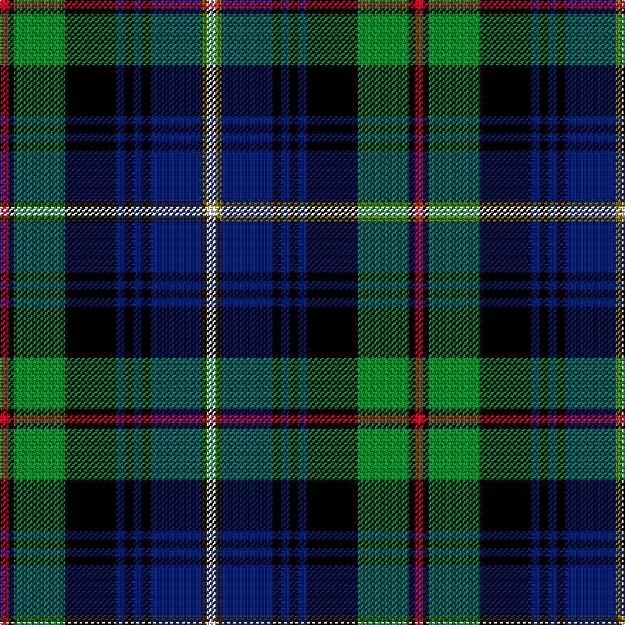

This is one **variant** — a specific cloth: this exact thread count and colourway, with its own
provenance below. It is one weaving of the [sett](/setts/r3k2g18k18db3k3db3k3db18y2w3/) (the scale-free proportion — the
same cloth at any scale or shade), whose colour order is pattern [RKGKBKBKBGW](/stripes/rkgkbkbkbgw/).

Part of the [Tindal](/tartans/tindal/) tartan — the named design grouping this sett with its other cloths.

Sourced from weddslist.  It is a [11 stripe tartan](/stripes/stripes11/).

Original link [http://www.weddslist.com/cgi-bin/tartans/pg.pl?source=sts](http://www.weddslist.com/cgi-bin/tartans/pg.pl?source=sts)

Dataset <small>— provenance for this record, inherited from the source manifest</small>

<dl class="dataset-prov">
<dt>source</dt><dd><a href="/sources/weddslist/">Weddslist</a></dd>
<dt>data captured from</dt><dd><a href="https://github.com/thetartan/tartan-database/blob/master/data/weddslist/data.csv">https://github.com/thetartan/tartan-database/blob/master/data/weddslist/data.csv</a></dd>
<dt>data date</dt><dd>2016-11-17 <small>(dataset default)</small></dd>
<dt>licence</dt><dd><a href="https://creativecommons.org/licenses/by-nc-nd/4.0/">CC BY-NC-ND 4.0</a></dd>
</dl>

Capture chain <small>— the hands this data passed through, oldest first; each capture carries its own licence</small>

<ol class="capture-chain">
<li><a href="https://www.weddslist.com/tartans/">Weddslist</a> <small>the living privately compiled reference</small></li>
<li><a href="https://github.com/thetartan/tartan-database">thetartan/tartan-database</a> <small>2016-2017</small> · <a href="https://creativecommons.org/licenses/by-nc-nd/4.0/">CC BY-NC-ND 4.0</a> <small>Levko Kravets's frozen compilation — the capture we vendored, and where its CC licence text came from</small></li>
<li>this dictionary <small>captured 2026-06-10 · commit 5bf86c7566</small> <small>each re-capture is a git commit to data/sources</small></li>
</ol>

## Thread count
R/6 K4 G36 K36 DB6 K6 DB6 K6 DB36 Y4 W/6

One full sett is **292 threads**.

## Palette
<table><thead><tr><th>Colour</th><th>Shade</th><th>OKLCh</th></tr></thead><tbody><tr><td>DB</td><td><code style="background-color:#082077;">#082077</code> <small style="color:#888">#082077</small></td><td><small style="color:#888">oklch(30.0% 0.149 265.1)</small></td></tr><tr><td>G</td><td><code style="background-color:#008B2A;">#008B2A</code> <small style="color:#888">#008B2A</small></td><td><small style="color:#888">oklch(55.4% 0.170 145.9)</small></td></tr><tr><td>K</td><td><code style="background-color:#000000;">#000000</code> <small style="color:#888">#000000</small></td><td><small style="color:#888">oklch(0.0% 0.000 0.0)</small></td></tr><tr><td>W</td><td><code style="background-color:#F7F7F7;">#F7F7F7</code> <small style="color:#888">#F7F7F7</small></td><td><small style="color:#888">oklch(97.6% 0.000 89.9)</small></td></tr><tr><td>R</td><td><code style="background-color:#D60020;">#D60020</code> <small style="color:#888">#D60020</small></td><td><small style="color:#888">oklch(55.2% 0.224 25.5)</small></td></tr><tr><td>Y</td><td><code style="background-color:#8B6E00;">#8B6E00</code> <small style="color:#888">#8B6E00</small></td><td><small style="color:#888">oklch(55.1% 0.113 90.4)</small></td></tr></tbody></table>

# Sample pattern

## Compared to the master

This cloth is one sett of its design; the master sett (the exemplar the design is anchored on) is below for comparison.

Its **ΔTartan distance** from the master is **0.02** — the same measure the nearest-tartans table ranks by (0 is identical; a re-scale of the same cloth is near 0, a recolour or a different proportion further).

<figure class="master-compare" style="margin:0">

this sett
master sett ★

<figcaption style="color:#888;font-size:smaller">One weave of this sett against the <a href="/setts/r3k2g18k18db3k3db3k3db18dy2w3/">master sett ★</a>, split on the diagonal: a shared proportion runs seamlessly across it with only the shades shifting; a different proportion breaks on it.</figcaption>
</figure>

## Nearest tartan variants

The nearest existing variants by ΔTartan distance, with this cloth at the top so the swatches line up against it.

ΔTartan

Threads

Variant

Sett

—

292

<a href="/variants/s11/r3k2g18k18db3k3db3k3db18y2w3~x2/">Tindal</a>

<a href="/ttd/edit/#slug=r3k2g18k18db3k3db3k3db18dy2w3~x2&amp;base=r3k2g18k18db3k3db3k3db18y2w3~x2" title="compare in the TTD">0.02</a>

292

<a href="/variants/s11/r3k2g18k18db3k3db3k3db18dy2w3~x2/">Tindal</a>

<a href="/ttd/edit/#slug=db10w5db48k35g5k5g35r5g5dp5&amp;base=r3k2g18k18db3k3db3k3db18y2w3~x2" title="compare in the TTD">1.00</a>

301

<a href="/variants/s10/db10w5db48k35g5k5g35r5g5dp5/">Big Rory (Corporate)</a>

<a href="/ttd/edit/#slug=r3db3k2db18ly2k25g20r2g3lb3~x2&amp;base=r3k2g18k18db3k3db3k3db18y2w3~x2" title="compare in the TTD">1.42</a>

312

<a href="/variants/s10/r3db3k2db18ly2k25g20r2g3lb3~x2/">Loch Freuchie (District)</a>

<a href="/ttd/edit/#slug=r1g3t1g5k1g1k9db12w1~x4~t2402222-db1004274&amp;base=r3k2g18k18db3k3db3k3db18y2w3~x2" title="compare in the TTD">1.45</a>

264

<a href="/variants/s9/r1g3t1g5k1g1k9db12w1~x4~t2402222-db1004274/">St Andrews Golf Club</a>

<a href="/ttd/edit/#slug=y3k2r3db20k24g20r3k2lb3~x2&amp;base=r3k2g18k18db3k3db3k3db18y2w3~x2" title="compare in the TTD">1.52</a>

308

<a href="/variants/s9/y3k2r3db20k24g20r3k2lb3~x2/">Loch Awe</a>

<a href="/ttd/edit/#slug=o4k7o2db25k19w2g13k2y3~x2&amp;base=r3k2g18k18db3k3db3k3db18y2w3~x2" title="compare in the TTD">1.55</a>

294

<a href="/variants/s9/o4k7o2db25k19w2g13k2y3~x2/">Leung (Personal)</a>

<a href="/ttd/edit/#slug=ly3k2r3db20k24g20r3k2lb3~x2&amp;base=r3k2g18k18db3k3db3k3db18y2w3~x2" title="compare in the TTD">1.56</a>

308

<a href="/variants/s9/ly3k2r3db20k24g20r3k2lb3~x2/">Loch Awe</a>

<a href="/ttd/edit/#slug=r3db3k2db13y2k25g20r2g3lb3~x2&amp;base=r3k2g18k18db3k3db3k3db18y2w3~x2" title="compare in the TTD">1.62</a>

292

<a href="/variants/s10/r3db3k2db13y2k25g20r2g3lb3~x2/">Loch Freuchie</a>

<a href="/ttd/edit/#slug=r3db3k2db13k27g20r2g3lb3~x2&amp;base=r3k2g18k18db3k3db3k3db18y2w3~x2" title="compare in the TTD">1.66</a>

292

<a href="/variants/s9/r3db3k2db13k27g20r2g3lb3~x2/">Loch Freuchie District Tartan</a>

<a href="/ttd/edit/#slug=w4k8db2lb2db4g16y2k15db6lb2k3lb4~x2&amp;base=r3k2g18k18db3k3db3k3db18y2w3~x2" title="compare in the TTD">1.85</a>

256

<a href="/variants/s12/w4k8db2lb2db4g16y2k15db6lb2k3lb4~x2/">Veere</a>

## Neighbour map

Every grey dot is one of 13621 variants placed by the first two principal components of the ΔTartan feature space (42% of its variance). Red is this tartan; blue dots are its nearest — click one to open its page.

<svg viewBox="0 0 640 380" role="img" style="max-width:100%;height:auto;border:1px solid #e0e0e0;border-radius:4px;display:block" xmlns="http://www.w3.org/2000/svg"><image href="/nn/cloud.v1.png" width="640" height="380"/><a href="/variants/s11/r3k2g18k18db3k3db3k3db18dy2w3~x2/"><circle cx="97.6" cy="136.0" r="4" fill="#3465a4"><title>Tindal</title></circle></a><a href="/variants/s10/db10w5db48k35g5k5g35r5g5dp5/"><circle cx="117.0" cy="138.1" r="4" fill="#3465a4"><title>Big Rory (Corporate)</title></circle></a><a href="/variants/s10/r3db3k2db18ly2k25g20r2g3lb3~x2/"><circle cx="106.6" cy="122.6" r="4" fill="#3465a4"><title>Loch Freuchie (District)</title></circle></a><a href="/variants/s9/r1g3t1g5k1g1k9db12w1~x4~t2402222-db1004274/"><circle cx="124.5" cy="132.1" r="4" fill="#3465a4"><title>St Andrews Golf Club</title></circle></a><a href="/variants/s9/y3k2r3db20k24g20r3k2lb3~x2/"><circle cx="105.8" cy="130.1" r="4" fill="#3465a4"><title>Loch Awe</title></circle></a><a href="/variants/s9/o4k7o2db25k19w2g13k2y3~x2/"><circle cx="117.7" cy="133.7" r="4" fill="#3465a4"><title>Leung (Personal)</title></circle></a><a href="/variants/s9/ly3k2r3db20k24g20r3k2lb3~x2/"><circle cx="101.9" cy="129.0" r="4" fill="#3465a4"><title>Loch Awe</title></circle></a><a href="/variants/s10/r3db3k2db13y2k25g20r2g3lb3~x2/"><circle cx="115.2" cy="121.5" r="4" fill="#3465a4"><title>Loch Freuchie</title></circle></a><a href="/variants/s9/r3db3k2db13k27g20r2g3lb3~x2/"><circle cx="108.8" cy="117.2" r="4" fill="#3465a4"><title>Loch Freuchie District Tartan</title></circle></a><a href="/variants/s12/w4k8db2lb2db4g16y2k15db6lb2k3lb4~x2/"><circle cx="73.3" cy="145.7" r="4" fill="#3465a4"><title>Veere</title></circle></a><circle cx="96.3" cy="135.6" r="5" fill="#c00000"/><text x="320" y="376" text-anchor="middle" font-size="11" fill="#999">ground</text><text x="11" y="190" text-anchor="middle" font-size="11" fill="#999" transform="rotate(-90 11 190)">complexity</text></svg>

ID: /variants/s11/r3k2g18k18db3k3db3k3db18y2w3~x2/
