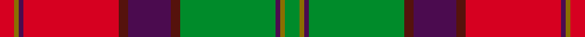

This is one **variant** — a specific cloth: this exact thread count and colourway, with its own
provenance below. It is one weaving of the [sett](/tartans/s/sc/scotland/) (the scale-free proportion — the
same cloth at any scale or shade), whose colour order is pattern [GGBGBBBRBGR](/stripes/ggbgbbbrbgr/).

Part of the [Scotland](/tartans/s/sc/scotland/) tartan — the named design grouping this sett with its other cloths.

Sourced from register-of-tartans.  It is a [11 stripe tartan](/stripes/stripes11/).

Original link [https://www.tartanregister.gov.uk/tartanDetails.aspx?ref=5067](https://www.tartanregister.gov.uk/tartanDetails.aspx?ref=5067)

Dataset <small>— provenance for this record, inherited from the source manifest</small>

<dl class="dataset-prov">
<dt>source</dt><dd><a href="/sources/register-of-tartans/">Scottish Register of Tartans</a></dd>
<dt>data captured from</dt><dd><a href="https://github.com/thetartan/tartan-database/blob/master/data/register-of-tartans/data.csv">https://github.com/thetartan/tartan-database/blob/master/data/register-of-tartans/data.csv</a></dd>
<dt>data date</dt><dd>01/09/2002 <small>(this record)</small></dd>
<dt>licence</dt><dd><a href="https://www.tartanregister.gov.uk/copyright">Crown copyright</a></dd>
</dl>

Capture chain <small>— the hands this data passed through, oldest first; each capture carries its own licence</small>

<ol class="capture-chain">
<li><a href="https://www.tartanregister.gov.uk/">Scottish Register of Tartans</a> · <a href="https://www.tartanregister.gov.uk/copyright">Crown copyright</a> <small>the living register — still published by National Records of Scotland</small></li>
<li><a href="https://github.com/thetartan/tartan-database">thetartan/tartan-database</a> <small>2016-2017</small> · <a href="https://creativecommons.org/licenses/by-nc-nd/4.0/">CC BY-NC-ND 4.0</a> <small>Levko Kravets's frozen compilation — the capture we vendored, and where its CC licence text came from</small></li>
<li>this dictionary <small>captured 2026-06-10 · commit 5bf86c7566</small> <small>each re-capture is a git commit to data/sources</small></li>
</ol>

## Register references

External register numbers recorded for this tartan.

- Scottish Register of Tartans: [5067](https://www.tartanregister.gov.uk/tartanDetails.aspx?ref=5067)
- Scottish Tartans Authority (ITI): 3115

## Thread count
R/6 Y2 DP2 R40 DR4 DP18 DR4 G40 DP2 Y2 G/6

One full sett is **240 threads**.

## Palette
<table><thead><tr><th>Colour</th><th>Shade</th><th>OKLCh</th></tr></thead><tbody><tr><td>DR</td><td><code style="background-color:#55120C;">#55120C</code> <small style="color:#888">#55120C</small></td><td><small style="color:#888">oklch(30.0% 0.099 29.3)</small></td></tr><tr><td>G</td><td><code style="background-color:#008B2A;">#008B2A</code> <small style="color:#888">#008B2A</small></td><td><small style="color:#888">oklch(55.4% 0.170 145.9)</small></td></tr><tr><td>DP</td><td><code style="background-color:#4B0B4F;">#4B0B4F</code> <small style="color:#888">#4B0B4F</small></td><td><small style="color:#888">oklch(30.1% 0.125 325.4)</small></td></tr><tr><td>R</td><td><code style="background-color:#D60020;">#D60020</code> <small style="color:#888">#D60020</small></td><td><small style="color:#888">oklch(55.2% 0.224 25.5)</small></td></tr><tr><td>Y</td><td><code style="background-color:#8B6E00;">#8B6E00</code> <small style="color:#888">#8B6E00</small></td><td><small style="color:#888">oklch(55.1% 0.113 90.4)</small></td></tr></tbody></table>

# Sample pattern

## Nearest tartan variants

The nearest existing variants by ΔTartan distance, with this cloth at the top so the swatches line up against it.

ΔTartan

Threads

Variant

Sett

—

240

<a href="/variants/s11/r3y1dp1r20dr2dp9dr2g20dp1y1g3~x2/">Scotland (Personal)</a>

<a href="/ttd/edit/#slug=ri3y1dp1ri20r2dp9r2g20dp1y1g3~x2~ri2108022-r1807033&amp;base=r3y1dp1r20dr2dp9dr2g20dp1y1g3~x2" title="compare in the TTD">0.05</a>

240

<a href="/variants/s11/ri3y1dp1ri20r2dp9r2g20dp1y1g3~x2~ri2108022-r1807033/">Scotland (Personal)</a>

<a href="/ttd/edit/#slug=dp1r1dp1r6g26dp14r20lb1r1lb1r2lr1~x2~r2109032-lr3303019&amp;base=r3y1dp1r20dr2dp9dr2g20dp1y1g3~x2" title="compare in the TTD">1.38</a>

296

<a href="/variants/s12/dp1r1dp1r6g26dp14r20lb1r1lb1r2lr1~x2~r2109032-lr3303019/">Scobie (Name)</a>

<a href="/ttd/edit/#slug=dy24r24w3g21y2r1y2dy6r2~x2&amp;base=r3y1dp1r20dr2dp9dr2g20dp1y1g3~x2" title="compare in the TTD">1.81</a>

288

<a href="/variants/s9/dy24r24w3g21y2r1y2dy6r2~x2/">Henry W.A. Canadian Tartan</a>

<a href="/ttd/edit/#slug=dg6y5w1dg2w1dg5w1dg2w1r15dp2w1~x2&amp;base=r3y1dp1r20dr2dp9dr2g20dp1y1g3~x2" title="compare in the TTD">2.46</a>

154

<a href="/variants/s12/dg6y5w1dg2w1dg5w1dg2w1r15dp2w1~x2/">Dunblane</a>

<a href="/ttd/edit/#slug=dg6y5w1dg2w1dg5w1dg2w1r15dp2w1~x4&amp;base=r3y1dp1r20dr2dp9dr2g20dp1y1g3~x2" title="compare in the TTD">2.46</a>

308

<a href="/variants/s12/dg6y5w1dg2w1dg5w1dg2w1r15dp2w1~x4/">Dunblane (District)</a>

<a href="/ttd/edit/#slug=g6y5w1g2w1g5w1g2w1r15db2w1~x2&amp;base=r3y1dp1r20dr2dp9dr2g20dp1y1g3~x2" title="compare in the TTD">2.57</a>

154

<a href="/variants/s12/g6y5w1g2w1g5w1g2w1r15db2w1~x2/">Dunblane District Tartan</a>

<a href="/ttd/edit/#slug=r22w1y7w1g21w1db12w1dr1w1r8~x2&amp;base=r3y1dp1r20dr2dp9dr2g20dp1y1g3~x2" title="compare in the TTD">2.61</a>

244

<a href="/variants/s11/r22w1y7w1g21w1db12w1dr1w1r8~x2/">Bendigo</a>

<a href="/ttd/edit/#slug=g25r2w2db2w2r13dy28db2r3~x2&amp;base=r3y1dp1r20dr2dp9dr2g20dp1y1g3~x2" title="compare in the TTD">2.64</a>

260

<a href="/variants/s9/g25r2w2db2w2r13dy28db2r3~x2/">Brousseau (Personal)</a>

<a href="/ttd/edit/#slug=w3dr20g2r5n2r4n2r2n4r1n20lb3~x2&amp;base=r3y1dp1r20dr2dp9dr2g20dp1y1g3~x2" title="compare in the TTD">2.72</a>

260

<a href="/variants/s12/w3dr20g2r5n2r4n2r2n4r1n20lb3~x2/">Ryutokukan High School</a>

<a href="/ttd/edit/#slug=r12dp2r4dp4r39lb2r4dp11r6g4r6g45r4dp4db10&amp;base=r3y1dp1r20dr2dp9dr2g20dp1y1g3~x2" title="compare in the TTD">2.73</a>

292

<a href="/variants/s15/r12dp2r4dp4r39lb2r4dp11r6g4r6g45r4dp4db10/">Grant or New Bruce Clan Tartan</a>

## Neighbour map

Every grey dot is one of 13656 variants placed by the first two principal components of the ΔTartan feature space (42% of its variance). Red is this tartan; blue dots are its nearest — click one to open its page. The map is a flat projection of a many-dimensional space — [how to read it](/posts/neighbourhood-maps/).

<svg viewBox="0 0 640 380" role="img" style="max-width:100%;height:auto;border:1px solid #e0e0e0;border-radius:4px;display:block" xmlns="http://www.w3.org/2000/svg"><image href="/nn/cloud.v1.png" width="640" height="380"/><a href="/variants/s11/ri3y1dp1ri20r2dp9r2g20dp1y1g3~x2~ri2108022-r1807033/"><circle cx="250.6" cy="129.4" r="4" fill="#3465a4"><title>Scotland (Personal)</title></circle></a><a href="/variants/s12/dp1r1dp1r6g26dp14r20lb1r1lb1r2lr1~x2~r2109032-lr3303019/"><circle cx="269.3" cy="106.4" r="4" fill="#3465a4"><title>Scobie (Name)</title></circle></a><a href="/variants/s9/dy24r24w3g21y2r1y2dy6r2~x2/"><circle cx="228.6" cy="141.7" r="4" fill="#3465a4"><title>Henry W.A. Canadian Tartan</title></circle></a><a href="/variants/s12/dg6y5w1dg2w1dg5w1dg2w1r15dp2w1~x2/"><circle cx="191.9" cy="135.1" r="4" fill="#3465a4"><title>Dunblane</title></circle></a><a href="/variants/s12/dg6y5w1dg2w1dg5w1dg2w1r15dp2w1~x4/"><circle cx="191.9" cy="135.1" r="4" fill="#3465a4"><title>Dunblane (District)</title></circle></a><a href="/variants/s12/g6y5w1g2w1g5w1g2w1r15db2w1~x2/"><circle cx="204.9" cy="144.3" r="4" fill="#3465a4"><title>Dunblane District Tartan</title></circle></a><a href="/variants/s11/r22w1y7w1g21w1db12w1dr1w1r8~x2/"><circle cx="198.9" cy="110.2" r="4" fill="#3465a4"><title>Bendigo</title></circle></a><a href="/variants/s9/g25r2w2db2w2r13dy28db2r3~x2/"><circle cx="202.8" cy="152.4" r="4" fill="#3465a4"><title>Brousseau (Personal)</title></circle></a><a href="/variants/s12/w3dr20g2r5n2r4n2r2n4r1n20lb3~x2/"><circle cx="246.7" cy="120.5" r="4" fill="#3465a4"><title>Ryutokukan High School</title></circle></a><a href="/variants/s15/r12dp2r4dp4r39lb2r4dp11r6g4r6g45r4dp4db10/"><circle cx="282.4" cy="105.2" r="4" fill="#3465a4"><title>Grant or New Bruce Clan Tartan</title></circle></a><circle cx="244.0" cy="128.2" r="5" fill="#c00000"/><text x="320" y="376" text-anchor="middle" font-size="11" fill="#999">ground</text><text x="11" y="190" text-anchor="middle" font-size="11" fill="#999" transform="rotate(-90 11 190)">complexity</text></svg>

ID: /variants/s11/r3y1dp1r20dr2dp9dr2g20dp1y1g3~x2/
