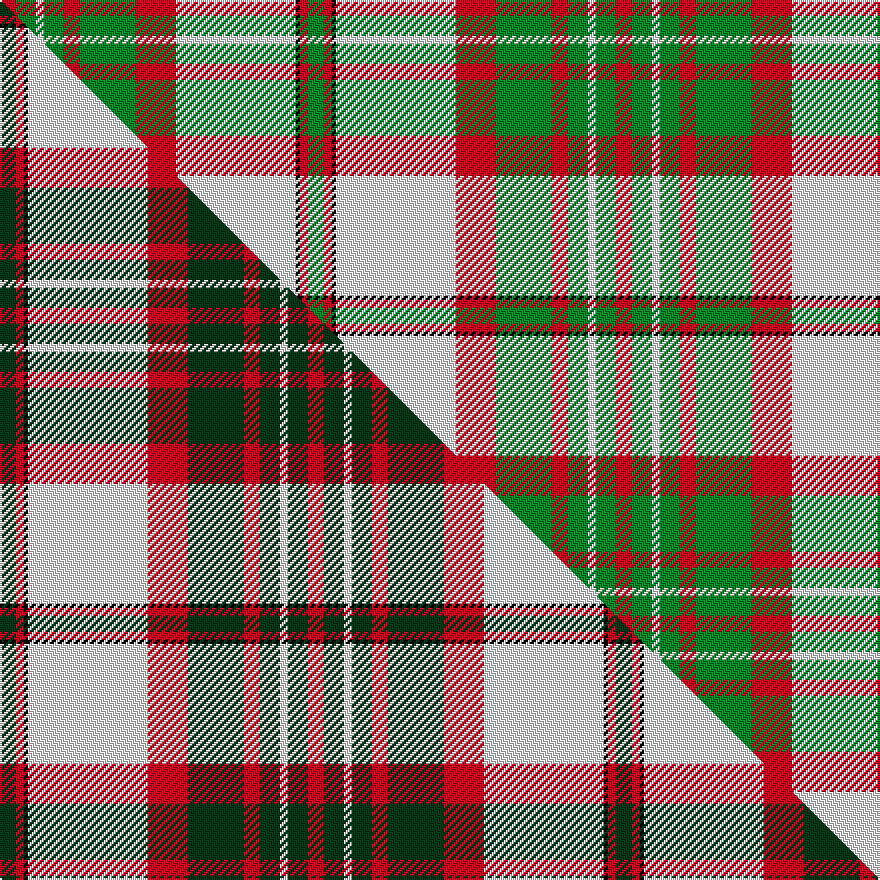

This is one **variant** — a specific cloth: this exact thread count and colourway, with its own
provenance below. It is one weaving of the [sett](/tartans/s/sc/scott-dress-2/) (the scale-free proportion — the
same cloth at any scale or shade), whose colour order is pattern [GRKWRGRGWGR](/stripes/grkwrgrgwgr/).

Part of the [Scott Dress](/tartans/s/sc/scott-dress-2/) tartan — the named design grouping this sett with its other cloths.

Sourced from house-of-tartan.  It is a [11 stripe tartan](/stripes/stripes11/).

Original link [http://www.house-of-tartan.scotland.net/house/TartanViewjs.asp?colr=Def&tnam=1006](http://www.house-of-tartan.scotland.net/house/TartanViewjs.asp?colr=Def&tnam=1006)

## Provenance

Earliest known date: pre 2003 Based on the 'Red' Scott from the Vestiarium Scoticum.

2 attestations — the source records this cloth was collapsed from (oldest owns this page)

<ul>
<li>pre 2003 — Scott Dress Tartan (house-of-tartan, <a href="http://www.house-of-tartan.scotland.net/house/TartanViewjs.asp?colr=Def&tnam=1006">record</a>) </li>
<li>undated — Scott, dress (weddslist, <a href="http://www.weddslist.com/cgi-bin/tartans/pg.pl?source=sts">record</a>) </li>
</ul>

Dataset <small>— provenance for this record, inherited from the source manifest</small>

<dl class="dataset-prov">
<dt>source</dt><dd><a href="/sources/house-of-tartan/">House of Tartan</a></dd>
<dt>data captured from</dt><dd><a href="https://github.com/thetartan/tartan-database/blob/master/data/house-of-tartan/data.csv">https://github.com/thetartan/tartan-database/blob/master/data/house-of-tartan/data.csv</a></dd>
<dt>data date</dt><dd>pre 2003 <small>(this record)</small></dd>
<dt>licence</dt><dd><a href="https://creativecommons.org/licenses/by-nc-nd/4.0/">CC BY-NC-ND 4.0</a></dd>
</dl>

Capture chain <small>— the hands this data passed through, oldest first; each capture carries its own licence</small>

<ol class="capture-chain">
<li><a href="http://www.house-of-tartan.scotland.net/">House of Tartan</a> <small>the weaver/retailer's database — the site is now offline; the URL is kept as the ultimate source's identity</small></li>
<li><a href="https://github.com/thetartan/tartan-database">thetartan/tartan-database</a> <small>2016-2017</small> · <a href="https://creativecommons.org/licenses/by-nc-nd/4.0/">CC BY-NC-ND 4.0</a> <small>Levko Kravets's frozen compilation — the capture we vendored, and where its CC licence text came from</small></li>
<li>this dictionary <small>captured 2026-06-10 · commit 5bf86c7566</small> <small>each re-capture is a git commit to data/sources</small></li>
</ol>

## Thread count
R/8 G10 W4 G10 R8 G28 R20 W60 K2 R4 G/8

One full sett is **308 threads**.

## Palette
<table><thead><tr><th>Colour</th><th>Shade</th><th>OKLCh</th></tr></thead><tbody><tr><td>G</td><td><code style="background-color:#008B2A;">#008B2A</code> <small style="color:#888">#008B2A</small></td><td><small style="color:#888">oklch(55.4% 0.170 145.9)</small></td></tr><tr><td>K</td><td><code style="background-color:#000000;">#000000</code> <small style="color:#888">#000000</small></td><td><small style="color:#888">oklch(0.0% 0.000 0.0)</small></td></tr><tr><td>W</td><td><code style="background-color:#F7F7F7;">#F7F7F7</code> <small style="color:#888">#F7F7F7</small></td><td><small style="color:#888">oklch(97.6% 0.000 89.9)</small></td></tr><tr><td>R</td><td><code style="background-color:#D60020;">#D60020</code> <small style="color:#888">#D60020</small></td><td><small style="color:#888">oklch(55.2% 0.224 25.5)</small></td></tr></tbody></table>

# Sample pattern

## Compared to the master

This cloth is one sett of its design; the master sett (the exemplar the design is anchored on) is below for comparison.

Its **ΔTartan distance** from the master is **0.15** — the same measure the nearest-tartans table ranks by (0 is identical; a re-scale of the same cloth is near 0, a recolour or a different proportion further).

<figure class="master-compare" style="margin:0">

this sett
master sett ★

<figcaption style="color:#888;font-size:smaller">One weave of this sett against the <a href="/setts/dg4r2k1w30r10dg14r4dg5w2dg5r4/">master sett ★</a>, split on the diagonal: a shared proportion runs seamlessly across it with only the shades shifting; a different proportion breaks on it.</figcaption>
</figure>

## Nearest tartan variants

The nearest existing variants by ΔTartan distance, with this cloth at the top so the swatches line up against it.

ΔTartan

Threads

Variant

Sett

—

308

<a href="/variants/s11/r4g5w2g5r4g14r10w30k1r2g4~x2/">Scott Dress Tartan</a>

<a href="/ttd/edit/#slug=dg4r2k1w30r10dg14r4dg5w2dg5r4~x2&amp;base=r4g5w2g5r4g14r10w30k1r2g4~x2" title="compare in the TTD">0.15</a>

308

<a href="/variants/s11/dg4r2k1w30r10dg14r4dg5w2dg5r4~x2/">Scott Dress</a>

<a href="/ttd/edit/#slug=g7r3k3w54g24r5g5w5g5r5~x2&amp;base=r4g5w2g5r4g14r10w30k1r2g4~x2" title="compare in the TTD">1.58</a>

440

<a href="/variants/s10/g7r3k3w54g24r5g5w5g5r5~x2/">Scott Dress #2</a>

<a href="/ttd/edit/#slug=g26r5k1r2k1r5g16r5w16g2w8~x2&amp;base=r4g5w2g5r4g14r10w30k1r2g4~x2" title="compare in the TTD">2.75</a>

280

<a href="/variants/s11/g26r5k1r2k1r5g16r5w16g2w8~x2/">Livingston (Personal)</a>

<a href="/ttd/edit/#slug=r6g3w22r5w5k9g16r4k1r4~x2&amp;base=r4g5w2g5r4g14r10w30k1r2g4~x2" title="compare in the TTD">3.07</a>

280

<a href="/variants/s10/r6g3w22r5w5k9g16r4k1r4~x2/">MacDuff Dress #3</a>

<a href="/ttd/edit/#slug=g3r12g12o5r1w25g2r1~x2&amp;base=r4g5w2g5r4g14r10w30k1r2g4~x2" title="compare in the TTD">3.09</a>

236

<a href="/variants/s8/g3r12g12o5r1w25g2r1~x2/">Dogwood</a>

<a href="/ttd/edit/#slug=r3w28k2w2k2w2g12r8k1r1w1~x2&amp;base=r4g5w2g5r4g14r10w30k1r2g4~x2" title="compare in the TTD">3.11</a>

240

<a href="/variants/s11/r3w28k2w2k2w2g12r8k1r1w1~x2/">Royal Stuart Royal Family Tartan</a>

<a href="/ttd/edit/#slug=g3dg32g36o12k2w68dg3k2~x2~g2003152-dg1806142&amp;base=r4g5w2g5r4g14r10w30k1r2g4~x2" title="compare in the TTD">3.13</a>

622

<a href="/variants/s8/g3dg32g36o12k2w68dg3k2~x2~g2003152-dg1806142/">Kintail Dress</a>

<a href="/ttd/edit/#slug=lb16k1r7k1r7k1lb7g24ly4~x2&amp;base=r4g5w2g5r4g14r10w30k1r2g4~x2" title="compare in the TTD">3.16</a>

232

<a href="/variants/s9/lb16k1r7k1r7k1lb7g24ly4~x2/">Knockando Woolmill (Corporate)</a>

<a href="/ttd/edit/#slug=lb37k12ly17r3ly17k1y3~x2&amp;base=r4g5w2g5r4g14r10w30k1r2g4~x2" title="compare in the TTD">3.24</a>

280

<a href="/variants/s7/lb37k12ly17r3ly17k1y3~x2/">Berger-MacLaren</a>

<a href="/ttd/edit/#slug=k7lb38g7k2g7k2g7ly21k3g4k3~x2&amp;base=r4g5w2g5r4g14r10w30k1r2g4~x2" title="compare in the TTD">3.29</a>

384

<a href="/variants/s11/k7lb38g7k2g7k2g7ly21k3g4k3~x2/">Chakraa (Fashion)</a>

## Neighbour map

Every grey dot is one of 13656 variants placed by the first two principal components of the ΔTartan feature space (42% of its variance). Red is this tartan; blue dots are its nearest — click one to open its page. The map is a flat projection of a many-dimensional space — [how to read it](/posts/neighbourhood-maps/).

<svg viewBox="0 0 640 380" role="img" style="max-width:100%;height:auto;border:1px solid #e0e0e0;border-radius:4px;display:block" xmlns="http://www.w3.org/2000/svg"><image href="/nn/cloud.v1.png" width="640" height="380"/><a href="/variants/s11/dg4r2k1w30r10dg14r4dg5w2dg5r4~x2/"><circle cx="193.8" cy="79.8" r="4" fill="#3465a4"><title>Scott Dress</title></circle></a><a href="/variants/s10/g7r3k3w54g24r5g5w5g5r5~x2/"><circle cx="262.0" cy="119.3" r="4" fill="#3465a4"><title>Scott Dress #2</title></circle></a><a href="/variants/s11/g26r5k1r2k1r5g16r5w16g2w8~x2/"><circle cx="247.7" cy="124.5" r="4" fill="#3465a4"><title>Livingston (Personal)</title></circle></a><a href="/variants/s10/r6g3w22r5w5k9g16r4k1r4~x2/"><circle cx="142.1" cy="138.0" r="4" fill="#3465a4"><title>MacDuff Dress #3</title></circle></a><a href="/variants/s8/g3r12g12o5r1w25g2r1~x2/"><circle cx="236.1" cy="149.2" r="4" fill="#3465a4"><title>Dogwood</title></circle></a><a href="/variants/s11/r3w28k2w2k2w2g12r8k1r1w1~x2/"><circle cx="262.5" cy="87.5" r="4" fill="#3465a4"><title>Royal Stuart Royal Family Tartan</title></circle></a><a href="/variants/s8/g3dg32g36o12k2w68dg3k2~x2~g2003152-dg1806142/"><circle cx="206.1" cy="105.1" r="4" fill="#3465a4"><title>Kintail Dress</title></circle></a><a href="/variants/s9/lb16k1r7k1r7k1lb7g24ly4~x2/"><circle cx="177.5" cy="128.8" r="4" fill="#3465a4"><title>Knockando Woolmill (Corporate)</title></circle></a><a href="/variants/s7/lb37k12ly17r3ly17k1y3~x2/"><circle cx="207.0" cy="120.9" r="4" fill="#3465a4"><title>Berger-MacLaren</title></circle></a><a href="/variants/s11/k7lb38g7k2g7k2g7ly21k3g4k3~x2/"><circle cx="158.6" cy="122.0" r="4" fill="#3465a4"><title>Chakraa (Fashion)</title></circle></a><circle cx="216.1" cy="111.5" r="5" fill="#c00000"/><text x="320" y="376" text-anchor="middle" font-size="11" fill="#999">ground</text><text x="11" y="190" text-anchor="middle" font-size="11" fill="#999" transform="rotate(-90 11 190)">complexity</text></svg>

ID: /variants/s11/r4g5w2g5r4g14r10w30k1r2g4~x2/
