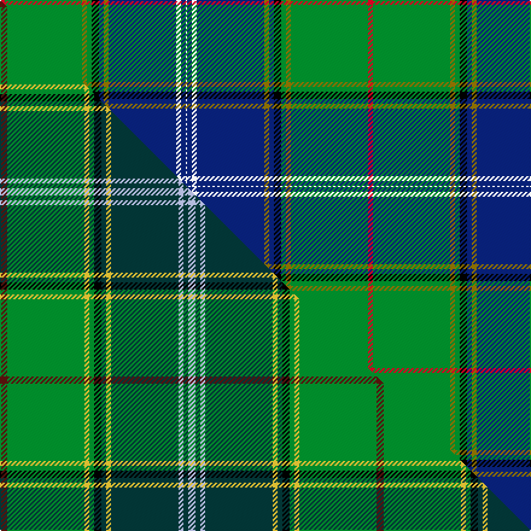

This is one **variant** — a specific cloth: this exact thread count and colourway, with its own
provenance below. It is one weaving of the [sett](/setts/r4g64y4g4k6db4y4db56w4db4w1/) (the scale-free proportion — the
same cloth at any scale or shade), whose colour order is pattern [RGGGKBGBWBW](/stripes/rgggkbgbwbw/).

Part of the [Pringle](/tartans/p/pr/pringle/) tartan — the named design grouping this sett with its other cloths.

Sourced from register-of-tartans.  It is a [11 stripe tartan](/stripes/stripes11/).

Original link [https://www.tartanregister.gov.uk/tartanDetails.aspx?ref=3410](https://www.tartanregister.gov.uk/tartanDetails.aspx?ref=3410)

Dataset <small>— provenance for this record, inherited from the source manifest</small>

<dl class="dataset-prov">
<dt>source</dt><dd><a href="/sources/register-of-tartans/">Scottish Register of Tartans</a></dd>
<dt>data captured from</dt><dd><a href="https://github.com/thetartan/tartan-database/blob/master/data/register-of-tartans/data.csv">https://github.com/thetartan/tartan-database/blob/master/data/register-of-tartans/data.csv</a></dd>
<dt>data date</dt><dd>2017-01-06 <small>(dataset default)</small></dd>
<dt>licence</dt><dd><a href="https://www.tartanregister.gov.uk/copyright">Crown copyright</a></dd>
</dl>

Capture chain <small>— the hands this data passed through, oldest first; each capture carries its own licence</small>

<ol class="capture-chain">
<li><a href="https://www.tartanregister.gov.uk/">Scottish Register of Tartans</a> · <a href="https://www.tartanregister.gov.uk/copyright">Crown copyright</a> <small>the living register — still published by National Records of Scotland</small></li>
<li><a href="https://github.com/thetartan/tartan-database">thetartan/tartan-database</a> <small>2016-2017</small> · <a href="https://creativecommons.org/licenses/by-nc-nd/4.0/">CC BY-NC-ND 4.0</a> <small>Levko Kravets's frozen compilation — the capture we vendored, and where its CC licence text came from</small></li>
<li>this dictionary <small>captured 2026-06-10 · commit 5bf86c7566</small> <small>each re-capture is a git commit to data/sources</small></li>
</ol>

## Register references

External register numbers recorded for this tartan.

- Scottish Register of Tartans: [3410](https://www.tartanregister.gov.uk/tartanDetails.aspx?ref=3410)
- Scottish Tartans World Register: 2816

## Thread count
R/4 G64 Y4 G4 K6 DB4 Y4 DB56 W4 DB4 W/1

One full sett is **305 threads**.

## Palette
<table><thead><tr><th>Colour</th><th>Shade</th><th>OKLCh</th></tr></thead><tbody><tr><td>DB</td><td><code style="background-color:#082077;">#082077</code> <small style="color:#888">#082077</small></td><td><small style="color:#888">oklch(30.0% 0.149 265.1)</small></td></tr><tr><td>G</td><td><code style="background-color:#008B2A;">#008B2A</code> <small style="color:#888">#008B2A</small></td><td><small style="color:#888">oklch(55.4% 0.170 145.9)</small></td></tr><tr><td>K</td><td><code style="background-color:#000000;">#000000</code> <small style="color:#888">#000000</small></td><td><small style="color:#888">oklch(0.0% 0.000 0.0)</small></td></tr><tr><td>W</td><td><code style="background-color:#F7F7F7;">#F7F7F7</code> <small style="color:#888">#F7F7F7</small></td><td><small style="color:#888">oklch(97.6% 0.000 89.9)</small></td></tr><tr><td>R</td><td><code style="background-color:#D60020;">#D60020</code> <small style="color:#888">#D60020</small></td><td><small style="color:#888">oklch(55.2% 0.224 25.5)</small></td></tr><tr><td>Y</td><td><code style="background-color:#8B6E00;">#8B6E00</code> <small style="color:#888">#8B6E00</small></td><td><small style="color:#888">oklch(55.1% 0.113 90.4)</small></td></tr></tbody></table>

# Sample pattern

## Compared to the master

This cloth is one sett of its design; the master sett (the exemplar the design is anchored on) is below for comparison.

Its **ΔTartan distance** from the master is **4.50** — the same measure the nearest-tartans table ranks by (0 is identical; a re-scale of the same cloth is near 0, a recolour or a different proportion further).

<figure class="master-compare" style="margin:0">

this sett
master sett ★

<figcaption style="color:#888;font-size:smaller">One weave of this sett against the <a href="/setts/dr3g32ly2g2k3dt2ly2dt28lb2dt2lb3/">master sett ★</a>, split on the diagonal: a shared proportion runs seamlessly across it with only the shades shifting; a different proportion breaks on it.</figcaption>
</figure>

## Nearest tartan variants

The nearest existing variants by ΔTartan distance, with this cloth at the top so the swatches line up against it.

ΔTartan

Threads

Variant

Sett

—

305

<a href="/variants/s11/r4g64y4g4k6db4y4db56w4db4w1/">Pringle</a>

<a href="/ttd/edit/#slug=dr2dg20y1dg1k2lb1y1lb22w1lb1w1~x4&amp;base=r4g64y4g4k6db4y4db56w4db4w1" title="compare in the TTD">0.74</a>

412

<a href="/variants/s11/dr2dg20y1dg1k2lb1y1lb22w1lb1w1~x4/">Unidentified (Tony Murray Collection</a>

<a href="/ttd/edit/#slug=dr2g32lo2g2k3db2lo2db28w2db2w2~x2~db1106275-w3600000&amp;base=r4g64y4g4k6db4y4db56w4db4w1" title="compare in the TTD">1.18</a>

308

<a href="/variants/s11/dr2g32lo2g2k3db2lo2db28w2db2w2~x2~db1106275-w3600000/">Pringle Personal Tartan</a>

<a href="/ttd/edit/#slug=r10db4r3db6w3db4w3db40g73k4db2y6&amp;base=r4g64y4g4k6db4y4db56w4db4w1" title="compare in the TTD">1.50</a>

300

<a href="/variants/s12/r10db4r3db6w3db4w3db40g73k4db2y6/">Johnston, Diana Dress (Personal)</a>

<a href="/ttd/edit/#slug=g90r1k10w6k4g6r10db62y8&amp;base=r4g64y4g4k6db4y4db56w4db4w1" title="compare in the TTD">1.80</a>

296

<a href="/variants/s9/g90r1k10w6k4g6r10db62y8/">Stirling, University of</a>

<a href="/ttd/edit/#slug=db10g6dp4dr2dp4k10db6k4db28g55w4&amp;base=r4g64y4g4k6db4y4db56w4db4w1" title="compare in the TTD">2.51</a>

252

<a href="/variants/s11/db10g6dp4dr2dp4k10db6k4db28g55w4/">1314 (Corporate)</a>

<a href="/ttd/edit/#slug=db31y4g68w4db31r2k6r2~x2&amp;base=r4g64y4g4k6db4y4db56w4db4w1" title="compare in the TTD">2.55</a>

526

<a href="/variants/s8/db31y4g68w4db31r2k6r2~x2/">Inkster (Name)</a>

<a href="/ttd/edit/#slug=r2k1db30k6g12y1db2y1g12k3w1~x2&amp;base=r4g64y4g4k6db4y4db56w4db4w1" title="compare in the TTD">2.56</a>

278

<a href="/variants/s11/r2k1db30k6g12y1db2y1g12k3w1~x2/">Hororata</a>

<a href="/ttd/edit/#slug=r2k1db30k6g12ly1db2ly1g12k3w1~x2&amp;base=r4g64y4g4k6db4y4db56w4db4w1" title="compare in the TTD">2.56</a>

278

<a href="/variants/s11/r2k1db30k6g12ly1db2ly1g12k3w1~x2/">Hororata (District)</a>

<a href="/ttd/edit/#slug=k4y1g2y1g32lb1g3db32lb3~x2&amp;base=r4g64y4g4k6db4y4db56w4db4w1" title="compare in the TTD">2.62</a>

302

<a href="/variants/s9/k4y1g2y1g32lb1g3db32lb3~x2/">McClurg</a>

<a href="/ttd/edit/#slug=db60k15g10r2g10r2g10r2g10k1y4~x2&amp;base=r4g64y4g4k6db4y4db56w4db4w1" title="compare in the TTD">2.70</a>

376

<a href="/variants/s11/db60k15g10r2g10r2g10r2g10k1y4~x2/">Muir/Moore</a>

## Neighbour map

Every grey dot is one of 13621 variants placed by the first two principal components of the ΔTartan feature space (42% of its variance). Red is this tartan; blue dots are its nearest — click one to open its page.

<svg viewBox="0 0 640 380" role="img" style="max-width:100%;height:auto;border:1px solid #e0e0e0;border-radius:4px;display:block" xmlns="http://www.w3.org/2000/svg"><image href="/nn/cloud.v1.png" width="640" height="380"/><a href="/variants/s11/dr2dg20y1dg1k2lb1y1lb22w1lb1w1~x4/"><circle cx="219.0" cy="69.3" r="4" fill="#3465a4"><title>Unidentified (Tony Murray Collection</title></circle></a><a href="/variants/s11/dr2g32lo2g2k3db2lo2db28w2db2w2~x2~db1106275-w3600000/"><circle cx="203.0" cy="90.0" r="4" fill="#3465a4"><title>Pringle Personal Tartan</title></circle></a><a href="/variants/s12/r10db4r3db6w3db4w3db40g73k4db2y6/"><circle cx="247.5" cy="57.7" r="4" fill="#3465a4"><title>Johnston, Diana Dress (Personal)</title></circle></a><a href="/variants/s9/g90r1k10w6k4g6r10db62y8/"><circle cx="253.3" cy="62.7" r="4" fill="#3465a4"><title>Stirling, University of</title></circle></a><a href="/variants/s11/db10g6dp4dr2dp4k10db6k4db28g55w4/"><circle cx="216.7" cy="85.9" r="4" fill="#3465a4"><title>1314 (Corporate)</title></circle></a><a href="/variants/s8/db31y4g68w4db31r2k6r2~x2/"><circle cx="250.5" cy="94.6" r="4" fill="#3465a4"><title>Inkster (Name)</title></circle></a><a href="/variants/s11/r2k1db30k6g12y1db2y1g12k3w1~x2/"><circle cx="218.5" cy="75.9" r="4" fill="#3465a4"><title>Hororata</title></circle></a><a href="/variants/s11/r2k1db30k6g12ly1db2ly1g12k3w1~x2/"><circle cx="213.9" cy="74.5" r="4" fill="#3465a4"><title>Hororata (District)</title></circle></a><a href="/variants/s9/k4y1g2y1g32lb1g3db32lb3~x2/"><circle cx="279.2" cy="96.2" r="4" fill="#3465a4"><title>McClurg</title></circle></a><a href="/variants/s11/db60k15g10r2g10r2g10r2g10k1y4~x2/"><circle cx="272.1" cy="67.6" r="4" fill="#3465a4"><title>Muir/Moore</title></circle></a><circle cx="258.2" cy="51.7" r="5" fill="#c00000"/><text x="320" y="376" text-anchor="middle" font-size="11" fill="#999">ground</text><text x="11" y="190" text-anchor="middle" font-size="11" fill="#999" transform="rotate(-90 11 190)">complexity</text></svg>

ID: /variants/s11/r4g64y4g4k6db4y4db56w4db4w1/
