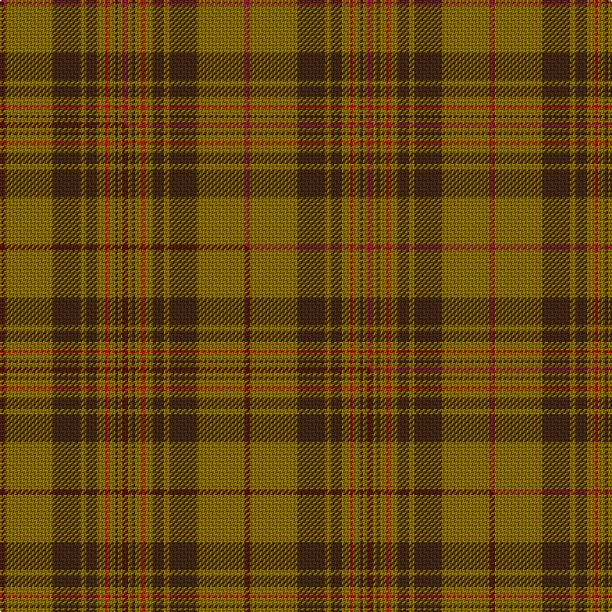

This page is one **sett** — a single exact thread-count. It belongs to the [tartan](/setts/r4y34do20y4do8y6ri2y5do2y3r4/)
(the same proportion at any scale), whose colour order is pattern [RGBGBGRGBGR](/stripes/rgbgbgrgbgr/).

Part of the [Morgan](/tartans/morgan/) tartan — the named design grouping this sett with its other cloths.

Sourced from house-of-tartan.  It is a [11 stripe tartan](/stripes/stripes11/).

Original link [http://www.house-of-tartan.scotland.net/house/TartanViewjs.asp?colr=Def&tnam=5760](http://www.house-of-tartan.scotland.net/house/TartanViewjs.asp?colr=Def&tnam=5760)

## Provenance

Earliest known date: 2002 The tartan for this Welsh surname and its variations, Morgaine, Morgan, Morgant, Morgans, Morgen, Morgun, Morrgun, Morgraunt, is actually woven in Wales at the Cambrian Woollen Mill, weaving on the same site since 1830. This tartan differs from many traditional patterns in that the warp and weft differ, giving the finished worsted wool cloth more of a predominant stripe, vertically noticeable in the finished Kilt, or Cilt in Wales.

Dataset <small>— provenance for this record, inherited from the source manifest</small>

<dl class="dataset-prov">
<dt>source</dt><dd><a href="/sources/house-of-tartan/">House of Tartan</a></dd>
<dt>data captured from</dt><dd><a href="https://github.com/thetartan/tartan-database/blob/master/data/house-of-tartan/data.csv">https://github.com/thetartan/tartan-database/blob/master/data/house-of-tartan/data.csv</a></dd>
<dt>data date</dt><dd>2017-01-10 <small>(dataset default)</small></dd>
<dt>licence</dt><dd><a href="https://creativecommons.org/licenses/by-nc-nd/4.0/">CC BY-NC-ND 4.0</a></dd>
</dl>

Capture chain <small>— the hands this data passed through, oldest first; each capture carries its own licence</small>

<ol class="capture-chain">
<li><a href="http://www.house-of-tartan.scotland.net/">House of Tartan</a> <small>the weaver/retailer's database — the site is now offline; the URL is kept as the ultimate source's identity</small></li>
<li><a href="https://github.com/thetartan/tartan-database">thetartan/tartan-database</a> <small>2016-2017</small> · <a href="https://creativecommons.org/licenses/by-nc-nd/4.0/">CC BY-NC-ND 4.0</a> <small>Levko Kravets's frozen compilation — the capture we vendored, and where its CC licence text came from</small></li>
<li>this dictionary <small>captured 2026-06-10 · commit 5bf86c7566</small> <small>each re-capture is a git commit to data/sources</small></li>
</ol>

## Thread count
R/4 Y34 DO20 Y4 DO8 Y6 Ri2 Y5 DO2 Y3 R/4

One full sett is **176 threads**.

## Palette
<table><thead><tr><th>Colour</th><th>Shade</th><th>OKLCh</th></tr></thead><tbody><tr><td>DO</td><td><code style="background-color:#412714;">#412714</code> <small style="color:#888">#412714</small></td><td><small style="color:#888">oklch(30.1% 0.050 55.7)</small></td></tr><tr><td>R</td><td><code style="background-color:#901C38;">#901C38</code> <small style="color:#888">#901C38</small></td><td><small style="color:#888">oklch(43.2% 0.150 13.1)</small></td></tr><tr><td>K</td><td><code style="background-color:#000000;">#000000</code> <small style="color:#888">#000000</small></td><td><small style="color:#888">oklch(0.0% 0.000 0.0)</small></td></tr><tr><td>R</td><td><code style="background-color:#C80000;">#C80000</code> <small style="color:#888">#C80000</small></td><td><small style="color:#888">oklch(52.3% 0.215 29.2)</small></td></tr><tr><td>Y</td><td><code style="background-color:#8B6E00;">#8B6E00</code> <small style="color:#888">#8B6E00</small></td><td><small style="color:#888">oklch(55.1% 0.113 90.4)</small></td></tr></tbody></table>

# Sample pattern

## Compared to the master

This cloth is one sett of its design; the master sett (the exemplar the design is anchored on) is below for comparison.

Its **ΔTartan distance** from the master is **0.03** — the same measure the nearest-tartans table ranks by (0 is identical; a re-scale of the same cloth is near 0, a recolour or a different proportion further).

<figure class="master-compare" style="margin:0">

this sett
master sett ★

<figcaption style="color:#888;font-size:smaller">One weave of this sett against the <a href="/setts/dr4y34do20y4do8y6r2y5do2y3dr4/">master sett ★</a>, split on the diagonal: a shared proportion runs seamlessly across it with only the shades shifting; a different proportion breaks on it.</figcaption>
</figure>

## Nearest tartan variants

The nearest existing variants by ΔTartan distance, with this cloth at the top so the swatches line up against it.

ΔTartan

Threads

Variant

Sett

—

176

<a href="/variants/s11/r4y34do20y4do8y6ri2y5do2y3r4~r1706009-ri2109032/">Morgan Welsh Name Tartan</a>

<a href="/ttd/edit/#slug=dr4y34do20y4do8y6r2y5do2y3dr4&amp;base=r4y34do20y4do8y6ri2y5do2y3r4~r1706009-ri2109032" title="compare in the TTD">0.03</a>

176

<a href="/variants/s11/dr4y34do20y4do8y6r2y5do2y3dr4/">Morgan of Wales</a>

<a href="/ttd/edit/#slug=dr3o28do5o5do33o5do5o28ly3~x2&amp;base=r4y34do20y4do8y6ri2y5do2y3r4~r1706009-ri2109032" title="compare in the TTD">2.83</a>

448

<a href="/variants/s9/dr3o28do5o5do33o5do5o28ly3~x2/">MacIver of Strathendry Htg (Personal</a>

<a href="/ttd/edit/#slug=dg8o5dg5o5dg5o6db1o2dg8o2db1o24db4o6~x2~dg1806142-o2005046&amp;base=r4y34do20y4do8y6ri2y5do2y3r4~r1706009-ri2109032" title="compare in the TTD">3.07</a>

300

<a href="/variants/s14/dg8o5dg5o5dg5o6db1o2dg8o2db1o24db4o6~x2~dg1806142-o2005046/">MacGillivray Hunting</a>

<a href="/ttd/edit/#slug=y30r2y2k5y3o2y3o22y3k2y3~x2&amp;base=r4y34do20y4do8y6ri2y5do2y3r4~r1706009-ri2109032" title="compare in the TTD">3.14</a>

242

<a href="/variants/s11/y30r2y2k5y3o2y3o22y3k2y3~x2/">Dunbarton</a>

<a href="/ttd/edit/#slug=r3n33g10r3g3r3g3r8n10r3~x2&amp;base=r4y34do20y4do8y6ri2y5do2y3r4~r1706009-ri2109032" title="compare in the TTD">3.16</a>

304

<a href="/variants/s10/r3n33g10r3g3r3g3r8n10r3~x2/">Gray (Name)</a>

<a href="/ttd/edit/#slug=g6w1g12o4r4o2r4o32g1o2~x2&amp;base=r4y34do20y4do8y6ri2y5do2y3r4~r1706009-ri2109032" title="compare in the TTD">3.21</a>

256

<a href="/variants/s10/g6w1g12o4r4o2r4o32g1o2~x2/">Seton, hunting</a>

<a href="/ttd/edit/#slug=g8y2o4dp4g3dp4o42g4r3g4o4dp5r3&amp;base=r4y34do20y4do8y6ri2y5do2y3r4~r1706009-ri2109032" title="compare in the TTD">3.27</a>

169

<a href="/variants/s13/g8y2o4dp4g3dp4o42g4r3g4o4dp5r3/">Sarna</a>

<a href="/ttd/edit/#slug=y5dg14o4db4o27dg3o4y5~x2&amp;base=r4y34do20y4do8y6ri2y5do2y3r4~r1706009-ri2109032" title="compare in the TTD">3.27</a>

244

<a href="/variants/s8/y5dg14o4db4o27dg3o4y5~x2/">Invertere</a>

<a href="/ttd/edit/#slug=g8o5g5o5g5o6db1o2g8o2db1o24db4o6~x2&amp;base=r4y34do20y4do8y6ri2y5do2y3r4~r1706009-ri2109032" title="compare in the TTD">3.41</a>

300

<a href="/variants/s14/g8o5g5o5g5o6db1o2g8o2db1o24db4o6~x2/">MacGillivray Htg (Clan)</a>

<a href="/ttd/edit/#slug=g5y5g5y35dr44r3dr3~x2&amp;base=r4y34do20y4do8y6ri2y5do2y3r4~r1706009-ri2109032" title="compare in the TTD">3.45</a>

384

<a href="/variants/s7/g5y5g5y35dr44r3dr3~x2/">Fernandes (Personal)</a>

## Neighbour map

Every grey dot is one of 13621 variants placed by the first two principal components of the ΔTartan feature space (42% of its variance). Red is this tartan; blue dots are its nearest — click one to open its page.

<svg viewBox="0 0 640 380" role="img" style="max-width:100%;height:auto;border:1px solid #e0e0e0;border-radius:4px;display:block" xmlns="http://www.w3.org/2000/svg"><image href="/nn/cloud.v1.png" width="640" height="380"/><a href="/variants/s11/dr4y34do20y4do8y6r2y5do2y3dr4/"><circle cx="428.2" cy="177.6" r="4" fill="#3465a4"><title>Morgan of Wales</title></circle></a><a href="/variants/s9/dr3o28do5o5do33o5do5o28ly3~x2/"><circle cx="415.3" cy="207.7" r="4" fill="#3465a4"><title>MacIver of Strathendry Htg (Personal</title></circle></a><a href="/variants/s14/dg8o5dg5o5dg5o6db1o2dg8o2db1o24db4o6~x2~dg1806142-o2005046/"><circle cx="483.7" cy="187.6" r="4" fill="#3465a4"><title>MacGillivray Hunting</title></circle></a><a href="/variants/s11/y30r2y2k5y3o2y3o22y3k2y3~x2/"><circle cx="393.2" cy="153.6" r="4" fill="#3465a4"><title>Dunbarton</title></circle></a><a href="/variants/s10/r3n33g10r3g3r3g3r8n10r3~x2/"><circle cx="421.9" cy="213.7" r="4" fill="#3465a4"><title>Gray (Name)</title></circle></a><a href="/variants/s10/g6w1g12o4r4o2r4o32g1o2~x2/"><circle cx="486.1" cy="153.0" r="4" fill="#3465a4"><title>Seton, hunting</title></circle></a><a href="/variants/s13/g8y2o4dp4g3dp4o42g4r3g4o4dp5r3/"><circle cx="393.0" cy="124.8" r="4" fill="#3465a4"><title>Sarna</title></circle></a><a href="/variants/s8/y5dg14o4db4o27dg3o4y5~x2/"><circle cx="364.9" cy="224.6" r="4" fill="#3465a4"><title>Invertere</title></circle></a><a href="/variants/s14/g8o5g5o5g5o6db1o2g8o2db1o24db4o6~x2/"><circle cx="462.1" cy="183.1" r="4" fill="#3465a4"><title>MacGillivray Htg (Clan)</title></circle></a><a href="/variants/s7/g5y5g5y35dr44r3dr3~x2/"><circle cx="370.1" cy="194.4" r="4" fill="#3465a4"><title>Fernandes (Personal)</title></circle></a><circle cx="430.6" cy="176.5" r="5" fill="#c00000"/><text x="320" y="376" text-anchor="middle" font-size="11" fill="#999">ground</text><text x="11" y="190" text-anchor="middle" font-size="11" fill="#999" transform="rotate(-90 11 190)">complexity</text></svg>

ID: /variants/s11/r4y34do20y4do8y6ri2y5do2y3r4~r1706009-ri2109032/
