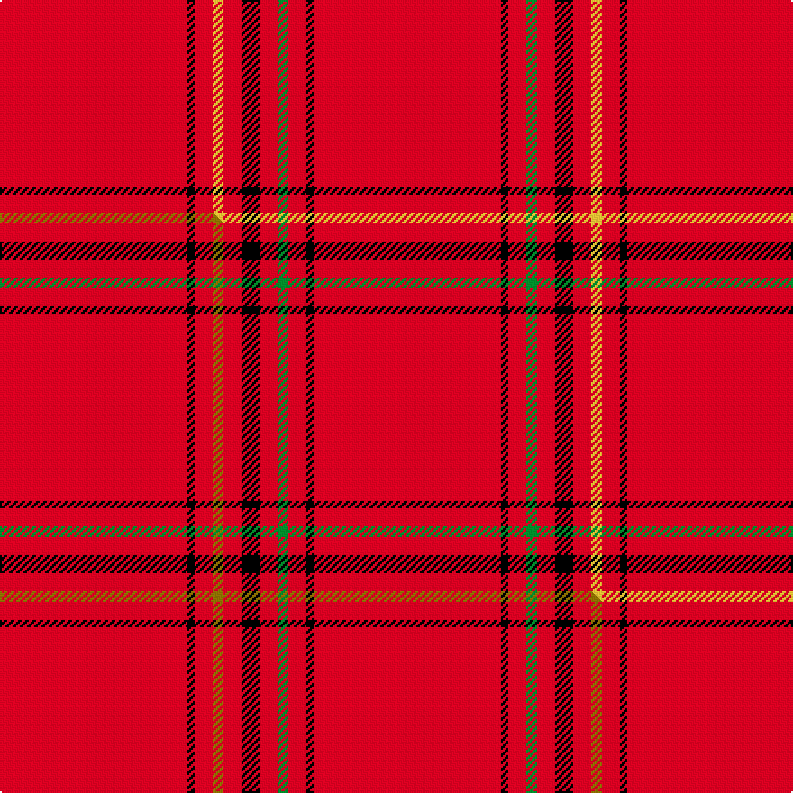

This is one **variant** — a specific cloth: this exact thread count and colourway, with its own
provenance below. It is one weaving of the [sett](/setts/r52k2r5g3r5k5r5ly3r5k2r52/) (the scale-free proportion — the
same cloth at any scale or shade), whose colour order is pattern [RKRGRKRYRKR](/stripes/rkrgrkryrkr/).

Part of the [Taplin](/tartans/t/ta/taplin/) tartan — the named design grouping this sett with its other cloths.

Sourced from tartans-authority.  It is a [11 stripe tartan](/stripes/stripes11/).

Original link [https://www.tartanregister.gov.uk/tartanDetails.aspx?ref=2759](https://www.tartanregister.gov.uk/tartanDetails.aspx?ref=2759)

Dataset <small>— provenance for this record, inherited from the source manifest</small>

<dl class="dataset-prov">
<dt>source</dt><dd><a href="/sources/tartans-authority/">Scottish Tartans Authority</a></dd>
<dt>data captured from</dt><dd><a href="https://github.com/thetartan/tartan-database/blob/master/data/tartans-authority/data.csv">https://github.com/thetartan/tartan-database/blob/master/data/tartans-authority/data.csv</a></dd>
<dt>data date</dt><dd>2003? <small>(this record)</small></dd>
<dt>licence</dt><dd><a href="https://creativecommons.org/licenses/by-nc-nd/4.0/">CC BY-NC-ND 4.0</a></dd>
</dl>

Capture chain <small>— the hands this data passed through, oldest first; each capture carries its own licence</small>

<ol class="capture-chain">
<li><a href="https://www.tartansauthority.com/">Scottish Tartans Authority</a> <small>the heritage body's archive — its tartan-ferret record browser is retired (links repaired to the SRT, above)</small></li>
<li><a href="https://github.com/thetartan/tartan-database">thetartan/tartan-database</a> <small>2016-2017</small> · <a href="https://creativecommons.org/licenses/by-nc-nd/4.0/">CC BY-NC-ND 4.0</a> <small>Levko Kravets's frozen compilation — the capture we vendored, and where its CC licence text came from</small></li>
<li>this dictionary <small>captured 2026-06-10 · commit 5bf86c7566</small> <small>each re-capture is a git commit to data/sources</small></li>
</ol>

## Register references

External register numbers recorded for this tartan.

- Scottish Tartans Authority (ITI): 2759

## Thread count
R/104 K4 R10 LY6 R10 K10 R10 G6 R10 K4 R/104

One full sett is **348 threads**.

## Palette
<table><thead><tr><th>Colour</th><th>Shade</th><th>OKLCh</th></tr></thead><tbody><tr><td>G</td><td><code style="background-color:#008B2A;">#008B2A</code> <small style="color:#888">#008B2A</small></td><td><small style="color:#888">oklch(55.4% 0.170 145.9)</small></td></tr><tr><td>K</td><td><code style="background-color:#000000;">#000000</code> <small style="color:#888">#000000</small></td><td><small style="color:#888">oklch(0.0% 0.000 0.0)</small></td></tr><tr><td>R</td><td><code style="background-color:#D60020;">#D60020</code> <small style="color:#888">#D60020</small></td><td><small style="color:#888">oklch(55.2% 0.224 25.5)</small></td></tr><tr><td>LY</td><td><code style="background-color:#DCBC32;">#DCBC32</code> <small style="color:#888">#DCBC32</small></td><td><small style="color:#888">oklch(80.0% 0.150 95.2)</small></td></tr></tbody></table>

# Sample pattern

## Compared to the master

This cloth is one sett of its design; the master sett (the exemplar the design is anchored on) is below for comparison.

Its **ΔTartan distance** from the master is **0.01** — the same measure the nearest-tartans table ranks by (0 is identical; a re-scale of the same cloth is near 0, a recolour or a different proportion further).

<figure class="master-compare" style="margin:0">

this sett
master sett ★

<figcaption style="color:#888;font-size:smaller">One weave of this sett against the <a href="/setts/r52k2r5y3r5k5r5g3r5k2r52/">master sett ★</a>, split on the diagonal: a shared proportion runs seamlessly across it with only the shades shifting; a different proportion breaks on it.</figcaption>
</figure>

## Nearest tartan variants

The nearest existing variants by ΔTartan distance, with this cloth at the top so the swatches line up against it.

ΔTartan

Threads

Variant

Sett

—

348

<a href="/variants/s11/r52k2r5g3r5k5r5ly3r5k2r52~x2/">Taplin (Name)</a>

<a href="/ttd/edit/#slug=r52k2r5y3r5k5r5g3r5k2r52~x2&amp;base=r52k2r5g3r5k5r5ly3r5k2r52~x2" title="compare in the TTD">0.01</a>

348

<a href="/variants/s11/r52k2r5y3r5k5r5g3r5k2r52~x2/">Taplin</a>

<a href="/ttd/edit/#slug=r8g4r30lb6r2k1r2g6r8k1r4ly2~x2&amp;base=r52k2r5g3r5k5r5ly3r5k2r52~x2" title="compare in the TTD">1.12</a>

276

<a href="/variants/s12/r8g4r30lb6r2k1r2g6r8k1r4ly2~x2/">Highland Queen</a>

<a href="/ttd/edit/#slug=r8g4r30db6r2k1r2g6r8k1r4y2~x2&amp;base=r52k2r5g3r5k5r5ly3r5k2r52~x2" title="compare in the TTD">1.12</a>

276

<a href="/variants/s12/r8g4r30db6r2k1r2g6r8k1r4y2~x2/">Highland Queen (Corporate)</a>

<a href="/ttd/edit/#slug=r90k6r6k6r90g6r6g45r6k4r3&amp;base=r52k2r5g3r5k5r5ly3r5k2r52~x2" title="compare in the TTD">2.10</a>

443

<a href="/variants/s11/r90k6r6k6r90g6r6g45r6k4r3/">MacPherson-Grant</a>

<a href="/ttd/edit/#slug=r75g12r3k2r2k2r36~x2&amp;base=r52k2r5g3r5k5r5ly3r5k2r52~x2" title="compare in the TTD">3.32</a>

306

<a href="/variants/s7/r75g12r3k2r2k2r36~x2/">MacKintosh (Moy Hall) Clan Tartan</a>

<a href="/ttd/edit/#slug=r64db4r1k4r12w4r1w4k4r1~x2&amp;base=r52k2r5g3r5k5r5ly3r5k2r52~x2" title="compare in the TTD">3.61</a>

266

<a href="/variants/s10/r64db4r1k4r12w4r1w4k4r1~x2/">Ramsay (Angus &amp; Mearns)</a>

<a href="/ttd/edit/#slug=r80w2r5k10r6n4r10k2n6&amp;base=r52k2r5g3r5k5r5ly3r5k2r52~x2" title="compare in the TTD">3.86</a>

164

<a href="/variants/s9/r80w2r5k10r6n4r10k2n6/">Hampden-Sydney College</a>

<a href="/ttd/edit/#slug=r65w1r6k8g8r6k3r11~x2&amp;base=r52k2r5g3r5k5r5ly3r5k2r52~x2" title="compare in the TTD">3.91</a>

280

<a href="/variants/s8/r65w1r6k8g8r6k3r11~x2/">Gudbrandsdalen, Rondastakken #2</a>

<a href="/ttd/edit/#slug=r40w1r1k8r1w1r6w1r1k8~x2&amp;base=r52k2r5g3r5k5r5ly3r5k2r52~x2" title="compare in the TTD">4.00</a>

176

<a href="/variants/s10/r40w1r1k8r1w1r6w1r1k8~x2/">Miyuki, Check Red, 1002A</a>

## Neighbour map

Every grey dot is one of 13621 variants placed by the first two principal components of the ΔTartan feature space (42% of its variance). Red is this tartan; blue dots are its nearest — click one to open its page. The map is a flat projection of a many-dimensional space — [how to read it](/posts/neighbourhood-maps/).

<svg viewBox="0 0 640 380" role="img" style="max-width:100%;height:auto;border:1px solid #e0e0e0;border-radius:4px;display:block" xmlns="http://www.w3.org/2000/svg"><image href="/nn/cloud.v1.png" width="640" height="380"/><a href="/variants/s11/r52k2r5y3r5k5r5g3r5k2r52~x2/"><circle cx="609.0" cy="81.8" r="4" fill="#3465a4"><title>Taplin</title></circle></a><a href="/variants/s12/r8g4r30lb6r2k1r2g6r8k1r4ly2~x2/"><circle cx="436.5" cy="78.9" r="4" fill="#3465a4"><title>Highland Queen</title></circle></a><a href="/variants/s12/r8g4r30db6r2k1r2g6r8k1r4y2~x2/"><circle cx="435.4" cy="78.2" r="4" fill="#3465a4"><title>Highland Queen (Corporate)</title></circle></a><a href="/variants/s11/r90k6r6k6r90g6r6g45r6k4r3/"><circle cx="485.9" cy="97.5" r="4" fill="#3465a4"><title>MacPherson-Grant</title></circle></a><a href="/variants/s7/r75g12r3k2r2k2r36~x2/"><circle cx="626.0" cy="112.0" r="4" fill="#3465a4"><title>MacKintosh (Moy Hall) Clan Tartan</title></circle></a><a href="/variants/s10/r64db4r1k4r12w4r1w4k4r1~x2/"><circle cx="516.4" cy="36.5" r="4" fill="#3465a4"><title>Ramsay (Angus &amp; Mearns)</title></circle></a><a href="/variants/s9/r80w2r5k10r6n4r10k2n6/"><circle cx="537.8" cy="60.6" r="4" fill="#3465a4"><title>Hampden-Sydney College</title></circle></a><a href="/variants/s8/r65w1r6k8g8r6k3r11~x2/"><circle cx="535.1" cy="64.7" r="4" fill="#3465a4"><title>Gudbrandsdalen, Rondastakken #2</title></circle></a><a href="/variants/s10/r40w1r1k8r1w1r6w1r1k8~x2/"><circle cx="454.4" cy="62.5" r="4" fill="#3465a4"><title>Miyuki, Check Red, 1002A</title></circle></a><circle cx="602.9" cy="80.0" r="5" fill="#c00000"/><text x="320" y="376" text-anchor="middle" font-size="11" fill="#999">ground</text><text x="11" y="190" text-anchor="middle" font-size="11" fill="#999" transform="rotate(-90 11 190)">complexity</text></svg>

ID: /variants/s11/r52k2r5g3r5k5r5ly3r5k2r52~x2/
