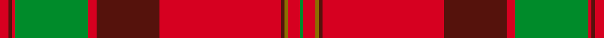

This page is one **sett** — a single exact thread-count. It belongs to the [tartan](/setts/r5dr2r2g42r5dr36r70dr2y2r7g2/)
(the same proportion at any scale), whose colour order is pattern [GRGBRBRGRBR](/stripes/grgbrbrgrbr/).

Part of the [MacPherson Of Cluny](/tartans/macpherson-of-cluny/) tartan — the named design grouping this sett with its other cloths.

Sourced from weddslist.  It is a [11 stripe tartan](/stripes/stripes11/).

Original link http://www.weddslist.com/cgi-bin/tartans/pg.pl?source=x

## Thread count
R/5 DR2 R2 G42 R5 DR36 R70 DR2 Y2 R7 G/2

One full sett is **343 threads**.

## Palette
<table><thead><tr><th>Colour</th><th>Shade</th><th>OKLCh</th></tr></thead><tbody><tr><td>G</td><td><code style="background-color:#008B2A;">#008B2A</code> <small style="color:#888">#008B2A</small></td><td><small style="color:#888">oklch(55.4% 0.170 145.9)</small></td></tr><tr><td>R</td><td><code style="background-color:#D60020;">#D60020</code> <small style="color:#888">#D60020</small></td><td><small style="color:#888">oklch(55.2% 0.224 25.5)</small></td></tr><tr><td>Y</td><td><code style="background-color:#8B6E00;">#8B6E00</code> <small style="color:#888">#8B6E00</small></td><td><small style="color:#888">oklch(55.1% 0.113 90.4)</small></td></tr><tr><td>DR</td><td><code style="background-color:#55120C;">#55120C</code> <small style="color:#888">#55120C</small></td><td><small style="color:#888">oklch(30.0% 0.099 29.3)</small></td></tr></tbody></table>

# Sample pattern

## Nearest variants

The nearest existing variants by ΔTartan distance, with this cloth at the top so the swatches line up against it.

ΔTartan

Threads

Variant

Sett

—

343

<a href="/variants/s11/r5dr2r2g42r5dr36r70dr2y2r7g2/">MacPherson Of Cluny</a>

<a href="/ttd/edit/#slug=r5dr2r2g42r5dr36r70dr2y2r7g2~x2&amp;base=r5dr2r2g42r5dr36r70dr2y2r7g2" title="compare in the TTD">0.00</a>

686

<a href="/variants/s11/r5dr2r2g42r5dr36r70dr2y2r7g2~x2/">MacPherson Of Cluny</a>

## Neighbour map

Every grey dot is one of 13620 variants placed by the first two principal components of the ΔTartan feature space (42% of its variance). Red is this tartan; blue dots are its nearest — click one to open its page.

<svg viewBox="0 0 640 380" role="img" style="max-width:100%;height:auto;border:1px solid #e0e0e0;border-radius:4px;display:block" xmlns="http://www.w3.org/2000/svg"><image href="/nn/cloud.v1.png" width="640" height="380"/><a href="/variants/s11/r5dr2r2g42r5dr36r70dr2y2r7g2~x2/"><circle cx="366.8" cy="109.7" r="4" fill="#3465a4"><title>MacPherson Of Cluny</title></circle></a><circle cx="366.8" cy="109.7" r="5" fill="#c00000"/><text x="320" y="376" text-anchor="middle" font-size="11" fill="#999">ground</text><text x="11" y="190" text-anchor="middle" font-size="11" fill="#999" transform="rotate(-90 11 190)">complexity</text></svg>

ID: /variants/s11/r5dr2r2g42r5dr36r70dr2y2r7g2/
