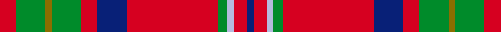

This page is one **sett** — a single exact thread-count. It belongs to the [tartan](/setts/r5g9y2g9r5db9r28g3lb2r4db2/)
(the same proportion at any scale), whose colour order is pattern [BRWGRBRGGGR](/stripes/brwgrbrgggr/).

Part of the [Loch Creran](/tartans/loch-creran/) tartan — the named design grouping this sett with its other cloths.

Sourced from register-of-tartans.  It is a [11 stripe tartan](/stripes/stripes11/).

Original link https://www.tartanregister.gov.uk/tartanDetails.aspx?ref=10529

## Register references

External register numbers recorded for this tartan.

- Scottish Register of Tartans: [10529](https://www.tartanregister.gov.uk/tartanDetails.aspx?ref=10529)

## Thread count
R/10 G18 Y4 G18 R10 DB18 R56 G6 LB4 R8 DB/4

One full sett is **298 threads**.

## Palette
<table><thead><tr><th>Colour</th><th>Shade</th><th>OKLCh</th></tr></thead><tbody><tr><td>DB</td><td><code style="background-color:#082077;">#082077</code> <small style="color:#888">#082077</small></td><td><small style="color:#888">oklch(30.0% 0.149 265.1)</small></td></tr><tr><td>G</td><td><code style="background-color:#008B2A;">#008B2A</code> <small style="color:#888">#008B2A</small></td><td><small style="color:#888">oklch(55.4% 0.170 145.9)</small></td></tr><tr><td>LB</td><td><code style="background-color:#B5BBDE;">#B5BBDE</code> <small style="color:#888">#B5BBDE</small></td><td><small style="color:#888">oklch(79.9% 0.050 277.6)</small></td></tr><tr><td>R</td><td><code style="background-color:#D60020;">#D60020</code> <small style="color:#888">#D60020</small></td><td><small style="color:#888">oklch(55.2% 0.224 25.5)</small></td></tr><tr><td>Y</td><td><code style="background-color:#8B6E00;">#8B6E00</code> <small style="color:#888">#8B6E00</small></td><td><small style="color:#888">oklch(55.1% 0.113 90.4)</small></td></tr></tbody></table>

# Sample pattern

## Nearest tartan variants

The nearest existing variants by ΔTartan distance, with this cloth at the top so the swatches line up against it.

ΔTartan

Threads

Variant

Sett

—

298

<a href="/variants/s11/r5g9y2g9r5db9r28g3lb2r4db2~x2/">Loch Creran</a>

<a href="/ttd/edit/#slug=r6dg8y2dg8r6db8r29dg3lb2r5db3~x2&amp;base=r5g9y2g9r5db9r28g3lb2r4db2~x2" title="compare in the TTD">0.23</a>

302

<a href="/variants/s11/r6dg8y2dg8r6db8r29dg3lb2r5db3~x2/">Loch Creran (District)</a>

<a href="/ttd/edit/#slug=y3r4db2r31g10lb2r5db12r6g3~x2&amp;base=r5g9y2g9r5db9r28g3lb2r4db2~x2" title="compare in the TTD">1.73</a>

300

<a href="/variants/s10/y3r4db2r31g10lb2r5db12r6g3~x2/">Loch Linnhe</a>

<a href="/ttd/edit/#slug=r7b2db2r2g32r6db12r41g2r5b2g5~x2&amp;base=r5g9y2g9r5db9r28g3lb2r4db2~x2" title="compare in the TTD">2.62</a>

448

<a href="/variants/s12/r7b2db2r2g32r6db12r41g2r5b2g5~x2/">MacDonald of Glenaladale</a>

## Neighbour map

Every grey dot is one of 13620 variants placed by the first two principal components of the ΔTartan feature space (42% of its variance). Red is this tartan; blue dots are its nearest — click one to open its page.

<svg viewBox="0 0 640 380" role="img" style="max-width:100%;height:auto;border:1px solid #e0e0e0;border-radius:4px;display:block" xmlns="http://www.w3.org/2000/svg"><image href="/nn/cloud.v1.png" width="640" height="380"/><a href="/variants/s11/r6dg8y2dg8r6db8r29dg3lb2r5db3~x2/"><circle cx="317.7" cy="143.0" r="4" fill="#3465a4"><title>Loch Creran (District)</title></circle></a><a href="/variants/s10/y3r4db2r31g10lb2r5db12r6g3~x2/"><circle cx="330.7" cy="139.0" r="4" fill="#3465a4"><title>Loch Linnhe</title></circle></a><a href="/variants/s12/r7b2db2r2g32r6db12r41g2r5b2g5~x2/"><circle cx="329.6" cy="128.8" r="4" fill="#3465a4"><title>MacDonald of Glenaladale</title></circle></a><circle cx="294.8" cy="147.1" r="5" fill="#c00000"/><text x="320" y="376" text-anchor="middle" font-size="11" fill="#999">ground</text><text x="11" y="190" text-anchor="middle" font-size="11" fill="#999" transform="rotate(-90 11 190)">complexity</text></svg>

ID: /variants/s11/r5g9y2g9r5db9r28g3lb2r4db2~x2/
