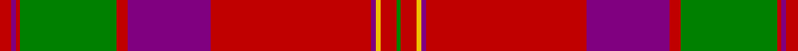

This page is one **sett** — a single exact thread-count. It belongs to the [tartan](/setts/r5p2r2g42r5p36r70p2ly2r7g2/)
(the same proportion at any scale), whose colour order is pattern [GRYBRBRGRBR](/stripes/grybrbrgrbr/).

Sourced from weddslist.  It is a [11 stripe tartan](/stripes/stripes11/).

Original link http://www.weddslist.com/cgi-bin/tartans/pg.pl?source=sts

## Thread count
R/10 P4 R4 G84 R10 P72 R140 P4 Y4 R14 G/4

One full sett is **686 threads**.

## Palette

Palette: <strong>custom</strong>
<table><thead><tr><th>Colour</th><th>Threads</th><th>Shade</th><th>Base</th><th>OKLCh</th></tr></thead><tbody><tr><td>R/</td><td style="text-align:right;font-variant-numeric:tabular-nums">10</td><td><code style="background-color:#C00000;">#C00000</code> <small style="color:#888">#C00000</small></td><td>R <code style="background-color:#CC0000;">#CC0000</code></td><td><small style="color:#888">oklch(50.7% 0.208 29.2)</small></td></tr><tr><td>P</td><td style="text-align:right;font-variant-numeric:tabular-nums">4</td><td><code style="background-color:#800080;">#800080</code> <small style="color:#888">#800080</small></td><td>B <code style="background-color:#2A418A;">#2A418A</code></td><td><small style="color:#888">oklch(42.1% 0.193 328.4)</small></td></tr><tr><td>R</td><td style="text-align:right;font-variant-numeric:tabular-nums">4</td><td><code style="background-color:#C00000;">#C00000</code> <small style="color:#888">#C00000</small></td><td>R <code style="background-color:#CC0000;">#CC0000</code></td><td><small style="color:#888">oklch(50.7% 0.208 29.2)</small></td></tr><tr><td>G</td><td style="text-align:right;font-variant-numeric:tabular-nums">84</td><td><code style="background-color:#008000;">#008000</code> <small style="color:#888">#008000</small></td><td>G <code style="background-color:#006100;">#006100</code></td><td><small style="color:#888">oklch(52.0% 0.177 142.5)</small></td></tr><tr><td>R</td><td style="text-align:right;font-variant-numeric:tabular-nums">10</td><td><code style="background-color:#C00000;">#C00000</code> <small style="color:#888">#C00000</small></td><td>R <code style="background-color:#CC0000;">#CC0000</code></td><td><small style="color:#888">oklch(50.7% 0.208 29.2)</small></td></tr><tr><td>P</td><td style="text-align:right;font-variant-numeric:tabular-nums">72</td><td><code style="background-color:#800080;">#800080</code> <small style="color:#888">#800080</small></td><td>B <code style="background-color:#2A418A;">#2A418A</code></td><td><small style="color:#888">oklch(42.1% 0.193 328.4)</small></td></tr><tr><td>R</td><td style="text-align:right;font-variant-numeric:tabular-nums">140</td><td><code style="background-color:#C00000;">#C00000</code> <small style="color:#888">#C00000</small></td><td>R <code style="background-color:#CC0000;">#CC0000</code></td><td><small style="color:#888">oklch(50.7% 0.208 29.2)</small></td></tr><tr><td>P</td><td style="text-align:right;font-variant-numeric:tabular-nums">4</td><td><code style="background-color:#800080;">#800080</code> <small style="color:#888">#800080</small></td><td>B <code style="background-color:#2A418A;">#2A418A</code></td><td><small style="color:#888">oklch(42.1% 0.193 328.4)</small></td></tr><tr><td>Y</td><td style="text-align:right;font-variant-numeric:tabular-nums">4</td><td><code style="background-color:#F0C000;">#F0C000</code> <small style="color:#888">#F0C000</small></td><td>Y <code style="background-color:#F2BF00;">#F2BF00</code></td><td><small style="color:#888">oklch(82.7% 0.169 90.5)</small></td></tr><tr><td>R</td><td style="text-align:right;font-variant-numeric:tabular-nums">14</td><td><code style="background-color:#C00000;">#C00000</code> <small style="color:#888">#C00000</small></td><td>R <code style="background-color:#CC0000;">#CC0000</code></td><td><small style="color:#888">oklch(50.7% 0.208 29.2)</small></td></tr><tr><td>G/</td><td style="text-align:right;font-variant-numeric:tabular-nums">4</td><td><code style="background-color:#008000;">#008000</code> <small style="color:#888">#008000</small></td><td>G <code style="background-color:#006100;">#006100</code></td><td><small style="color:#888">oklch(52.0% 0.177 142.5)</small></td></tr></tbody></table>

## Nearest tartans

The nearest existing variants by ΔTartan distance, with this tartan at the top so the swatches line up against it.

ΔTartan

Tartan

Sett

—

<a href="/ttd/edit/#slug=r5p2r2g42r5p36r70p2ly2r7g2~x2">MacPherson of Cluny</a> <a class="nn-out" href="/variants/s11/r5p2r2g42r5p36r70p2ly2r7g2~x2/" title="open its dictionary page">↗</a>

0.43

<a href="/ttd/edit/#slug=r3dp1r1dg21r3dp18r35dp1ly1r4dg1&amp;base=r5p2r2g42r5p36r70p2ly2r7g2~x2">MacPherson Of Cluny</a> <a class="nn-out" href="/variants/s11/r3dp1r1dg21r3dp18r35dp1ly1r4dg1/" title="open its dictionary page">↗</a>

0.81

<a href="/ttd/edit/#slug=r6db1r1dg28r4db8w1r32dg1r4dg2~x2&amp;base=r5p2r2g42r5p36r70p2ly2r7g2~x2">MacDonell of Keppoch (artefact)</a> <a class="nn-out" href="/variants/s11/r6db1r1dg28r4db8w1r32dg1r4dg2~x2/" title="open its dictionary page">↗</a>

0.84

<a href="/ttd/edit/#slug=r4t1db1r32t2r2db12r2g16r4t1r4db2~x2&amp;base=r5p2r2g42r5p36r70p2ly2r7g2~x2">MacGillivray</a> <a class="nn-out" href="/variants/s13/r4t1db1r32t2r2db12r2g16r4t1r4db2~x2/" title="open its dictionary page">↗</a>

0.89

<a href="/ttd/edit/#slug=r6lb1r24dp6dg2dp1dg2dp1dg12r1&amp;base=r5p2r2g42r5p36r70p2ly2r7g2~x2">Chisholm D</a> <a class="nn-out" href="/variants/s10/r6lb1r24dp6dg2dp1dg2dp1dg12r1/" title="open its dictionary page">↗</a>

0.94

<a href="/ttd/edit/#slug=y4r4do2r32b1do12r2y16r4do2~x2&amp;base=r5p2r2g42r5p36r70p2ly2r7g2~x2">Wcwm 9275-1626</a> <a class="nn-out" href="/variants/s10/y4r4do2r32b1do12r2y16r4do2~x2/" title="open its dictionary page">↗</a>

0.99

<a href="/variants/s12/r60db2g24r8db2t3db2/">Unidentified Cant #12</a>

1.01

<a href="/ttd/edit/#slug=r6db2r2g24r2g2r2db8r2t2r32db2r2db1r6~x2&amp;base=r5p2r2g42r5p36r70p2ly2r7g2~x2">Grant or Drummond Clan Tartan</a> <a class="nn-out" href="/variants/s15/r6db2r2g24r2g2r2db8r2t2r32db2r2db1r6~x2/" title="open its dictionary page">↗</a>

1.02

<a href="/ttd/edit/#slug=r6w1r24db6g2db1g2db1g12r1~x2&amp;base=r5p2r2g42r5p36r70p2ly2r7g2~x2">Chisholm</a> <a class="nn-out" href="/variants/s10/r6w1r24db6g2db1g2db1g12r1~x2/" title="open its dictionary page">↗</a>

1.04

<a href="/ttd/edit/#slug=r6t1dt1r57t2r2dt23r4g30r6t1r6dt2~x2&amp;base=r5p2r2g42r5p36r70p2ly2r7g2~x2">MacGillivray - 1819 (Clan)</a> <a class="nn-out" href="/variants/s13/r6t1dt1r57t2r2dt23r4g30r6t1r6dt2~x2/" title="open its dictionary page">↗</a>

1.06

<a href="/ttd/edit/#slug=r5k2r2g42r5k36r70k2ly2r7g2&amp;base=r5p2r2g42r5p36r70p2ly2r7g2~x2">MacPherson of Cluny</a> <a class="nn-out" href="/variants/s11/r5k2r2g42r5k36r70k2ly2r7g2/" title="open its dictionary page">↗</a>

## Neighbour map

Every grey dot is one of 14360 variants placed by the first two principal components of the ΔTartan feature space (44% of its variance). Red is this tartan; blue dots are its nearest — click one to open its page.

<svg viewBox="0 0 640 380" role="img" style="max-width:100%;height:auto;border:1px solid #e0e0e0;border-radius:4px;display:block" xmlns="http://www.w3.org/2000/svg"><image href="/nn/cloud.v1.png" width="640" height="380"/><a href="/variants/s11/r3dp1r1dg21r3dp18r35dp1ly1r4dg1/"><circle cx="367.7" cy="103.7" r="4" fill="#3465a4"><title>MacPherson Of Cluny</title></circle></a><a href="/variants/s11/r6db1r1dg28r4db8w1r32dg1r4dg2~x2/"><circle cx="373.8" cy="104.4" r="4" fill="#3465a4"><title>MacDonell of Keppoch (artefact)</title></circle></a><a href="/variants/s13/r4t1db1r32t2r2db12r2g16r4t1r4db2~x2/"><circle cx="394.4" cy="103.1" r="4" fill="#3465a4"><title>MacGillivray</title></circle></a><a href="/variants/s10/r6lb1r24dp6dg2dp1dg2dp1dg12r1/"><circle cx="372.0" cy="125.8" r="4" fill="#3465a4"><title>Chisholm D</title></circle></a><a href="/variants/s10/y4r4do2r32b1do12r2y16r4do2~x2/"><circle cx="360.1" cy="114.9" r="4" fill="#3465a4"><title>Wcwm 9275-1626</title></circle></a><a href="/variants/s12/r60db2g24r8db2t3db2/"><circle cx="385.4" cy="105.3" r="4" fill="#3465a4"><title>Unidentified Cant #12</title></circle></a><a href="/variants/s15/r6db2r2g24r2g2r2db8r2t2r32db2r2db1r6~x2/"><circle cx="389.9" cy="92.9" r="4" fill="#3465a4"><title>Grant or Drummond Clan Tartan</title></circle></a><a href="/variants/s10/r6w1r24db6g2db1g2db1g12r1~x2/"><circle cx="363.6" cy="123.3" r="4" fill="#3465a4"><title>Chisholm</title></circle></a><a href="/variants/s13/r6t1dt1r57t2r2dt23r4g30r6t1r6dt2~x2/"><circle cx="411.4" cy="79.2" r="4" fill="#3465a4"><title>MacGillivray - 1819 (Clan)</title></circle></a><a href="/variants/s11/r5k2r2g42r5k36r70k2ly2r7g2/"><circle cx="344.5" cy="94.3" r="4" fill="#3465a4"><title>MacPherson of Cluny</title></circle></a><circle cx="367.2" cy="100.4" r="5" fill="#c00000"/></svg>

ID: /variants/s11/r5p2r2g42r5p36r70p2ly2r7g2~x2/
