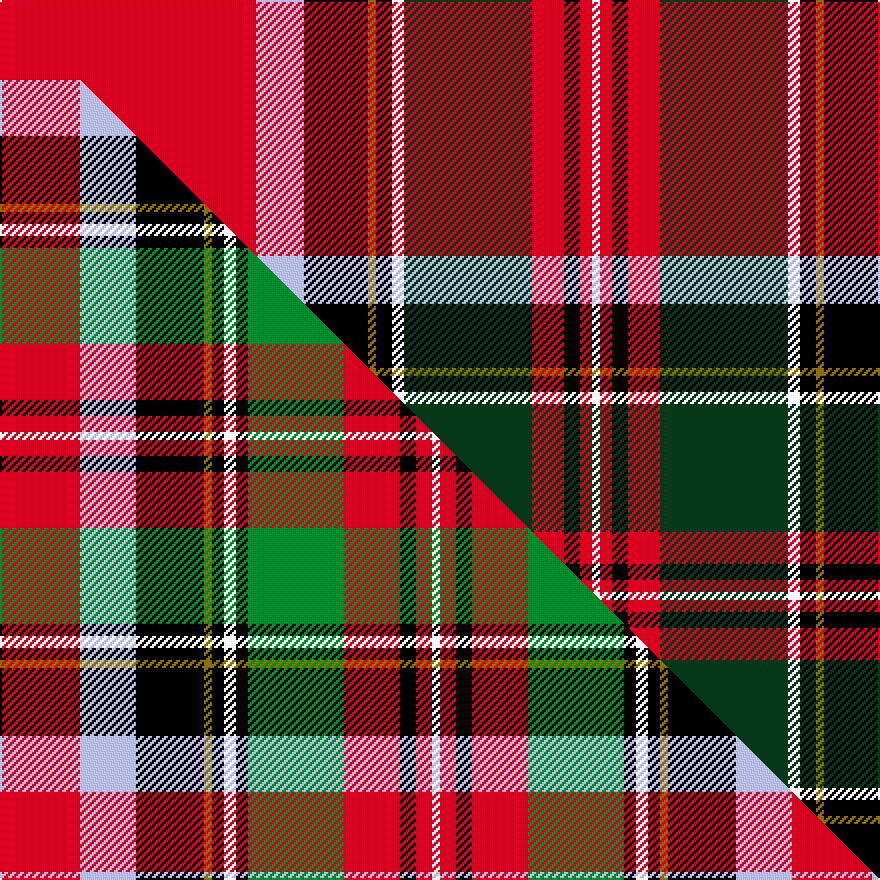

This page is one **sett** — a single exact thread-count. It belongs to the [tartan](/setts/r64lb12k16y2k4w3dg32r8k4r3w2/)
(the same proportion at any scale), whose colour order is pattern [RWKGKWGRKRW](/stripes/rwkgkwgrkrw/).

Part of the [Royal Stewart](/tartans/royal-stewart/) tartan — the named design grouping this sett with its other cloths.

Sourced from weddslist.  It is a [11 stripe tartan](/stripes/stripes11/).

Original link http://www.weddslist.com/cgi-bin/tartans/pg.pl?source=sts

## Thread count
R/128 LB24 K32 Y4 K8 W6 DG64 R16 K8 R6 W/4

One full sett is **468 threads**.

## Palette
<table><thead><tr><th>Colour</th><th>Shade</th><th>OKLCh</th></tr></thead><tbody><tr><td>LB</td><td><code style="background-color:#B5BBDE;">#B5BBDE</code> <small style="color:#888">#B5BBDE</small></td><td><small style="color:#888">oklch(79.9% 0.050 277.6)</small></td></tr><tr><td>DG</td><td><code style="background-color:#053819;">#053819</code> <small style="color:#888">#053819</small></td><td><small style="color:#888">oklch(30.0% 0.075 151.3)</small></td></tr><tr><td>K</td><td><code style="background-color:#000000;">#000000</code> <small style="color:#888">#000000</small></td><td><small style="color:#888">oklch(0.0% 0.000 0.0)</small></td></tr><tr><td>W</td><td><code style="background-color:#F7F7F7;">#F7F7F7</code> <small style="color:#888">#F7F7F7</small></td><td><small style="color:#888">oklch(97.6% 0.000 89.9)</small></td></tr><tr><td>R</td><td><code style="background-color:#D60020;">#D60020</code> <small style="color:#888">#D60020</small></td><td><small style="color:#888">oklch(55.2% 0.224 25.5)</small></td></tr><tr><td>Y</td><td><code style="background-color:#8B6E00;">#8B6E00</code> <small style="color:#888">#8B6E00</small></td><td><small style="color:#888">oklch(55.1% 0.113 90.4)</small></td></tr></tbody></table>

# Sample pattern

## Compared to the master

This cloth is one sett of its design; the master sett (the exemplar the design is anchored on) is below for comparison.

Its **ΔTartan distance** from the master is **1.72** — the same measure the nearest-tartans table ranks by (0 is identical; a re-scale of the same cloth is near 0, a recolour or a different proportion further).

<figure class="master-compare" style="margin:0">

this sett
master sett ★

<figcaption style="color:#888;font-size:smaller">One weave of this sett against the <a href="/setts/r20lb14k17y2k3w3k3g24r14k4r4w2/">master sett ★</a>, split on the diagonal: a shared proportion runs seamlessly across it with only the shades shifting; a different proportion breaks on it.</figcaption>
</figure>

## Nearest tartan variants

The nearest existing variants by ΔTartan distance, with this cloth at the top so the swatches line up against it.

ΔTartan

Threads

Variant

Sett

—

468

<a href="/variants/s11/r64lb12k16y2k4w3dg32r8k4r3w2~x2/">Royal Stewart</a>

<a href="/ttd/edit/#slug=r48lb8k10y2k3w2g25r10k3r3w2~x2&amp;base=r64lb12k16y2k4w3dg32r8k4r3w2~x2" title="compare in the TTD">0.40</a>

364

<a href="/variants/s11/r48lb8k10y2k3w2g25r10k3r3w2~x2/">Followers' Plaid</a>

<a href="/ttd/edit/#slug=db3r2db2r35dy2db3k2db5k4g13k1w3~x2&amp;base=r64lb12k16y2k4w3dg32r8k4r3w2~x2" title="compare in the TTD">1.34</a>

288

<a href="/variants/s12/db3r2db2r35dy2db3k2db5k4g13k1w3~x2/">Celtic Nations</a>

<a href="/ttd/edit/#slug=db3r2db2r35ly2db3k2db5k4g13k1w3~x2&amp;base=r64lb12k16y2k4w3dg32r8k4r3w2~x2" title="compare in the TTD">1.34</a>

288

<a href="/variants/s12/db3r2db2r35ly2db3k2db5k4g13k1w3~x2/">Celtic Nations (Fashion)</a>

<a href="/ttd/edit/#slug=r18db2k3y1k1w1k1g4r2k1r1w1~x4&amp;base=r64lb12k16y2k4w3dg32r8k4r3w2~x2" title="compare in the TTD">1.74</a>

212

<a href="/variants/s12/r18db2k3y1k1w1k1g4r2k1r1w1~x4/">Royal Stewart Royal Family Tartan</a>

<a href="/ttd/edit/#slug=r18db2k3y1k1w1k1g4r2k1r1w1~x2&amp;base=r64lb12k16y2k4w3dg32r8k4r3w2~x2" title="compare in the TTD">1.74</a>

106

<a href="/variants/s12/r18db2k3y1k1w1k1g4r2k1r1w1~x2/">Royal Stewart MINI Design Tartan</a>

<a href="/ttd/edit/#slug=r18db2k3y1k1w1k1g4r2k1r1w1~x8&amp;base=r64lb12k16y2k4w3dg32r8k4r3w2~x2" title="compare in the TTD">1.74</a>

424

<a href="/variants/s12/r18db2k3y1k1w1k1g4r2k1r1w1~x8/">Royal Stewart (Universal)</a>

<a href="/ttd/edit/#slug=r18db2k3y1k1w1k1g4r2k1r1w1~x8~db1406275&amp;base=r64lb12k16y2k4w3dg32r8k4r3w2~x2" title="compare in the TTD">1.74</a>

424

<a href="/variants/s12/r18db2k3y1k1w1k1g4r2k1r1w1~x8~db1406275/">Stewart/Stuart, Royal #2</a>

<a href="/ttd/edit/#slug=r18b2k3y1k1w1k1g4r2k1r1w1~x4&amp;base=r64lb12k16y2k4w3dg32r8k4r3w2~x2" title="compare in the TTD">1.74</a>

212

<a href="/variants/s12/r18b2k3y1k1w1k1g4r2k1r1w1~x4/">Royal Stewart</a>

<a href="/ttd/edit/#slug=r68n5k9y3k3lb3k3dg20r9k3r5lb4&amp;base=r64lb12k16y2k4w3dg32r8k4r3w2~x2" title="compare in the TTD">1.77</a>

198

<a href="/variants/s12/r68n5k9y3k3lb3k3dg20r9k3r5lb4/">British Caledonian Airways #4</a>

<a href="/ttd/edit/#slug=r41g13k8w2y2r1y2w2db6k2r3y2w5&amp;base=r64lb12k16y2k4w3dg32r8k4r3w2~x2" title="compare in the TTD">1.84</a>

132

<a href="/variants/s13/r41g13k8w2y2r1y2w2db6k2r3y2w5/">MacGill</a>

## Neighbour map

Every grey dot is one of 13620 variants placed by the first two principal components of the ΔTartan feature space (42% of its variance). Red is this tartan; blue dots are its nearest — click one to open its page.

<svg viewBox="0 0 640 380" role="img" style="max-width:100%;height:auto;border:1px solid #e0e0e0;border-radius:4px;display:block" xmlns="http://www.w3.org/2000/svg"><image href="/nn/cloud.v1.png" width="640" height="380"/><a href="/variants/s11/r48lb8k10y2k3w2g25r10k3r3w2~x2/"><circle cx="232.8" cy="68.4" r="4" fill="#3465a4"><title>Followers' Plaid</title></circle></a><a href="/variants/s12/db3r2db2r35dy2db3k2db5k4g13k1w3~x2/"><circle cx="234.3" cy="45.0" r="4" fill="#3465a4"><title>Celtic Nations</title></circle></a><a href="/variants/s12/db3r2db2r35ly2db3k2db5k4g13k1w3~x2/"><circle cx="232.3" cy="44.6" r="4" fill="#3465a4"><title>Celtic Nations (Fashion)</title></circle></a><a href="/variants/s12/r18db2k3y1k1w1k1g4r2k1r1w1~x4/"><circle cx="261.1" cy="57.2" r="4" fill="#3465a4"><title>Royal Stewart Royal Family Tartan</title></circle></a><a href="/variants/s12/r18db2k3y1k1w1k1g4r2k1r1w1~x2/"><circle cx="261.1" cy="57.2" r="4" fill="#3465a4"><title>Royal Stewart MINI Design Tartan</title></circle></a><a href="/variants/s12/r18db2k3y1k1w1k1g4r2k1r1w1~x8/"><circle cx="261.1" cy="57.2" r="4" fill="#3465a4"><title>Royal Stewart (Universal)</title></circle></a><a href="/variants/s12/r18db2k3y1k1w1k1g4r2k1r1w1~x8~db1406275/"><circle cx="262.2" cy="57.4" r="4" fill="#3465a4"><title>Stewart/Stuart, Royal #2</title></circle></a><a href="/variants/s12/r18b2k3y1k1w1k1g4r2k1r1w1~x4/"><circle cx="262.1" cy="57.7" r="4" fill="#3465a4"><title>Royal Stewart</title></circle></a><a href="/variants/s12/r68n5k9y3k3lb3k3dg20r9k3r5lb4/"><circle cx="301.7" cy="50.1" r="4" fill="#3465a4"><title>British Caledonian Airways #4</title></circle></a><a href="/variants/s13/r41g13k8w2y2r1y2w2db6k2r3y2w5/"><circle cx="233.2" cy="30.1" r="4" fill="#3465a4"><title>MacGill</title></circle></a><circle cx="227.6" cy="53.6" r="5" fill="#c00000"/><text x="320" y="376" text-anchor="middle" font-size="11" fill="#999">ground</text><text x="11" y="190" text-anchor="middle" font-size="11" fill="#999" transform="rotate(-90 11 190)">complexity</text></svg>

ID: /variants/s11/r64lb12k16y2k4w3dg32r8k4r3w2~x2/
