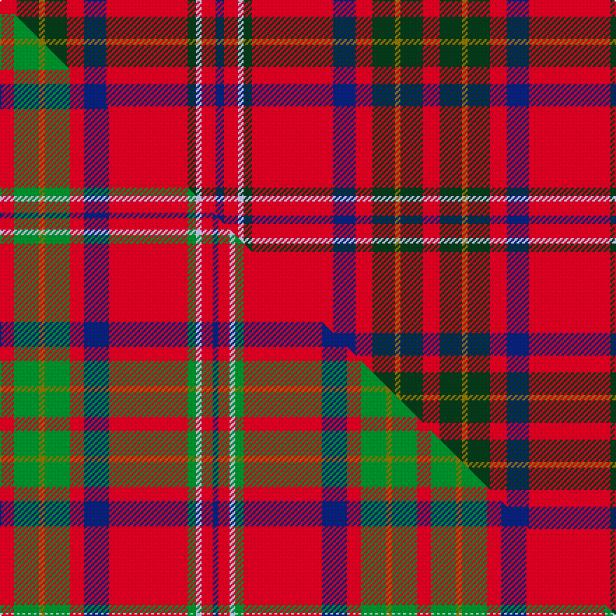

This is one **variant** — a specific cloth: this exact thread count and colourway, with its own
provenance below. It is one weaving of the [sett](/setts/r6dg8y2dg8r6db8r29dg3lb2r5db3/) (the scale-free proportion — the
same cloth at any scale or shade), whose colour order is pattern [BRWGRBRGGGR](/stripes/brwgrbrgggr/).

Part of the [Loch Creran](/tartans/l/lo/loch-creran/) tartan — the named design grouping this sett with its other cloths.

Sourced from tartans-authority.  It is a [11 stripe tartan](/stripes/stripes11/).

Original link [https://www.tartanregister.gov.uk/tartanDetails.aspx?ref=10529](https://www.tartanregister.gov.uk/tartanDetails.aspx?ref=10529)

Dataset <small>— provenance for this record, inherited from the source manifest</small>

<dl class="dataset-prov">
<dt>source</dt><dd><a href="/sources/tartans-authority/">Scottish Tartans Authority</a></dd>
<dt>data captured from</dt><dd><a href="https://github.com/thetartan/tartan-database/blob/master/data/tartans-authority/data.csv">https://github.com/thetartan/tartan-database/blob/master/data/tartans-authority/data.csv</a></dd>
<dt>data date</dt><dd>March 21st 2011 <small>(this record)</small></dd>
<dt>licence</dt><dd><a href="https://creativecommons.org/licenses/by-nc-nd/4.0/">CC BY-NC-ND 4.0</a></dd>
</dl>

Capture chain <small>— the hands this data passed through, oldest first; each capture carries its own licence</small>

<ol class="capture-chain">
<li><a href="https://www.tartansauthority.com/">Scottish Tartans Authority</a> <small>the heritage body's archive — its tartan-ferret record browser is retired (links repaired to the SRT, above)</small></li>
<li><a href="https://github.com/thetartan/tartan-database">thetartan/tartan-database</a> <small>2016-2017</small> · <a href="https://creativecommons.org/licenses/by-nc-nd/4.0/">CC BY-NC-ND 4.0</a> <small>Levko Kravets's frozen compilation — the capture we vendored, and where its CC licence text came from</small></li>
<li>this dictionary <small>captured 2026-06-10 · commit 5bf86c7566</small> <small>each re-capture is a git commit to data/sources</small></li>
</ol>

## Register references

External register numbers recorded for this tartan.

- Scottish Register of Tartans: [10529](https://www.tartanregister.gov.uk/tartanDetails?ref=10529)
- Scottish Tartans Authority (ITI): 10529

## Thread count
R/12 DG16 Y4 DG16 R12 DB16 R58 DG6 LB4 R10 DB/6

One full sett is **302 threads**.

## Palette
<table><thead><tr><th>Colour</th><th>Shade</th><th>OKLCh</th></tr></thead><tbody><tr><td>DB</td><td><code style="background-color:#082077;">#082077</code> <small style="color:#888">#082077</small></td><td><small style="color:#888">oklch(30.0% 0.149 265.1)</small></td></tr><tr><td>DG</td><td><code style="background-color:#053819;">#053819</code> <small style="color:#888">#053819</small></td><td><small style="color:#888">oklch(30.0% 0.075 151.3)</small></td></tr><tr><td>LB</td><td><code style="background-color:#B5BBDE;">#B5BBDE</code> <small style="color:#888">#B5BBDE</small></td><td><small style="color:#888">oklch(79.9% 0.050 277.6)</small></td></tr><tr><td>R</td><td><code style="background-color:#D60020;">#D60020</code> <small style="color:#888">#D60020</small></td><td><small style="color:#888">oklch(55.2% 0.224 25.5)</small></td></tr><tr><td>Y</td><td><code style="background-color:#8B6E00;">#8B6E00</code> <small style="color:#888">#8B6E00</small></td><td><small style="color:#888">oklch(55.1% 0.113 90.4)</small></td></tr></tbody></table>

# Sample pattern

## Compared to the master

This cloth is one sett of its design; the master sett (the exemplar the design is anchored on) is below for comparison.

Its **ΔTartan distance** from the master is **0.33** — the same measure the nearest-tartans table ranks by (0 is identical; a re-scale of the same cloth is near 0, a recolour or a different proportion further).

<figure class="master-compare" style="margin:0">

this sett
master sett ★

<figcaption style="color:#888;font-size:smaller">One weave of this sett against the <a href="/setts/r5g9y2g9r5db9r28g3lb2r4db2/">master sett ★</a>, split on the diagonal: a shared proportion runs seamlessly across it with only the shades shifting; a different proportion breaks on it.</figcaption>
</figure>

## Nearest tartan variants

The nearest existing variants by ΔTartan distance, with this cloth at the top so the swatches line up against it.

ΔTartan

Threads

Variant

Sett

—

302

<a href="/variants/s11/r6dg8y2dg8r6db8r29dg3lb2r5db3~x2/">Loch Creran (District)</a>

<a href="/ttd/edit/#slug=r5g9y2g9r5db9r28g3lb2r4db2~x2&amp;base=r6dg8y2dg8r6db8r29dg3lb2r5db3~x2" title="compare in the TTD">0.33</a>

298

<a href="/variants/s11/r5g9y2g9r5db9r28g3lb2r4db2~x2/">Loch Creran</a>

<a href="/ttd/edit/#slug=y3r4db2r31g10lb2r5db12r6g3~x2&amp;base=r6dg8y2dg8r6db8r29dg3lb2r5db3~x2" title="compare in the TTD">1.57</a>

300

<a href="/variants/s10/y3r4db2r31g10lb2r5db12r6g3~x2/">Loch Linnhe</a>

<a href="/ttd/edit/#slug=r16db6r6db5r40lb3r6dg12r5dp4r5dg30r5db5r12&amp;base=r6dg8y2dg8r6db8r29dg3lb2r5db3~x2" title="compare in the TTD">1.58</a>

292

<a href="/variants/s15/r16db6r6db5r40lb3r6dg12r5dp4r5dg30r5db5r12/">Walkers Shortbread</a>

<a href="/ttd/edit/#slug=r23g3y1g3r2db18r2w1g3r2db2r23~x2&amp;base=r6dg8y2dg8r6db8r29dg3lb2r5db3~x2" title="compare in the TTD">2.21</a>

240

<a href="/variants/s12/r23g3y1g3r2db18r2w1g3r2db2r23~x2/">Mair Family Tartan</a>

<a href="/ttd/edit/#slug=r23g3ly1g3r2db18r2w1g3r2db2r23~x2&amp;base=r6dg8y2dg8r6db8r29dg3lb2r5db3~x2" title="compare in the TTD">2.21</a>

240

<a href="/variants/s12/r23g3ly1g3r2db18r2w1g3r2db2r23~x2/">Mair (Personal)</a>

<a href="/ttd/edit/#slug=db6dp2r2g5r2g2r2dp6r2lb2r24dp2r2dp2r6~x2&amp;base=r6dg8y2dg8r6db8r29dg3lb2r5db3~x2" title="compare in the TTD">2.34</a>

244

<a href="/variants/s15/db6dp2r2g5r2g2r2dp6r2lb2r24dp2r2dp2r6~x2/">Grant</a>

<a href="/ttd/edit/#slug=dy4db2r7db15r4db3r4db7r28dg7r6dg2&amp;base=r6dg8y2dg8r6db8r29dg3lb2r5db3~x2" title="compare in the TTD">2.37</a>

172

<a href="/variants/s12/dy4db2r7db15r4db3r4db7r28dg7r6dg2/">Walker Family Tartan</a>

<a href="/ttd/edit/#slug=db4r1db1r18db10r1g1r6g10r6w1r4db1~x2&amp;base=r6dg8y2dg8r6db8r29dg3lb2r5db3~x2" title="compare in the TTD">2.38</a>

246

<a href="/variants/s13/db4r1db1r18db10r1g1r6g10r6w1r4db1~x2/">Cameron of Locheil</a>

<a href="/ttd/edit/#slug=dy4r2dy2r2dy1r19dy3r2db11r3dy2r3lb2~x2&amp;base=r6dg8y2dg8r6db8r29dg3lb2r5db3~x2" title="compare in the TTD">2.43</a>

212

<a href="/variants/s13/dy4r2dy2r2dy1r19dy3r2db11r3dy2r3lb2~x2/">Châine des Rôtisseurs, (Grande Bretagne)</a>

<a href="/ttd/edit/#slug=r6g14r6db12r31lb2r4ly3~x2&amp;base=r6dg8y2dg8r6db8r29dg3lb2r5db3~x2" title="compare in the TTD">2.49</a>

294

<a href="/variants/s8/r6g14r6db12r31lb2r4ly3~x2/">Loch Lochy (District)</a>

## Neighbour map

Every grey dot is one of 13656 variants placed by the first two principal components of the ΔTartan feature space (42% of its variance). Red is this tartan; blue dots are its nearest — click one to open its page. The map is a flat projection of a many-dimensional space — [how to read it](/posts/neighbourhood-maps/).

<svg viewBox="0 0 640 380" role="img" style="max-width:100%;height:auto;border:1px solid #e0e0e0;border-radius:4px;display:block" xmlns="http://www.w3.org/2000/svg"><image href="/nn/cloud.v1.png" width="640" height="380"/><a href="/variants/s11/r5g9y2g9r5db9r28g3lb2r4db2~x2/"><circle cx="295.1" cy="146.7" r="4" fill="#3465a4"><title>Loch Creran</title></circle></a><a href="/variants/s10/y3r4db2r31g10lb2r5db12r6g3~x2/"><circle cx="331.0" cy="138.6" r="4" fill="#3465a4"><title>Loch Linnhe</title></circle></a><a href="/variants/s15/r16db6r6db5r40lb3r6dg12r5dp4r5dg30r5db5r12/"><circle cx="320.5" cy="133.3" r="4" fill="#3465a4"><title>Walkers Shortbread</title></circle></a><a href="/variants/s12/r23g3y1g3r2db18r2w1g3r2db2r23~x2/"><circle cx="367.2" cy="101.2" r="4" fill="#3465a4"><title>Mair Family Tartan</title></circle></a><a href="/variants/s12/r23g3ly1g3r2db18r2w1g3r2db2r23~x2/"><circle cx="365.2" cy="100.6" r="4" fill="#3465a4"><title>Mair (Personal)</title></circle></a><a href="/variants/s15/db6dp2r2g5r2g2r2dp6r2lb2r24dp2r2dp2r6~x2/"><circle cx="332.0" cy="121.6" r="4" fill="#3465a4"><title>Grant</title></circle></a><a href="/variants/s12/dy4db2r7db15r4db3r4db7r28dg7r6dg2/"><circle cx="319.6" cy="156.5" r="4" fill="#3465a4"><title>Walker Family Tartan</title></circle></a><a href="/variants/s13/db4r1db1r18db10r1g1r6g10r6w1r4db1~x2/"><circle cx="320.6" cy="138.0" r="4" fill="#3465a4"><title>Cameron of Locheil</title></circle></a><a href="/variants/s13/dy4r2dy2r2dy1r19dy3r2db11r3dy2r3lb2~x2/"><circle cx="337.3" cy="130.0" r="4" fill="#3465a4"><title>Châine des Rôtisseurs, (Grande Bretagne)</title></circle></a><a href="/variants/s8/r6g14r6db12r31lb2r4ly3~x2/"><circle cx="330.6" cy="156.4" r="4" fill="#3465a4"><title>Loch Lochy (District)</title></circle></a><circle cx="317.9" cy="142.5" r="5" fill="#c00000"/><text x="320" y="376" text-anchor="middle" font-size="11" fill="#999">ground</text><text x="11" y="190" text-anchor="middle" font-size="11" fill="#999" transform="rotate(-90 11 190)">complexity</text></svg>

ID: /variants/s11/r6dg8y2dg8r6db8r29dg3lb2r5db3~x2/
