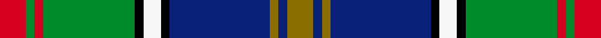

This page is one **sett** — a single exact thread-count. It belongs to the [tartan](/setts/r6g2r2g21k2w4k2db23y2db2y6/)
(the same proportion at any scale), whose colour order is pattern [GBGBKWKGRGR](/stripes/gbgbkwkgrgr/).

Sourced from register-of-tartans.  It is a [11 stripe tartan](/stripes/stripes11/).

Original link https://www.tartanregister.gov.uk/tartanDetails.aspx?ref=1359

## Provenance

Earliest known date: 1989 Colours chosen to reflect a European essence that will endure beyond the 1990 'Year of Culture'. Supply and manufacture only at MacDonald MacKay (Kiltmakers) Ltd., Glasgow.

4 attestations — the source records this cloth was collapsed from (oldest owns this page)

<ul>
<li>01/01/1989 — Glasgow, City of Culture (register-of-tartans, <a href="https://www.tartanregister.gov.uk/tartanDetails.aspx?ref=1359">record</a>)  <em>Designed by MacDonald and MacKay kiltmakers, Glasgow, in recognition of City of Glasgow having been designated European City of Culture, 1990. Also known as The Culture. Woven by Lochcarron.</em></li>
<li>1990? — Culture, The (Corporate) (tartans-authority, <a href="http://www.tartansauthority.com/tartan-ferret/display/1534/">record</a>)  <em>Designed by Glasgow kiltmakers MacDonald & MacKay Ltd with colours representing a 'European essence' that will endure beyond the 1990 'Year of Culture'. Manufacture & supply only from MacDonald & Mackay. Sample.</em></li>
<li>undated — Culture, The... (weddslist, <a href="http://www.weddslist.com/cgi-bin/tartans/pg.pl?source=sts">record</a>) </li>
<li>undated — Culture The... Corporate Tartan (house-of-tartan, <a href="http://www.house-of-tartan.scotland.net/house/TartanViewjs.asp?colr=Def&tnam=1534">record</a>) </li>
</ul>

## Register references

External register numbers recorded for this tartan.

- Scottish Register of Tartans: [1359](https://www.tartanregister.gov.uk/tartanDetails.aspx?ref=1359)
- Scottish Tartans Authority (ITI): 1534

## Thread count
R/12 G4 R4 G42 K4 W8 K4 DB46 Y4 DB4 Y/12

One full sett is **264 threads**.

## Palette
<table><thead><tr><th>Colour</th><th>Shade</th><th>OKLCh</th></tr></thead><tbody><tr><td>DB</td><td><code style="background-color:#082077;">#082077</code> <small style="color:#888">#082077</small></td><td><small style="color:#888">oklch(30.0% 0.149 265.1)</small></td></tr><tr><td>G</td><td><code style="background-color:#008B2A;">#008B2A</code> <small style="color:#888">#008B2A</small></td><td><small style="color:#888">oklch(55.4% 0.170 145.9)</small></td></tr><tr><td>K</td><td><code style="background-color:#000000;">#000000</code> <small style="color:#888">#000000</small></td><td><small style="color:#888">oklch(0.0% 0.000 0.0)</small></td></tr><tr><td>R</td><td><code style="background-color:#D60020;">#D60020</code> <small style="color:#888">#D60020</small></td><td><small style="color:#888">oklch(55.2% 0.224 25.5)</small></td></tr><tr><td>W</td><td><code style="background-color:#F7F7F7;">#F7F7F7</code> <small style="color:#888">#F7F7F7</small></td><td><small style="color:#888">oklch(97.6% 0.000 89.9)</small></td></tr><tr><td>Y</td><td><code style="background-color:#8B6E00;">#8B6E00</code> <small style="color:#888">#8B6E00</small></td><td><small style="color:#888">oklch(55.1% 0.113 90.4)</small></td></tr></tbody></table>

# Sample pattern

## Nearest tartan variants

The nearest existing variants by ΔTartan distance, with this cloth at the top so the swatches line up against it.

ΔTartan

Threads

Variant

Sett

—

264

<a href="/variants/s11/r6g2r2g21k2w4k2db23y2db2y6~x2/">Glasgow, City of Culture</a>

<a href="/ttd/edit/#slug=t5dr3t30k6w4k6dg24dr4dg6dr3&amp;base=r6g2r2g21k2w4k2db23y2db2y6~x2" title="compare in the TTD">0.99</a>

174

<a href="/variants/s10/t5dr3t30k6w4k6dg24dr4dg6dr3/">Law Society of Scotland</a>

<a href="/ttd/edit/#slug=r4k2g25k2lb10k2g4k2db25k2y4~x2&amp;base=r6g2r2g21k2w4k2db23y2db2y6~x2" title="compare in the TTD">1.16</a>

312

<a href="/variants/s11/r4k2g25k2lb10k2g4k2db25k2y4~x2/">Ayrton (amended)</a>

<a href="/ttd/edit/#slug=dy4k2db25k2g4k2lb10k2g25k2r4~x2&amp;base=r6g2r2g21k2w4k2db23y2db2y6~x2" title="compare in the TTD">1.27</a>

312

<a href="/variants/s11/dy4k2db25k2g4k2lb10k2g25k2r4~x2/">Ayrton (1979) (Personal)</a>

<a href="/ttd/edit/#slug=r3k1lb10k1g2k1db8g12k1y3~x2&amp;base=r6g2r2g21k2w4k2db23y2db2y6~x2" title="compare in the TTD">1.72</a>

156

<a href="/variants/s10/r3k1lb10k1g2k1db8g12k1y3~x2/">Sullivan (Estimated threadcount)</a>

<a href="/ttd/edit/#slug=lb6g13k12t3k3ly3t30k3n11ly3n5~x2&amp;base=r6g2r2g21k2w4k2db23y2db2y6~x2" title="compare in the TTD">1.82</a>

346

<a href="/variants/s11/lb6g13k12t3k3ly3t30k3n11ly3n5~x2/">State Seal of Kentucky (Fashion)</a>

<a href="/ttd/edit/#slug=g9w9k2w2k2y2dg28g2db12g4~x2&amp;base=r6g2r2g21k2w4k2db23y2db2y6~x2" title="compare in the TTD">1.86</a>

262

<a href="/variants/s10/g9w9k2w2k2y2dg28g2db12g4~x2/">Order of Saint Lazarus</a>

<a href="/ttd/edit/#slug=r2k1y2g3y4g3db12k1w2~x4&amp;base=r6g2r2g21k2w4k2db23y2db2y6~x2" title="compare in the TTD">1.91</a>

224

<a href="/variants/s9/r2k1y2g3y4g3db12k1w2~x4/">Federated Women's Institutes of</a>

<a href="/ttd/edit/#slug=db25g5db2y2k2r3g20r20db2w2k2r2~x2&amp;base=r6g2r2g21k2w4k2db23y2db2y6~x2" title="compare in the TTD">1.97</a>

294

<a href="/variants/s12/db25g5db2y2k2r3g20r20db2w2k2r2~x2/">Quebec, Plaid Du</a>

<a href="/ttd/edit/#slug=r7g20ly2g4k5db4k2db20k3w1~x2&amp;base=r6g2r2g21k2w4k2db23y2db2y6~x2" title="compare in the TTD">2.04</a>

256

<a href="/variants/s10/r7g20ly2g4k5db4k2db20k3w1~x2/">McMeeken (Name)</a>

<a href="/ttd/edit/#slug=r7g20y2g4k5db4k2db20k3w1~x2&amp;base=r6g2r2g21k2w4k2db23y2db2y6~x2" title="compare in the TTD">2.04</a>

256

<a href="/variants/s10/r7g20y2g4k5db4k2db20k3w1~x2/">McMeeken</a>

## Neighbour map

Every grey dot is one of 13620 variants placed by the first two principal components of the ΔTartan feature space (42% of its variance). Red is this tartan; blue dots are its nearest — click one to open its page.

<svg viewBox="0 0 640 380" role="img" style="max-width:100%;height:auto;border:1px solid #e0e0e0;border-radius:4px;display:block" xmlns="http://www.w3.org/2000/svg"><image href="/nn/cloud.v1.png" width="640" height="380"/><a href="/variants/s10/t5dr3t30k6w4k6dg24dr4dg6dr3/"><circle cx="158.8" cy="157.7" r="4" fill="#3465a4"><title>Law Society of Scotland</title></circle></a><a href="/variants/s11/r4k2g25k2lb10k2g4k2db25k2y4~x2/"><circle cx="115.8" cy="116.2" r="4" fill="#3465a4"><title>Ayrton (amended)</title></circle></a><a href="/variants/s11/dy4k2db25k2g4k2lb10k2g25k2r4~x2/"><circle cx="116.0" cy="116.1" r="4" fill="#3465a4"><title>Ayrton (1979) (Personal)</title></circle></a><a href="/variants/s10/r3k1lb10k1g2k1db8g12k1y3~x2/"><circle cx="89.2" cy="135.5" r="4" fill="#3465a4"><title>Sullivan (Estimated threadcount)</title></circle></a><a href="/variants/s11/lb6g13k12t3k3ly3t30k3n11ly3n5~x2/"><circle cx="98.2" cy="145.7" r="4" fill="#3465a4"><title>State Seal of Kentucky (Fashion)</title></circle></a><a href="/variants/s10/g9w9k2w2k2y2dg28g2db12g4~x2/"><circle cx="125.8" cy="121.7" r="4" fill="#3465a4"><title>Order of Saint Lazarus</title></circle></a><a href="/variants/s9/r2k1y2g3y4g3db12k1w2~x4/"><circle cx="130.4" cy="137.8" r="4" fill="#3465a4"><title>Federated Women's Institutes of</title></circle></a><a href="/variants/s12/db25g5db2y2k2r3g20r20db2w2k2r2~x2/"><circle cx="130.9" cy="109.9" r="4" fill="#3465a4"><title>Quebec, Plaid Du</title></circle></a><a href="/variants/s10/r7g20ly2g4k5db4k2db20k3w1~x2/"><circle cx="139.1" cy="114.2" r="4" fill="#3465a4"><title>McMeeken (Name)</title></circle></a><a href="/variants/s10/r7g20y2g4k5db4k2db20k3w1~x2/"><circle cx="141.7" cy="114.6" r="4" fill="#3465a4"><title>McMeeken</title></circle></a><circle cx="121.3" cy="122.7" r="5" fill="#c00000"/><text x="320" y="376" text-anchor="middle" font-size="11" fill="#999">ground</text><text x="11" y="190" text-anchor="middle" font-size="11" fill="#999" transform="rotate(-90 11 190)">complexity</text></svg>

ID: /variants/s11/r6g2r2g21k2w4k2db23y2db2y6~x2/
