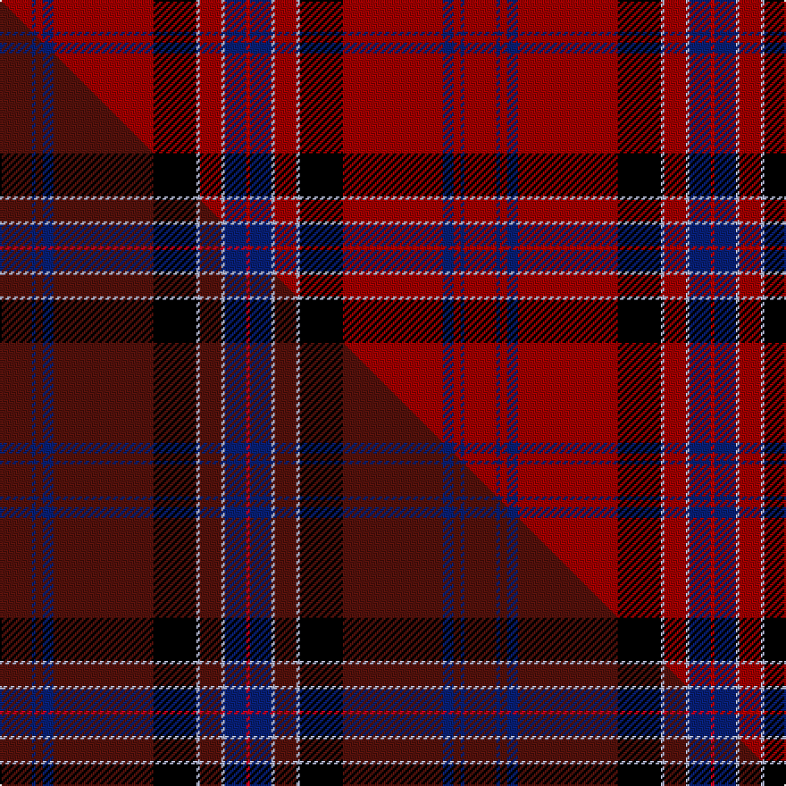

This is one **variant** — a specific cloth: this exact thread count and colourway, with its own
provenance below. It is one weaving of the [sett](/setts/r9db1r2db3r28k12lb1r6lb1db6ri1/) (the scale-free proportion — the
same cloth at any scale or shade), whose colour order is pattern [RBRBRKWRWBR](/stripes/rbrbrkwrwbr/).

Part of the [New York Caledonian Club Dress](/tartans/new-york-caledonian-club-dress/) tartan — the named design grouping this sett with its other cloths.

Sourced from tartans-authority.  It is a [11 stripe tartan](/stripes/stripes11/).

Original link [https://www.tartanregister.gov.uk/tartanDetails.aspx?ref=11281](https://www.tartanregister.gov.uk/tartanDetails.aspx?ref=11281)

Dataset <small>— provenance for this record, inherited from the source manifest</small>

<dl class="dataset-prov">
<dt>source</dt><dd><a href="/sources/tartans-authority/">Scottish Tartans Authority</a></dd>
<dt>data captured from</dt><dd><a href="https://github.com/thetartan/tartan-database/blob/master/data/tartans-authority/data.csv">https://github.com/thetartan/tartan-database/blob/master/data/tartans-authority/data.csv</a></dd>
<dt>data date</dt><dd>2015 <small>(this record)</small></dd>
<dt>licence</dt><dd><a href="https://creativecommons.org/licenses/by-nc-nd/4.0/">CC BY-NC-ND 4.0</a></dd>
</dl>

Capture chain <small>— the hands this data passed through, oldest first; each capture carries its own licence</small>

<ol class="capture-chain">
<li><a href="https://www.tartansauthority.com/">Scottish Tartans Authority</a> <small>the heritage body's archive — its tartan-ferret record browser is retired (links repaired to the SRT, above)</small></li>
<li><a href="https://github.com/thetartan/tartan-database">thetartan/tartan-database</a> <small>2016-2017</small> · <a href="https://creativecommons.org/licenses/by-nc-nd/4.0/">CC BY-NC-ND 4.0</a> <small>Levko Kravets's frozen compilation — the capture we vendored, and where its CC licence text came from</small></li>
<li>this dictionary <small>captured 2026-06-10 · commit 5bf86c7566</small> <small>each re-capture is a git commit to data/sources</small></li>
</ol>

## Register references

External register numbers recorded for this tartan.

- Scottish Register of Tartans: [11281](https://www.tartanregister.gov.uk/tartanDetails?ref=11281)
- Scottish Tartans Authority (ITI): 11281

## Thread count
R/18 DB2 R4 DB6 R56 K24 LB2 R12 LB2 DB12 Ri/2

One full sett is **260 threads**.

## Palette
<table><thead><tr><th>Colour</th><th>Shade</th><th>OKLCh</th></tr></thead><tbody><tr><td>DB</td><td><code style="background-color:#082077;">#082077</code> <small style="color:#888">#082077</small></td><td><small style="color:#888">oklch(30.0% 0.149 265.1)</small></td></tr><tr><td>R</td><td><code style="background-color:#A00000;">#A00000</code> <small style="color:#888">#A00000</small></td><td><small style="color:#888">oklch(44.3% 0.182 29.2)</small></td></tr><tr><td>K</td><td><code style="background-color:#000000;">#000000</code> <small style="color:#888">#000000</small></td><td><small style="color:#888">oklch(0.0% 0.000 0.0)</small></td></tr><tr><td>LB</td><td><code style="background-color:#B5BBDE;">#B5BBDE</code> <small style="color:#888">#B5BBDE</small></td><td><small style="color:#888">oklch(79.9% 0.050 277.6)</small></td></tr><tr><td>R</td><td><code style="background-color:#C80000;">#C80000</code> <small style="color:#888">#C80000</small></td><td><small style="color:#888">oklch(52.3% 0.215 29.2)</small></td></tr></tbody></table>

# Sample pattern

## Compared to the master

This cloth is one sett of its design; the master sett (the exemplar the design is anchored on) is below for comparison.

Its **ΔTartan distance** from the master is **0.16** — the same measure the nearest-tartans table ranks by (0 is identical; a re-scale of the same cloth is near 0, a recolour or a different proportion further).

<figure class="master-compare" style="margin:0">

this sett
master sett ★

<figcaption style="color:#888;font-size:smaller">One weave of this sett against the <a href="/setts/dr9db1dr2db3dr28k12lb1dr6lb1db6r1/">master sett ★</a>, split on the diagonal: a shared proportion runs seamlessly across it with only the shades shifting; a different proportion breaks on it.</figcaption>
</figure>

## Nearest tartan variants

The nearest existing variants by ΔTartan distance, with this cloth at the top so the swatches line up against it.

ΔTartan

Threads

Variant

Sett

—

260

<a href="/variants/s11/r9db1r2db3r28k12lb1r6lb1db6ri1~x2~r1807033-ri2109032/">New York Caledonian Club Dress</a>

<a href="/ttd/edit/#slug=dr9db1dr2db3dr28k12lb1dr6lb1db6r1~x2&amp;base=r9db1r2db3r28k12lb1r6lb1db6ri1~x2~r1807033-ri2109032" title="compare in the TTD">0.16</a>

260

<a href="/variants/s11/dr9db1dr2db3dr28k12lb1dr6lb1db6r1~x2/">New York Caledonian Club Dress</a>

<a href="/ttd/edit/#slug=dg2r26db4r2k4r2dg8r4k1r1w2~x2&amp;base=r9db1r2db3r28k12lb1r6lb1db6ri1~x2~r1807033-ri2109032" title="compare in the TTD">2.19</a>

216

<a href="/variants/s11/dg2r26db4r2k4r2dg8r4k1r1w2~x2/">Stewart/Stuart of Rothesay (Sobieski)</a>

<a href="/ttd/edit/#slug=r40k3r2db12r2g2r2g2y3~x2&amp;base=r9db1r2db3r28k12lb1r6lb1db6ri1~x2~r1807033-ri2109032" title="compare in the TTD">2.39</a>

186

<a href="/variants/s9/r40k3r2db12r2g2r2g2y3~x2/">Oliver Family Tartan</a>

<a href="/ttd/edit/#slug=r15k1r1db5r1g1r1g1lo1~x8&amp;base=r9db1r2db3r28k12lb1r6lb1db6ri1~x2~r1807033-ri2109032" title="compare in the TTD">2.42</a>

304

<a href="/variants/s9/r15k1r1db5r1g1r1g1lo1~x8/">Oliver, Red (Clan)</a>

<a href="/ttd/edit/#slug=r15k1r1dt5r1g1r1g1lo1~x8~dt1703208&amp;base=r9db1r2db3r28k12lb1r6lb1db6ri1~x2~r1807033-ri2109032" title="compare in the TTD">2.47</a>

304

<a href="/variants/s9/r15k1r1dt5r1g1r1g1lo1~x8~dt1703208/">Oliver Dress (Red)</a>

<a href="/ttd/edit/#slug=w8r100k42g42r5k3r5lb42r100w8&amp;base=r9db1r2db3r28k12lb1r6lb1db6ri1~x2~r1807033-ri2109032" title="compare in the TTD">2.53</a>

694

<a href="/variants/s10/w8r100k42g42r5k3r5lb42r100w8/">Unidentified Plaid #7</a>

<a href="/ttd/edit/#slug=k3w1r20db4r4g10r4db4r20k1w3~x2&amp;base=r9db1r2db3r28k12lb1r6lb1db6ri1~x2~r1807033-ri2109032" title="compare in the TTD">2.61</a>

284

<a href="/variants/s11/k3w1r20db4r4g10r4db4r20k1w3~x2/">Hoben (Personal)</a>

<a href="/ttd/edit/#slug=r23db2r1o2r1db2r4db10k2lo2~x2&amp;base=r9db1r2db3r28k12lb1r6lb1db6ri1~x2~r1807033-ri2109032" title="compare in the TTD">2.74</a>

146

<a href="/variants/s10/r23db2r1o2r1db2r4db10k2lo2~x2/">Chang-Miller (Personal)</a>

<a href="/ttd/edit/#slug=r6y1r24g6db2k1db2k1db12r1~x2&amp;base=r9db1r2db3r28k12lb1r6lb1db6ri1~x2~r1807033-ri2109032" title="compare in the TTD">2.77</a>

210

<a href="/variants/s10/r6y1r24g6db2k1db2k1db12r1~x2/">MacEdward</a>

<a href="/ttd/edit/#slug=g2r26db4r2k4r2g8r4k1r1w2~x2&amp;base=r9db1r2db3r28k12lb1r6lb1db6ri1~x2~r1807033-ri2109032" title="compare in the TTD">2.89</a>

216

<a href="/variants/s11/g2r26db4r2k4r2g8r4k1r1w2~x2/">Stewart of Rothesay Clan Tartan</a>

## Neighbour map

Every grey dot is one of 13621 variants placed by the first two principal components of the ΔTartan feature space (42% of its variance). Red is this tartan; blue dots are its nearest — click one to open its page.

<svg viewBox="0 0 640 380" role="img" style="max-width:100%;height:auto;border:1px solid #e0e0e0;border-radius:4px;display:block" xmlns="http://www.w3.org/2000/svg"><image href="/nn/cloud.v1.png" width="640" height="380"/><a href="/variants/s11/dr9db1dr2db3dr28k12lb1dr6lb1db6r1~x2/"><circle cx="395.3" cy="103.0" r="4" fill="#3465a4"><title>New York Caledonian Club Dress</title></circle></a><a href="/variants/s11/dg2r26db4r2k4r2dg8r4k1r1w2~x2/"><circle cx="328.4" cy="72.0" r="4" fill="#3465a4"><title>Stewart/Stuart of Rothesay (Sobieski)</title></circle></a><a href="/variants/s9/r40k3r2db12r2g2r2g2y3~x2/"><circle cx="390.6" cy="83.3" r="4" fill="#3465a4"><title>Oliver Family Tartan</title></circle></a><a href="/variants/s9/r15k1r1db5r1g1r1g1lo1~x8/"><circle cx="368.2" cy="97.7" r="4" fill="#3465a4"><title>Oliver, Red (Clan)</title></circle></a><a href="/variants/s9/r15k1r1dt5r1g1r1g1lo1~x8~dt1703208/"><circle cx="388.5" cy="105.7" r="4" fill="#3465a4"><title>Oliver Dress (Red)</title></circle></a><a href="/variants/s10/w8r100k42g42r5k3r5lb42r100w8/"><circle cx="285.6" cy="86.6" r="4" fill="#3465a4"><title>Unidentified Plaid #7</title></circle></a><a href="/variants/s11/k3w1r20db4r4g10r4db4r20k1w3~x2/"><circle cx="318.9" cy="105.8" r="4" fill="#3465a4"><title>Hoben (Personal)</title></circle></a><a href="/variants/s10/r23db2r1o2r1db2r4db10k2lo2~x2/"><circle cx="336.3" cy="90.0" r="4" fill="#3465a4"><title>Chang-Miller (Personal)</title></circle></a><a href="/variants/s10/r6y1r24g6db2k1db2k1db12r1~x2/"><circle cx="305.5" cy="95.5" r="4" fill="#3465a4"><title>MacEdward</title></circle></a><a href="/variants/s11/g2r26db4r2k4r2g8r4k1r1w2~x2/"><circle cx="325.7" cy="73.2" r="4" fill="#3465a4"><title>Stewart of Rothesay Clan Tartan</title></circle></a><circle cx="352.7" cy="81.7" r="5" fill="#c00000"/><text x="320" y="376" text-anchor="middle" font-size="11" fill="#999">ground</text><text x="11" y="190" text-anchor="middle" font-size="11" fill="#999" transform="rotate(-90 11 190)">complexity</text></svg>

ID: /variants/s11/r9db1r2db3r28k12lb1r6lb1db6ri1~x2~r1807033-ri2109032/
