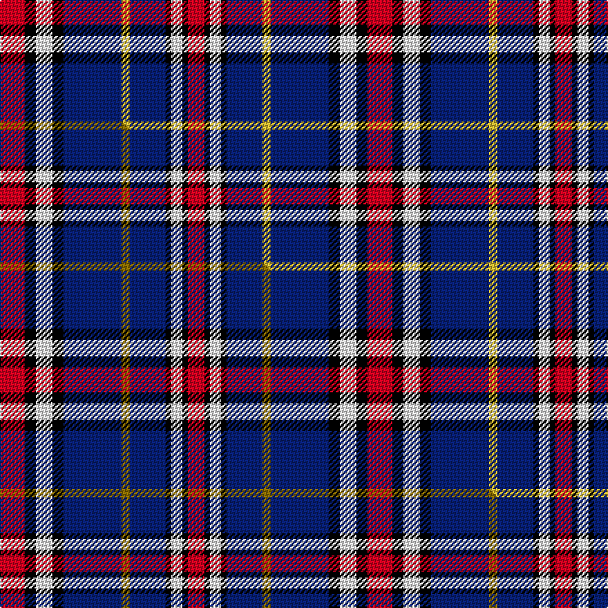

This is one **variant** — a specific cloth: this exact thread count and colourway, with its own
provenance below. It is one weaving of the [sett](/setts/r9k4w6k4db21ly3db13k2w4k2r6/) (the scale-free proportion — the
same cloth at any scale or shade), whose colour order is pattern [RKWKBYBKWKR](/stripes/rkwkbybkwkr/).

Part of the [Dauphinee](/tartans/d/da/dauphinee/) tartan — the named design grouping this sett with its other cloths.

Sourced from tartans-authority.  It is a [11 stripe tartan](/stripes/stripes11/).

Original link [https://www.tartanregister.gov.uk/tartanDetails.aspx?ref=10648](https://www.tartanregister.gov.uk/tartanDetails.aspx?ref=10648)

Dataset <small>— provenance for this record, inherited from the source manifest</small>

<dl class="dataset-prov">
<dt>source</dt><dd><a href="/sources/tartans-authority/">Scottish Tartans Authority</a></dd>
<dt>data captured from</dt><dd><a href="https://github.com/thetartan/tartan-database/blob/master/data/tartans-authority/data.csv">https://github.com/thetartan/tartan-database/blob/master/data/tartans-authority/data.csv</a></dd>
<dt>data date</dt><dd>27/06/2012 <small>(this record)</small></dd>
<dt>licence</dt><dd><a href="https://creativecommons.org/licenses/by-nc-nd/4.0/">CC BY-NC-ND 4.0</a></dd>
</dl>

Capture chain <small>— the hands this data passed through, oldest first; each capture carries its own licence</small>

<ol class="capture-chain">
<li><a href="https://www.tartansauthority.com/">Scottish Tartans Authority</a> <small>the heritage body's archive — its tartan-ferret record browser is retired (links repaired to the SRT, above)</small></li>
<li><a href="https://github.com/thetartan/tartan-database">thetartan/tartan-database</a> <small>2016-2017</small> · <a href="https://creativecommons.org/licenses/by-nc-nd/4.0/">CC BY-NC-ND 4.0</a> <small>Levko Kravets's frozen compilation — the capture we vendored, and where its CC licence text came from</small></li>
<li>this dictionary <small>captured 2026-06-10 · commit 5bf86c7566</small> <small>each re-capture is a git commit to data/sources</small></li>
</ol>

## Register references

External register numbers recorded for this tartan.

- Scottish Register of Tartans: [10648](https://www.tartanregister.gov.uk/tartanDetails?ref=10648)
- Scottish Tartans Authority (ITI): 10648

## Thread count
R/18 K8 W12 K8 DB42 LY6 DB26 K4 W8 K4 R/12

One full sett is **266 threads**.

## Palette
<table><thead><tr><th>Colour</th><th>Shade</th><th>OKLCh</th></tr></thead><tbody><tr><td>DB</td><td><code style="background-color:#082077;">#082077</code> <small style="color:#888">#082077</small></td><td><small style="color:#888">oklch(30.0% 0.149 265.1)</small></td></tr><tr><td>LY</td><td><code style="background-color:#DCBC32;">#DCBC32</code> <small style="color:#888">#DCBC32</small></td><td><small style="color:#888">oklch(80.0% 0.150 95.2)</small></td></tr><tr><td>K</td><td><code style="background-color:#000000;">#000000</code> <small style="color:#888">#000000</small></td><td><small style="color:#888">oklch(0.0% 0.000 0.0)</small></td></tr><tr><td>R</td><td><code style="background-color:#D60020;">#D60020</code> <small style="color:#888">#D60020</small></td><td><small style="color:#888">oklch(55.2% 0.224 25.5)</small></td></tr><tr><td>W</td><td><code style="background-color:#F7F7F7;">#F7F7F7</code> <small style="color:#888">#F7F7F7</small></td><td><small style="color:#888">oklch(97.6% 0.000 89.9)</small></td></tr></tbody></table>

# Sample pattern

## Compared to the master

This cloth is one sett of its design; the master sett (the exemplar the design is anchored on) is below for comparison.

Its **ΔTartan distance** from the master is **0.02** — the same measure the nearest-tartans table ranks by (0 is identical; a re-scale of the same cloth is near 0, a recolour or a different proportion further).

<figure class="master-compare" style="margin:0">

this sett
master sett ★

<figcaption style="color:#888;font-size:smaller">One weave of this sett against the <a href="/setts/r9k4w6k4db21y3db13k2w4k2r6/">master sett ★</a>, split on the diagonal: a shared proportion runs seamlessly across it with only the shades shifting; a different proportion breaks on it.</figcaption>
</figure>

## Nearest tartan variants

The nearest existing variants by ΔTartan distance, with this cloth at the top so the swatches line up against it.

ΔTartan

Threads

Variant

Sett

—

266

<a href="/variants/s11/r9k4w6k4db21ly3db13k2w4k2r6~x2/">Dauphinee (Personal)</a>

<a href="/ttd/edit/#slug=r9k4w6k4db21y3db13k2w4k2r6~x2&amp;base=r9k4w6k4db21ly3db13k2w4k2r6~x2" title="compare in the TTD">0.02</a>

266

<a href="/variants/s11/r9k4w6k4db21y3db13k2w4k2r6~x2/">Dauphinee (Trussville, Alabama) (Personal)</a>

<a href="/ttd/edit/#slug=w5db6r18k8lb5k4db27w3~x2&amp;base=r9k4w6k4db21ly3db13k2w4k2r6~x2" title="compare in the TTD">1.62</a>

288

<a href="/variants/s8/w5db6r18k8lb5k4db27w3~x2/">Clinton (Personal)</a>

<a href="/ttd/edit/#slug=k4w3k3r13db24r8db26lb12k3w2~x2&amp;base=r9k4w6k4db21ly3db13k2w4k2r6~x2" title="compare in the TTD">1.74</a>

380

<a href="/variants/s10/k4w3k3r13db24r8db26lb12k3w2~x2/">Unidentified</a>

<a href="/ttd/edit/#slug=lb3k1lb1db4lb10r2k8db2lb1k1lb3~x2&amp;base=r9k4w6k4db21ly3db13k2w4k2r6~x2" title="compare in the TTD">1.85</a>

132

<a href="/variants/s11/lb3k1lb1db4lb10r2k8db2lb1k1lb3~x2/">Norwich No.020</a>

<a href="/ttd/edit/#slug=db11k4w5k1r3k1w5k4db11r1~x4~db1406275&amp;base=r9k4w6k4db21ly3db13k2w4k2r6~x2" title="compare in the TTD">1.97</a>

320

<a href="/variants/s10/db11k4w5k1r3k1w5k4db11r1~x4~db1406275/">Hydro-Electric</a>

<a href="/ttd/edit/#slug=dr1k1lr2k2lr2k1lr4k1db9lo1~x4&amp;base=r9k4w6k4db21ly3db13k2w4k2r6~x2" title="compare in the TTD">2.27</a>

184

<a href="/variants/s10/dr1k1lr2k2lr2k1lr4k1db9lo1~x4/">Hanna of Stirlingshire (Clan)</a>

<a href="/ttd/edit/#slug=y8lb17dp5lb5dp5k10dp5lr5dp32k5dp5k4dp6~lb3201240-lr2800000&amp;base=r9k4w6k4db21ly3db13k2w4k2r6~x2" title="compare in the TTD">2.34</a>

210

<a href="/variants/s13/y8lb17dp5lb5dp5k10dp5lr5dp32k5dp5k4dp6~lb3201240-lr2800000/">Life Goes On Foundation (Corporate)</a>

<a href="/ttd/edit/#slug=r1k1lb2k2lb2k1lb4k1db9lo1~x4&amp;base=r9k4w6k4db21ly3db13k2w4k2r6~x2" title="compare in the TTD">2.42</a>

184

<a href="/variants/s10/r1k1lb2k2lb2k1lb4k1db9lo1~x4/">Thompson Variant</a>

<a href="/ttd/edit/#slug=k2db15w5db15r15w2k2g4y3g4k2~x2&amp;base=r9k4w6k4db21ly3db13k2w4k2r6~x2" title="compare in the TTD">2.51</a>

268

<a href="/variants/s11/k2db15w5db15r15w2k2g4y3g4k2~x2/">Pride, George (Personal)</a>

<a href="/ttd/edit/#slug=db14lb2w2lb2db20k20r17w4r3w3r3w3r5~x2&amp;base=r9k4w6k4db21ly3db13k2w4k2r6~x2" title="compare in the TTD">2.55</a>

354

<a href="/variants/s13/db14lb2w2lb2db20k20r17w4r3w3r3w3r5~x2/">American Bi-Centennial</a>

## Neighbour map

Every grey dot is one of 13621 variants placed by the first two principal components of the ΔTartan feature space (42% of its variance). Red is this tartan; blue dots are its nearest — click one to open its page.

<svg viewBox="0 0 640 380" role="img" style="max-width:100%;height:auto;border:1px solid #e0e0e0;border-radius:4px;display:block" xmlns="http://www.w3.org/2000/svg"><image href="/nn/cloud.v1.png" width="640" height="380"/><a href="/variants/s11/r9k4w6k4db21y3db13k2w4k2r6~x2/"><circle cx="144.9" cy="145.7" r="4" fill="#3465a4"><title>Dauphinee (Trussville, Alabama) (Personal)</title></circle></a><a href="/variants/s8/w5db6r18k8lb5k4db27w3~x2/"><circle cx="139.7" cy="162.9" r="4" fill="#3465a4"><title>Clinton (Personal)</title></circle></a><a href="/variants/s10/k4w3k3r13db24r8db26lb12k3w2~x2/"><circle cx="194.0" cy="139.5" r="4" fill="#3465a4"><title>Unidentified</title></circle></a><a href="/variants/s11/lb3k1lb1db4lb10r2k8db2lb1k1lb3~x2/"><circle cx="164.9" cy="142.7" r="4" fill="#3465a4"><title>Norwich No.020</title></circle></a><a href="/variants/s10/db11k4w5k1r3k1w5k4db11r1~x4~db1406275/"><circle cx="171.4" cy="164.3" r="4" fill="#3465a4"><title>Hydro-Electric</title></circle></a><a href="/variants/s10/dr1k1lr2k2lr2k1lr4k1db9lo1~x4/"><circle cx="135.3" cy="147.9" r="4" fill="#3465a4"><title>Hanna of Stirlingshire (Clan)</title></circle></a><a href="/variants/s13/y8lb17dp5lb5dp5k10dp5lr5dp32k5dp5k4dp6~lb3201240-lr2800000/"><circle cx="188.4" cy="148.6" r="4" fill="#3465a4"><title>Life Goes On Foundation (Corporate)</title></circle></a><a href="/variants/s10/r1k1lb2k2lb2k1lb4k1db9lo1~x4/"><circle cx="126.5" cy="146.6" r="4" fill="#3465a4"><title>Thompson Variant</title></circle></a><a href="/variants/s11/k2db15w5db15r15w2k2g4y3g4k2~x2/"><circle cx="107.6" cy="142.7" r="4" fill="#3465a4"><title>Pride, George (Personal)</title></circle></a><a href="/variants/s13/db14lb2w2lb2db20k20r17w4r3w3r3w3r5~x2/"><circle cx="101.4" cy="133.3" r="4" fill="#3465a4"><title>American Bi-Centennial</title></circle></a><circle cx="142.7" cy="145.1" r="5" fill="#c00000"/><text x="320" y="376" text-anchor="middle" font-size="11" fill="#999">ground</text><text x="11" y="190" text-anchor="middle" font-size="11" fill="#999" transform="rotate(-90 11 190)">complexity</text></svg>

ID: /variants/s11/r9k4w6k4db21ly3db13k2w4k2r6~x2/
