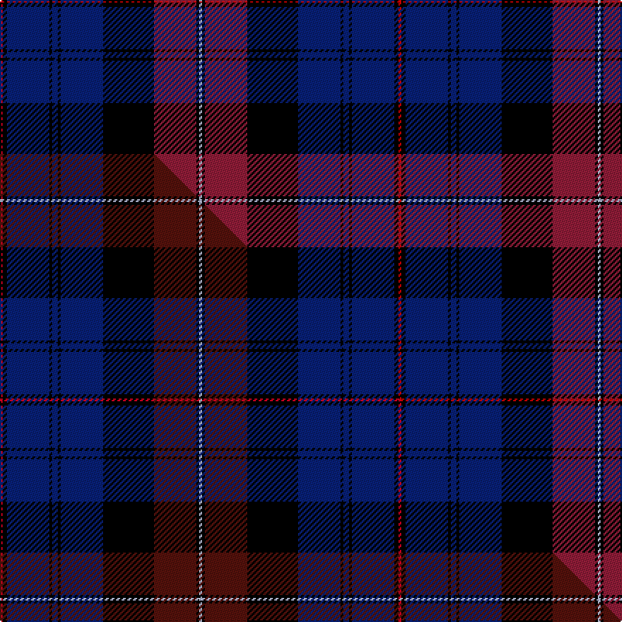

This is one **variant** — a specific cloth: this exact thread count and colourway, with its own
provenance below. It is one weaving of the [sett](/tartans/e/ev/evans/) (the scale-free proportion — the
same cloth at any scale or shade), whose colour order is pattern [RKBKBKBKRKW](/stripes/rkbkbkbkrkw/).

Part of the [Evans](/tartans/e/ev/evans/) tartan — the named design grouping this sett with its other cloths.

Sourced from house-of-tartan.  It is a [11 stripe tartan](/stripes/stripes11/).

Original link [http://www.house-of-tartan.scotland.net/house/TartanViewjs.asp?colr=Def&tnam=5732](http://www.house-of-tartan.scotland.net/house/TartanViewjs.asp?colr=Def&tnam=5732)

## Provenance

Earliest known date: 2002 The tartan for this Welsh surname and its variations, Ifan, Bevan, Jevons and Heavens is actually woven in Wales at the Cambrian Woollen Mill, weaving on the same site since 1830. This tartan differs from many traditional patterns in that the warp and weft differ, giving the finished worsted wool cloth more of a predominant stripe, vertically noticeable in the finished Kilt, or Cilt in Wales. Available from Wales Tartan Centre in Swansea

Dataset <small>— provenance for this record, inherited from the source manifest</small>

<dl class="dataset-prov">
<dt>source</dt><dd><a href="/sources/house-of-tartan/">House of Tartan</a></dd>
<dt>data captured from</dt><dd><a href="https://github.com/thetartan/tartan-database/blob/master/data/house-of-tartan/data.csv">https://github.com/thetartan/tartan-database/blob/master/data/house-of-tartan/data.csv</a></dd>
<dt>data date</dt><dd>2002 <small>(this record)</small></dd>
<dt>licence</dt><dd><a href="https://creativecommons.org/licenses/by-nc-nd/4.0/">CC BY-NC-ND 4.0</a></dd>
</dl>

Capture chain <small>— the hands this data passed through, oldest first; each capture carries its own licence</small>

<ol class="capture-chain">
<li><a href="http://www.house-of-tartan.scotland.net/">House of Tartan</a> <small>the weaver/retailer's database — the site is now offline; the URL is kept as the ultimate source's identity</small></li>
<li><a href="https://github.com/thetartan/tartan-database">thetartan/tartan-database</a> <small>2016-2017</small> · <a href="https://creativecommons.org/licenses/by-nc-nd/4.0/">CC BY-NC-ND 4.0</a> <small>Levko Kravets's frozen compilation — the capture we vendored, and where its CC licence text came from</small></li>
<li>this dictionary <small>captured 2026-06-10 · commit 5bf86c7566</small> <small>each re-capture is a git commit to data/sources</small></li>
</ol>

## Thread count
Ri/2 K3 DB30 K2 DB4 K2 DB30 K36 R30 K2 LB/2

One full sett is **282 threads**.

## Palette
<table><thead><tr><th>Colour</th><th>Shade</th><th>OKLCh</th></tr></thead><tbody><tr><td>LB</td><td><code style="background-color:#B5BBDE;">#B5BBDE</code> <small style="color:#888">#B5BBDE</small></td><td><small style="color:#888">oklch(79.9% 0.050 277.6)</small></td></tr><tr><td>DB</td><td><code style="background-color:#082077;">#082077</code> <small style="color:#888">#082077</small></td><td><small style="color:#888">oklch(30.0% 0.149 265.1)</small></td></tr><tr><td>R</td><td><code style="background-color:#901C38;">#901C38</code> <small style="color:#888">#901C38</small></td><td><small style="color:#888">oklch(43.2% 0.150 13.1)</small></td></tr><tr><td>K</td><td><code style="background-color:#000000;">#000000</code> <small style="color:#888">#000000</small></td><td><small style="color:#888">oklch(0.0% 0.000 0.0)</small></td></tr><tr><td>R</td><td><code style="background-color:#C80000;">#C80000</code> <small style="color:#888">#C80000</small></td><td><small style="color:#888">oklch(52.3% 0.215 29.2)</small></td></tr></tbody></table>

# Sample pattern

## Compared to the master

This cloth is one sett of its design; the master sett (the exemplar the design is anchored on) is below for comparison.

Its **ΔTartan distance** from the master is **0.07** — the same measure the nearest-tartans table ranks by (0 is identical; a re-scale of the same cloth is near 0, a recolour or a different proportion further).

<figure class="master-compare" style="margin:0">

this sett
master sett ★

<figcaption style="color:#888;font-size:smaller">One weave of this sett against the <a href="/setts/r2k3db30k2db4k2db30k36dr30k2lb2/">master sett ★</a>, split on the diagonal: a shared proportion runs seamlessly across it with only the shades shifting; a different proportion breaks on it.</figcaption>
</figure>

## Nearest tartan variants

The nearest existing variants by ΔTartan distance, with this cloth at the top so the swatches line up against it.

ΔTartan

Threads

Variant

Sett

—

282

<a href="/variants/s11/ri2k3db30k2db4k2db30k36r30k2lb2~ri2109032-r1706009/">Evans Welsh Name Tartan</a>

<a href="/ttd/edit/#slug=r2k3db30k2db4k2db30k36dr30k2lb2&amp;base=ri2k3db30k2db4k2db30k36r30k2lb2~ri2109032-r1706009" title="compare in the TTD">0.07</a>

282

<a href="/variants/s11/r2k3db30k2db4k2db30k36dr30k2lb2/">Evans (Welsh Name)</a>

<a href="/ttd/edit/#slug=db17k2m2db17k14dy1w2dy1k4dy1w2dy1k14~x2&amp;base=ri2k3db30k2db4k2db30k36r30k2lb2~ri2109032-r1706009" title="compare in the TTD">2.24</a>

250

<a href="/variants/s13/db17k2m2db17k14dy1w2dy1k4dy1w2dy1k14~x2/">Presley of Lonmay #2</a>

<a href="/ttd/edit/#slug=dr2db6lr2db2k9dbi30k9db5lr4db2dr2~x2~db1106275-dbi1406275&amp;base=ri2k3db30k2db4k2db30k36r30k2lb2~ri2109032-r1706009" title="compare in the TTD">2.27</a>

284

<a href="/variants/s11/dr2db6lr2db2k9dbi30k9db5lr4db2dr2~x2~db1106275-dbi1406275/">Rangers Football Club Dress</a>

<a href="/ttd/edit/#slug=y6db3k3db36k10n18db6k2g4k3~x2&amp;base=ri2k3db30k2db4k2db30k36r30k2lb2~ri2109032-r1706009" title="compare in the TTD">2.31</a>

346

<a href="/variants/s10/y6db3k3db36k10n18db6k2g4k3~x2/">Dinwiddie Hunting</a>

<a href="/ttd/edit/#slug=k4dp30k3dp2db2r2g12k3db18r3~x2&amp;base=ri2k3db30k2db4k2db30k36r30k2lb2~ri2109032-r1706009" title="compare in the TTD">2.38</a>

302

<a href="/variants/s10/k4dp30k3dp2db2r2g12k3db18r3~x2/">Wardlaw</a>

<a href="/ttd/edit/#slug=r24o4db6k6db60k40b12k20o3b8&amp;base=ri2k3db30k2db4k2db30k36r30k2lb2~ri2109032-r1706009" title="compare in the TTD">2.44</a>

334

<a href="/variants/s10/r24o4db6k6db60k40b12k20o3b8/">The KpgM</a>

<a href="/ttd/edit/#slug=w1db16k12lb2dp3lb2k12db2k2db2k2db7w1~x2&amp;base=ri2k3db30k2db4k2db30k36r30k2lb2~ri2109032-r1706009" title="compare in the TTD">2.65</a>

252

<a href="/variants/s13/w1db16k12lb2dp3lb2k12db2k2db2k2db7w1~x2/">Edgar (2014)</a>

<a href="/ttd/edit/#slug=k5db26k2db4k2db26k3lr36k3dbi30k3t2~db0806265-lr2800000-dbi1404245-t2503227&amp;base=ri2k3db30k2db4k2db30k36r30k2lb2~ri2109032-r1706009" title="compare in the TTD">2.67</a>

277

<a href="/variants/s12/k5db26k2db4k2db26k3lr36k3dbi30k3t2~db0806265-lr2800000-dbi1404245-t2503227/">Daniel Welsh Name Tartan</a>

<a href="/ttd/edit/#slug=k8r4k36db48r6g3lo2~x2&amp;base=ri2k3db30k2db4k2db30k36r30k2lb2~ri2109032-r1706009" title="compare in the TTD">2.67</a>

408

<a href="/variants/s7/k8r4k36db48r6g3lo2~x2/">Royal Marines Condor</a>

<a href="/ttd/edit/#slug=k5dbi26k2dbi4k2dbi26k3lr36k3db30k3t2~k0700000-dbi0806265-lr2800000-t2503227&amp;base=ri2k3db30k2db4k2db30k36r30k2lb2~ri2109032-r1706009" title="compare in the TTD">2.68</a>

277

<a href="/variants/s12/k5dbi26k2dbi4k2dbi26k3lr36k3db30k3t2~k0700000-dbi0806265-lr2800000-t2503227/">Daniel (Welsh Name)</a>

## Neighbour map

Every grey dot is one of 13657 variants placed by the first two principal components of the ΔTartan feature space (42% of its variance). Red is this tartan; blue dots are its nearest — click one to open its page. The map is a flat projection of a many-dimensional space — [how to read it](/posts/neighbourhood-maps/).

<svg viewBox="0 0 640 380" role="img" style="max-width:100%;height:auto;border:1px solid #e0e0e0;border-radius:4px;display:block" xmlns="http://www.w3.org/2000/svg"><image href="/nn/cloud.v1.png" width="640" height="380"/><a href="/variants/s11/r2k3db30k2db4k2db30k36dr30k2lb2/"><circle cx="254.6" cy="128.2" r="4" fill="#3465a4"><title>Evans (Welsh Name)</title></circle></a><a href="/variants/s13/db17k2m2db17k14dy1w2dy1k4dy1w2dy1k14~x2/"><circle cx="214.3" cy="111.2" r="4" fill="#3465a4"><title>Presley of Lonmay #2</title></circle></a><a href="/variants/s11/dr2db6lr2db2k9dbi30k9db5lr4db2dr2~x2~db1106275-dbi1406275/"><circle cx="204.0" cy="125.4" r="4" fill="#3465a4"><title>Rangers Football Club Dress</title></circle></a><a href="/variants/s10/y6db3k3db36k10n18db6k2g4k3~x2/"><circle cx="250.5" cy="128.4" r="4" fill="#3465a4"><title>Dinwiddie Hunting</title></circle></a><a href="/variants/s10/k4dp30k3dp2db2r2g12k3db18r3~x2/"><circle cx="206.3" cy="132.3" r="4" fill="#3465a4"><title>Wardlaw</title></circle></a><a href="/variants/s10/r24o4db6k6db60k40b12k20o3b8/"><circle cx="166.5" cy="123.0" r="4" fill="#3465a4"><title>The KpgM</title></circle></a><a href="/variants/s13/w1db16k12lb2dp3lb2k12db2k2db2k2db7w1~x2/"><circle cx="206.5" cy="121.1" r="4" fill="#3465a4"><title>Edgar (2014)</title></circle></a><a href="/variants/s12/k5db26k2db4k2db26k3lr36k3dbi30k3t2~db0806265-lr2800000-dbi1404245-t2503227/"><circle cx="177.9" cy="120.9" r="4" fill="#3465a4"><title>Daniel Welsh Name Tartan</title></circle></a><a href="/variants/s7/k8r4k36db48r6g3lo2~x2/"><circle cx="250.1" cy="118.1" r="4" fill="#3465a4"><title>Royal Marines Condor</title></circle></a><a href="/variants/s12/k5dbi26k2dbi4k2dbi26k3lr36k3db30k3t2~k0700000-dbi0806265-lr2800000-t2503227/"><circle cx="194.2" cy="126.5" r="4" fill="#3465a4"><title>Daniel (Welsh Name)</title></circle></a><circle cx="233.0" cy="118.6" r="5" fill="#c00000"/><text x="320" y="376" text-anchor="middle" font-size="11" fill="#999">ground</text><text x="11" y="190" text-anchor="middle" font-size="11" fill="#999" transform="rotate(-90 11 190)">complexity</text></svg>

ID: /variants/s11/ri2k3db30k2db4k2db30k36r30k2lb2~ri2109032-r1706009/
