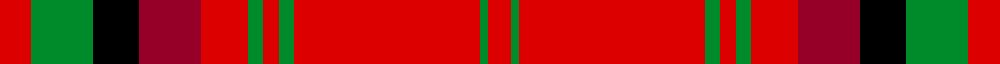

This page is one **sett** — a single exact thread-count. It belongs to the [tartan](/setts/ri4g8k6r8ri6g2ri2g2ri24g1ri3/)
(the same proportion at any scale), whose colour order is pattern [RGKRRGRGRGR](/stripes/rgkrrgrgrgr/).

Sourced from register-of-tartans.  It is a [11 stripe tartan](/stripes/stripes11/).

Original link https://www.tartanregister.gov.uk/tartanDetails.aspx?ref=2401

## Register references

External register numbers recorded for this tartan.

- Scottish Register of Tartans: [2401](https://www.tartanregister.gov.uk/tartanDetails.aspx?ref=2401)
- Scottish Tartans World Register: 1471

## Thread count
Ri/8 G16 K12 R16 Ri12 G4 Ri4 G4 Ri48 G2 Ri/6

One full sett is **250 threads**.

## Palette
<table><thead><tr><th>Colour</th><th>Shade</th><th>OKLCh</th></tr></thead><tbody><tr><td>R</td><td><code style="background-color:#960028;">#960028</code> <small style="color:#888">#960028</small></td><td><small style="color:#888">oklch(42.7% 0.171 18.3)</small></td></tr><tr><td>G</td><td><code style="background-color:#008B2A;">#008B2A</code> <small style="color:#888">#008B2A</small></td><td><small style="color:#888">oklch(55.4% 0.170 145.9)</small></td></tr><tr><td>K</td><td><code style="background-color:#000000;">#000000</code> <small style="color:#888">#000000</small></td><td><small style="color:#888">oklch(0.0% 0.000 0.0)</small></td></tr><tr><td>R</td><td><code style="background-color:#DC0000;">#DC0000</code> <small style="color:#888">#DC0000</small></td><td><small style="color:#888">oklch(56.2% 0.230 29.2)</small></td></tr></tbody></table>

# Sample pattern

## Nearest variants

The nearest existing variants by ΔTartan distance, with this cloth at the top so the swatches line up against it.

ΔTartan

Threads

Variant

Sett

—

250

<a href="/variants/s11/ri4g8k6r8ri6g2ri2g2ri24g1ri3~x2~ri2209032-r1707016/">MacDougall #8</a>

<a href="/ttd/edit/#slug=ri4g8k6r8ri6g2ri2g2ri24g1ri3~x2~ri2008029-r1707016&amp;base=ri4g8k6r8ri6g2ri2g2ri24g1ri3~x2~ri2209032-r1707016" title="compare in the TTD">0.00</a>

250

<a href="/variants/s11/ri4g8k6r8ri6g2ri2g2ri24g1ri3~x2~ri2008029-r1707016/">MacDougal 3</a>

## Neighbour map

Every grey dot is one of 13620 variants placed by the first two principal components of the ΔTartan feature space (42% of its variance). Red is this tartan; blue dots are its nearest — click one to open its page.

<svg viewBox="0 0 640 380" role="img" style="max-width:100%;height:auto;border:1px solid #e0e0e0;border-radius:4px;display:block" xmlns="http://www.w3.org/2000/svg"><image href="/nn/cloud.v1.png" width="640" height="380"/><a href="/variants/s11/ri4g8k6r8ri6g2ri2g2ri24g1ri3~x2~ri2008029-r1707016/"><circle cx="334.8" cy="119.8" r="4" fill="#3465a4"><title>MacDougal 3</title></circle></a><circle cx="324.5" cy="115.1" r="5" fill="#c00000"/><text x="320" y="376" text-anchor="middle" font-size="11" fill="#999">ground</text><text x="11" y="190" text-anchor="middle" font-size="11" fill="#999" transform="rotate(-90 11 190)">complexity</text></svg>

ID: /variants/s11/ri4g8k6r8ri6g2ri2g2ri24g1ri3~x2~ri2209032-r1707016/
