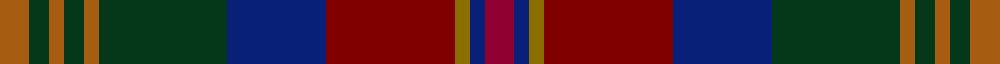

This page is one **sett** — a single exact thread-count. It belongs to the [tartan](/setts/ri6db3y3r26db20dg26o3dg4o3dg4o6/)
(the same proportion at any scale), whose colour order is pattern [RBGRBGRGRGR](/stripes/rbgrbgrgrgr/).

Sourced from weddslist.  It is a [11 stripe tartan](/stripes/stripes11/).

Original link http://www.weddslist.com/cgi-bin/tartans/pg.pl?source=sts

## Thread count
O/6 DG4 O3 DG4 O3 DG26 DB20 R26 Y3 DB3 Ri/6

One full sett is **196 threads**.

## Palette
<table><thead><tr><th>Colour</th><th>Shade</th><th>OKLCh</th></tr></thead><tbody><tr><td>DB</td><td><code style="background-color:#082077;">#082077</code> <small style="color:#888">#082077</small></td><td><small style="color:#888">oklch(30.0% 0.149 265.1)</small></td></tr><tr><td>DG</td><td><code style="background-color:#053819;">#053819</code> <small style="color:#888">#053819</small></td><td><small style="color:#888">oklch(30.0% 0.075 151.3)</small></td></tr><tr><td>R</td><td><code style="background-color:#800000;">#800000</code> <small style="color:#888">#800000</small></td><td><small style="color:#888">oklch(37.7% 0.155 29.2)</small></td></tr><tr><td>R</td><td><code style="background-color:#900030;">#900030</code> <small style="color:#888">#900030</small></td><td><small style="color:#888">oklch(41.6% 0.166 13.6)</small></td></tr><tr><td>Y</td><td><code style="background-color:#8B6E00;">#8B6E00</code> <small style="color:#888">#8B6E00</small></td><td><small style="color:#888">oklch(55.1% 0.113 90.4)</small></td></tr><tr><td>O</td><td><code style="background-color:#A65C11;">#A65C11</code> <small style="color:#888">#A65C11</small></td><td><small style="color:#888">oklch(55.0% 0.125 58.3)</small></td></tr></tbody></table>

# Sample pattern

## Nearest variants

The nearest existing variants by ΔTartan distance, with this cloth at the top so the swatches line up against it.

ΔTartan

Threads

Variant

Sett

—

196

<a href="/variants/s11/ri6db3y3r26db20dg26o3dg4o3dg4o6~ri1707016-r1506028/">Bonnie Brae</a>

<a href="/ttd/edit/#slug=r6db3y3o32db24g32y3g3y3g3y6&amp;base=ri6db3y3r26db20dg26o3dg4o3dg4o6~ri1707016-r1506028" title="compare in the TTD">2.83</a>

224

<a href="/variants/s11/r6db3y3o32db24g32y3g3y3g3y6/">Bonnie Brae Corporate Tartan</a>

## Neighbour map

Every grey dot is one of 13620 variants placed by the first two principal components of the ΔTartan feature space (42% of its variance). Red is this tartan; blue dots are its nearest — click one to open its page.

<svg viewBox="0 0 640 380" role="img" style="max-width:100%;height:auto;border:1px solid #e0e0e0;border-radius:4px;display:block" xmlns="http://www.w3.org/2000/svg"><image href="/nn/cloud.v1.png" width="640" height="380"/><a href="/variants/s11/r6db3y3o32db24g32y3g3y3g3y6/"><circle cx="205.1" cy="177.7" r="4" fill="#3465a4"><title>Bonnie Brae Corporate Tartan</title></circle></a><circle cx="206.7" cy="184.2" r="5" fill="#c00000"/><text x="320" y="376" text-anchor="middle" font-size="11" fill="#999">ground</text><text x="11" y="190" text-anchor="middle" font-size="11" fill="#999" transform="rotate(-90 11 190)">complexity</text></svg>

ID: /variants/s11/ri6db3y3r26db20dg26o3dg4o3dg4o6~ri1707016-r1506028/
