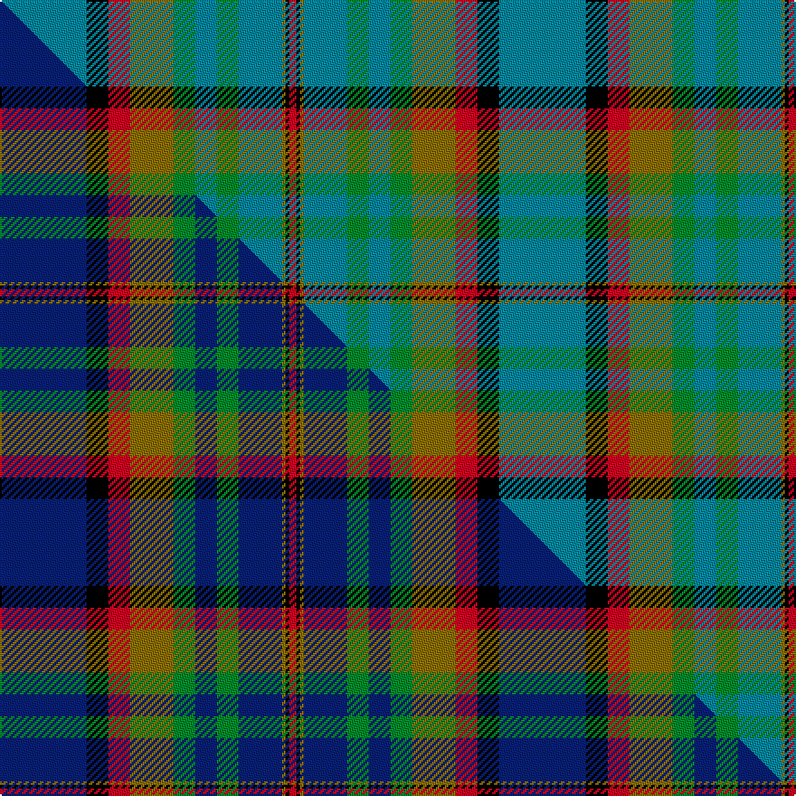

This is one **variant** — a specific cloth: this exact thread count and colourway, with its own
provenance below. It is one weaving of the [sett](/setts/t24k6r6y12g6t6g6t12y1k1r2/) (the scale-free proportion — the
same cloth at any scale or shade), whose colour order is pattern [BKRGGBGBGKR](/stripes/bkrggbgbgkr/).

Part of the [Berwick Friendship](/tartans/b/be/berwick-friendship/) tartan — the named design grouping this sett with its other cloths.

Sourced from tartans-authority.  It is a [11 stripe tartan](/stripes/stripes11/).

Original link [https://www.tartanregister.gov.uk/tartanDetails.aspx?ref=6184](https://www.tartanregister.gov.uk/tartanDetails.aspx?ref=6184)

Dataset <small>— provenance for this record, inherited from the source manifest</small>

<dl class="dataset-prov">
<dt>source</dt><dd><a href="/sources/tartans-authority/">Scottish Tartans Authority</a></dd>
<dt>data captured from</dt><dd><a href="https://github.com/thetartan/tartan-database/blob/master/data/tartans-authority/data.csv">https://github.com/thetartan/tartan-database/blob/master/data/tartans-authority/data.csv</a></dd>
<dt>data date</dt><dd>pre 2004 <small>(this record)</small></dd>
<dt>licence</dt><dd><a href="https://creativecommons.org/licenses/by-nc-nd/4.0/">CC BY-NC-ND 4.0</a></dd>
</dl>

Capture chain <small>— the hands this data passed through, oldest first; each capture carries its own licence</small>

<ol class="capture-chain">
<li><a href="https://www.tartansauthority.com/">Scottish Tartans Authority</a> <small>the heritage body's archive — its tartan-ferret record browser is retired (links repaired to the SRT, above)</small></li>
<li><a href="https://github.com/thetartan/tartan-database">thetartan/tartan-database</a> <small>2016-2017</small> · <a href="https://creativecommons.org/licenses/by-nc-nd/4.0/">CC BY-NC-ND 4.0</a> <small>Levko Kravets's frozen compilation — the capture we vendored, and where its CC licence text came from</small></li>
<li>this dictionary <small>captured 2026-06-10 · commit 5bf86c7566</small> <small>each re-capture is a git commit to data/sources</small></li>
</ol>

## Register references

External register numbers recorded for this tartan.

- Scottish Tartans Authority (ITI): 6184

## Thread count
T/48 K12 R12 Y24 G12 T12 G12 T24 Y2 K2 R/4

One full sett is **276 threads**.

## Palette
<table><thead><tr><th>Colour</th><th>Shade</th><th>OKLCh</th></tr></thead><tbody><tr><td>T</td><td><code style="background-color:#00879F;">#00879F</code> <small style="color:#888">#00879F</small></td><td><small style="color:#888">oklch(57.4% 0.102 216.1)</small></td></tr><tr><td>G</td><td><code style="background-color:#008B2A;">#008B2A</code> <small style="color:#888">#008B2A</small></td><td><small style="color:#888">oklch(55.4% 0.170 145.9)</small></td></tr><tr><td>K</td><td><code style="background-color:#000000;">#000000</code> <small style="color:#888">#000000</small></td><td><small style="color:#888">oklch(0.0% 0.000 0.0)</small></td></tr><tr><td>R</td><td><code style="background-color:#D60020;">#D60020</code> <small style="color:#888">#D60020</small></td><td><small style="color:#888">oklch(55.2% 0.224 25.5)</small></td></tr><tr><td>Y</td><td><code style="background-color:#8B6E00;">#8B6E00</code> <small style="color:#888">#8B6E00</small></td><td><small style="color:#888">oklch(55.1% 0.113 90.4)</small></td></tr></tbody></table>

# Sample pattern

## Compared to the master

This cloth is one sett of its design; the master sett (the exemplar the design is anchored on) is below for comparison.

Its **ΔTartan distance** from the master is **0.20** — the same measure the nearest-tartans table ranks by (0 is identical; a re-scale of the same cloth is near 0, a recolour or a different proportion further).

<figure class="master-compare" style="margin:0">

this sett
master sett ★

<figcaption style="color:#888;font-size:smaller">One weave of this sett against the <a href="/setts/db24k6r6y12g6db6g6db12y1k1r2/">master sett ★</a>, split on the diagonal: a shared proportion runs seamlessly across it with only the shades shifting; a different proportion breaks on it.</figcaption>
</figure>

## Nearest tartan variants

The nearest existing variants by ΔTartan distance, with this cloth at the top so the swatches line up against it.

ΔTartan

Threads

Variant

Sett

—

276

<a href="/variants/s11/t24k6r6y12g6t6g6t12y1k1r2~x2/">Berwick Friendship (Corporate)</a>

<a href="/ttd/edit/#slug=db24k6r6y12g6db6g6db12y1k1r2~x2&amp;base=t24k6r6y12g6t6g6t12y1k1r2~x2" title="compare in the TTD">0.20</a>

276

<a href="/variants/s11/db24k6r6y12g6db6g6db12y1k1r2~x2/">Berwick Friendship</a>

<a href="/ttd/edit/#slug=t32k12t12g6r6g18k2y3~x2&amp;base=t24k6r6y12g6t6g6t12y1k1r2~x2" title="compare in the TTD">2.83</a>

294

<a href="/variants/s8/t32k12t12g6r6g18k2y3~x2/">Gillies (House of Edgar)</a>

<a href="/ttd/edit/#slug=w4t30k3g20r4k1w3k1r4g20k3t30w4r2~x2~g2408144&amp;base=t24k6r6y12g6t6g6t12y1k1r2~x2" title="compare in the TTD">3.08</a>

504

<a href="/variants/s14/w4t30k3g20r4k1w3k1r4g20k3t30w4r2~x2~g2408144/">Scottish Prison Service</a>

<a href="/ttd/edit/#slug=b16y2b4y2b5k14g28y2g7~x2&amp;base=t24k6r6y12g6t6g6t12y1k1r2~x2" title="compare in the TTD">3.08</a>

274

<a href="/variants/s9/b16y2b4y2b5k14g28y2g7~x2/">Marie Curie Fields of Hope</a>

<a href="/ttd/edit/#slug=b24w2b6g9r6b3r6g35k2ly2~x2&amp;base=t24k6r6y12g6t6g6t12y1k1r2~x2" title="compare in the TTD">3.10</a>

328

<a href="/variants/s10/b24w2b6g9r6b3r6g35k2ly2~x2/">O'Donohue Personal)</a>

<a href="/ttd/edit/#slug=y7n2k2n41k12g22n6k2r4k2~x2&amp;base=t24k6r6y12g6t6g6t12y1k1r2~x2" title="compare in the TTD">3.14</a>

382

<a href="/variants/s10/y7n2k2n41k12g22n6k2r4k2~x2/">Dinwiddie</a>

<a href="/ttd/edit/#slug=dy2g12k10r1t16r2t16r1~x4&amp;base=t24k6r6y12g6t6g6t12y1k1r2~x2" title="compare in the TTD">3.20</a>

468

<a href="/variants/s8/dy2g12k10r1t16r2t16r1~x4/">MacWilliam</a>

<a href="/ttd/edit/#slug=k3r1ly1lb11g13lb5r1ly1~x4~r2109032-ly3307090-g2408144&amp;base=t24k6r6y12g6t6g6t12y1k1r2~x2" title="compare in the TTD">3.22</a>

272

<a href="/variants/s8/k3r1ly1lb11g13lb5r1ly1~x4~r2109032-ly3307090-g2408144/">Snodgrass</a>

<a href="/ttd/edit/#slug=k3r1y1lb11g13lb5r1y1~x4&amp;base=t24k6r6y12g6t6g6t12y1k1r2~x2" title="compare in the TTD">3.23</a>

272

<a href="/variants/s8/k3r1y1lb11g13lb5r1y1~x4/">Snodgrass (Clan)</a>

<a href="/ttd/edit/#slug=k3r1y1db11g13db5r1y1~x2&amp;base=t24k6r6y12g6t6g6t12y1k1r2~x2" title="compare in the TTD">3.24</a>

136

<a href="/variants/s8/k3r1y1db11g13db5r1y1~x2/">Snodgrass Family Tartan</a>

## Neighbour map

Every grey dot is one of 13656 variants placed by the first two principal components of the ΔTartan feature space (42% of its variance). Red is this tartan; blue dots are its nearest — click one to open its page. The map is a flat projection of a many-dimensional space — [how to read it](/posts/neighbourhood-maps/).

<svg viewBox="0 0 640 380" role="img" style="max-width:100%;height:auto;border:1px solid #e0e0e0;border-radius:4px;display:block" xmlns="http://www.w3.org/2000/svg"><image href="/nn/cloud.v1.png" width="640" height="380"/><a href="/variants/s11/db24k6r6y12g6db6g6db12y1k1r2~x2/"><circle cx="230.8" cy="127.0" r="4" fill="#3465a4"><title>Berwick Friendship</title></circle></a><a href="/variants/s8/t32k12t12g6r6g18k2y3~x2/"><circle cx="211.9" cy="164.9" r="4" fill="#3465a4"><title>Gillies (House of Edgar)</title></circle></a><a href="/variants/s14/w4t30k3g20r4k1w3k1r4g20k3t30w4r2~x2~g2408144/"><circle cx="231.7" cy="98.6" r="4" fill="#3465a4"><title>Scottish Prison Service</title></circle></a><a href="/variants/s9/b16y2b4y2b5k14g28y2g7~x2/"><circle cx="204.7" cy="166.4" r="4" fill="#3465a4"><title>Marie Curie Fields of Hope</title></circle></a><a href="/variants/s10/b24w2b6g9r6b3r6g35k2ly2~x2/"><circle cx="236.8" cy="124.4" r="4" fill="#3465a4"><title>O'Donohue Personal)</title></circle></a><a href="/variants/s10/y7n2k2n41k12g22n6k2r4k2~x2/"><circle cx="244.8" cy="115.3" r="4" fill="#3465a4"><title>Dinwiddie</title></circle></a><a href="/variants/s8/dy2g12k10r1t16r2t16r1~x4/"><circle cx="229.9" cy="157.4" r="4" fill="#3465a4"><title>MacWilliam</title></circle></a><a href="/variants/s8/k3r1ly1lb11g13lb5r1ly1~x4~r2109032-ly3307090-g2408144/"><circle cx="219.7" cy="138.7" r="4" fill="#3465a4"><title>Snodgrass</title></circle></a><a href="/variants/s8/k3r1y1lb11g13lb5r1y1~x4/"><circle cx="198.5" cy="150.9" r="4" fill="#3465a4"><title>Snodgrass (Clan)</title></circle></a><a href="/variants/s8/k3r1y1db11g13db5r1y1~x2/"><circle cx="209.1" cy="153.2" r="4" fill="#3465a4"><title>Snodgrass Family Tartan</title></circle></a><circle cx="250.6" cy="140.2" r="5" fill="#c00000"/><text x="320" y="376" text-anchor="middle" font-size="11" fill="#999">ground</text><text x="11" y="190" text-anchor="middle" font-size="11" fill="#999" transform="rotate(-90 11 190)">complexity</text></svg>

ID: /variants/s11/t24k6r6y12g6t6g6t12y1k1r2~x2/
