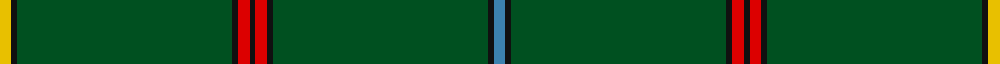

This page is one **sett** — a single exact thread-count. It belongs to the [tartan](/setts/t2k1dg36k1r2k1r2k1dg36k1ly2/)
(the same proportion at any scale), whose colour order is pattern [BKGKRKRKGKY](/stripes/bkgkrkrkgky/).

Part of the [Unidentified](/tartans/unidentified/) tartan — the named design grouping this sett with its other cloths.

Sourced from register-of-tartans.  It is a [11 stripe tartan](/stripes/stripes11/).

Original link https://www.tartanregister.gov.uk/tartanDetails.aspx?ref=4213

## Also known as

This cloth is also recorded under:

- Unidentified #10
- Unidentified #12
- Unidentified #14
- Unidentified #15
- Unidentified #16
- Unidentified #18
- Unidentified #2
- Unidentified #21
- Unidentified #22
- Unidentified #24
- Unidentified #25
- Unidentified #28
- Unidentified #29
- Unidentified #30
- Unidentified #31
- Unidentified #32
- Unidentified #36
- Unidentified #37
- Unidentified #38
- Unidentified #40
- Unidentified #43
- Unidentified #44
- Unidentified #45
- Unidentified #46
- Unidentified #47
- Unidentified #48
- Unidentified #49
- Unidentified #5
- Unidentified #50
- Unidentified #51
- Unidentified #52
- Unidentified #53
- Unidentified #54
- Unidentified #55
- Unidentified #56
- Unidentified #57
- Unidentified #58
- Unidentified #59
- Unidentified #60
- Unidentified #61
- Unidentified #62
- Unidentified #63
- Unidentified #64
- Unidentified #65
- Unidentified #66
- Unidentified #7
- Unidentified #8
- Unidentified #9
- Unidentified 16
- Unidentified Artifact
- Unidentified Plaid
- Unidentified Plaid #11
- Unidentified Plaid #13
- Unidentified Plaid #2
- Unidentified Plaid #3
- Unidentified Plaid #7
- Unidentified Plaid #8
- Unidentified Plaid #9
- Unidentified Portrait

## Register references

External register numbers recorded for this tartan.

- Scottish Register of Tartans: [4213](https://www.tartanregister.gov.uk/tartanDetails.aspx?ref=4213)
- Scottish Tartans World Register: 346

## Thread count
Y/4 K2 G72 K2 R4 K2 R4 K2 G72 K2 B/4

One full sett is **332 threads**.

## Palette

Palette: <strong>Tartan Register</strong>
<table><thead><tr><th>Colour</th><th>Threads</th><th>Shade</th><th>Base</th><th>OKLCh</th></tr></thead><tbody><tr><td>Y/</td><td style="text-align:right;font-variant-numeric:tabular-nums">4</td><td><code style="background-color:#E8C000;">#E8C000</code> <small style="color:#888">#E8C000</small></td><td>Y <code style="background-color:#F2BF00;">#F2BF00</code></td><td><small style="color:#888">oklch(81.9% 0.168 93.7)</small></td></tr><tr><td>K</td><td style="text-align:right;font-variant-numeric:tabular-nums">2</td><td><code style="background-color:#101010;">#101010</code> <small style="color:#888">#101010</small></td><td>K <code style="background-color:#000000;">#000000</code></td><td><small style="color:#888">oklch(17.3% 0.000 89.9)</small></td></tr><tr><td>G</td><td style="text-align:right;font-variant-numeric:tabular-nums">72</td><td><code style="background-color:#005020;">#005020</code> <small style="color:#888">#005020</small></td><td>G <code style="background-color:#006100;">#006100</code></td><td><small style="color:#888">oklch(37.7% 0.105 149.6)</small></td></tr><tr><td>K</td><td style="text-align:right;font-variant-numeric:tabular-nums">2</td><td><code style="background-color:#101010;">#101010</code> <small style="color:#888">#101010</small></td><td>K <code style="background-color:#000000;">#000000</code></td><td><small style="color:#888">oklch(17.3% 0.000 89.9)</small></td></tr><tr><td>R</td><td style="text-align:right;font-variant-numeric:tabular-nums">4</td><td><code style="background-color:#DC0000;">#DC0000</code> <small style="color:#888">#DC0000</small></td><td>R <code style="background-color:#CC0000;">#CC0000</code></td><td><small style="color:#888">oklch(56.2% 0.230 29.2)</small></td></tr><tr><td>K</td><td style="text-align:right;font-variant-numeric:tabular-nums">2</td><td><code style="background-color:#101010;">#101010</code> <small style="color:#888">#101010</small></td><td>K <code style="background-color:#000000;">#000000</code></td><td><small style="color:#888">oklch(17.3% 0.000 89.9)</small></td></tr><tr><td>R</td><td style="text-align:right;font-variant-numeric:tabular-nums">4</td><td><code style="background-color:#DC0000;">#DC0000</code> <small style="color:#888">#DC0000</small></td><td>R <code style="background-color:#CC0000;">#CC0000</code></td><td><small style="color:#888">oklch(56.2% 0.230 29.2)</small></td></tr><tr><td>K</td><td style="text-align:right;font-variant-numeric:tabular-nums">2</td><td><code style="background-color:#101010;">#101010</code> <small style="color:#888">#101010</small></td><td>K <code style="background-color:#000000;">#000000</code></td><td><small style="color:#888">oklch(17.3% 0.000 89.9)</small></td></tr><tr><td>G</td><td style="text-align:right;font-variant-numeric:tabular-nums">72</td><td><code style="background-color:#005020;">#005020</code> <small style="color:#888">#005020</small></td><td>G <code style="background-color:#006100;">#006100</code></td><td><small style="color:#888">oklch(37.7% 0.105 149.6)</small></td></tr><tr><td>K</td><td style="text-align:right;font-variant-numeric:tabular-nums">2</td><td><code style="background-color:#101010;">#101010</code> <small style="color:#888">#101010</small></td><td>K <code style="background-color:#000000;">#000000</code></td><td><small style="color:#888">oklch(17.3% 0.000 89.9)</small></td></tr><tr><td>B/</td><td style="text-align:right;font-variant-numeric:tabular-nums">4</td><td><code style="background-color:#3C82AF;">#3C82AF</code> <small style="color:#888">#3C82AF</small></td><td>B <code style="background-color:#2A418A;">#2A418A</code></td><td><small style="color:#888">oklch(58.1% 0.099 239.8)</small></td></tr></tbody></table>

## Compared to the master

This cloth is one sett of its design; the master sett (the exemplar the design is anchored on) is below for comparison.

<figure style="margin:0"><figcaption style="color:#888;font-size:smaller">this sett</figcaption></figure>
<figure style="margin:0"><figcaption style="color:#888;font-size:smaller"><a href="/setts/dp4r3dp26r26dg26r4/">master sett →</a></figcaption></figure>

## Nearest tartans

The nearest existing variants by ΔTartan distance, with this tartan at the top so the swatches line up against it.

ΔTartan

Tartan

Sett

—

<a href="/ttd/edit/#slug=t2k1dg36k1r2k1r2k1dg36k1ly2~x2">Unidentified #12</a> <a class="nn-out" href="/variants/s11/t2k1dg36k1r2k1r2k1dg36k1ly2~x2/" title="open its dictionary page">↗</a>

1.23

<a href="/ttd/edit/#slug=dg25k1lr2k1dg4k1r2k1dg4k1ly2k1dg25~x4&amp;base=t2k1dg36k1r2k1r2k1dg36k1ly2~x2">Hilton Check</a> <a class="nn-out" href="/variants/s13/dg25k1lr2k1dg4k1r2k1dg4k1ly2k1dg25~x4/" title="open its dictionary page">↗</a>

1.53

<a href="/ttd/edit/#slug=dg83k6dg3k9r2k5dg2ly2~x2&amp;base=t2k1dg36k1r2k1r2k1dg36k1ly2~x2">Stewart from Cairnie</a> <a class="nn-out" href="/variants/s8/dg83k6dg3k9r2k5dg2ly2~x2/" title="open its dictionary page">↗</a>

1.62

<a href="/ttd/edit/#slug=g82k6g3k9r2k5g2ly2~x2&amp;base=t2k1dg36k1r2k1r2k1dg36k1ly2~x2">Crane of Cluny (Personal)</a> <a class="nn-out" href="/variants/s8/g82k6g3k9r2k5g2ly2~x2/" title="open its dictionary page">↗</a>

1.77

<a href="/ttd/edit/#slug=dg10w2dg10ly1dg10r2dg24g1dg2g1dg2g2~x2&amp;base=t2k1dg36k1r2k1r2k1dg36k1ly2~x2">Women's Royal Army Corps Ass. (Corp.</a> <a class="nn-out" href="/variants/s12/dg10w2dg10ly1dg10r2dg24g1dg2g1dg2g2~x2/" title="open its dictionary page">↗</a>

1.80

<a href="/ttd/edit/#slug=lr1r12dg2r1dg162r12ly1~x2&amp;base=t2k1dg36k1r2k1r2k1dg36k1ly2~x2">MacFie</a> <a class="nn-out" href="/variants/s7/lr1r12dg2r1dg162r12ly1~x2/" title="open its dictionary page">↗</a>

1.90

<a href="/ttd/edit/#slug=g14w2g14r1g14ly2g30t2g2t4~x2&amp;base=t2k1dg36k1r2k1r2k1dg36k1ly2~x2">Holmston Primary (School)</a> <a class="nn-out" href="/variants/s10/g14w2g14r1g14ly2g30t2g2t4~x2/" title="open its dictionary page">↗</a>

1.91

<a href="/ttd/edit/#slug=g40ly2db3r4db3ly2g40w3~x2&amp;base=t2k1dg36k1r2k1r2k1dg36k1ly2~x2">Asher (Personal)</a> <a class="nn-out" href="/variants/s8/g40ly2db3r4db3ly2g40w3~x2/" title="open its dictionary page">↗</a>

1.92

<a href="/ttd/edit/#slug=g72lo2g10r9g2dy9g2db9g2b9g9lo2g72~x2&amp;base=t2k1dg36k1r2k1r2k1dg36k1ly2~x2">U.S. Seabees (Military)</a> <a class="nn-out" href="/variants/s13/g72lo2g10r9g2dy9g2db9g2b9g9lo2g72~x2/" title="open its dictionary page">↗</a>

1.95

<a href="/ttd/edit/#slug=g61g1g1db2g1g1g16g1db4g2db6g1db4~x2&amp;base=t2k1dg36k1r2k1r2k1dg36k1ly2~x2">Coeur D'Alene Firefighters (Corporat</a> <a class="nn-out" href="/variants/s13/g61g1g1db2g1g1g16g1db4g2db6g1db4~x2/" title="open its dictionary page">↗</a>

2.05

<a href="/ttd/edit/#slug=r3k4lb2g64k6ly3~x2&amp;base=t2k1dg36k1r2k1r2k1dg36k1ly2~x2">Braemar Royal Highland Gathering</a> <a class="nn-out" href="/variants/s6/r3k4lb2g64k6ly3~x2/" title="open its dictionary page">↗</a>

## Neighbour map

Every grey dot is one of 14360 variants placed by the first two principal components of the ΔTartan feature space (44% of its variance). Red is this tartan; blue dots are its nearest — click one to open its page.

<svg viewBox="0 0 640 380" role="img" style="max-width:100%;height:auto;border:1px solid #e0e0e0;border-radius:4px;display:block" xmlns="http://www.w3.org/2000/svg"><image href="/nn/cloud.v1.png" width="640" height="380"/><a href="/variants/s13/dg25k1lr2k1dg4k1r2k1dg4k1ly2k1dg25~x4/"><circle cx="582.2" cy="135.7" r="4" fill="#3465a4"><title>Hilton Check</title></circle></a><a href="/variants/s8/dg83k6dg3k9r2k5dg2ly2~x2/"><circle cx="621.9" cy="148.1" r="4" fill="#3465a4"><title>Stewart from Cairnie</title></circle></a><a href="/variants/s8/g82k6g3k9r2k5g2ly2~x2/"><circle cx="588.8" cy="132.6" r="4" fill="#3465a4"><title>Crane of Cluny (Personal)</title></circle></a><a href="/variants/s12/dg10w2dg10ly1dg10r2dg24g1dg2g1dg2g2~x2/"><circle cx="570.6" cy="146.9" r="4" fill="#3465a4"><title>Women's Royal Army Corps Ass. (Corp.</title></circle></a><a href="/variants/s7/lr1r12dg2r1dg162r12ly1~x2/"><circle cx="626.0" cy="148.6" r="4" fill="#3465a4"><title>MacFie</title></circle></a><a href="/variants/s10/g14w2g14r1g14ly2g30t2g2t4~x2/"><circle cx="611.4" cy="171.4" r="4" fill="#3465a4"><title>Holmston Primary (School)</title></circle></a><a href="/variants/s8/g40ly2db3r4db3ly2g40w3~x2/"><circle cx="540.3" cy="156.6" r="4" fill="#3465a4"><title>Asher (Personal)</title></circle></a><a href="/variants/s13/g72lo2g10r9g2dy9g2db9g2b9g9lo2g72~x2/"><circle cx="589.9" cy="126.2" r="4" fill="#3465a4"><title>U.S. Seabees (Military)</title></circle></a><a href="/variants/s13/g61g1g1db2g1g1g16g1db4g2db6g1db4~x2/"><circle cx="626.0" cy="128.3" r="4" fill="#3465a4"><title>Coeur D'Alene Firefighters (Corporat</title></circle></a><a href="/variants/s6/r3k4lb2g64k6ly3~x2/"><circle cx="538.5" cy="136.4" r="4" fill="#3465a4"><title>Braemar Royal Highland Gathering</title></circle></a><circle cx="625.0" cy="123.8" r="5" fill="#c00000"/></svg>

ID: /variants/s11/t2k1dg36k1r2k1r2k1dg36k1ly2~x2/
