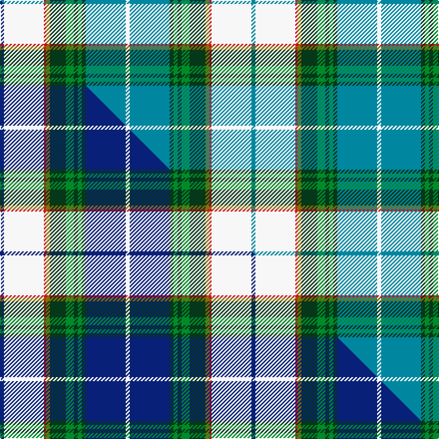

This is one **variant** — a specific cloth: this exact thread count and colourway, with its own
provenance below. It is one weaving of the [sett](/tartans/n/no/nova-scotia-dress-2/) (the scale-free proportion — the
same cloth at any scale or shade), whose colour order is pattern [BWRGGGGGGBW](/stripes/bwrggggggbw/).

Part of the [Nova Scotia Dress](/tartans/n/no/nova-scotia-dress-2/) tartan — the named design grouping this sett with its other cloths.

Sourced from tartans-authority.  It is a [11 stripe tartan](/stripes/stripes11/).

Original link <code>http://www.tartansauthority.com/tartan-ferret/display/660/</code> — retired · [Internet Archive copy](https://web.archive.org/web/*/http://www.tartansauthority.com/tartan-ferret/display/660/*)

Dataset <small>— provenance for this record, inherited from the source manifest</small>

<dl class="dataset-prov">
<dt>source</dt><dd><a href="/sources/tartans-authority/">Scottish Tartans Authority</a></dd>
<dt>data captured from</dt><dd><a href="https://github.com/thetartan/tartan-database/blob/master/data/tartans-authority/data.csv">https://github.com/thetartan/tartan-database/blob/master/data/tartans-authority/data.csv</a></dd>
<dt>data date</dt><dd>1963 <small>(this record)</small></dd>
<dt>licence</dt><dd><a href="https://creativecommons.org/licenses/by-nc-nd/4.0/">CC BY-NC-ND 4.0</a></dd>
</dl>

Capture chain <small>— the hands this data passed through, oldest first; each capture carries its own licence</small>

<ol class="capture-chain">
<li><a href="https://www.tartansauthority.com/">Scottish Tartans Authority</a> <small>the heritage body’s archive — its tartan-ferret record browser is retired; dead record links are shown unlinked, with an Internet Archive copy (ITI numbers are not SRT references)</small></li>
<li><a href="https://github.com/thetartan/tartan-database">thetartan/tartan-database</a> <small>2016-2017</small> · <a href="https://creativecommons.org/licenses/by-nc-nd/4.0/">CC BY-NC-ND 4.0</a> <small>Levko Kravets's frozen compilation — the capture we vendored, and where its CC licence text came from</small></li>
<li>this dictionary <small>captured 2026-06-10 · commit 5bf86c7566</small> <small>each re-capture is a git commit to data/sources</small></li>
</ol>

## Register references

External register numbers recorded for this tartan.

- Scottish Tartans Authority (ITI): 660

## Thread count
T/4 W40 R2 Y4 DG16 G8 DG4 G4 DG4 T40 W/4

One full sett is **252 threads**.

## Palette
<table><thead><tr><th>Colour</th><th>Shade</th><th>OKLCh</th></tr></thead><tbody><tr><td>T</td><td><code style="background-color:#00879F;">#00879F</code> <small style="color:#888">#00879F</small></td><td><small style="color:#888">oklch(57.4% 0.102 216.1)</small></td></tr><tr><td>DG</td><td><code style="background-color:#053819;">#053819</code> <small style="color:#888">#053819</small></td><td><small style="color:#888">oklch(30.0% 0.075 151.3)</small></td></tr><tr><td>G</td><td><code style="background-color:#008B2A;">#008B2A</code> <small style="color:#888">#008B2A</small></td><td><small style="color:#888">oklch(55.4% 0.170 145.9)</small></td></tr><tr><td>W</td><td><code style="background-color:#F7F7F7;">#F7F7F7</code> <small style="color:#888">#F7F7F7</small></td><td><small style="color:#888">oklch(97.6% 0.000 89.9)</small></td></tr><tr><td>R</td><td><code style="background-color:#D60020;">#D60020</code> <small style="color:#888">#D60020</small></td><td><small style="color:#888">oklch(55.2% 0.224 25.5)</small></td></tr><tr><td>Y</td><td><code style="background-color:#8B6E00;">#8B6E00</code> <small style="color:#888">#8B6E00</small></td><td><small style="color:#888">oklch(55.1% 0.113 90.4)</small></td></tr></tbody></table>

# Sample pattern

## Compared to the master

This cloth is one sett of its design; the master sett (the exemplar the design is anchored on) is below for comparison.

Its **ΔTartan distance** from the master is **0.16** — the same measure the nearest-tartans table ranks by (0 is identical; a re-scale of the same cloth is near 0, a recolour or a different proportion further).

<figure class="master-compare" style="margin:0">

this sett
master sett ★

<figcaption style="color:#888;font-size:smaller">One weave of this sett against the <a href="/setts/db2w20r1y2dg8g4dg2g2dg2db20w2/">master sett ★</a>, split on the diagonal: a shared proportion runs seamlessly across it with only the shades shifting; a different proportion breaks on it.</figcaption>
</figure>

## Nearest tartan variants

The nearest existing variants by ΔTartan distance, with this cloth at the top so the swatches line up against it.

ΔTartan

Threads

Variant

Sett

—

252

<a href="/variants/s11/t2w20r1y2dg8g4dg2g2dg2t20w2~x2/">Nova Scotia Dress (District)</a>

<a href="/ttd/edit/#slug=db2w20r1y2dg8g4dg2g2dg2db20w2~x2&amp;base=t2w20r1y2dg8g4dg2g2dg2t20w2~x2" title="compare in the TTD">0.16</a>

252

<a href="/variants/s11/db2w20r1y2dg8g4dg2g2dg2db20w2~x2/">Nova Scotia Dress Canadian Tartan</a>

<a href="/ttd/edit/#slug=db2w20r1y2dg8b4dg2b2dg2db20w2~x2&amp;base=t2w20r1y2dg8g4dg2g2dg2t20w2~x2" title="compare in the TTD">0.67</a>

252

<a href="/variants/s11/db2w20r1y2dg8b4dg2b2dg2db20w2~x2/">Nova Scotia, dress</a>

<a href="/ttd/edit/#slug=lb18w1lb4w1ly4dg1ly2dg12r2dg4~x2&amp;base=t2w20r1y2dg8g4dg2g2dg2t20w2~x2" title="compare in the TTD">1.74</a>

152

<a href="/variants/s10/lb18w1lb4w1ly4dg1ly2dg12r2dg4~x2/">Michigan, State of</a>

<a href="/ttd/edit/#slug=db18w1db4w1lo4g1lo2g12r2g4~x2~w4000000-r1707033&amp;base=t2w20r1y2dg8g4dg2g2dg2t20w2~x2" title="compare in the TTD">2.05</a>

152

<a href="/variants/s10/db18w1db4w1lo4g1lo2g12r2g4~x2~w4000000-r1707033/">Michigan State District Tartan</a>

<a href="/ttd/edit/#slug=t4w2t1w19r2do4t8g4w2t3dy2g2do2r2dy2~x2&amp;base=t2w20r1y2dg8g4dg2g2dg2t20w2~x2" title="compare in the TTD">2.20</a>

224

<a href="/variants/s15/t4w2t1w19r2do4t8g4w2t3dy2g2do2r2dy2~x2/">Highlands of Haliburton Dress</a>

<a href="/ttd/edit/#slug=b16r1g16w1dy1w8dr3~x2&amp;base=t2w20r1y2dg8g4dg2g2dg2t20w2~x2" title="compare in the TTD">2.65</a>

146

<a href="/variants/s7/b16r1g16w1dy1w8dr3~x2/">Chambers, Christopher J (Personal)</a>

<a href="/ttd/edit/#slug=g4y1lb3db15g2r2g14n1lb28db2~x2~db0805267-n1604274&amp;base=t2w20r1y2dg8g4dg2g2dg2t20w2~x2" title="compare in the TTD">2.81</a>

276

<a href="/variants/s10/g4y1lb3db15g2r2g14dbi1lb28db2~x2~db0805267-dbi1604274/">Heriot Watt University</a>

<a href="/ttd/edit/#slug=dp6lb2w24r15g12lb4w4lb4w4lb4g34y4&amp;base=t2w20r1y2dg8g4dg2g2dg2t20w2~x2" title="compare in the TTD">2.83</a>

224

<a href="/variants/s12/dp6lb2w24r15g12lb4w4lb4w4lb4g34y4/">Fredericton (District)</a>

<a href="/ttd/edit/#slug=db16w3db1y4g24r1g3r4g3r1lb8~x2&amp;base=t2w20r1y2dg8g4dg2g2dg2t20w2~x2" title="compare in the TTD">2.96</a>

224

<a href="/variants/s11/db16w3db1y4g24r1g3r4g3r1lb8~x2/">Currie</a>

<a href="/ttd/edit/#slug=w50g5y2g5r2g20r2db5y2db40~x2&amp;base=t2w20r1y2dg8g4dg2g2dg2t20w2~x2" title="compare in the TTD">2.97</a>

352

<a href="/variants/s10/w50g5y2g5r2g20r2db5y2db40~x2/">Cornell (Fashion)</a>

## Neighbour map

Every grey dot is one of 13656 variants placed by the first two principal components of the ΔTartan feature space (42% of its variance). Red is this tartan; blue dots are its nearest — click one to open its page. The map is a flat projection of a many-dimensional space — [how to read it](/posts/neighbourhood-maps/).

<svg viewBox="0 0 640 380" role="img" style="max-width:100%;height:auto;border:1px solid #e0e0e0;border-radius:4px;display:block" xmlns="http://www.w3.org/2000/svg"><image href="/nn/cloud.v1.png" width="640" height="380"/><a href="/variants/s11/db2w20r1y2dg8g4dg2g2dg2db20w2~x2/"><circle cx="140.9" cy="108.4" r="4" fill="#3465a4"><title>Nova Scotia Dress Canadian Tartan</title></circle></a><a href="/variants/s11/db2w20r1y2dg8b4dg2b2dg2db20w2~x2/"><circle cx="143.0" cy="107.8" r="4" fill="#3465a4"><title>Nova Scotia, dress</title></circle></a><a href="/variants/s10/lb18w1lb4w1ly4dg1ly2dg12r2dg4~x2/"><circle cx="229.4" cy="136.9" r="4" fill="#3465a4"><title>Michigan, State of</title></circle></a><a href="/variants/s10/db18w1db4w1lo4g1lo2g12r2g4~x2~w4000000-r1707033/"><circle cx="231.9" cy="139.4" r="4" fill="#3465a4"><title>Michigan State District Tartan</title></circle></a><a href="/variants/s15/t4w2t1w19r2do4t8g4w2t3dy2g2do2r2dy2~x2/"><circle cx="154.0" cy="106.5" r="4" fill="#3465a4"><title>Highlands of Haliburton Dress</title></circle></a><a href="/variants/s7/b16r1g16w1dy1w8dr3~x2/"><circle cx="173.3" cy="160.3" r="4" fill="#3465a4"><title>Chambers, Christopher J (Personal)</title></circle></a><a href="/variants/s10/g4y1lb3db15g2r2g14dbi1lb28db2~x2~db0805267-dbi1604274/"><circle cx="214.2" cy="102.9" r="4" fill="#3465a4"><title>Heriot Watt University</title></circle></a><a href="/variants/s12/dp6lb2w24r15g12lb4w4lb4w4lb4g34y4/"><circle cx="166.0" cy="132.6" r="4" fill="#3465a4"><title>Fredericton (District)</title></circle></a><a href="/variants/s11/db16w3db1y4g24r1g3r4g3r1lb8~x2/"><circle cx="211.1" cy="113.5" r="4" fill="#3465a4"><title>Currie</title></circle></a><a href="/variants/s10/w50g5y2g5r2g20r2db5y2db40~x2/"><circle cx="194.9" cy="111.4" r="4" fill="#3465a4"><title>Cornell (Fashion)</title></circle></a><circle cx="158.0" cy="117.7" r="5" fill="#c00000"/><text x="320" y="376" text-anchor="middle" font-size="11" fill="#999">ground</text><text x="11" y="190" text-anchor="middle" font-size="11" fill="#999" transform="rotate(-90 11 190)">complexity</text></svg>

ID: /variants/s11/t2w20r1y2dg8g4dg2g2dg2t20w2~x2/
