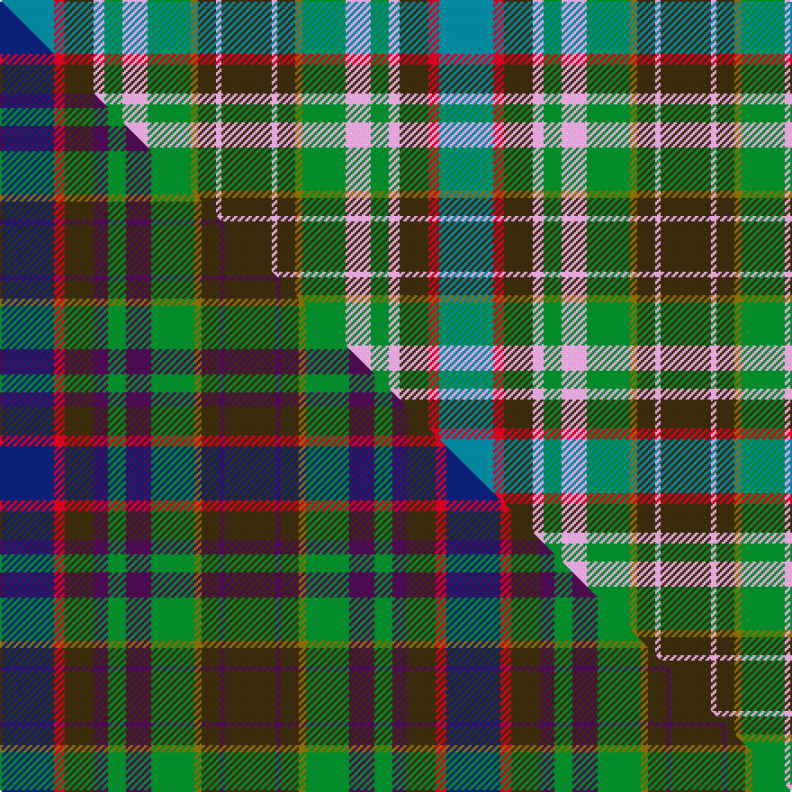

This is one **variant** — a specific cloth: this exact thread count and colourway, with its own
provenance below. It is one weaving of the [sett](/setts/t30r6dy16lp6g10lp14g24y4dy10lp3dy28/) (the scale-free proportion — the
same cloth at any scale or shade), whose colour order is pattern [BRGWGWGGGWG](/stripes/brgwgwgggwg/).

Part of the [Greyfriars](/tartans/g/gr/greyfriars/) tartan — the named design grouping this sett with its other cloths.

Sourced from tartans-authority.  It is a [11 stripe tartan](/stripes/stripes11/).

Original link [https://www.tartanregister.gov.uk/tartanDetails.aspx?ref=10337](https://www.tartanregister.gov.uk/tartanDetails.aspx?ref=10337)

Dataset <small>— provenance for this record, inherited from the source manifest</small>

<dl class="dataset-prov">
<dt>source</dt><dd><a href="/sources/tartans-authority/">Scottish Tartans Authority</a></dd>
<dt>data captured from</dt><dd><a href="https://github.com/thetartan/tartan-database/blob/master/data/tartans-authority/data.csv">https://github.com/thetartan/tartan-database/blob/master/data/tartans-authority/data.csv</a></dd>
<dt>data date</dt><dd>14th Dec. 2010 <small>(this record)</small></dd>
<dt>licence</dt><dd><a href="https://creativecommons.org/licenses/by-nc-nd/4.0/">CC BY-NC-ND 4.0</a></dd>
</dl>

Capture chain <small>— the hands this data passed through, oldest first; each capture carries its own licence</small>

<ol class="capture-chain">
<li><a href="https://www.tartansauthority.com/">Scottish Tartans Authority</a> <small>the heritage body's archive — its tartan-ferret record browser is retired (links repaired to the SRT, above)</small></li>
<li><a href="https://github.com/thetartan/tartan-database">thetartan/tartan-database</a> <small>2016-2017</small> · <a href="https://creativecommons.org/licenses/by-nc-nd/4.0/">CC BY-NC-ND 4.0</a> <small>Levko Kravets's frozen compilation — the capture we vendored, and where its CC licence text came from</small></li>
<li>this dictionary <small>captured 2026-06-10 · commit 5bf86c7566</small> <small>each re-capture is a git commit to data/sources</small></li>
</ol>

## Register references

External register numbers recorded for this tartan.

- Scottish Register of Tartans: [10337](https://www.tartanregister.gov.uk/tartanDetails?ref=10337)
- Scottish Tartans Authority (ITI): 10337

## Thread count
T/30 R6 DY16 LP6 G10 LP14 G24 Y4 DY10 LP3 DY/28

One full sett is **244 threads**.

## Palette
<table><thead><tr><th>Colour</th><th>Shade</th><th>OKLCh</th></tr></thead><tbody><tr><td>T</td><td><code style="background-color:#00879F;">#00879F</code> <small style="color:#888">#00879F</small></td><td><small style="color:#888">oklch(57.4% 0.102 216.1)</small></td></tr><tr><td>G</td><td><code style="background-color:#008B2A;">#008B2A</code> <small style="color:#888">#008B2A</small></td><td><small style="color:#888">oklch(55.4% 0.170 145.9)</small></td></tr><tr><td>LP</td><td><code style="background-color:#E4A6DB;">#E4A6DB</code> <small style="color:#888">#E4A6DB</small></td><td><small style="color:#888">oklch(80.0% 0.100 331.6)</small></td></tr><tr><td>R</td><td><code style="background-color:#D60020;">#D60020</code> <small style="color:#888">#D60020</small></td><td><small style="color:#888">oklch(55.2% 0.224 25.5)</small></td></tr><tr><td>DY</td><td><code style="background-color:#3A2B0D;">#3A2B0D</code> <small style="color:#888">#3A2B0D</small></td><td><small style="color:#888">oklch(30.0% 0.049 82.0)</small></td></tr><tr><td>Y</td><td><code style="background-color:#8B6E00;">#8B6E00</code> <small style="color:#888">#8B6E00</small></td><td><small style="color:#888">oklch(55.1% 0.113 90.4)</small></td></tr></tbody></table>

# Sample pattern

## Compared to the master

This cloth is one sett of its design; the master sett (the exemplar the design is anchored on) is below for comparison.

Its **ΔTartan distance** from the master is **0.20** — the same measure the nearest-tartans table ranks by (0 is identical; a re-scale of the same cloth is near 0, a recolour or a different proportion further).

<figure class="master-compare" style="margin:0">

this sett
master sett ★

<figcaption style="color:#888;font-size:smaller">One weave of this sett against the <a href="/setts/db30r6dy16dp8g10dp14g24y4dy10dp3dy28/">master sett ★</a>, split on the diagonal: a shared proportion runs seamlessly across it with only the shades shifting; a different proportion breaks on it.</figcaption>
</figure>

## Nearest tartan variants

The nearest existing variants by ΔTartan distance, with this cloth at the top so the swatches line up against it.

ΔTartan

Threads

Variant

Sett

—

244

<a href="/variants/s11/t30r6dy16lp6g10lp14g24y4dy10lp3dy28/">Greyfriars (District)</a>

<a href="/ttd/edit/#slug=db30r6dy16dp8g10dp14g24y4dy10dp3dy28&amp;base=t30r6dy16lp6g10lp14g24y4dy10lp3dy28" title="compare in the TTD">0.20</a>

248

<a href="/variants/s11/db30r6dy16dp8g10dp14g24y4dy10dp3dy28/">Greyfriars</a>

<a href="/ttd/edit/#slug=dg12g24t48r23w8r23t24y4g12dg12&amp;base=t30r6dy16lp6g10lp14g24y4dy10lp3dy28" title="compare in the TTD">1.36</a>

356

<a href="/variants/s10/dg12g24t48r23w8r23t24y4g12dg12/">Swiss Highlander (Corporate)</a>

<a href="/ttd/edit/#slug=y3g15r2db8lb2r8g8r2dg15r2dg2lb2~x2&amp;base=t30r6dy16lp6g10lp14g24y4dy10lp3dy28" title="compare in the TTD">1.96</a>

266

<a href="/variants/s12/y3g15r2db8lb2r8g8r2dg15r2dg2lb2~x2/">Gordonstoun Corporate Tartan</a>

<a href="/ttd/edit/#slug=db8r2db3r4db13w2o13w2g13r4g4y2g8~x2&amp;base=t30r6dy16lp6g10lp14g24y4dy10lp3dy28" title="compare in the TTD">2.06</a>

280

<a href="/variants/s13/db8r2db3r4db13w2o13w2g13r4g4y2g8~x2/">Bowie</a>

<a href="/ttd/edit/#slug=r1dy7db3g1n3g1db3g7w1~x4&amp;base=t30r6dy16lp6g10lp14g24y4dy10lp3dy28" title="compare in the TTD">2.18</a>

208

<a href="/variants/s9/r1dy7db3g1n3g1db3g7w1~x4/">Adamson (Personal)</a>

<a href="/ttd/edit/#slug=lo5t2o14do9dg8t3o3t3o3t3dg19lr3~x2&amp;base=t30r6dy16lp6g10lp14g24y4dy10lp3dy28" title="compare in the TTD">2.25</a>

284

<a href="/variants/s12/lo5t2o14do9dg8t3o3t3o3t3dg19lr3~x2/">Meath Irish County Tartan</a>

<a href="/ttd/edit/#slug=g10m2g2r4g16dp16r2b18y2b8r3~x2&amp;base=t30r6dy16lp6g10lp14g24y4dy10lp3dy28" title="compare in the TTD">2.49</a>

306

<a href="/variants/s11/g10m2g2r4g16dp16r2b18y2b8r3~x2/">Commonwealth Games 1998 (Corporate)</a>

<a href="/ttd/edit/#slug=db8r2db3r4db13w2dr13w2g13r4g4y2g8~x2&amp;base=t30r6dy16lp6g10lp14g24y4dy10lp3dy28" title="compare in the TTD">2.50</a>

280

<a href="/variants/s13/db8r2db3r4db13w2dr13w2g13r4g4y2g8~x2/">Bowie (Dalgety) Family Tartan</a>

<a href="/ttd/edit/#slug=o3b2g19b6g2b6dg14dr4w2~x2&amp;base=t30r6dy16lp6g10lp14g24y4dy10lp3dy28" title="compare in the TTD">2.62</a>

222

<a href="/variants/s9/o3b2g19b6g2b6dg14dr4w2~x2/">Royal Pharmaceutical, Society</a>

<a href="/ttd/edit/#slug=db11r1db2r3db1do8g11w1g11do8db8y1r1y1~x2&amp;base=t30r6dy16lp6g10lp14g24y4dy10lp3dy28" title="compare in the TTD">2.62</a>

248

<a href="/variants/s14/db11r1db2r3db1do8g11w1g11do8db8y1r1y1~x2/">Allen Northumbrian Family Tartan</a>

## Neighbour map

Every grey dot is one of 13621 variants placed by the first two principal components of the ΔTartan feature space (42% of its variance). Red is this tartan; blue dots are its nearest — click one to open its page.

<svg viewBox="0 0 640 380" role="img" style="max-width:100%;height:auto;border:1px solid #e0e0e0;border-radius:4px;display:block" xmlns="http://www.w3.org/2000/svg"><image href="/nn/cloud.v1.png" width="640" height="380"/><a href="/variants/s11/db30r6dy16dp8g10dp14g24y4dy10dp3dy28/"><circle cx="172.3" cy="202.1" r="4" fill="#3465a4"><title>Greyfriars</title></circle></a><a href="/variants/s10/dg12g24t48r23w8r23t24y4g12dg12/"><circle cx="166.5" cy="196.7" r="4" fill="#3465a4"><title>Swiss Highlander (Corporate)</title></circle></a><a href="/variants/s12/y3g15r2db8lb2r8g8r2dg15r2dg2lb2~x2/"><circle cx="125.5" cy="180.3" r="4" fill="#3465a4"><title>Gordonstoun Corporate Tartan</title></circle></a><a href="/variants/s13/db8r2db3r4db13w2o13w2g13r4g4y2g8~x2/"><circle cx="100.1" cy="189.5" r="4" fill="#3465a4"><title>Bowie</title></circle></a><a href="/variants/s9/r1dy7db3g1n3g1db3g7w1~x4/"><circle cx="135.9" cy="204.8" r="4" fill="#3465a4"><title>Adamson (Personal)</title></circle></a><a href="/variants/s12/lo5t2o14do9dg8t3o3t3o3t3dg19lr3~x2/"><circle cx="167.9" cy="179.9" r="4" fill="#3465a4"><title>Meath Irish County Tartan</title></circle></a><a href="/variants/s11/g10m2g2r4g16dp16r2b18y2b8r3~x2/"><circle cx="157.6" cy="182.0" r="4" fill="#3465a4"><title>Commonwealth Games 1998 (Corporate)</title></circle></a><a href="/variants/s13/db8r2db3r4db13w2dr13w2g13r4g4y2g8~x2/"><circle cx="95.0" cy="186.8" r="4" fill="#3465a4"><title>Bowie (Dalgety) Family Tartan</title></circle></a><a href="/variants/s9/o3b2g19b6g2b6dg14dr4w2~x2/"><circle cx="173.8" cy="189.2" r="4" fill="#3465a4"><title>Royal Pharmaceutical, Society</title></circle></a><a href="/variants/s14/db11r1db2r3db1do8g11w1g11do8db8y1r1y1~x2/"><circle cx="150.8" cy="160.9" r="4" fill="#3465a4"><title>Allen Northumbrian Family Tartan</title></circle></a><circle cx="139.3" cy="190.9" r="5" fill="#c00000"/><text x="320" y="376" text-anchor="middle" font-size="11" fill="#999">ground</text><text x="11" y="190" text-anchor="middle" font-size="11" fill="#999" transform="rotate(-90 11 190)">complexity</text></svg>

ID: /variants/s11/t30r6dy16lp6g10lp14g24y4dy10lp3dy28/
