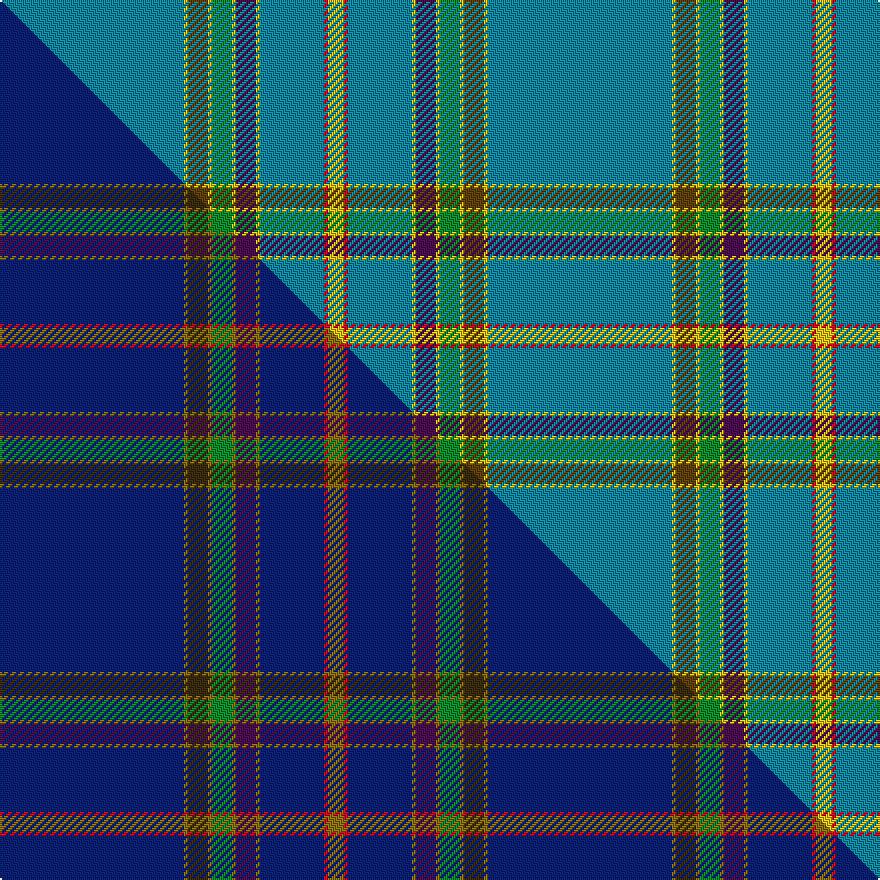

This is one **variant** — a specific cloth: this exact thread count and colourway, with its own
provenance below. It is one weaving of the [sett](/setts/t46ly1dy5ly1g5ly1dp5ly1t16r1ly4/) (the scale-free proportion — the
same cloth at any scale or shade), whose colour order is pattern [BYGYGYBYBRY](/stripes/bygygybybry/).

Part of the [Craven County](/tartans/c/cr/craven-county/) tartan — the named design grouping this sett with its other cloths.

Sourced from tartans-authority.  It is a [11 stripe tartan](/stripes/stripes11/).

Original link [https://www.tartanregister.gov.uk/tartanDetails.aspx?ref=10679](https://www.tartanregister.gov.uk/tartanDetails.aspx?ref=10679)

Dataset <small>— provenance for this record, inherited from the source manifest</small>

<dl class="dataset-prov">
<dt>source</dt><dd><a href="/sources/tartans-authority/">Scottish Tartans Authority</a></dd>
<dt>data captured from</dt><dd><a href="https://github.com/thetartan/tartan-database/blob/master/data/tartans-authority/data.csv">https://github.com/thetartan/tartan-database/blob/master/data/tartans-authority/data.csv</a></dd>
<dt>data date</dt><dd>20/08/2012 <small>(this record)</small></dd>
<dt>licence</dt><dd><a href="https://creativecommons.org/licenses/by-nc-nd/4.0/">CC BY-NC-ND 4.0</a></dd>
</dl>

Capture chain <small>— the hands this data passed through, oldest first; each capture carries its own licence</small>

<ol class="capture-chain">
<li><a href="https://www.tartansauthority.com/">Scottish Tartans Authority</a> <small>the heritage body's archive — its tartan-ferret record browser is retired (links repaired to the SRT, above)</small></li>
<li><a href="https://github.com/thetartan/tartan-database">thetartan/tartan-database</a> <small>2016-2017</small> · <a href="https://creativecommons.org/licenses/by-nc-nd/4.0/">CC BY-NC-ND 4.0</a> <small>Levko Kravets's frozen compilation — the capture we vendored, and where its CC licence text came from</small></li>
<li>this dictionary <small>captured 2026-06-10 · commit 5bf86c7566</small> <small>each re-capture is a git commit to data/sources</small></li>
</ol>

## Register references

External register numbers recorded for this tartan.

- Scottish Register of Tartans: [10679](https://www.tartanregister.gov.uk/tartanDetails?ref=10679)
- Scottish Tartans Authority (ITI): 10679

## Thread count
T/92 LY2 DY10 LY2 G10 LY2 DP10 LY2 T32 R2 LY/8

One full sett is **244 threads**.

## Palette
<table><thead><tr><th>Colour</th><th>Shade</th><th>OKLCh</th></tr></thead><tbody><tr><td>T</td><td><code style="background-color:#00879F;">#00879F</code> <small style="color:#888">#00879F</small></td><td><small style="color:#888">oklch(57.4% 0.102 216.1)</small></td></tr><tr><td>DP</td><td><code style="background-color:#4B0B4F;">#4B0B4F</code> <small style="color:#888">#4B0B4F</small></td><td><small style="color:#888">oklch(30.1% 0.125 325.4)</small></td></tr><tr><td>G</td><td><code style="background-color:#008B2A;">#008B2A</code> <small style="color:#888">#008B2A</small></td><td><small style="color:#888">oklch(55.4% 0.170 145.9)</small></td></tr><tr><td>R</td><td><code style="background-color:#D60020;">#D60020</code> <small style="color:#888">#D60020</small></td><td><small style="color:#888">oklch(55.2% 0.224 25.5)</small></td></tr><tr><td>DY</td><td><code style="background-color:#604000;">#604000</code> <small style="color:#888">#604000</small></td><td><small style="color:#888">oklch(39.8% 0.083 76.8)</small></td></tr><tr><td>LY</td><td><code style="background-color:#E8C000;">#E8C000</code> <small style="color:#888">#E8C000</small></td><td><small style="color:#888">oklch(81.9% 0.168 93.7)</small></td></tr></tbody></table>

# Sample pattern

## Compared to the master

This cloth is one sett of its design; the master sett (the exemplar the design is anchored on) is below for comparison.

Its **ΔTartan distance** from the master is **1.80** — the same measure the nearest-tartans table ranks by (0 is identical; a re-scale of the same cloth is near 0, a recolour or a different proportion further).

<figure class="master-compare" style="margin:0">

this sett
master sett ★

<figcaption style="color:#888;font-size:smaller">One weave of this sett against the <a href="/setts/db46y1dy5y1g5y1dp5y1db16r1y4/">master sett ★</a>, split on the diagonal: a shared proportion runs seamlessly across it with only the shades shifting; a different proportion breaks on it.</figcaption>
</figure>

## Nearest tartan variants

The nearest existing variants by ΔTartan distance, with this cloth at the top so the swatches line up against it.

ΔTartan

Threads

Variant

Sett

—

244

<a href="/variants/s11/t46ly1dy5ly1g5ly1dp5ly1t16r1ly4~x2~ly3307090-dy1603076/">Craven County (Commemorative)</a>

<a href="/ttd/edit/#slug=db46y1dy5y1g5y1dp5y1db16r1y4~x2&amp;base=t46ly1dy5ly1g5ly1dp5ly1t16r1ly4~x2~ly3307090-dy1603076" title="compare in the TTD">1.80</a>

244

<a href="/variants/s11/db46y1dy5y1g5y1dp5y1db16r1y4~x2/">Craven County</a>

<a href="/ttd/edit/#slug=t42w5t1w1ly9t1dg2w1t1r1~x4&amp;base=t46ly1dy5ly1g5ly1dp5ly1t16r1ly4~x2~ly3307090-dy1603076" title="compare in the TTD">3.18</a>

340

<a href="/variants/s10/t42w5t1w1ly9t1dg2w1t1r1~x4/">Stratford, (Oregon) City of (Dist.)</a>

<a href="/ttd/edit/#slug=n56db9w2db2r2n9lb4db2lb2y3~x2&amp;base=t46ly1dy5ly1g5ly1dp5ly1t16r1ly4~x2~ly3307090-dy1603076" title="compare in the TTD">3.36</a>

246

<a href="/variants/s10/n56db9w2db2r2n9lb4db2lb2y3~x2/">Blue Toon</a>

<a href="/ttd/edit/#slug=t48dp4t8lr2t4r3t4dg14dr7t2dr4r2~x2&amp;base=t46ly1dy5ly1g5ly1dp5ly1t16r1ly4~x2~ly3307090-dy1603076" title="compare in the TTD">3.56</a>

308

<a href="/variants/s12/t48dp4t8lr2t4r3t4dg14dr7t2dr4r2~x2/">Louth, County</a>

<a href="/ttd/edit/#slug=t49db11w2db2r2db2t10lb4db2lb2y3~x2~t2203246-db1404245&amp;base=t46ly1dy5ly1g5ly1dp5ly1t16r1ly4~x2~ly3307090-dy1603076" title="compare in the TTD">3.65</a>

252

<a href="/variants/s11/t49db11w2db2r2db2t10lb4db2lb2y3~x2~t2203246-db1404245/">Blue Toon (Fashion)</a>

<a href="/ttd/edit/#slug=dy6y3t42w4dg18y2t12r3~x2&amp;base=t46ly1dy5ly1g5ly1dp5ly1t16r1ly4~x2~ly3307090-dy1603076" title="compare in the TTD">3.67</a>

342

<a href="/variants/s8/dy6y3t42w4dg18y2t12r3~x2/">Glasgow High (School)</a>

<a href="/ttd/edit/#slug=w4t8w4lg8w2lg2w4t42r1ly2r1t2~x2&amp;base=t46ly1dy5ly1g5ly1dp5ly1t16r1ly4~x2~ly3307090-dy1603076" title="compare in the TTD">3.79</a>

308

<a href="/variants/s12/w4t8w4lg8w2lg2w4t42r1ly2r1t2~x2/">StammBar</a>

<a href="/ttd/edit/#slug=t27w2t15ly1t1ly1t15k2w2g16r1~x2&amp;base=t46ly1dy5ly1g5ly1dp5ly1t16r1ly4~x2~ly3307090-dy1603076" title="compare in the TTD">3.90</a>

276

<a href="/variants/s11/t27w2t15ly1t1ly1t15k2w2g16r1~x2/">Quigley of Knockcroghery Htg (Per.)</a>

<a href="/ttd/edit/#slug=n30db6o1w2o6w2o1db6n30lb1dp3~x2&amp;base=t46ly1dy5ly1g5ly1dp5ly1t16r1ly4~x2~ly3307090-dy1603076" title="compare in the TTD">3.90</a>

286

<a href="/variants/s11/n30db6o1w2o6w2o1db6n30lb1dp3~x2/">Kuehle Family (Personal)</a>

<a href="/ttd/edit/#slug=dp2y1lb42lo2lb6lr1r1lr1g4lo4lr1y1dp1~x2&amp;base=t46ly1dy5ly1g5ly1dp5ly1t16r1ly4~x2~ly3307090-dy1603076" title="compare in the TTD">3.91</a>

262

<a href="/variants/s13/dp2y1lb42lo2lb6lr1r1lr1g4lo4lr1y1dp1~x2/">Kerr of Ardgowan Dress (Personal)</a>

## Neighbour map

Every grey dot is one of 13621 variants placed by the first two principal components of the ΔTartan feature space (42% of its variance). Red is this tartan; blue dots are its nearest — click one to open its page. The map is a flat projection of a many-dimensional space — [how to read it](/posts/neighbourhood-maps/).

<svg viewBox="0 0 640 380" role="img" style="max-width:100%;height:auto;border:1px solid #e0e0e0;border-radius:4px;display:block" xmlns="http://www.w3.org/2000/svg"><image href="/nn/cloud.v1.png" width="640" height="380"/><a href="/variants/s11/db46y1dy5y1g5y1dp5y1db16r1y4~x2/"><circle cx="502.1" cy="77.0" r="4" fill="#3465a4"><title>Craven County</title></circle></a><a href="/variants/s10/t42w5t1w1ly9t1dg2w1t1r1~x4/"><circle cx="475.1" cy="84.2" r="4" fill="#3465a4"><title>Stratford, (Oregon) City of (Dist.)</title></circle></a><a href="/variants/s10/n56db9w2db2r2n9lb4db2lb2y3~x2/"><circle cx="493.0" cy="97.3" r="4" fill="#3465a4"><title>Blue Toon</title></circle></a><a href="/variants/s12/t48dp4t8lr2t4r3t4dg14dr7t2dr4r2~x2/"><circle cx="398.0" cy="105.1" r="4" fill="#3465a4"><title>Louth, County</title></circle></a><a href="/variants/s11/t49db11w2db2r2db2t10lb4db2lb2y3~x2~t2203246-db1404245/"><circle cx="461.5" cy="112.0" r="4" fill="#3465a4"><title>Blue Toon (Fashion)</title></circle></a><a href="/variants/s8/dy6y3t42w4dg18y2t12r3~x2/"><circle cx="347.0" cy="142.1" r="4" fill="#3465a4"><title>Glasgow High (School)</title></circle></a><a href="/variants/s12/w4t8w4lg8w2lg2w4t42r1ly2r1t2~x2/"><circle cx="425.1" cy="89.0" r="4" fill="#3465a4"><title>StammBar</title></circle></a><a href="/variants/s11/t27w2t15ly1t1ly1t15k2w2g16r1~x2/"><circle cx="423.8" cy="118.0" r="4" fill="#3465a4"><title>Quigley of Knockcroghery Htg (Per.)</title></circle></a><a href="/variants/s11/n30db6o1w2o6w2o1db6n30lb1dp3~x2/"><circle cx="450.3" cy="109.9" r="4" fill="#3465a4"><title>Kuehle Family (Personal)</title></circle></a><a href="/variants/s13/dp2y1lb42lo2lb6lr1r1lr1g4lo4lr1y1dp1~x2/"><circle cx="486.1" cy="47.4" r="4" fill="#3465a4"><title>Kerr of Ardgowan Dress (Personal)</title></circle></a><circle cx="495.0" cy="84.1" r="5" fill="#c00000"/><text x="320" y="376" text-anchor="middle" font-size="11" fill="#999">ground</text><text x="11" y="190" text-anchor="middle" font-size="11" fill="#999" transform="rotate(-90 11 190)">complexity</text></svg>

ID: /variants/s11/t46ly1dy5ly1g5ly1dp5ly1t16r1ly4~x2~ly3307090-dy1603076/
