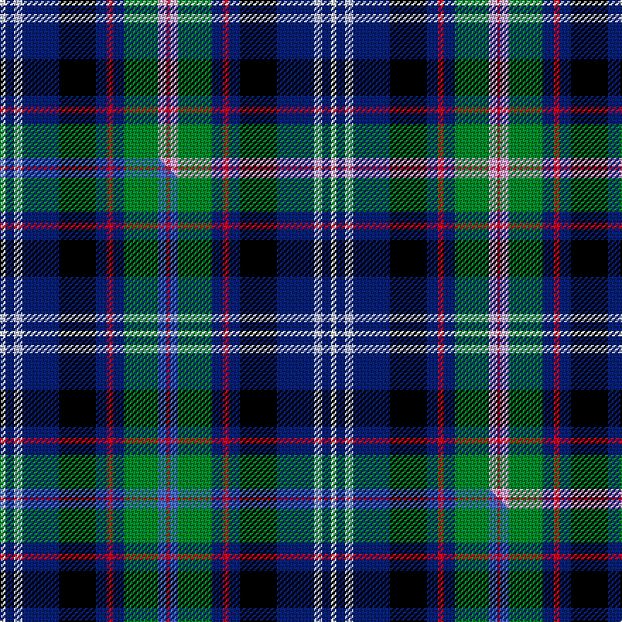

This is one **variant** — a specific cloth: this exact thread count and colourway, with its own
provenance below. It is one weaving of the [sett](/tartans/f/fi/fitzgerald-hunting-3/) (the scale-free proportion — the
same cloth at any scale or shade), whose colour order is pattern [RWGBRBKBWBW](/stripes/rwgbrbkbwbw/).

Part of the [Fitzgerald, hunting](/tartans/f/fi/fitzgerald-hunting-3/) tartan — the named design grouping this sett with its other cloths.

Sourced from house-of-tartan.  It is a [11 stripe tartan](/stripes/stripes11/).

Original link [http://www.house-of-tartan.scotland.net/house/TartanViewjs.asp?colr=Def&tnam=1336](http://www.house-of-tartan.scotland.net/house/TartanViewjs.asp?colr=Def&tnam=1336)

## Provenance

Earliest known date: 1985 Sample in STS collection.

Dataset <small>— provenance for this record, inherited from the source manifest</small>

<dl class="dataset-prov">
<dt>source</dt><dd><a href="/sources/house-of-tartan/">House of Tartan</a></dd>
<dt>data captured from</dt><dd><a href="https://github.com/thetartan/tartan-database/blob/master/data/house-of-tartan/data.csv">https://github.com/thetartan/tartan-database/blob/master/data/house-of-tartan/data.csv</a></dd>
<dt>data date</dt><dd>1985 <small>(this record)</small></dd>
<dt>licence</dt><dd><a href="https://creativecommons.org/licenses/by-nc-nd/4.0/">CC BY-NC-ND 4.0</a></dd>
</dl>

Capture chain <small>— the hands this data passed through, oldest first; each capture carries its own licence</small>

<ol class="capture-chain">
<li><a href="http://www.house-of-tartan.scotland.net/">House of Tartan</a> <small>the weaver/retailer's database — the site is now offline; the URL is kept as the ultimate source's identity</small></li>
<li><a href="https://github.com/thetartan/tartan-database">thetartan/tartan-database</a> <small>2016-2017</small> · <a href="https://creativecommons.org/licenses/by-nc-nd/4.0/">CC BY-NC-ND 4.0</a> <small>Levko Kravets's frozen compilation — the capture we vendored, and where its CC licence text came from</small></li>
<li>this dictionary <small>captured 2026-06-10 · commit 5bf86c7566</small> <small>each re-capture is a git commit to data/sources</small></li>
</ol>

## Thread count
W/4 DB6 LB6 DB26 K26 DB8 R4 DB8 G24 LP6 R/2

One full sett is **234 threads**.

## Palette
<table><thead><tr><th>Colour</th><th>Shade</th><th>OKLCh</th></tr></thead><tbody><tr><td>LB</td><td><code style="background-color:#B5BBDE;">#B5BBDE</code> <small style="color:#888">#B5BBDE</small></td><td><small style="color:#888">oklch(79.9% 0.050 277.6)</small></td></tr><tr><td>DB</td><td><code style="background-color:#082077;">#082077</code> <small style="color:#888">#082077</small></td><td><small style="color:#888">oklch(30.0% 0.149 265.1)</small></td></tr><tr><td>G</td><td><code style="background-color:#008B2A;">#008B2A</code> <small style="color:#888">#008B2A</small></td><td><small style="color:#888">oklch(55.4% 0.170 145.9)</small></td></tr><tr><td>K</td><td><code style="background-color:#000000;">#000000</code> <small style="color:#888">#000000</small></td><td><small style="color:#888">oklch(0.0% 0.000 0.0)</small></td></tr><tr><td>W</td><td><code style="background-color:#F7F7F7;">#F7F7F7</code> <small style="color:#888">#F7F7F7</small></td><td><small style="color:#888">oklch(97.6% 0.000 89.9)</small></td></tr><tr><td>LP</td><td><code style="background-color:#E4A6DB;">#E4A6DB</code> <small style="color:#888">#E4A6DB</small></td><td><small style="color:#888">oklch(80.0% 0.100 331.6)</small></td></tr><tr><td>R</td><td><code style="background-color:#D60020;">#D60020</code> <small style="color:#888">#D60020</small></td><td><small style="color:#888">oklch(55.2% 0.224 25.5)</small></td></tr></tbody></table>

# Sample pattern

[Sample sheet (PDF)](swatch.pdf) — the woven sample, thread count and palette on one printable A4, rendered on demand (the same sheet the TTD print page downloads).

## Compared to the master

This cloth is one sett of its design; the master sett (the exemplar the design is anchored on) is below for comparison.

Its **ΔTartan distance** from the master is **0.60** — the same measure the nearest-tartans table ranks by (0 is identical; a re-scale of the same cloth is near 0, a recolour or a different proportion further).

<figure class="master-compare" style="margin:0">

this sett
master sett ★

<figcaption style="color:#888;font-size:smaller">One weave of this sett against the <a href="/setts/w2db3lb3db13k13db4r2db4g12b3r1/">master sett ★</a>, split on the diagonal: a shared proportion runs seamlessly across it with only the shades shifting; a different proportion breaks on it.</figcaption>
</figure>

## Nearest tartan variants

The nearest existing variants by ΔTartan distance, with this cloth at the top so the swatches line up against it.

ΔTartan

Threads

Variant

Sett

—

234

<a href="/variants/s11/w2db3lb3db13k13db4r2db4g12lp3r1~x2/">Fitzgerald Hunting Family Tartan</a>

<a href="/ttd/edit/#slug=w2db3lb3db13k13db4r2db4g12b3r1~x2&amp;base=w2db3lb3db13k13db4r2db4g12lp3r1~x2" title="compare in the TTD">0.60</a>

234

<a href="/variants/s11/w2db3lb3db13k13db4r2db4g12b3r1~x2/">Fitzgerald, hunting</a>

<a href="/ttd/edit/#slug=db40lb3db11k7g22k7db3w3n10k32y13~x2&amp;base=w2db3lb3db13k13db4r2db4g12lp3r1~x2" title="compare in the TTD">1.61</a>

498

<a href="/variants/s11/db40lb3db11k7g22k7db3w3n10k32y13~x2/">Aurora House Check</a>

<a href="/ttd/edit/#slug=k40n15o10y3lb5w5db10lb20~n47-o62&amp;base=w2db3lb3db13k13db4r2db4g12lp3r1~x2" title="compare in the TTD">2.09</a>

156

<a href="/variants/s8/k40n15o10y3lb5w5db10lb20~n47-o62/">Julien Pigeut Tartan</a>

<a href="/ttd/edit/#slug=db24y4n4dp4db24r4w3k18w9r4k3w2~x2&amp;base=w2db3lb3db13k13db4r2db4g12lp3r1~x2" title="compare in the TTD">2.34</a>

360

<a href="/variants/s12/db24y4n4dp4db24r4w3k18w9r4k3w2~x2/">Queen Mary RMS</a>

<a href="/ttd/edit/#slug=g16db7r2db7k5y2dp1y2k5db16g8w1~x2&amp;base=w2db3lb3db13k13db4r2db4g12lp3r1~x2" title="compare in the TTD">2.34</a>

254

<a href="/variants/s12/g16db7r2db7k5y2dp1y2k5db16g8w1~x2/">Waipu (District)</a>

<a href="/ttd/edit/#slug=k1dr4k1w3k1g7k2db16r2ly1~x2&amp;base=w2db3lb3db13k13db4r2db4g12lp3r1~x2" title="compare in the TTD">2.42</a>

148

<a href="/variants/s10/k1dr4k1w3k1g7k2db16r2ly1~x2/">Twempy</a>

<a href="/ttd/edit/#slug=db21w2ly3w2ly2w2k12w2g6db15r2y4~x2&amp;base=w2db3lb3db13k13db4r2db4g12lp3r1~x2" title="compare in the TTD">2.52</a>

242

<a href="/variants/s12/db21w2ly3w2ly2w2k12w2g6db15r2y4~x2/">Robitaille, Jean-Francois (Personal)</a>

<a href="/ttd/edit/#slug=db37r3k17r3g22k4g22r3k17r3db37w3~x2&amp;base=w2db3lb3db13k13db4r2db4g12lp3r1~x2" title="compare in the TTD">2.54</a>

604

<a href="/variants/s12/db37r3k17r3g22k4g22r3k17r3db37w3~x2/">Souza Nery (Personal)</a>

<a href="/ttd/edit/#slug=n3lb18dr2lb18g3db8k20g2k5lo3~x2&amp;base=w2db3lb3db13k13db4r2db4g12lp3r1~x2" title="compare in the TTD">2.54</a>

316

<a href="/variants/s10/n3lb18dr2lb18g3db8k20g2k5lo3~x2/">Royal Air Force Lossiemouth</a>

<a href="/ttd/edit/#slug=db21w2ly3w2ly2w2k12w2g6db15r2lyi4~x2~ly6307084-lyi8517093&amp;base=w2db3lb3db13k13db4r2db4g12lp3r1~x2" title="compare in the TTD">2.57</a>

242

<a href="/variants/s12/db21w2ly3w2ly2w2k12w2g6db15r2lyi4~x2~ly6307084-lyi8517093/">Robitaille, Jean-Francois (Personal)</a>

## Neighbour map

Every grey dot is one of 13662 variants placed by the first two principal components of the ΔTartan feature space (42% of its variance). Red is this tartan; blue dots are its nearest — click one to open its page. The map is a flat projection of a many-dimensional space — [how to read it](/posts/neighbourhood-maps/).

<svg viewBox="0 0 640 380" role="img" style="max-width:100%;height:auto;border:1px solid #e0e0e0;border-radius:4px;display:block" xmlns="http://www.w3.org/2000/svg"><image href="/nn/cloud.v1.png" width="640" height="380"/><a href="/variants/s11/w2db3lb3db13k13db4r2db4g12b3r1~x2/"><circle cx="98.3" cy="124.1" r="4" fill="#3465a4"><title>Fitzgerald, hunting</title></circle></a><a href="/variants/s11/db40lb3db11k7g22k7db3w3n10k32y13~x2/"><circle cx="91.1" cy="119.9" r="4" fill="#3465a4"><title>Aurora House Check</title></circle></a><a href="/variants/s8/k40n15o10y3lb5w5db10lb20~n47-o62/"><circle cx="76.3" cy="127.8" r="4" fill="#3465a4"><title>Julien Pigeut Tartan</title></circle></a><a href="/variants/s12/db24y4n4dp4db24r4w3k18w9r4k3w2~x2/"><circle cx="122.2" cy="103.9" r="4" fill="#3465a4"><title>Queen Mary RMS</title></circle></a><a href="/variants/s12/g16db7r2db7k5y2dp1y2k5db16g8w1~x2/"><circle cx="137.5" cy="116.8" r="4" fill="#3465a4"><title>Waipu (District)</title></circle></a><a href="/variants/s10/k1dr4k1w3k1g7k2db16r2ly1~x2/"><circle cx="127.7" cy="90.8" r="4" fill="#3465a4"><title>Twempy</title></circle></a><a href="/variants/s12/db21w2ly3w2ly2w2k12w2g6db15r2y4~x2/"><circle cx="142.3" cy="113.1" r="4" fill="#3465a4"><title>Robitaille, Jean-Francois (Personal)</title></circle></a><a href="/variants/s12/db37r3k17r3g22k4g22r3k17r3db37w3~x2/"><circle cx="140.3" cy="128.3" r="4" fill="#3465a4"><title>Souza Nery (Personal)</title></circle></a><a href="/variants/s10/n3lb18dr2lb18g3db8k20g2k5lo3~x2/"><circle cx="102.8" cy="123.8" r="4" fill="#3465a4"><title>Royal Air Force Lossiemouth</title></circle></a><a href="/variants/s12/db21w2ly3w2ly2w2k12w2g6db15r2lyi4~x2~ly6307084-lyi8517093/"><circle cx="141.3" cy="112.7" r="4" fill="#3465a4"><title>Robitaille, Jean-Francois (Personal)</title></circle></a><circle cx="94.4" cy="122.2" r="5" fill="#c00000"/><text x="320" y="376" text-anchor="middle" font-size="11" fill="#999">ground</text><text x="11" y="190" text-anchor="middle" font-size="11" fill="#999" transform="rotate(-90 11 190)">complexity</text></svg>

ID: /variants/s11/w2db3lb3db13k13db4r2db4g12lp3r1~x2/
