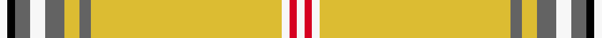

This is one **variant** — a specific cloth: this exact thread count and colourway, with its own
provenance below. It is one weaving of the [sett](/tartans/b/bo/bourbon-sebastien/) (the scale-free proportion — the
same cloth at any scale or shade), whose colour order is pattern [WKBWBYBYWRW](/stripes/wkbwbybywrw/).

Part of the [Bourbon, Sebastien](/tartans/b/bo/bourbon-sebastien/) tartan — the named design grouping this sett with its other cloths.

Sourced from register-of-tartans.  It is a [11 stripe tartan](/stripes/stripes11/).

Original link [https://www.tartanregister.gov.uk/tartanDetails.aspx?ref=11307](https://www.tartanregister.gov.uk/tartanDetails.aspx?ref=11307)

Dataset <small>— provenance for this record, inherited from the source manifest</small>

<dl class="dataset-prov">
<dt>source</dt><dd><a href="/sources/register-of-tartans/">Scottish Register of Tartans</a></dd>
<dt>data captured from</dt><dd><a href="https://github.com/thetartan/tartan-database/blob/master/data/register-of-tartans/data.csv">https://github.com/thetartan/tartan-database/blob/master/data/register-of-tartans/data.csv</a></dd>
<dt>data date</dt><dd>27/04/2015 <small>(this record)</small></dd>
<dt>licence</dt><dd><a href="https://www.tartanregister.gov.uk/copyright">Crown copyright</a></dd>
</dl>

Capture chain <small>— the hands this data passed through, oldest first; each capture carries its own licence</small>

<ol class="capture-chain">
<li><a href="https://www.tartanregister.gov.uk/">Scottish Register of Tartans</a> · <a href="https://www.tartanregister.gov.uk/copyright">Crown copyright</a> <small>the living register — still published by National Records of Scotland</small></li>
<li><a href="https://github.com/thetartan/tartan-database">thetartan/tartan-database</a> <small>2016-2017</small> · <a href="https://creativecommons.org/licenses/by-nc-nd/4.0/">CC BY-NC-ND 4.0</a> <small>Levko Kravets's frozen compilation — the capture we vendored, and where its CC licence text came from</small></li>
<li>this dictionary <small>captured 2026-06-10 · commit 5bf86c7566</small> <small>each re-capture is a git commit to data/sources</small></li>
</ol>

## Register references

External register numbers recorded for this tartan.

- Scottish Register of Tartans: [11307](https://www.tartanregister.gov.uk/tartanDetails.aspx?ref=11307)

## Thread count
W/4 K4 N8 W8 N10 LY8 N6 LY100 W4 R4 W/4

One full sett is **312 threads**.

## Palette
<table><thead><tr><th>Colour</th><th>Shade</th><th>OKLCh</th></tr></thead><tbody><tr><td>K</td><td><code style="background-color:#000000;">#000000</code> <small style="color:#888">#000000</small></td><td><small style="color:#888">oklch(0.0% 0.000 0.0)</small></td></tr><tr><td>LY</td><td><code style="background-color:#DCBC32;">#DCBC32</code> <small style="color:#888">#DCBC32</small></td><td><small style="color:#888">oklch(80.0% 0.150 95.2)</small></td></tr><tr><td>N</td><td><code style="background-color:#636363;">#636363</code> <small style="color:#888">#636363</small></td><td><small style="color:#888">oklch(50.0% 0.000 89.9)</small></td></tr><tr><td>R</td><td><code style="background-color:#D60020;">#D60020</code> <small style="color:#888">#D60020</small></td><td><small style="color:#888">oklch(55.2% 0.224 25.5)</small></td></tr><tr><td>W</td><td><code style="background-color:#F7F7F7;">#F7F7F7</code> <small style="color:#888">#F7F7F7</small></td><td><small style="color:#888">oklch(97.6% 0.000 89.9)</small></td></tr></tbody></table>

# Sample pattern

## Nearest tartan variants

The nearest existing variants by ΔTartan distance, with this cloth at the top so the swatches line up against it.

ΔTartan

Threads

Variant

Sett

—

312

<a href="/variants/s11/w2k2n4w4n5ly4n3ly50w2r2w2~x2/">Bourbon, Sebastien (Personal)</a>

<a href="/ttd/edit/#slug=ly144k9ly13lr9ly4k9ly4lb13lr13ly4lr13k4&amp;base=w2k2n4w4n5ly4n3ly50w2r2w2~x2" title="compare in the TTD">2.98</a>

330

<a href="/variants/s12/ly144k9ly13lr9ly4k9ly4lb13lr13ly4lr13k4/">London Fog Camel (Fashion)</a>

<a href="/ttd/edit/#slug=r4ly40n12o2n12ly30k2ly4k2ly4o2ly3k3~x2~n1900000-o2500000&amp;base=w2k2n4w4n5ly4n3ly50w2r2w2~x2" title="compare in the TTD">3.21</a>

466

<a href="/variants/s13/r4ly40n12o2n12ly30k2ly4k2ly4o2ly3k3~x2~n1900000-o2500000/">Bartlett (Personal)</a>

<a href="/ttd/edit/#slug=n16w1n1k1n8ly4r2w2r2~x4&amp;base=w2k2n4w4n5ly4n3ly50w2r2w2~x2" title="compare in the TTD">3.50</a>

224

<a href="/variants/s9/n16w1n1k1n8ly4r2w2r2~x4/">Middleton, City of</a>

<a href="/ttd/edit/#slug=r4ly40dt12y2dt12ly30k2ly4k2ly4y2ly3k3~x2~dt1500000-y2301120&amp;base=w2k2n4w4n5ly4n3ly50w2r2w2~x2" title="compare in the TTD">3.64</a>

466

<a href="/variants/s13/r4ly40dt12y2dt12ly30k2ly4k2ly4y2ly3k3~x2~dt1500000-y2301120/">Bartlett, Chris (Personal)</a>

## Neighbour map

Every grey dot is one of 13657 variants placed by the first two principal components of the ΔTartan feature space (42% of its variance). Red is this tartan; blue dots are its nearest — click one to open its page. The map is a flat projection of a many-dimensional space — [how to read it](/posts/neighbourhood-maps/).

<svg viewBox="0 0 640 380" role="img" style="max-width:100%;height:auto;border:1px solid #e0e0e0;border-radius:4px;display:block" xmlns="http://www.w3.org/2000/svg"><image href="/nn/cloud.v1.png" width="640" height="380"/><a href="/variants/s12/ly144k9ly13lr9ly4k9ly4lb13lr13ly4lr13k4/"><circle cx="429.9" cy="64.5" r="4" fill="#3465a4"><title>London Fog Camel (Fashion)</title></circle></a><a href="/variants/s13/r4ly40n12o2n12ly30k2ly4k2ly4o2ly3k3~x2~n1900000-o2500000/"><circle cx="346.7" cy="94.1" r="4" fill="#3465a4"><title>Bartlett (Personal)</title></circle></a><a href="/variants/s9/n16w1n1k1n8ly4r2w2r2~x4/"><circle cx="369.5" cy="132.4" r="4" fill="#3465a4"><title>Middleton, City of</title></circle></a><a href="/variants/s13/r4ly40dt12y2dt12ly30k2ly4k2ly4y2ly3k3~x2~dt1500000-y2301120/"><circle cx="336.5" cy="90.6" r="4" fill="#3465a4"><title>Bartlett, Chris (Personal)</title></circle></a><circle cx="406.2" cy="78.7" r="5" fill="#c00000"/><text x="320" y="376" text-anchor="middle" font-size="11" fill="#999">ground</text><text x="11" y="190" text-anchor="middle" font-size="11" fill="#999" transform="rotate(-90 11 190)">complexity</text></svg>

ID: /variants/s11/w2k2n4w4n5ly4n3ly50w2r2w2~x2/
