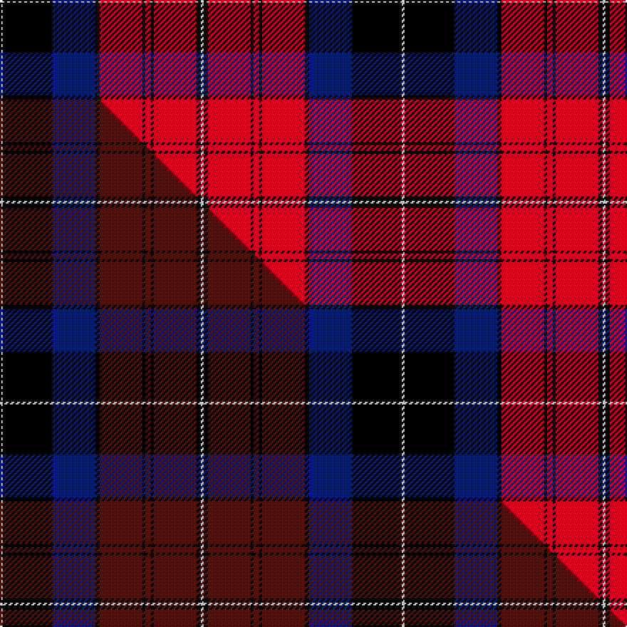

This page is one **sett** — a single exact thread-count. It belongs to the [tartan](/setts/w2k35db30k3r30k2r4k2r30k3w2/)
(the same proportion at any scale), whose colour order is pattern [WKBKRKRKRKW](/stripes/wkbkrkrkrkw/).

Part of the [Gwyn](/tartans/gwyn/) tartan — the named design grouping this sett with its other cloths.

Sourced from house-of-tartan.  It is a [11 stripe tartan](/stripes/stripes11/).

Original link http://www.house-of-tartan.scotland.net/house/TartanViewjs.asp?colr=Def&tnam=5734

## Provenance

Earliest known date: 2002 The tartan for this Welsh surname and its spelling variation, Wynn, is actually woven in Wales at the Cambrian Woollen Mill, weaving on the same site since 1830. This tartan differs from many traditional patterns in that the warp and weft differ, giving the finished worsted wool cloth more of a predominant stripe, vertically noticeable in the finished Kilt, or Cilt in Wales.

## Thread count
W/2 K35 DB30 K3 R30 K2 R4 K2 R30 K3 W/2

One full sett is **282 threads**.

## Palette
<table><thead><tr><th>Colour</th><th>Shade</th><th>OKLCh</th></tr></thead><tbody><tr><td>DB</td><td><code style="background-color:#082077;">#082077</code> <small style="color:#888">#082077</small></td><td><small style="color:#888">oklch(30.0% 0.149 265.1)</small></td></tr><tr><td>R</td><td><code style="background-color:#D60020;">#D60020</code> <small style="color:#888">#D60020</small></td><td><small style="color:#888">oklch(55.2% 0.224 25.5)</small></td></tr><tr><td>K</td><td><code style="background-color:#000000;">#000000</code> <small style="color:#888">#000000</small></td><td><small style="color:#888">oklch(0.0% 0.000 0.0)</small></td></tr><tr><td>W</td><td><code style="background-color:#F7F7F7;">#F7F7F7</code> <small style="color:#888">#F7F7F7</small></td><td><small style="color:#888">oklch(97.6% 0.000 89.9)</small></td></tr></tbody></table>

# Sample pattern

## Compared to the master

This cloth is one sett of its design; the master sett (the exemplar the design is anchored on) is below for comparison.

Its **ΔTartan distance** from the master is **1.96** — the same measure the nearest-tartans table ranks by (0 is identical; a re-scale of the same cloth is near 0, a recolour or a different proportion further).

<figure class="master-compare" style="margin:0">

this sett
master sett ★

<figcaption style="color:#888;font-size:smaller">One weave of this sett against the <a href="/setts/w2k35db30k3dr30k2dr4k2dr30k3w2/">master sett ★</a>, split on the diagonal: a shared proportion runs seamlessly across it with only the shades shifting; a different proportion breaks on it.</figcaption>
</figure>

## Nearest tartan variants

The nearest existing variants by ΔTartan distance, with this cloth at the top so the swatches line up against it.

ΔTartan

Threads

Variant

Sett

—

282

<a href="/variants/s11/w2k35db30k3r30k2r4k2r30k3w2/">Gwyn Welsh Name Tartan</a>

<a href="/ttd/edit/#slug=w8k1r24k2r4k2r1k2r4k2db20k1w5~x2&amp;base=w2k35db30k3r30k2r4k2r30k3w2" title="compare in the TTD">2.29</a>

278

<a href="/variants/s13/w8k1r24k2r4k2r1k2r4k2db20k1w5~x2/">Danish</a>

<a href="/ttd/edit/#slug=r48k10db12k2r3k2db12k10n10k2y3~x2&amp;base=w2k35db30k3r30k2r4k2r30k3w2" title="compare in the TTD">2.33</a>

354

<a href="/variants/s11/r48k10db12k2r3k2db12k10n10k2y3~x2/">Brooks Brothers (WCWM)</a>

<a href="/ttd/edit/#slug=r7k3r4k5r25k7y2db22k3db4~x2&amp;base=w2k35db30k3r30k2r4k2r30k3w2" title="compare in the TTD">2.63</a>

306

<a href="/variants/s10/r7k3r4k5r25k7y2db22k3db4~x2/">St. George's (Edinburgh) (School)</a>

<a href="/ttd/edit/#slug=w4k6r3k15r3k6r27db9w2~x2&amp;base=w2k35db30k3r30k2r4k2r30k3w2" title="compare in the TTD">2.64</a>

288

<a href="/variants/s9/w4k6r3k15r3k6r27db9w2~x2/">Memery (Reston, USA)</a>

<a href="/ttd/edit/#slug=k2r13k8n2r1k1r21n1r1k2db8k13db2~x2&amp;base=w2k35db30k3r30k2r4k2r30k3w2" title="compare in the TTD">2.70</a>

292

<a href="/variants/s13/k2r13k8n2r1k1r21n1r1k2db8k13db2~x2/">Alyssa's Theme</a>

## Neighbour map

Every grey dot is one of 13620 variants placed by the first two principal components of the ΔTartan feature space (42% of its variance). Red is this tartan; blue dots are its nearest — click one to open its page.

<svg viewBox="0 0 640 380" role="img" style="max-width:100%;height:auto;border:1px solid #e0e0e0;border-radius:4px;display:block" xmlns="http://www.w3.org/2000/svg"><image href="/nn/cloud.v1.png" width="640" height="380"/><a href="/variants/s13/w8k1r24k2r4k2r1k2r4k2db20k1w5~x2/"><circle cx="202.4" cy="88.0" r="4" fill="#3465a4"><title>Danish</title></circle></a><a href="/variants/s11/r48k10db12k2r3k2db12k10n10k2y3~x2/"><circle cx="211.8" cy="86.0" r="4" fill="#3465a4"><title>Brooks Brothers (WCWM)</title></circle></a><a href="/variants/s10/r7k3r4k5r25k7y2db22k3db4~x2/"><circle cx="206.0" cy="144.2" r="4" fill="#3465a4"><title>St. George's (Edinburgh) (School)</title></circle></a><a href="/variants/s9/w4k6r3k15r3k6r27db9w2~x2/"><circle cx="190.4" cy="142.5" r="4" fill="#3465a4"><title>Memery (Reston, USA)</title></circle></a><a href="/variants/s13/k2r13k8n2r1k1r21n1r1k2db8k13db2~x2/"><circle cx="237.6" cy="102.3" r="4" fill="#3465a4"><title>Alyssa's Theme</title></circle></a><circle cx="213.0" cy="116.0" r="5" fill="#c00000"/><text x="320" y="376" text-anchor="middle" font-size="11" fill="#999">ground</text><text x="11" y="190" text-anchor="middle" font-size="11" fill="#999" transform="rotate(-90 11 190)">complexity</text></svg>

ID: /variants/s11/w2k35db30k3r30k2r4k2r30k3w2/
