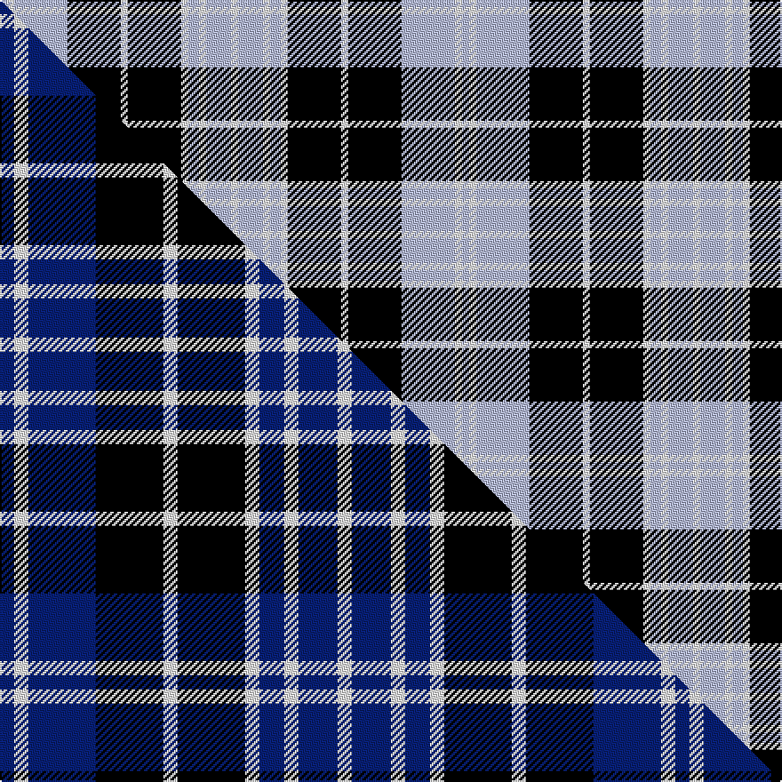

This page is one **sett** — a single exact thread-count. It belongs to the [tartan](/setts/w2lb7w2lb3w2k15w2k15lb15w2lb2/)
(the same proportion at any scale), whose colour order is pattern [WWWKWKWWWWW](/stripes/wwwkwkwwwww/).

Part of the [Clark](/tartans/clark-2/) tartan — the named design grouping this sett with its other cloths.

Sourced from tartans-authority.  It is a [11 stripe tartan](/stripes/stripes11/).

Original link http://www.tartansauthority.com/tartan-ferret/display/633/

## Register references

External register numbers recorded for this tartan.

- Scottish Tartans Authority (ITI): 633

## Thread count
LB/4 W4 LB30 K30 W4 K30 W4 LB6 W4 LB14 W/4

One full sett is **260 threads**.

## Palette
<table><thead><tr><th>Colour</th><th>Shade</th><th>OKLCh</th></tr></thead><tbody><tr><td>LB</td><td><code style="background-color:#B5BBDE;">#B5BBDE</code> <small style="color:#888">#B5BBDE</small></td><td><small style="color:#888">oklch(79.9% 0.050 277.6)</small></td></tr><tr><td>K</td><td><code style="background-color:#000000;">#000000</code> <small style="color:#888">#000000</small></td><td><small style="color:#888">oklch(0.0% 0.000 0.0)</small></td></tr><tr><td>W</td><td><code style="background-color:#F7F7F7;">#F7F7F7</code> <small style="color:#888">#F7F7F7</small></td><td><small style="color:#888">oklch(97.6% 0.000 89.9)</small></td></tr></tbody></table>

# Sample pattern

## Compared to the master

This cloth is one sett of its design; the master sett (the exemplar the design is anchored on) is below for comparison.

Its **ΔTartan distance** from the master is **1.76** — the same measure the nearest-tartans table ranks by (0 is identical; a re-scale of the same cloth is near 0, a recolour or a different proportion further).

<figure class="master-compare" style="margin:0">

this sett
master sett ★

<figcaption style="color:#888;font-size:smaller">One weave of this sett against the <a href="/setts/db4w4db19k19w4k19w4db7w4db11w4/">master sett ★</a>, split on the diagonal: a shared proportion runs seamlessly across it with only the shades shifting; a different proportion breaks on it.</figcaption>
</figure>

## Nearest variants

The nearest existing variants by ΔTartan distance, with this cloth at the top so the swatches line up against it.

ΔTartan

Threads

Variant

Sett

—

260

<a href="/variants/s11/w2lb7w2lb3w2k15w2k15lb15w2lb2~x2/">Clark (Clan)</a>

<a href="/ttd/edit/#slug=k4lr4t29k29lr4k29lr4t6lr4t14lr4~x2~lr2800000-t2503227&amp;base=w2lb7w2lb3w2k15w2k15lb15w2lb2~x2" title="compare in the TTD">1.10</a>

508

<a href="/variants/s11/k4lr4t29k29lr4k29lr4t6lr4t14lr4~x2~lr2800000-t2503227/">Clergy (Corporate)</a>

<a href="/ttd/edit/#slug=n1lb1n6k6lb1k6lb1n2lb1n3lb1~x2&amp;base=w2lb7w2lb3w2k15w2k15lb15w2lb2~x2" title="compare in the TTD">1.91</a>

112

<a href="/variants/s11/n1lb1n6k6lb1k6lb1n2lb1n3lb1~x2/">Clergy (Grey)</a>

<a href="/ttd/edit/#slug=k2b2w11b5k5w2k1b2~x2&amp;base=w2lb7w2lb3w2k15w2k15lb15w2lb2~x2" title="compare in the TTD">2.55</a>

112

<a href="/variants/s8/k2b2w11b5k5w2k1b2~x2/">Conquergood</a>

<a href="/ttd/edit/#slug=k3lo2b14k14lb2k14lb2b6lb2b16lb3~x2&amp;base=w2lb7w2lb3w2k15w2k15lb15w2lb2~x2" title="compare in the TTD">2.86</a>

300

<a href="/variants/s11/k3lo2b14k14lb2k14lb2b6lb2b16lb3~x2/">Immanuel Presbyterian Church (Corp)</a>

<a href="/ttd/edit/#slug=y5lb36n5lb5n56k5n8k5n5k34y5&amp;base=w2lb7w2lb3w2k15w2k15lb15w2lb2~x2" title="compare in the TTD">2.88</a>

328

<a href="/variants/s11/y5lb36n5lb5n56k5n8k5n5k34y5/">Chartered Institute of Bankers in Scotland</a>

<a href="/ttd/edit/#slug=k14w2k3w2b10w32b10k10w2k3~x2&amp;base=w2lb7w2lb3w2k15w2k15lb15w2lb2~x2" title="compare in the TTD">2.97</a>

318

<a href="/variants/s10/k14w2k3w2b10w32b10k10w2k3~x2/">Fraser, Arisaid</a>

## Neighbour map

Every grey dot is one of 13620 variants placed by the first two principal components of the ΔTartan feature space (42% of its variance). Red is this tartan; blue dots are its nearest — click one to open its page.

<svg viewBox="0 0 640 380" role="img" style="max-width:100%;height:auto;border:1px solid #e0e0e0;border-radius:4px;display:block" xmlns="http://www.w3.org/2000/svg"><image href="/nn/cloud.v1.png" width="640" height="380"/><a href="/variants/s11/k4lr4t29k29lr4k29lr4t6lr4t14lr4~x2~lr2800000-t2503227/"><circle cx="209.5" cy="186.3" r="4" fill="#3465a4"><title>Clergy (Corporate)</title></circle></a><a href="/variants/s11/n1lb1n6k6lb1k6lb1n2lb1n3lb1~x2/"><circle cx="179.9" cy="202.9" r="4" fill="#3465a4"><title>Clergy (Grey)</title></circle></a><a href="/variants/s8/k2b2w11b5k5w2k1b2~x2/"><circle cx="186.6" cy="188.9" r="4" fill="#3465a4"><title>Conquergood</title></circle></a><a href="/variants/s11/k3lo2b14k14lb2k14lb2b6lb2b16lb3~x2/"><circle cx="187.2" cy="178.0" r="4" fill="#3465a4"><title>Immanuel Presbyterian Church (Corp)</title></circle></a><a href="/variants/s11/y5lb36n5lb5n56k5n8k5n5k34y5/"><circle cx="190.3" cy="142.5" r="4" fill="#3465a4"><title>Chartered Institute of Bankers in Scotland</title></circle></a><a href="/variants/s10/k14w2k3w2b10w32b10k10w2k3~x2/"><circle cx="196.3" cy="146.0" r="4" fill="#3465a4"><title>Fraser, Arisaid</title></circle></a><circle cx="197.4" cy="183.9" r="5" fill="#c00000"/><text x="320" y="376" text-anchor="middle" font-size="11" fill="#999">ground</text><text x="11" y="190" text-anchor="middle" font-size="11" fill="#999" transform="rotate(-90 11 190)">complexity</text></svg>

ID: /variants/s11/w2lb7w2lb3w2k15w2k15lb15w2lb2~x2/
