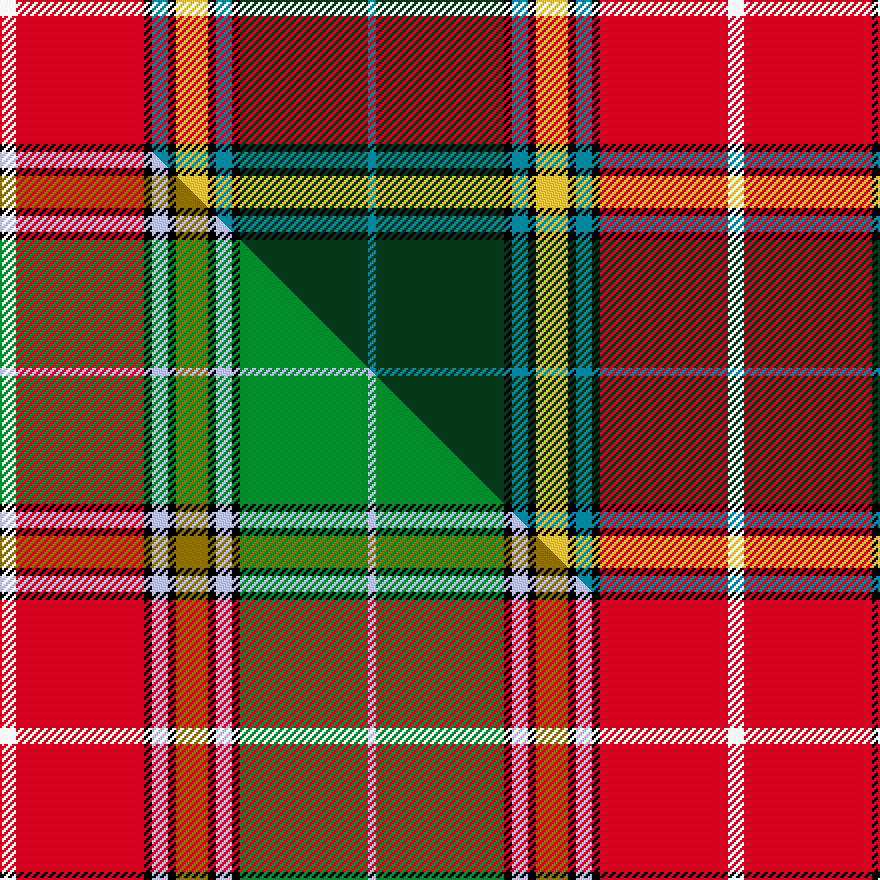

This is one **variant** — a specific cloth: this exact thread count and colourway, with its own
provenance below. It is one weaving of the [sett](/tartans/b/ba/baxter-of-balgavies/) (the scale-free proportion — the
same cloth at any scale or shade), whose colour order is pattern [BGKBKYKBKRW](/stripes/bgkbkykbkrw/).

Part of the [Baxter of Balgavies](/tartans/b/ba/baxter-of-balgavies/) tartan — the named design grouping this sett with its other cloths.

Sourced from peter-1856.  It is a [11 stripe tartan](/stripes/stripes11/).

Original link [/posts/baronage-angus-mearns/](/posts/baronage-angus-mearns/)

## Provenance

<figure class="logan-scan">

<figcaption>Peter, The Baronage of Angus and Mearns (1856), p. 23 — page-scan crop (93,1125)–(852,1205)</figcaption>
</figure>

David MacGregor Peter recorded the tartan of **Baxter of Balgavies** in 1856, on page 23 of *The Baronage of Angus and Mearns* — a genealogy of the families of Angus and the Mearns whose entries carry their tartans in Logan's method: stripe depths in eighths of an inch, measured across the cloth and reflected about each end (a half-sett):

> ½ azure · 8 green · ½ black · 1 azure · ½ black · 2 yellow · ½ black · 1 azure · ½ black · 8 red · 1 white

Rendered at 8 threads to the eighth-inch that is `A/4 G64 K4 A8 K4 Y16 K4 A8 K4 R64 W/8` — the eighths are the captured data, and the threadcount is derived from them at that stated factor (the same display calibration as Logan 1831, whose method the book borrows). Peter named his colours rather than dyeing to a standard, so the palette here is the Dictionary's modern reading of his names.

The entry as printed: [page 23 of the first edition, on the Internet Archive](https://archive.org/details/baronageofangusm00peteuoft/page/n38/mode/1up).

See [The Baronage of Angus and Mearns](/posts/baronage-angus-mearns/) for the book, its method and every entry.

Dataset <small>— provenance for this record, inherited from the source manifest</small>

<dl class="dataset-prov">
<dt>source</dt><dd><a href="/sources/peter-1856/">Peter, The Baronage of Angus and Mearns (1856)</a></dd>
<dt>data captured from</dt><dd><a href="https://archive.org/details/baronageofangusm00peteuoft">https://archive.org/details/baronageofangusm00peteuoft</a></dd>
<dt>data date</dt><dd>1856 <small>(this record)</small></dd>
<dt>licence</dt><dd>Public domain</dd>
</dl>

Capture chain <small>— the hands this data passed through, oldest first; each capture carries its own licence</small>

<ol class="capture-chain">
<li>David MacGregor Peter, The Baronage of Angus and Mearns (first edition) <small>1856</small> · Public domain <small>38 TARTAN entries among the genealogies of 360 Angus and Mearns families, in Logan's eighths-of-an-inch method</small></li>
<li><a href="https://archive.org/details/baronageofangusm00peteuoft">Internet Archive scans</a> <small>three digitised copies: University of Toronto (500 ppi, the transcription's primary), Allen County Public Library, and Google/Oxford — each OCR layer garbles the fraction glyphs differently, so all three were kept as a per-glyph vote, the 500 ppi page image ruling</small></li>
<li><a href="/posts/baronage-angus-mearns/">Tartan Dictionary transcription — The Baronage of Angus and Mearns</a> <small>2026-07</small> · <a href="https://creativecommons.org/licenses/by-sa/4.0/">CC BY-SA 4.0</a> <small>by-eye transcription of the 38 entries from 200-400 dpi page renders of the 500 ppi scan — depths in eighths of an inch, rendered at 8 threads per eighth (the Logan display calibration); method and entry table in the linked post</small></li>
<li>this dictionary <small>each re-capture is a git commit to data/sources</small></li>
</ol>

## Thread count
W/8 R64 K4 T8 K4 LY16 K4 T8 K4 DG64 T/4

One full sett is **364 threads**.

## Palette
<table><thead><tr><th>Colour</th><th>Shade</th><th>OKLCh</th></tr></thead><tbody><tr><td>T</td><td><code style="background-color:#00879F;">#00879F</code> <small style="color:#888">#00879F</small></td><td><small style="color:#888">oklch(57.4% 0.102 216.1)</small></td></tr><tr><td>DG</td><td><code style="background-color:#053819;">#053819</code> <small style="color:#888">#053819</small></td><td><small style="color:#888">oklch(30.0% 0.075 151.3)</small></td></tr><tr><td>K</td><td><code style="background-color:#000000;">#000000</code> <small style="color:#888">#000000</small></td><td><small style="color:#888">oklch(0.0% 0.000 0.0)</small></td></tr><tr><td>W</td><td><code style="background-color:#F7F7F7;">#F7F7F7</code> <small style="color:#888">#F7F7F7</small></td><td><small style="color:#888">oklch(97.6% 0.000 89.9)</small></td></tr><tr><td>R</td><td><code style="background-color:#D60020;">#D60020</code> <small style="color:#888">#D60020</small></td><td><small style="color:#888">oklch(55.2% 0.224 25.5)</small></td></tr><tr><td>LY</td><td><code style="background-color:#DCBC32;">#DCBC32</code> <small style="color:#888">#DCBC32</small></td><td><small style="color:#888">oklch(80.0% 0.150 95.2)</small></td></tr></tbody></table>

# Sample pattern

[Sample sheet (PDF)](swatch.pdf) — the woven sample, thread count and palette on one printable A4, rendered on demand (the same sheet the TTD print page downloads).

## Compared to the master

This cloth is one sett of its design; the master sett (the exemplar the design is anchored on) is below for comparison.

Its **ΔTartan distance** from the master is **0.19** — the same measure the nearest-tartans table ranks by (0 is identical; a re-scale of the same cloth is near 0, a recolour or a different proportion further).

<figure class="master-compare" style="margin:0">

this sett
master sett ★

<figcaption style="color:#888;font-size:smaller">One weave of this sett against the <a href="/setts/w2r16k1lb2k1y4k1lb2k1g16lb1/">master sett ★</a>, split on the diagonal: a shared proportion runs seamlessly across it with only the shades shifting; a different proportion breaks on it.</figcaption>
</figure>

## Nearest tartan variants

The nearest existing variants by ΔTartan distance, with this cloth at the top so the swatches line up against it.

ΔTartan

Threads

Variant

Sett

—

364

<a href="/variants/s11/w2r16k1t2k1ly4k1t2k1dg16t1~x4/">Baxter of Balgavies</a>

<a href="/ttd/edit/#slug=w2r16k1lb2k1y4k1lb2k1g16lb1~x2&amp;base=w2r16k1t2k1ly4k1t2k1dg16t1~x4" title="compare in the TTD">0.19</a>

182

<a href="/variants/s11/w2r16k1lb2k1y4k1lb2k1g16lb1~x2/">Baxter of Balgavies</a>

<a href="/ttd/edit/#slug=w2r16k1lb2k1y4k1lb2k1g16lb1~x4&amp;base=w2r16k1t2k1ly4k1t2k1dg16t1~x4" title="compare in the TTD">0.19</a>

364

<a href="/variants/s11/w2r16k1lb2k1y4k1lb2k1g16lb1~x4/">Baxter (Clan)</a>

<a href="/ttd/edit/#slug=w2r12k1lb2k1y3k1y3k1lb2k1g12lb2~x2&amp;base=w2r16k1t2k1ly4k1t2k1dg16t1~x4" title="compare in the TTD">0.89</a>

164

<a href="/variants/s13/w2r12k1lb2k1y3k1y3k1lb2k1g12lb2~x2/">Buchanan #3</a>

<a href="/ttd/edit/#slug=w2r16k1t2k1ly4k1ly4k1t2k1g16t1~x4&amp;base=w2r16k1t2k1ly4k1t2k1dg16t1~x4" title="compare in the TTD">1.30</a>

404

<a href="/variants/s13/w2r16k1t2k1ly4k1ly4k1t2k1g16t1~x4/">Buchanan</a>

<a href="/ttd/edit/#slug=w2r16k1lb2k1y4k1y4k1lb2k1dg16lb2~x4&amp;base=w2r16k1t2k1ly4k1t2k1dg16t1~x4" title="compare in the TTD">1.33</a>

408

<a href="/variants/s13/w2r16k1lb2k1y4k1y4k1lb2k1dg16lb2~x4/">Buchanan (Logan)</a>

<a href="/ttd/edit/#slug=w2r16k1lb2k1y4k1y4k1lb2k1g16lb2~x2&amp;base=w2r16k1t2k1ly4k1t2k1dg16t1~x4" title="compare in the TTD">1.33</a>

204

<a href="/variants/s13/w2r16k1lb2k1y4k1y4k1lb2k1g16lb2~x2/">Buchanan D</a>

<a href="/ttd/edit/#slug=w3r31k2lb4k2y8k2y8k2lb4k2g31lb3~x2&amp;base=w2r16k1t2k1ly4k1t2k1dg16t1~x4" title="compare in the TTD">1.36</a>

396

<a href="/variants/s13/w3r31k2lb4k2y8k2y8k2lb4k2g31lb3~x2/">Buchanan #2</a>

<a href="/ttd/edit/#slug=lb1dg8k1lb2k1y2k1lb2k1r8w1lb1~x4&amp;base=w2r16k1t2k1ly4k1t2k1dg16t1~x4" title="compare in the TTD">1.43</a>

224

<a href="/variants/s12/lb1dg8k1lb2k1y2k1lb2k1r8w1lb1~x4/">MacWhirter</a>

<a href="/ttd/edit/#slug=w4r25k2lb4k2y8k3y8k2lb4k2g25lb4~x2&amp;base=w2r16k1t2k1ly4k1t2k1dg16t1~x4" title="compare in the TTD">1.53</a>

356

<a href="/variants/s13/w4r25k2lb4k2y8k3y8k2lb4k2g25lb4~x2/">Buchanan Clan Tartan</a>

<a href="/ttd/edit/#slug=dp45k12y4k4w6k4g50r57dp4r10k4~x2&amp;base=w2r16k1t2k1ly4k1t2k1dg16t1~x4" title="compare in the TTD">1.55</a>

702

<a href="/variants/s11/dp45k12y4k4w6k4g50r57dp4r10k4~x2/">MacLean Variation</a>

## Neighbour map

Every grey dot is one of 13662 variants placed by the first two principal components of the ΔTartan feature space (42% of its variance). Red is this tartan; blue dots are its nearest — click one to open its page. The map is a flat projection of a many-dimensional space — [how to read it](/posts/neighbourhood-maps/).

<svg viewBox="0 0 640 380" role="img" style="max-width:100%;height:auto;border:1px solid #e0e0e0;border-radius:4px;display:block" xmlns="http://www.w3.org/2000/svg"><image href="/nn/cloud.v1.png" width="640" height="380"/><a href="/variants/s11/w2r16k1lb2k1y4k1lb2k1g16lb1~x2/"><circle cx="143.4" cy="96.3" r="4" fill="#3465a4"><title>Baxter of Balgavies</title></circle></a><a href="/variants/s11/w2r16k1lb2k1y4k1lb2k1g16lb1~x4/"><circle cx="143.4" cy="96.3" r="4" fill="#3465a4"><title>Baxter (Clan)</title></circle></a><a href="/variants/s13/w2r12k1lb2k1y3k1y3k1lb2k1g12lb2~x2/"><circle cx="80.9" cy="110.1" r="4" fill="#3465a4"><title>Buchanan #3</title></circle></a><a href="/variants/s13/w2r16k1t2k1ly4k1ly4k1t2k1g16t1~x4/"><circle cx="114.2" cy="90.4" r="4" fill="#3465a4"><title>Buchanan</title></circle></a><a href="/variants/s13/w2r16k1lb2k1y4k1y4k1lb2k1dg16lb2~x4/"><circle cx="112.4" cy="88.7" r="4" fill="#3465a4"><title>Buchanan (Logan)</title></circle></a><a href="/variants/s13/w2r16k1lb2k1y4k1y4k1lb2k1g16lb2~x2/"><circle cx="116.5" cy="93.7" r="4" fill="#3465a4"><title>Buchanan D</title></circle></a><a href="/variants/s13/w3r31k2lb4k2y8k2y8k2lb4k2g31lb3~x2/"><circle cx="118.7" cy="94.3" r="4" fill="#3465a4"><title>Buchanan #2</title></circle></a><a href="/variants/s12/lb1dg8k1lb2k1y2k1lb2k1r8w1lb1~x4/"><circle cx="60.1" cy="128.3" r="4" fill="#3465a4"><title>MacWhirter</title></circle></a><a href="/variants/s13/w4r25k2lb4k2y8k3y8k2lb4k2g25lb4~x2/"><circle cx="77.1" cy="112.2" r="4" fill="#3465a4"><title>Buchanan Clan Tartan</title></circle></a><a href="/variants/s11/dp45k12y4k4w6k4g50r57dp4r10k4~x2/"><circle cx="123.1" cy="105.4" r="4" fill="#3465a4"><title>MacLean Variation</title></circle></a><circle cx="137.4" cy="91.5" r="5" fill="#c00000"/><text x="320" y="376" text-anchor="middle" font-size="11" fill="#999">ground</text><text x="11" y="190" text-anchor="middle" font-size="11" fill="#999" transform="rotate(-90 11 190)">complexity</text></svg>

ID: /variants/s11/w2r16k1t2k1ly4k1t2k1dg16t1~x4/
