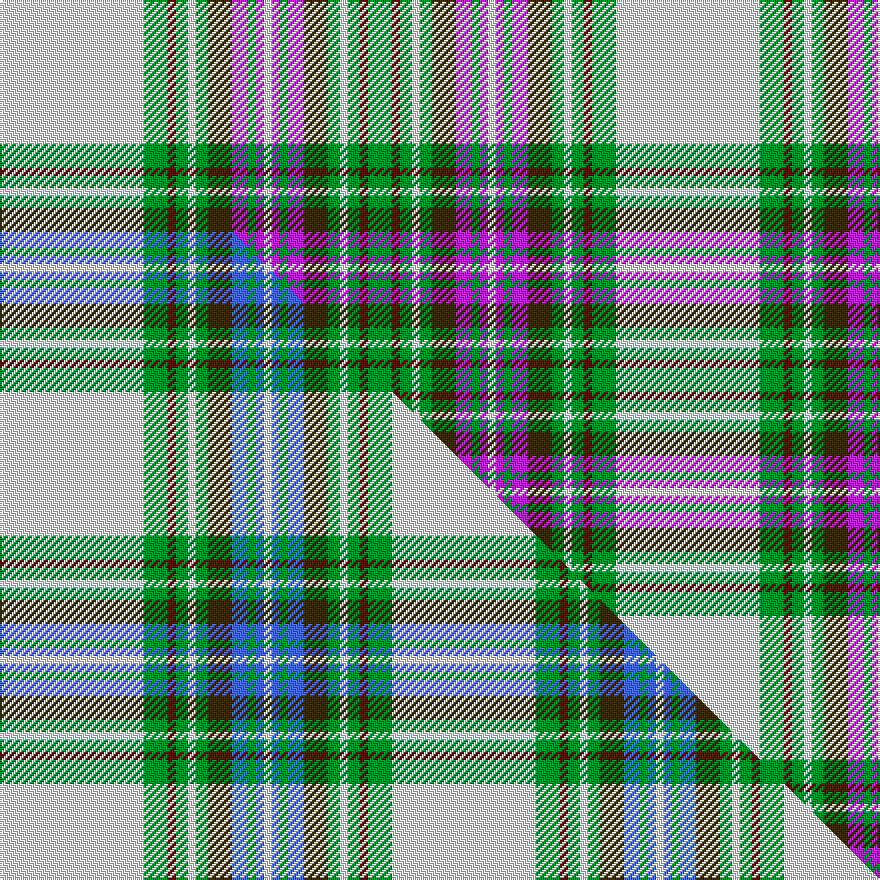

This page is one **sett** — a single exact thread-count. It belongs to the [tartan](/setts/w36g6dr2g3w2g3dy6p4g2p2w2/)
(the same proportion at any scale), whose colour order is pattern [GBGWGGBGBWBGBGGWGBGW](/stripes/gbgwggbgbwbgbggwgbgw/).

Part of the [Strathyre Dress](/tartans/strathyre-dress-2/) tartan — the named design grouping this sett with its other cloths.

Sourced from house-of-tartan.  It is a [20 stripe tartan](/stripes/stripes20/).

Original link http://www.house-of-tartan.scotland.net/house/TartanViewjs.asp?colr=Def&tnam=3227

## Provenance

Earliest known date: 1996 From Dalgleish May, 1996. Stewart Modern. Could be Dancers' Fancy.

## Thread count
W/72 G12 DR4 G6 W4 G6 DY12 P8 G4 P4 W4 P4 G4 P8 DY12 G6 W4 G6 DR4 G/12

One full sett is **308 threads**.

## Palette
<table><thead><tr><th>Colour</th><th>Shade</th><th>OKLCh</th></tr></thead><tbody><tr><td>G</td><td><code style="background-color:#008B2A;">#008B2A</code> <small style="color:#888">#008B2A</small></td><td><small style="color:#888">oklch(55.4% 0.170 145.9)</small></td></tr><tr><td>W</td><td><code style="background-color:#F7F7F7;">#F7F7F7</code> <small style="color:#888">#F7F7F7</small></td><td><small style="color:#888">oklch(97.6% 0.000 89.9)</small></td></tr><tr><td>LB</td><td><code style="background-color:#B5BBDE;">#B5BBDE</code> <small style="color:#888">#B5BBDE</small></td><td><small style="color:#888">oklch(79.9% 0.050 277.6)</small></td></tr><tr><td>P</td><td><code style="background-color:#AA2DBD;">#AA2DBD</code> <small style="color:#888">#AA2DBD</small></td><td><small style="color:#888">oklch(55.0% 0.225 322.0)</small></td></tr><tr><td>DR</td><td><code style="background-color:#55120C;">#55120C</code> <small style="color:#888">#55120C</small></td><td><small style="color:#888">oklch(30.0% 0.099 29.3)</small></td></tr><tr><td>DY</td><td><code style="background-color:#3A2B0D;">#3A2B0D</code> <small style="color:#888">#3A2B0D</small></td><td><small style="color:#888">oklch(30.0% 0.049 82.0)</small></td></tr></tbody></table>

# Sample pattern

## Compared to the master

This cloth is one sett of its design; the master sett (the exemplar the design is anchored on) is below for comparison.

Its **ΔTartan distance** from the master is **0.60** — the same measure the nearest-tartans table ranks by (0 is identical; a re-scale of the same cloth is near 0, a recolour or a different proportion further).

<figure class="master-compare" style="margin:0">

this sett
master sett ★

<figcaption style="color:#888;font-size:smaller">One weave of this sett against the <a href="/setts/w36g6dr2g3w2g3dy6b4g2b2w2/">master sett ★</a>, split on the diagonal: a shared proportion runs seamlessly across it with only the shades shifting; a different proportion breaks on it.</figcaption>
</figure>

## Nearest tartan variants

The nearest existing variants by ΔTartan distance, with this cloth at the top so the swatches line up against it.

ΔTartan

Threads

Variant

Sett

—

308

<a href="/variants/s11/w36g6dr2g3w2g3dy6p4g2p2w2~x2/">Strathyre Dress District Tartan</a>

<a href="/ttd/edit/#slug=w36g6dr2g3w2g3dy6b4g2b2w2~x2&amp;base=w36g6dr2g3w2g3dy6p4g2p2w2~x2" title="compare in the TTD">0.60</a>

196

<a href="/variants/s11/w36g6dr2g3w2g3dy6b4g2b2w2~x2/">Strathyre Dress (Dance)</a>

<a href="/ttd/edit/#slug=w55dg12r2dg3w2dgi10dp9dg2dp6w2~x2~dgi1806142-dp1607327&amp;base=w36g6dr2g3w2g3dy6p4g2p2w2~x2" title="compare in the TTD">1.80</a>

298

<a href="/variants/s10/w55dg12r2dg3w2dgi10dp9dg2dp6w2~x2~dgi1806142-dp1607327/">Strathyre Dress (Dance)</a>

<a href="/ttd/edit/#slug=w55dg12r2dg3w2g10dp9dg2dp6w2~x2&amp;base=w36g6dr2g3w2g3dy6p4g2p2w2~x2" title="compare in the TTD">1.80</a>

298

<a href="/variants/s10/w55dg12r2dg3w2g10dp9dg2dp6w2~x2/">Strathyre Dress (Dance)</a>

<a href="/ttd/edit/#slug=g2w2db1w30g1w1g5t8g4db1g1db8w1db2y1~x2&amp;base=w36g6dr2g3w2g3dy6p4g2p2w2~x2" title="compare in the TTD">3.08</a>

266

<a href="/variants/s15/g2w2db1w30g1w1g5t8g4db1g1db8w1db2y1~x2/">Borderland Dress (Estimated threadcount)</a>

<a href="/ttd/edit/#slug=lb22r1lo4lb4lo1lb1lo1lb1lo1lb1lo1lb1lo1lb1lo1lb1lo1lb1lo1lb1lo1lb1lo9dy24db2~x4&amp;base=w36g6dr2g3w2g3dy6p4g2p2w2~x2" title="compare in the TTD">3.28</a>

576

<a href="/variants/s25/lb22r1lo4lb4lo1lb1lo1lb1lo1lb1lo1lb1lo1lb1lo1lb1lo1lb1lo1lb1lo1lb1lo9dy24db2~x4/">Allen Hunting (?Thomson)</a>

<a href="/ttd/edit/#slug=g3dg15ly3dg3dp1dg1dp1dg1dp1dg1dp1dg1dp1dg1dp12w15g3~x2&amp;base=w36g6dr2g3w2g3dy6p4g2p2w2~x2" title="compare in the TTD">3.46</a>

244

<a href="/variants/s17/g3dg15ly3dg3dp1dg1dp1dg1dp1dg1dp1dg1dp1dg1dp12w15g3~x2/">Prickly Thistle</a>

<a href="/ttd/edit/#slug=w55dp12ly2dp3w2dg10dpi9dp2dpi6w2~x2~dp1105325-dg1806142-dpi1607327&amp;base=w36g6dr2g3w2g3dy6p4g2p2w2~x2" title="compare in the TTD">3.48</a>

298

<a href="/variants/s10/w55dp12ly2dp3w2dg10dpi9dp2dpi6w2~x2~dp1105325-dg1806142-dpi1607327/">Stewart Dress Purple Dance Tartan</a>

<a href="/ttd/edit/#slug=n3w20dr1db1dr1db3dr4db2dr4db2dr4db1g8dy1~x4&amp;base=w36g6dr2g3w2g3dy6p4g2p2w2~x2" title="compare in the TTD">3.53</a>

424

<a href="/variants/s14/n3w20dr1db1dr1db3dr4db2dr4db2dr4db1g8dy1~x4/">Cairn (Fashion)</a>

<a href="/ttd/edit/#slug=n12lb2do4y2do3w3do3ly20w29lb2w4do2~x2&amp;base=w36g6dr2g3w2g3dy6p4g2p2w2~x2" title="compare in the TTD">3.82</a>

316

<a href="/variants/s12/n12lb2do4y2do3w3do3ly20w29lb2w4do2~x2/">MacLean of Duart (Reproduction Colours)</a>

<a href="/ttd/edit/#slug=w4lb1db1w22lb2w2db12r2g16r4lb1r4db2~x2&amp;base=w36g6dr2g3w2g3dy6p4g2p2w2~x2" title="compare in the TTD">3.88</a>

280

<a href="/variants/s13/w4lb1db1w22lb2w2db12r2g16r4lb1r4db2~x2/">MacGillivray Dress, Janice</a>

## Neighbour map

Every grey dot is one of 13620 variants placed by the first two principal components of the ΔTartan feature space (42% of its variance). Red is this tartan; blue dots are its nearest — click one to open its page.

<svg viewBox="0 0 640 380" role="img" style="max-width:100%;height:auto;border:1px solid #e0e0e0;border-radius:4px;display:block" xmlns="http://www.w3.org/2000/svg"><image href="/nn/cloud.v1.png" width="640" height="380"/><a href="/variants/s11/w36g6dr2g3w2g3dy6b4g2b2w2~x2/"><circle cx="322.4" cy="119.1" r="4" fill="#3465a4"><title>Strathyre Dress (Dance)</title></circle></a><a href="/variants/s10/w55dg12r2dg3w2dgi10dp9dg2dp6w2~x2~dgi1806142-dp1607327/"><circle cx="195.5" cy="72.8" r="4" fill="#3465a4"><title>Strathyre Dress (Dance)</title></circle></a><a href="/variants/s10/w55dg12r2dg3w2g10dp9dg2dp6w2~x2/"><circle cx="294.1" cy="90.9" r="4" fill="#3465a4"><title>Strathyre Dress (Dance)</title></circle></a><a href="/variants/s15/g2w2db1w30g1w1g5t8g4db1g1db8w1db2y1~x2/"><circle cx="276.3" cy="88.2" r="4" fill="#3465a4"><title>Borderland Dress (Estimated threadcount)</title></circle></a><a href="/variants/s25/lb22r1lo4lb4lo1lb1lo1lb1lo1lb1lo1lb1lo1lb1lo1lb1lo1lb1lo1lb1lo1lb1lo9dy24db2~x4/"><circle cx="247.4" cy="60.7" r="4" fill="#3465a4"><title>Allen Hunting (?Thomson)</title></circle></a><a href="/variants/s17/g3dg15ly3dg3dp1dg1dp1dg1dp1dg1dp1dg1dp1dg1dp12w15g3~x2/"><circle cx="174.6" cy="120.7" r="4" fill="#3465a4"><title>Prickly Thistle</title></circle></a><a href="/variants/s10/w55dp12ly2dp3w2dg10dpi9dp2dpi6w2~x2~dp1105325-dg1806142-dpi1607327/"><circle cx="220.0" cy="84.5" r="4" fill="#3465a4"><title>Stewart Dress Purple Dance Tartan</title></circle></a><a href="/variants/s14/n3w20dr1db1dr1db3dr4db2dr4db2dr4db1g8dy1~x4/"><circle cx="161.2" cy="106.2" r="4" fill="#3465a4"><title>Cairn (Fashion)</title></circle></a><a href="/variants/s12/n12lb2do4y2do3w3do3ly20w29lb2w4do2~x2/"><circle cx="202.7" cy="137.9" r="4" fill="#3465a4"><title>MacLean of Duart (Reproduction Colours)</title></circle></a><a href="/variants/s13/w4lb1db1w22lb2w2db12r2g16r4lb1r4db2~x2/"><circle cx="171.1" cy="112.2" r="4" fill="#3465a4"><title>MacGillivray Dress, Janice</title></circle></a><circle cx="218.3" cy="98.9" r="5" fill="#c00000"/><text x="320" y="376" text-anchor="middle" font-size="11" fill="#999">ground</text><text x="11" y="190" text-anchor="middle" font-size="11" fill="#999" transform="rotate(-90 11 190)">complexity</text></svg>

ID: /variants/s11/w36g6dr2g3w2g3dy6p4g2p2w2~x2/
